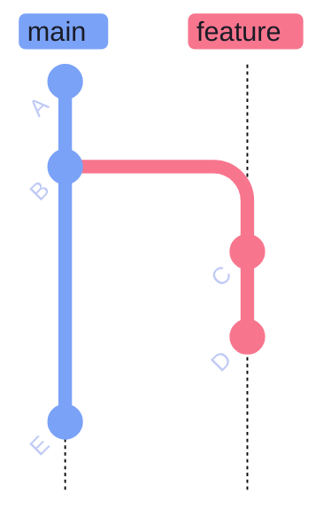
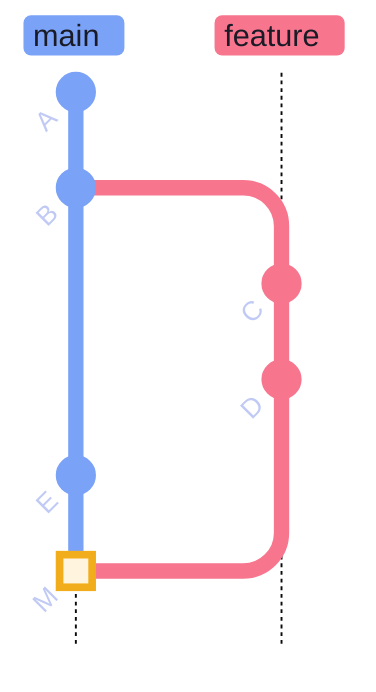
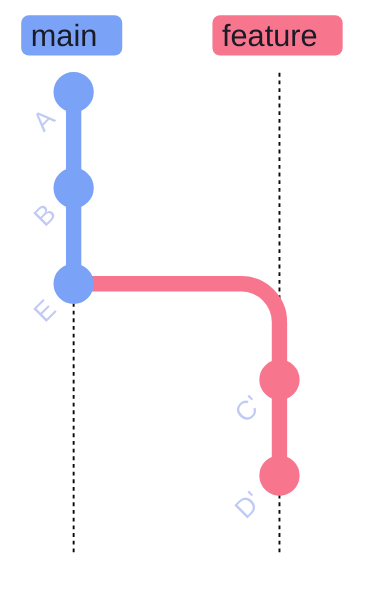
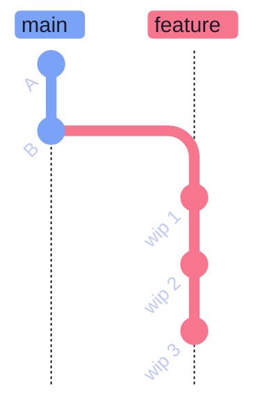
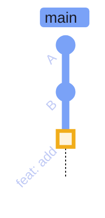
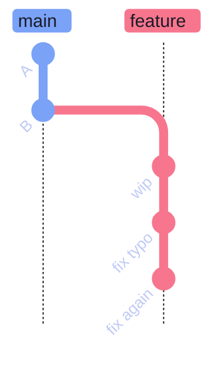
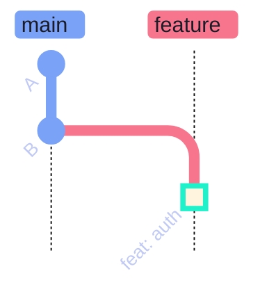

# Merge vs Rebase vs Squash

> [!quote]
> "I want clean history, but that really means (a) clean and (b) history."
>
> — **Linus Torvalds**, Git mailing list

Three strategies for integrating changes from one branch into another. Each produces a different commit history shape: a standard merge preserves branch topology with a merge commit, rebase replays commits linearly with new SHAs, and squash merge collapses all branch commits into one.

## Overview

The three strategies produce fundamentally different graph shapes. Choosing the wrong strategy for your context can make history hard to read, bisect, or revert.

### Merge vs rebase vs squash — comparison table

| Strategy | History Shape | Preserves Individual Commits? | Creates Merge Commit? | Best For |
|----------|--------------|------|------|----------|
| **Merge** | Non-linear (merge commits) | Yes | Yes | Feature branches where commit history is meaningful |
| **Rebase** | Linear | Yes (replayed, new SHAs) | No | Keeping a clean, linear main branch |
| **Squash** | Linear (single commit) | No (collapsed into one) | No | Small features or fixups where individual commits add noise |

> [!question] Which strategy should I use?
>
> - **Merge** — when the branch has meaningful history that reviewers or future debuggers want to see. Default for team branches and long-lived features.
> - **Rebase** — when you want a clean, linear log and the branch is private. Rewrites SHAs, so never use on shared branches.
> - **Squash** — when the branch has noisy "wip"/"fix typo" commits and only the end result matters. Common for small fixes and automated dependency bumps.

## Standard Merge

A standard merge joins two branches by creating a new **merge commit** — a commit with two parents, one from each branch. The full history of both branches is preserved: every individual commit on the feature branch remains visible in `git log --graph`. HEAD advances to the new merge commit; branch pointers are not rewritten.

A **fast-forward merge** is a special case: if the target branch has not diverged, Git simply advances the branch pointer with no merge commit. The `--no-ff` flag forces a merge commit even when fast-forward is possible, preserving the record that a feature branch existed.

### git merge — merge commit

A three-way merge creates a new commit with two parent commits: the tip of the current branch and the tip of the branch being merged. Git finds the common ancestor automatically and applies both diffs. The working tree, staging area, and HEAD all advance to the new merge commit.

**Before merge:**



*Figure: Two branches have diverged — `feat/new-feature` has commits C and D, while main has advanced to E. A three-way merge is required to integrate both lines of work.*

**After merge:**



*Figure: After `git merge feat/new-feature`, commit M has two parents: E (from main) and D (from the feature branch). Both branch histories remain fully visible in `git log --graph`.*

#### git checkout main

Switch to the branch that will receive the merge.

```bash
git checkout main
```

#### git merge feat/new-feature

Merge the feature branch into the current branch. Git performs a three-way merge using the common ancestor, the tip of main, and the tip of the feature branch.

```bash
git merge feat/new-feature
```

```text
Merge made by the 'ort' strategy.
 src/feature.py | 42 ++++++++++++++++++++++++++++++++++++++++++
 1 file changed, 42 insertions(+)
```

**Use when:** The branch has meaningful intermediate commits that reviewers or future debuggers will want to see.

| Flag | Syntax | Description |
|---|---|---|
| `--no-ff` | `git merge --no-ff <branch>` | Force a merge commit even when fast-forward is possible |
| `--ff-only` | `git merge --ff-only <branch>` | Refuse to merge if a fast-forward is not possible |
| `--squash` | `git merge --squash <branch>` | Collapse all commits into one staged change without committing |
| `--abort` | `git merge --abort` | Abort an in-progress merge and restore the pre-merge state |
| `--no-commit` | `git merge --no-commit <branch>` | Perform the merge but stop before creating the commit |
| `-m` | `git merge -m "msg" <branch>` | Override the auto-generated merge commit message |
| `--strategy` | `git merge --strategy=ort <branch>` | Specify the merge strategy (default: `ort` since Git 2.34) |

## Rebase

Rebasing detaches your commits from where they originally branched off and **replays** them one by one on top of the target branch's latest commit. Each replayed commit gets a **new SHA** — the content is the same but the parent pointer changes. The result is a clean, linear history with no merge commits, as if the feature work started after all main-branch commits were already in place.

Because rebase rewrites history (new SHAs), it must only be used on local or private branches. If others have already pulled the branch, the rewritten commits will conflict with their copies.

### git rebase — replay commits on new base

The rebase operation moves the branch's fork point from the original common ancestor to the current tip of the target branch, then replays each commit in order. The branch pointer advances to the last replayed commit. The original commits become orphaned and are retained in the reflog for approximately 90 days.

**Before rebase:**


*Figure: Feature branch forked from B; main has since advanced to E. The two branches have diverged and share B as their common ancestor.*

**After rebase:**



*Figure: After `git rebase main`, commits C and D have been replayed as C' and D' on top of E. The branch is now a direct descendant of main — a fast-forward merge will produce a fully linear history with no merge commit.*

> [!danger] Never Rebase Shared Branches
>
> Rebasing rewrites commit SHAs. If others have pulled your branch, the rewritten commits will diverge from their copies, causing conflicts on their next pull. Only rebase local or private branches that no one else has checked out.

> [!success] Use Merge to Update a Branch Under Active Review
>
> While your PR is open and teammates may have checked out your branch, use `git merge origin/main` to incorporate upstream changes. This adds a merge commit but does not rewrite any existing commits, keeping all SHA references stable.

#### git checkout feat/new-feature

Switch to the feature branch to rebase it onto the updated target.

```bash
git checkout feat/new-feature
```

#### git rebase main

Replay all commits on the feature branch onto the tip of main. Git detaches each commit, applies it in order, and assigns a new SHA. Conflicts are resolved commit-by-commit with `git rebase --continue`.

```bash
git rebase main
```

```text
Successfully rebased and updated refs/heads/feat/new-feature.
```

#### git checkout main

Switch back to main to complete the integration.

```bash
git checkout main
```

#### git merge feat/new-feature — fast-forward

After rebase, the feature branch is a direct descendant of main with no divergence. Git fast-forwards: it moves the main branch pointer to the tip of the feature branch. No merge commit is created.

```bash
git merge feat/new-feature
```

```text
Updating a1b2c3d..e4f5g6h
Fast-forward
 src/feature.py | 42 ++++++++++++++++++++++++++++++++++++++++++
 1 file changed, 42 insertions(+)
```

**Use when:** You want a linear history and the branch is private to you.

| Flag | Syntax | Description |
|---|---|---|
| `--onto <newbase>` | `git rebase --onto main B feat` | Replay commits reachable from `feat` but not `B` onto `main` |
| `-i` | `git rebase -i HEAD~N` | Interactive rebase: reorder, squash, edit, or drop commits |
| `--continue` | `git rebase --continue` | Continue after resolving a conflict |
| `--abort` | `git rebase --abort` | Abort the rebase and restore the original branch state |
| `--skip` | `git rebase --skip` | Skip the current conflicting commit and continue |
| `--autosquash` | `git rebase -i --autosquash` | Automatically apply `fixup!` and `squash!` commit messages |
| `--no-ff` | `git rebase --no-ff` | Create a merge commit even after a successful rebase |

## Squash Merge

Squash merging takes all the commits on a feature branch and **condenses them into a single staged changeset** on the target branch. Unlike a standard merge, `git merge --squash` does not create the commit automatically — it stages all changes and you write one final commit message. The feature branch's individual commit history is discarded from the target's log.

After a squash merge, the feature branch pointer is **not** advanced. The branch remains in its original state and should be deleted after the squash commit is made.

### git merge --squash — collapse branch into single commit

The squash operation takes the combined diff between the common ancestor and the tip of the feature branch, applies it to the working tree and staging area of the target branch, then stops. You create the final commit with a descriptive message summarizing all the work.

**Before squash merge:**



*Figure: Feature branch has three noisy WIP commits that add no value to the permanent history of main. Squash merge will collapse all three into a single descriptive commit.*

**After squash merge:**



*Figure: After `git merge --squash`, the three WIP commits are replaced by a single highlighted commit on main. The feature branch pointer is not advanced and should be deleted after this step.*

> [!warning] Squash loses individual commit history
>
> After a squash merge, all individual commits on the feature branch are collapsed into one. If you need to bisect or revert a specific change from within that branch, you cannot — you can only revert the entire squash commit. For branches with multiple meaningful changes, use a standard merge or rebase instead.

> [!success] Use Standard Merge to Preserve Meaningful Commit History
>
> For feature branches with multiple distinct commits that reviewers or future debuggers will want to inspect individually, use `git merge` (without `--squash`). Each commit remains visible in `git log --graph` and can be individually reverted or bisected.

#### git checkout main

Switch to the branch that will receive the squash commit.

```bash
git checkout main
```

#### git merge --squash feat/new-feature

Stage the combined diff of all commits on the feature branch without creating a commit. The staging area now contains all changes ready for a single commit.

```bash
git merge --squash feat/new-feature
```

```text
Squash commit -- not updating HEAD
Automatic merge went well; stopped before committing as requested
```

#### git commit -m "feat: add new feature"

Create the single squash commit with a descriptive message summarizing all work from the feature branch.

```bash
git commit -m "feat: add new feature"
```

```text
[main f1e2d3c] feat: add new feature
 1 file changed, 42 insertions(+)
```

**Use when:** The branch has many small "wip" or "fix typo" commits that add noise to main's history.

| Flag | Syntax | Description |
|---|---|---|
| `--squash` | `git merge --squash <branch>` | Stage all changes from branch without committing |
| `--no-commit` | `git merge --no-commit <branch>` | Perform merge but stop before committing |
| `--abort` | `git merge --abort` | Abort the merge and restore the pre-merge state |

## Choosing a Strategy

The right strategy depends on the type of branch, its commit quality, and whether the team values linear history over preserved context. Consistency within a team matters more than which strategy is theoretically optimal.

### Decision guide — which strategy by scenario

> [!question] Shared feature branch with multiple contributors
>
> Use **standard merge**. Rebase would rewrite commits that teammates have already pulled. Squash would discard their individual commit attribution.

> [!question] Solo feature branch — clean history matters
>
> Use **rebase** before merging. Replay your commits onto main's latest, then fast-forward. Result is a linear history with no merge commits.

> [!question] Branch with many fixup commits — only the result matters
>
> Use **squash merge**. Write one descriptive commit message summarizing all the work. Delete the feature branch after. Do not use squash when you may need `git bisect` to isolate a change within that branch.

> [!question] Hotfix — 1–2 commits
>
> Either **rebase** or **squash**. Both produce a linear result. Rebase preserves the individual commits; squash collapses them into one.

> [!question] Long-lived branch with many contributors (e.g., develop → main)
>
> Use **merge**. The merge commit marks the integration point and both parent histories remain intact.

| Scenario | Recommended |
|----------|-------------|
| Multi-commit feature with meaningful history | Merge |
| Single developer, clean linear history preferred | Rebase |
| Many small fixup commits, only the end result matters | Squash |
| Hotfix with 1–2 commits | Rebase or Squash |
| Long-lived branch with many contributors | Merge |
| PR open and colleagues have checked out the branch | Merge (`git merge origin/main` to update) |

### Interactive Rebase — Clean Up Before PR

Before opening a PR, use `git rebase -i HEAD~N` to squash or reword messy WIP commits into a clean, reviewable history. This is a local operation — no shared history is affected.

**Before interactive rebase:**



*Figure: Feature branch with messy WIP commits before cleanup. Running `git rebase -i HEAD~3` lets you squash these into a single descriptive commit before opening a PR.*

**After interactive rebase:**



*Figure: After interactive rebase — three messy commits squashed into one clean commit. The PR now has a single descriptive entry. History is professional and bisectable.*

### GitHub PR merge strategies

GitHub, GitLab, and Bitbucket expose these three strategies as buttons in the pull request UI. They produce the same graph shapes as the CLI operations:

- **Merge commit** — equivalent to `git merge --no-ff`: always creates a merge commit regardless of divergence.
- **Squash and merge** — equivalent to `git merge --squash` + `git commit`: one commit on main per PR.
- **Rebase and merge** — equivalent to `git rebase` + fast-forward: replays PR commits linearly onto main.

> [!info] GitHub rewrites SHAs for "Rebase and merge"
>
> Even if the PR branch is already up to date with main, GitHub's "Rebase and merge" creates new commit SHAs — it does not fast-forward in place. The result is linear history but with different SHAs than the original PR commits.

---

## Related

- [merge conflicts](https://alp78.github.io/elysium/08-Git/git-merge-conflicts) — resolving conflicts that arise from any merge strategy
- [recovery and undo](https://alp78.github.io/elysium/08-Git/git-recovery-and-undo) — reverting a bad merge or undoing a rebase with reflog
- [remote management](https://alp78.github.io/elysium/08-Git/git-remote-management) — force-push safely after rebase with `--force-with-lease`
