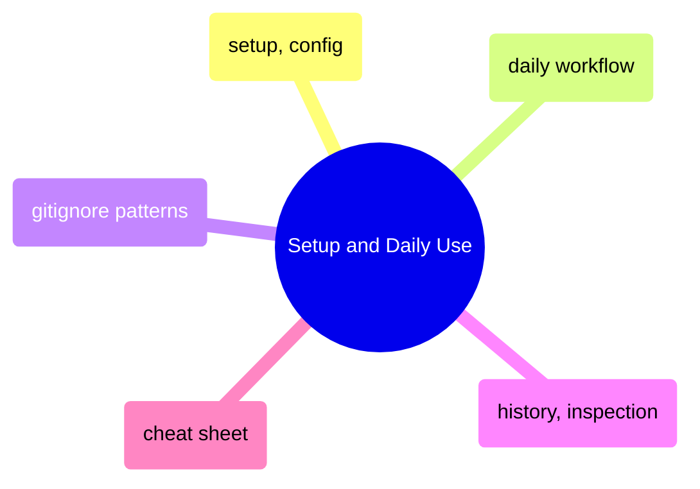
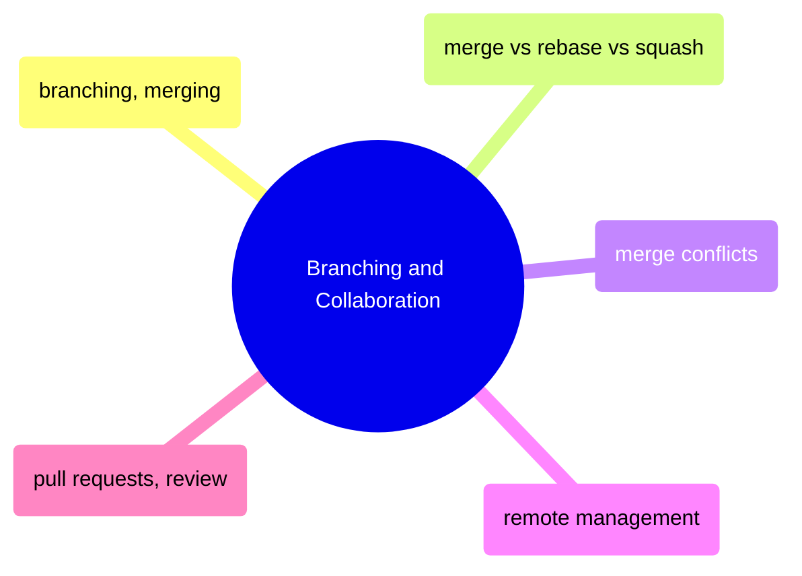
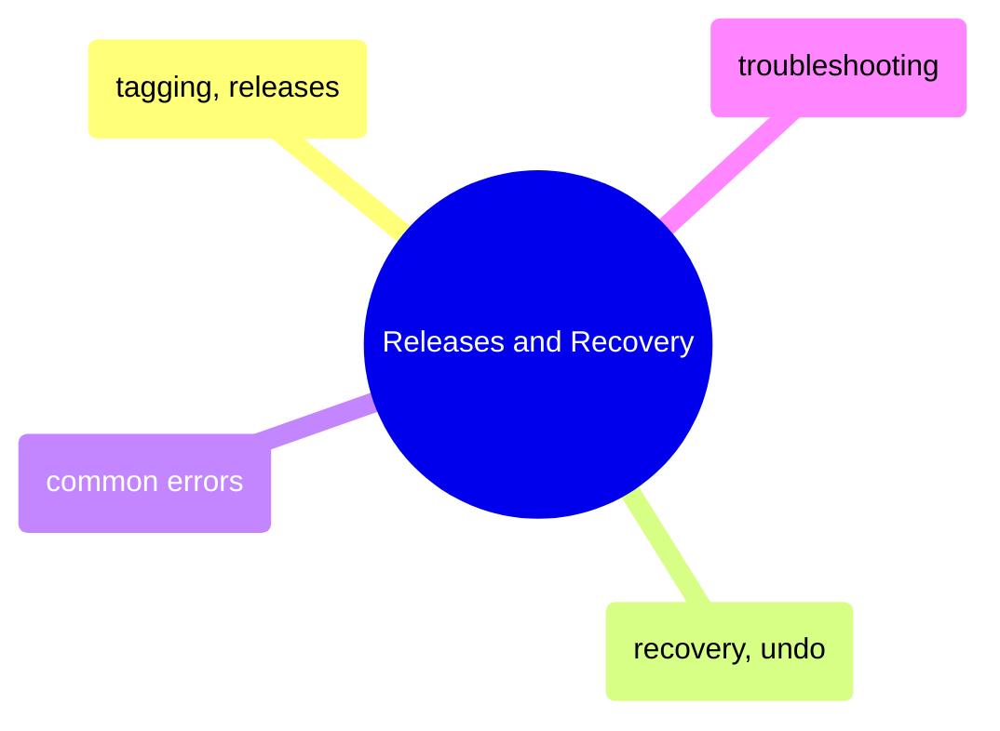

# MOC: Git

Version control from daily commits to disaster recovery — 14 pages covering
setup, branching, collaboration, and troubleshooting. Expand any section
to browse page contents.

> [!guide]+ Setup and Daily Use
>
> [[domain-setup-and-daily-use]]
>
> Git fundamentals from initial configuration through the daily commit-push-pull cycle, plus gitignore patterns, history inspection, and a quick-reference cheat sheet.

> [!guide]+ Branching and Collaboration
>
> [[domain-branching-and-collaboration]]
>
> Branch management, merge strategies, conflict resolution, remote workflows, and pull request best practices for team-based development.

> [!guide]+ Releases and Recovery
>
> [[domain-releases-and-recovery]]
>
> Tagging releases with semantic versioning, undoing mistakes safely, and troubleshooting common Git errors and team workflow problems.

## Cross-References

- [GitHub Actions](https://alp78.github.io/elysium/10-GitHub-Actions/moc-github-actions) — CI/CD workflows triggered by Git events
- [Shell](https://alp78.github.io/elysium/01-Shell/moc-shell) — Git commands run from shell
