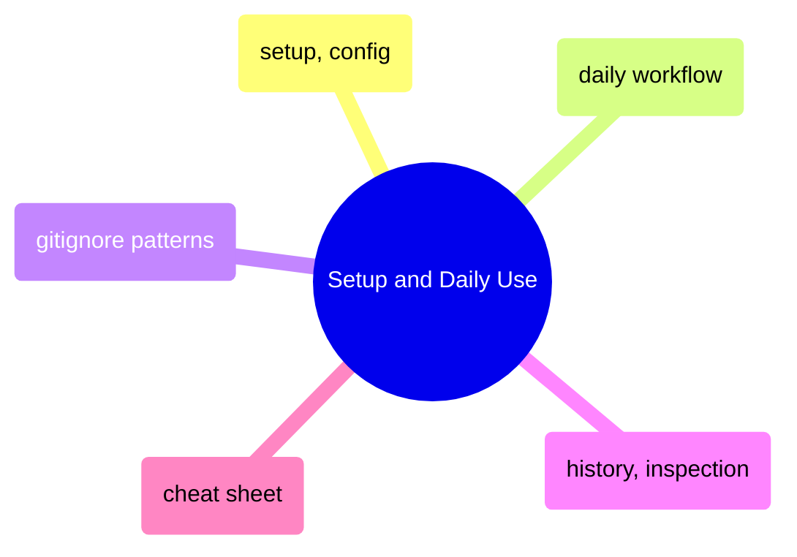
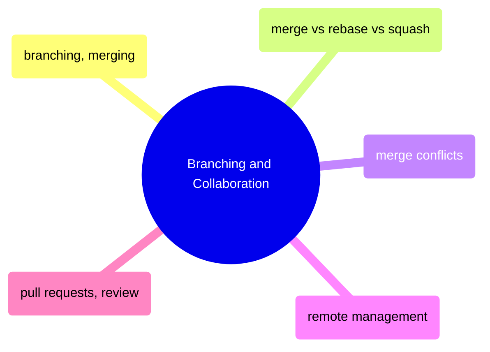
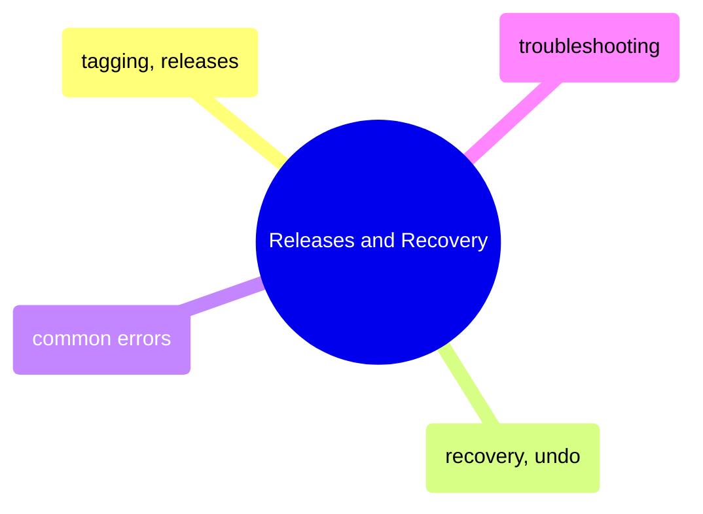

# MOC: Git

Version control from daily commits to disaster recovery — 14 pages covering
setup, branching, collaboration, and troubleshooting. Expand any section
to browse page contents.

> [!example]- Setup and Daily Use
>
> > [!abstract]- [[git-setup-and-config]]
> >
> > - [[git-setup-and-config#What is Git? Core Concepts Glossary|Core concepts glossary]]
> > - [[git-setup-and-config#Initial Setup and Configuration|Initial setup and configuration]]
> > - [[git-setup-and-config#Creating and Cloning Repositories|Creating and cloning repositories]]
> > - [[git-setup-and-config#Pre-Commit Hooks — Automated Quality Gates|Pre-commit hooks]]
>
> > [!abstract]- [[git-daily-workflow]]
> >
> > - [[git-daily-workflow#Step 1: Check What's Changed|Check what changed]]
> > - [[git-daily-workflow#Step 2: Stage Changes (Choose What to Commit)|Stage changes]]
> > - [[git-daily-workflow#Step 3: Commit (Create a Save Point)|Commit]]
> > - [[git-daily-workflow#Step 4: Push (Upload to GitHub)|Push to GitHub]]
> > - [[git-daily-workflow#Step 5: Pull (Download from GitHub)|Pull from GitHub]]
>
> > [!abstract]- [[gitignore-patterns]]
> >
> > - [[gitignore-patterns#Pattern Syntax|Pattern syntax]]
> > - [[gitignore-patterns#Stop Tracking a File That's Already Committed|Stop tracking committed files]]
> > - [[gitignore-patterns#If Secrets Were Accidentally Committed|Accidentally committed secrets]]
> > - [[gitignore-patterns#Git LFS — Large File Storage|Git LFS]]
>
> > [!abstract]- [[git-history-and-inspection]]
> >
> > - [[git-history-and-inspection#git log — The Commit Timeline|Commit timeline]]
> > - [[git-history-and-inspection#git diff — What Changed|Viewing diffs]]
> > - [[git-history-and-inspection#git blame — Who Changed Each Line|Blame authorship]]
> > - [[git-history-and-inspection#Finding Changes Quickly|Finding changes quickly]]
>
> > [!abstract]- [[git-cheat-sheet]]
> >
> > - [[git-cheat-sheet#Staging and Committing|Staging and committing]]
> > - [[git-cheat-sheet#Branching|Branching]]
> > - [[git-cheat-sheet#Merging and Rebasing|Merging and rebasing]]
> > - [[git-cheat-sheet#Remote Operations|Remote operations]]
> > - [[git-cheat-sheet#Undoing and Recovery|Undoing and recovery]]
> > - [[git-cheat-sheet#GitHub CLI|GitHub CLI]]

> [!example]- Branching and Collaboration
>
> > [!abstract]- [[git-branching-and-merging]]
> >
> > - [[git-branching-and-merging#Creating and Switching Branches|Creating and switching branches]]
> > - [[git-branching-and-merging#Stashing Uncommitted Work|Stashing uncommitted work]]
> > - [[git-branching-and-merging#Merging Strategies|Merging strategies]]
> > - [[git-branching-and-merging#Git Branch Recovery Techniques|Branch recovery techniques]]
>
> > [!abstract]- [[merge-vs-rebase-vs-squash]]
> >
> > - [[merge-vs-rebase-vs-squash#Merge vs rebase vs squash — comparison table|Comparison table]]
> > - [[merge-vs-rebase-vs-squash#git merge — standard merge with merge commit|Standard merge]]
> > - [[merge-vs-rebase-vs-squash#git rebase — replay commits for linear history|Rebase for linear history]]
> > - [[merge-vs-rebase-vs-squash#git merge --squash — collapse branch into single commit|Squash merge]]
> > - [[merge-vs-rebase-vs-squash#Decision guide — which merge strategy by scenario|Decision guide]]
>
> > [!abstract]- [[git-merge-conflicts]]
> >
> > - [[git-merge-conflicts#What a Merge Conflict Looks Like|What a conflict looks like]]
> > - [[git-merge-conflicts#Step-by-Step Merge Conflict Resolution Process|Step-by-step resolution]]
> > - [[git-merge-conflicts#Visual Merge Tools|Visual merge tools]]
> > - [[git-merge-conflicts#Rebase Conflict Resolution|Rebase conflict resolution]]
> > - [[git-merge-conflicts#Preventing Merge Conflicts|Preventing conflicts]]
>
> > [!abstract]- [[git-remote-management]]
> >
> > - [[git-remote-management#Viewing Configured Remotes|Viewing configured remotes]]
> > - [[git-remote-management#Adding a Remote (Fork Workflow)|Adding a remote]]
> > - [[git-remote-management#Fetching: Download Without Merging|Fetching without merging]]
> > - [[git-remote-management#Pruning: Clean Up Deleted Remote Branches|Pruning stale branches]]
> > - [[git-remote-management#Safe Force-Push After Rebase|Safe force-push]]
>
> > [!abstract]- [[pull-requests-and-code-review]]
> >
> > - [[pull-requests-and-code-review#Creating a PR|Creating a PR]]
> > - [[pull-requests-and-code-review#Reviewing and Merging PRs|Reviewing and merging]]
> > - [[pull-requests-and-code-review#Merge Strategy Comparison|Merge strategy comparison]]
> > - [[pull-requests-and-code-review#Preventing "PR is not mergeable" Errors|Preventing unmergeable PRs]]
> > - [[pull-requests-and-code-review#Feature Branch Team Workflow|Feature branch team workflow]]

> [!example]- Releases and Recovery
>
> > [!abstract]- [[git-tagging-and-releases]]
> >
> > - [[git-tagging-and-releases#Lightweight vs Annotated Tags|Lightweight vs annotated tags]]
> > - [[git-tagging-and-releases#Creating Tags|Creating tags]]
> > - [[git-tagging-and-releases#Pushing Tags to GitHub|Pushing tags to GitHub]]
> > - [[git-tagging-and-releases#Semantic Versioning Context|Semantic versioning]]
>
> > [!abstract]- [[git-recovery-and-undo]]
> >
> > - [[git-recovery-and-undo#Decision Tree: Which Git Undo to Use|Undo decision tree]]
> > - [[git-recovery-and-undo#Safe: Discard Uncommitted Changes|Discard uncommitted changes]]
> > - [[git-recovery-and-undo#Safe: Revert a Commit (Creates a New Undo Commit)|Revert a commit]]
> > - [[git-recovery-and-undo#Careful: Reset (Rewrites History)|Reset (rewrite history)]]
> > - [[git-recovery-and-undo#Recover: Reflog — Git's Safety Net|Reflog safety net]]
>
> > [!abstract]- [[git-common-errors]]
> >
> > - [[git-common-errors#"Failed to push: rejected -- non-fast-forward"|Push rejected non-fast-forward]]
> > - [[git-common-errors#"Detached HEAD"|Detached HEAD]]
> > - [[git-common-errors#"Permission denied (publickey)"|Permission denied publickey]]
> > - [[git-common-errors#"fatal: refusing to merge unrelated histories"|Unrelated histories]]
> > - [[git-common-errors#Quick Reference Table|Quick reference table]]
>
> > [!abstract]- [[git-problems]]
> >
> > - [[git-problems#Secrets Committed to Repository|Secrets committed to repo]]
> > - [[git-problems#Force Push to Main|Force push to shared branch]]
> > - [[git-problems#Long-Lived Feature Branches|Long-lived feature branches]]
> > - [[git-problems#Broken Main Branch|Broken main branch]]
> > - [[git-problems#PR Review Bottleneck|PR review bottleneck]]

## Cross-References

- [GitHub Actions](/10-GitHub-Actions/moc-github-actions) — CI/CD workflows triggered by Git events
- [Shell](/01-Shell/moc-shell) — Git commands run from shell
