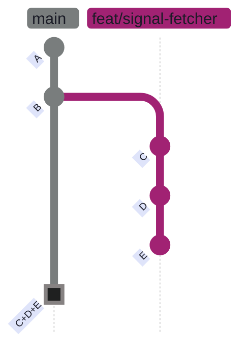
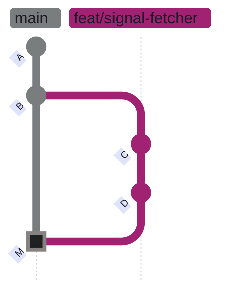
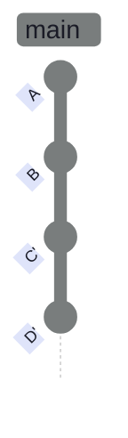
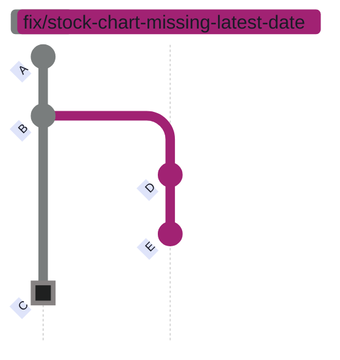
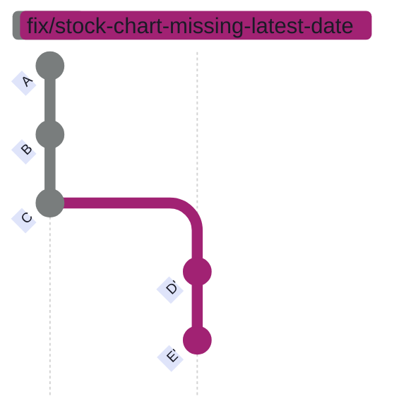

# Pull Requests and Code Review

> [!quote]
> "Given enough eyeballs, all bugs are shallow."
>
> — **Eric S. Raymond**, *The Cathedral and the Bazaar* (1999) (Linus's Law)

Pull requests (PRs) are GitHub's mechanism for proposing changes. They let teammates review your code, discuss it, and approve it before merging. This note covers the complete PR lifecycle from creation to merge, including recovery from common failure modes.

## PR Lifecycle

The PR lifecycle covers creating a branch-based proposal, having teammates review it, then merging it into main using one of three merge strategies. GitHub compares your feature branch against the base, runs CI checks, and gates the merge button until reviews and checks pass.

### Creating a PR

A pull request proposes merging one branch into another. When you open a PR, GitHub records the diff, notifies reviewers, and triggers any configured CI workflows. The PR remains open until it is merged, closed, or converted to a draft.

#### gh pr create — open a pull request from the current branch

`gh pr create` opens a new PR from the current branch against the repository's default base (usually `main`). The command returns the PR URL on success.

```bash
gh pr create --title "Add daily signal fetcher" --body "Fetches PE, yield from yfinance."
```

```text
https://github.com/org/repo/pull/42
```

To target a different base branch:

```bash
gh pr create --title "Fix bug" --body "Details" --base develop
```

To open a draft PR that cannot be merged until explicitly marked ready:

```bash
gh pr create --draft --title "WIP: new feature"
```

> [!warning] Draft PRs block merge
>
> A `--draft` PR cannot be merged until explicitly marked as "Ready for review" via the GitHub UI or `gh pr ready`. CI checks still run on draft PRs, but the merge button is disabled. This prevents accidental merges of incomplete work.

> [!success] Mark Ready When All Work Is Complete
>
> Run `gh pr ready <number>` or click "Ready for review" in the GitHub UI once your branch is complete and all CI checks pass. This unblocks the merge button and signals to reviewers that the PR is ready for evaluation.

| Flag | Syntax | Description |
|------|--------|-------------|
| `--title` | `gh pr create --title "..."` | Set the PR title |
| `--body` | `gh pr create --body "..."` | Set the PR description |
| `--base` | `gh pr create --base develop` | Target a specific base branch |
| `--draft` | `gh pr create --draft` | Mark as work-in-progress; merge button disabled |
| `--assignee` | `gh pr create --assignee @me` | Assign the PR to a user |
| `--reviewer` | `gh pr create --reviewer alice` | Request a reviewer |
| `--label` | `gh pr create --label bug` | Attach a label |

### Reviewing PRs

Use `gh pr list` to see all open PRs, `gh pr view` to inspect a specific one, and `gh pr checkout` to download the branch and test it locally before approving.

#### gh pr list — list open pull requests

Displays all open PRs with their number, title, branch, and age.

```bash
gh pr list
```

```text
#43  Add daily signal fetcher    feat/signal-fetcher    about 2 hours ago
#41  Fix chart missing volume    fix/chart-volume       about 1 day ago
```

#### gh pr view — inspect PR details and CI status

Shows the full PR: title, body, review status, CI check results, and comments. Pass `--web` to open in the browser.

```bash
gh pr view 42
```

```text
title:  Add daily signal fetcher
state:  OPEN
author: alp78
branch: feat/signal-fetcher -> main
checks: ✓ ci/build  ✓ ci/test

Fetches PE, yield from yfinance.
```

#### gh pr checkout — test a PR branch locally

Downloads the PR branch and switches to it so you can build and test changes locally before approving.

```bash
gh pr checkout 42
```

```text
Switched to branch 'feat/signal-fetcher'
Your branch is up to date with 'origin/feat/signal-fetcher'.
```

| Flag | Syntax | Description |
|------|--------|-------------|
| `pr list` | `gh pr list` | List all open PRs |
| `pr view` | `gh pr view 42` | Inspect PR title, body, checks, and reviews |
| `--web` | `gh pr view 42 --web` | Open the PR in the browser |
| `pr checkout` | `gh pr checkout 42` | Switch to the PR branch locally |

### Merging PRs

GitHub supports three merge strategies. Each produces a different commit graph shape on main. All strategies accept `--delete-branch` to remove the feature branch from GitHub after merge.

#### gh pr merge --squash — combine all commits into one

Squash merge collapses every commit on the feature branch into a single new commit on main. The feature branch's individual commit history is not preserved — main receives one clean commit per PR. The squash commit is a brand-new object with a new SHA and no parent relationship to the original branch commits.

**Squash merge:**



*Figure: Squash merge — commits C, D, and E from the feature branch are collapsed into a single commit C+D+E on main. Individual commit history is discarded. One clean entry per PR.*

```bash
gh pr merge 42 --squash --delete-branch
```

```text
✓ Squashed and merged pull request #42 (Add daily signal fetcher)
✓ Deleted branch feat/signal-fetcher
```

> [!tip] After Squash Merge
>
> After `gh pr merge --squash`, `git branch -d` may warn the branch isn't merged (different SHA). This is normal — squash creates a new combined commit with a different SHA. The changes ARE on main, just as a different commit. Safe to use `git branch -d` anyway (the warning is cosmetic).

#### gh pr merge --merge — standard merge (preserve full history)

Standard merge creates a **merge commit** with two parents: the tip of main and the tip of the feature branch. The feature branch's full commit history is preserved and visible in `git log --graph`. Use when an audit trail of individual commits matters.

**Standard merge:**



*Figure: Standard merge — merge commit M joins the two histories. All original commits (C, D) are preserved. History shows the branch existed.*

```bash
gh pr merge --merge
```

```text
✓ Merged pull request #42 (Add daily signal fetcher)
```

#### gh pr merge --rebase — replay commits linearly (no merge commit)

Rebase merge replays each feature branch commit on top of main, one by one, without creating a merge commit. Individual commits are preserved and visible in `git log`, but receive **new SHAs** — they are new commit objects, not the originals. Use when you want clean linear history with individual commits visible.

**Rebase merge:**



*Figure: Rebase merge — commits C and D replayed linearly on main as C' and D' (new SHAs). No merge commit. History is linear but SHAs differ from the originals.*

```bash
gh pr merge --rebase
```

```text
✓ Rebased and merged pull request #42 (Add daily signal fetcher)
```

| Flag | Syntax | Description |
|------|--------|-------------|
| `--squash` | `gh pr merge 42 --squash` | Squash all branch commits into one on main |
| `--merge` | `gh pr merge 42 --merge` | Create a merge commit (full history preserved) |
| `--rebase` | `gh pr merge 42 --rebase` | Replay commits linearly (new SHAs, no merge commit) |
| `--delete-branch` | `gh pr merge 42 --squash --delete-branch` | Delete the branch on GitHub after merging |

## Merge Strategies and Branch Protection

These settings control how branches are merged into main and how GitHub enforces branch hygiene. See [merge-vs-rebase-vs-squash](https://alp78.github.io/elysium/08-Git/merge-vs-rebase-vs-squash) for a deep comparison with workflow guidance and team-size recommendations.

### Merge Strategy Comparison

| Strategy | History | When to Use |
|----------|---------|------------|
| `--squash` | One clean commit per PR on main | Default for most teams — clean history |
| `--merge` | Full branch history preserved | When audit trail of individual commits matters |
| `--rebase` | Linear history, no merge commit | Clean history + individual commits visible |

### Preventing "PR Is Not Mergeable"

When another PR is merged into `main` while yours is open, GitHub may block your squash merge with: *"the merge commit cannot be cleanly created."* This happens because your branch has **diverged** — main has advanced to a new commit that your branch does not share as a parent, so Git cannot automatically reconcile the two histories.

#### Option A — Rebase locally before merge

The safest manual approach: fetch the latest main, replay your branch commits on top of it, then force-push and retry the merge. Run this right before `gh pr merge --squash`.

```bash
git fetch origin main
```

```bash
git rebase origin/main
```

```bash
git push --force-with-lease
```

#### Option B — GitHub PR settings

Configure GitHub to surface the problem automatically on every PR. Go to **Settings → General → Pull Requests** and enable:

| Setting | What it does |
|---------|--------------|
| **"Always suggest updating pull request branches"** | Adds an **"Update branch"** button on the PR page when it falls behind main — one click to rebase without CLI |
| **"Allow auto-merge"** | Lets PRs merge automatically once all checks pass |

#### Option C — Branch protection rule

Branch protection rules work hand-in-hand with [github-actions-ci-cd](https://alp78.github.io/elysium/10-GitHub-Actions/github-actions-ci-cd) — CI checks run on every PR push, and the merge button stays greyed out until they pass. Code review itself is also a powerful [teaching and collaboration tool](https://alp78.github.io/elysium/15-DataOps/leadership-and-collaboration), especially for onboarding new team members.

Go to **Settings → Branches → Branch protection rules → Add rule** for `main`:

- Enable **"Require branches to be up to date before merging"**
- GitHub will grey out the merge button until the PR is rebased onto latest `main`
- This forces contributors to always update before merging, avoiding dirty histories

> [!tip] Combining Options B and C
>
> With both enabled, you click "Update branch" on the PR page (no CLI needed), wait for checks to pass, then merge. If you also enable auto-merge, it all happens automatically.

---

## Real-World Case Study — Rebase a Diverged PR

This scenario happens regularly: you create a feature branch, another PR gets merged into `main` while you're working, and now your PR has merge conflicts that block squash-merge.

### The Situation

1. You're on `main` and have uncommitted changes across 5 files
2. A teammate's PR (`perf/bulk-sql-inserts`) was already merged into `main`
3. You need to move your changes to an existing feature branch (`fix/stock-chart-missing-latest-date`)
4. That feature branch was created *before* the teammate's PR was merged — so it diverges from `main`

The divergence is the root cause. `main` has advanced to commit `C` (the merged PR), but the feature branch's parent chain stops at `B`. GitHub cannot cleanly squash-merge a branch that diverges from the target.

**Before rebase — diverged history:**



*Figure: Feature branch diverged from main after B. The teammate's PR (commit C) was merged into main while the fix branch developed commits D and E.*

**After rebase — linear history, PR can merge:**



*Figure: After rebase — D and E replayed on top of C as D' and E' with new SHAs. The branch is now a linear extension of main and can be cleanly squash-merged.*

### Step 1 — Stash and switch branches

Moving uncommitted changes to a different branch requires stashing them first. The stash saves all staged and unstaged changes to a temporary stack, leaving the working tree clean so `git checkout` can switch branches without error.

#### git stash — shelve uncommitted changes

`git stash` saves all modified tracked files and staged changes to the stash stack, reverting the working tree to the last commit. The stash persists until you explicitly pop or drop it.

```bash
git stash
```

```text
Saved working directory and index state WIP on main: b3f1a2c fix: update dashboard layout
```

#### git checkout — switch to the feature branch

With the working tree clean after stashing, switch to the target feature branch.

```bash
git checkout fix/stock-chart-missing-latest-date
```

```text
Switched to branch 'fix/stock-chart-missing-latest-date'
Your branch is behind 'origin/fix/stock-chart-missing-latest-date' by 2 commits.
```

#### git stash pop — restore shelved changes

`git stash pop` re-applies the most recent stash onto the current branch and removes it from the stash stack — unless conflicts occur, in which case the stash is left in place and must be dropped manually after resolving.

```bash
git stash pop
```

> [!warning] Stash Pop Can Conflict
>
> If the stashed changes touch the same lines that differ between branches, `git stash pop` will produce merge conflicts. This is expected — the stash is still preserved (not dropped) when conflicts occur, so your work is safe.

> [!success] Resolve Conflict Markers, Then Drop the Stash
>
> Open each conflicted file, edit the `<<<<<<<`/`=======`/`>>>>>>>` markers to keep the correct code, then run `git add <file>` and `git stash drop` to finalize. Your stash remains available until you explicitly drop it.

### Step 2 — Resolve stash pop conflicts

When `git stash pop` produces conflicts, files will contain conflict markers. `Updated upstream` is the current branch state; `Stashed changes` is the work you stashed. Keep the code that should survive, then remove all three marker lines.

```text
<<<<<<< Updated upstream     ← what's on the current branch
            rows = []
            skipped = 0
=======                      ← separator
            inserts = []
            updates = []
>>>>>>> Stashed changes      ← your stashed work
```

After resolving, stage each file. Then manually drop the stash — `git stash pop` left it in place because conflicts prevented the auto-drop.

```bash
git add ingestion/loaders/load_ohlcv.py
```

```bash
git stash drop
```

### Step 3 — Commit and push the feature branch

With stash conflicts resolved and all changes staged, commit and push the feature branch to create the remote tracking branch.

```bash
git add -A
```

```bash
git commit -m "fix: resolve missing volume and stale OHLCV data across pipeline and dashboard"
```

```text
[fix/stock-chart-missing-latest-date a4b3c2d] fix: resolve missing volume and stale OHLCV data across pipeline and dashboard
 5 files changed, 42 insertions(+), 18 deletions(-)
```

```bash
git push -u origin fix/stock-chart-missing-latest-date
```

```text
Branch 'fix/stock-chart-missing-latest-date' set up to track remote branch 'fix/stock-chart-missing-latest-date' from 'origin'.
To github.com:org/repo.git
   b2c1d0e..a4b3c2d  fix/stock-chart-missing-latest-date -> fix/stock-chart-missing-latest-date
```

### Step 4 — Create the PR and attempt squash-merge

Open the PR and immediately try to squash-merge it. This will fail because the branch diverged from `main` before the teammate's PR was merged.

```bash
gh pr create --title "fix: resolve missing volume and stale OHLCV data" --body "..."
```

```bash
gh pr merge 7 --squash
```

#### Merge failure — PR not mergeable

GitHub blocks the merge because the branch's parent chain diverged from `main` after the teammate's PR was merged. Git cannot automatically create a clean merge commit.

```text
Pull request #7 is not mergeable: the merge commit cannot be cleanly created.
```

### Step 5 — Rebase onto the updated main

Rebasing replays your branch's commits on top of the latest `main`, creating new commit objects with new SHAs. This eliminates the divergence. After rebase, your branch is a linear extension of `main` and the squash merge can proceed. See [git-remote-management](https://alp78.github.io/elysium/08-Git/git-remote-management) for `--force-with-lease` context.

#### git fetch origin main — sync remote state

Downloads the latest `main` from GitHub without modifying your local branch or working tree.

```bash
git fetch origin main
```

```text
From github.com:org/repo
 * branch            main       -> FETCH_HEAD
```

#### git rebase origin/main — replay commits on new base

Replays each of your branch's commits on top of the fetched `origin/main`. Git pauses at each commit that conflicts with changes on `main` and shows conflict markers.

```bash
git rebase origin/main
```

Git will pause at each conflicting commit:

```text
Auto-merging ingestion/loaders/load_ohlcv.py
CONFLICT (content): Merge conflict in ingestion/loaders/load_ohlcv.py
error: could not apply f55889d... fix: resolve missing volume...
hint: Resolve all conflicts manually, mark them as resolved with
hint: "git add/rm <conflicted_files>", then run "git rebase --continue".
```

### Step 6 — Resolve rebase conflicts

Open the conflicted file. During rebase, `HEAD` means the target branch (main), not your commit. See [git-merge-conflicts](https://alp78.github.io/elysium/08-Git/git-merge-conflicts) for detailed conflict resolution techniques.

```text
<<<<<<< HEAD                 ← what's on main (the "base" during rebase)
            rows = []        ← old code from merged PR
=======
            inserts = []     ← your feature branch changes
            updates = []
>>>>>>> f55889d (fix: ...)
```

After editing out the markers, mark the file resolved and advance the rebase:

```bash
git add ingestion/loaders/load_ohlcv.py
```

```bash
git rebase --continue
```

If you need to abandon the rebase entirely and return to the pre-rebase state:

```bash
git rebase --abort
```

To skip the current commit entirely (only if the commit is no longer needed):

```bash
git rebase --skip
```

### Step 7 — Force-push and squash-merge

After rebase, the local branch has been rewritten — it has new commit SHAs and a different parent chain than the remote branch. A normal `git push` is rejected because the remote's history diverges. Use `--force-with-lease` to push the rewritten history safely.

#### git push --force-with-lease — update the remote safely

`--force-with-lease` force-pushes but only if no one else has pushed to this branch since your last fetch. It aborts the push if the remote has advanced, protecting teammates' work. Always prefer this over `--force` on any branch someone else might have fetched.

```bash
git push --force-with-lease origin fix/stock-chart-missing-latest-date
```

```text
To github.com:org/repo.git
 + a4b3c2d...e5f4g3h fix/stock-chart-missing-latest-date -> fix/stock-chart-missing-latest-date (forced update)
```

#### gh pr merge --squash — squash-merge the rebased branch

Now that the branch is a linear extension of `main`, the squash merge succeeds.

```bash
gh pr merge 7 --squash
```

```text
✓ Squashed and merged pull request #7 (fix: resolve missing volume and stale OHLCV data)
```

### Why This Works

Each step addresses a specific problem in the diverged-branch scenario.

| Step | What happens |
|------|-------------|
| `git stash` + `pop` | Moves uncommitted work across branches |
| `git rebase origin/main` | Replays your commits on top of the latest main, creating a linear history |
| Resolve conflicts | You manually pick the correct code when Git can't auto-merge |
| `--force-with-lease` | Updates the remote branch with the rewritten (rebased) history |
| `gh pr merge --squash` | Squashes all commits into one clean commit on main |

### Key Takeaways

The five rules that prevent or recover from every failure mode in this scenario.

1. **Stash pop conflicts are normal** when branches have diverged — your work is safe in the stash until you `git stash drop`
2. **Rebase before merge** when your PR falls behind `main` — it creates a clean linear history
3. **Always use `--force-with-lease`** instead of `--force` when pushing rebased branches
4. **Conflict markers differ** between stash pop (`Updated upstream` / `Stashed changes`) and rebase (`HEAD` = target branch / commit SHA = your commit)
5. **`git rebase --abort`** is your safety net — it undoes the entire rebase if things go wrong

---

## Team Workflow

Standard conventions for collaborative PR-based development on shared repositories.

### Feature Branch Workflow

The standard eight-step cycle for all feature work on a shared repository.

```text
1. git checkout main && git pull
2. git checkout -b feat/my-feature
3. Make changes, commit frequently with clear messages
4. git push -u origin feat/my-feature
5. gh pr create --title 'Add feature X'
6. Teammates review, you address feedback with new commits
7. gh pr merge --squash --delete-branch
8. git checkout main && git pull && git branch -d feat/my-feature
```

### Team Rules

Non-negotiable conventions for shared repository hygiene and safe collaboration.

- Never push directly to main — always use PRs
- Never force-push to shared branches
- Pull before you push to avoid conflicts
- Keep PRs small and focused — one feature per PR
- Write descriptive PR descriptions explaining WHY, not just WHAT
- Delete branches after merging (use `--delete-branch` flag)
- Use branch protection rules on main: require reviews, passing CI, no force-push
- Tag releases so you can always find what's deployed

---

## GitHub CLI Reference

Quick reference for `gh` subcommands beyond pull requests. All commands operate on the current repository by default; pass `OWNER/REPO` to target a specific repo.

### gh issue — Issue Commands

Create, list, view, edit, comment on, and close issues.

```bash
gh issue list                          # Open issues
gh issue list --state all --label bug
gh issue list --author "@me" --assignee "@me"
gh issue view 99                       # View issue
gh issue view 99 --web

gh issue create --title "Bug: crash on login" --body "Steps to reproduce..."
gh issue create --label bug --assignee alice --milestone v2.0
gh issue create --template bug_report.md

gh issue edit 99 --title "new title"
gh issue edit 99 --add-label "confirmed" --remove-label "needs-triage"
gh issue edit 99 --assignee alice

gh issue comment 99 --body "Fixed in #42"
gh issue close 99 --comment "Closed by #42" --reason completed
gh issue reopen 99
gh issue pin 99
gh issue transfer 99 REPO
gh issue delete 99 --yes
```

---

### gh release — Release Commands

Create, publish, and manage GitHub releases and their attached assets.

```bash
gh release list                         # List releases
gh release view TAG                     # View release details
gh release view --json tagName,body,assets

gh release create TAG                   # Create release (prompts for details)
gh release create v1.2.0 --title "v1.2.0" --notes "Release notes"
gh release create v1.2.0 --notes-file CHANGELOG.md
gh release create v1.2.0 --draft        # Draft release
gh release create v1.2.0 --prerelease   # Pre-release
gh release create v1.2.0 ./dist/*.tar.gz  # Attach assets
gh release create v1.2.0 ./bin/app#"Linux binary"  # Named asset

gh release edit TAG --title "new title" --notes "new notes"
gh release edit TAG --draft=false        # Publish draft

gh release upload TAG FILE [FILE...]    # Upload additional assets
gh release delete TAG --yes             # Delete release
gh release delete TAG --cleanup-tag --yes  # Also delete the git tag
```

---

### gh repo — Repository Commands

Clone, create, fork, view, sync, and manage repositories.

```bash
gh repo clone OWNER/REPO               # Clone a repo
gh repo clone OWNER/REPO -- --depth 1  # With git flags after --

gh repo create NAME --public           # Create public repo
gh repo create NAME --private --clone  # Private + clone locally
gh repo create NAME --template OWNER/TEMPLATE

gh repo fork OWNER/REPO                # Fork to your account
gh repo fork OWNER/REPO --clone        # Fork + clone
gh repo fork OWNER/REPO --remote       # Add upstream remote

gh repo view                           # View current repo
gh repo view OWNER/REPO --web          # Open in browser

gh repo sync                           # Sync fork with upstream
gh repo sync --branch main

gh repo rename NEW_NAME
gh repo archive                        # Archive repo
gh repo delete --confirm

gh repo list [OWNER]                   # List your/org repos
gh repo list --fork --source --archived

gh repo set-default OWNER/REPO         # Set default repo for gh commands
```

---

### gh auth — Authentication Commands

Log in, log out, inspect token status, and configure Git to use `gh` as a credential helper.

```bash
gh auth login                          # Interactive login (browser or token)
gh auth login --with-token < token.txt # Non-interactive with token
gh auth login --hostname ENTERPRISE_URL  # GitHub Enterprise

gh auth logout                         # Remove stored credentials
gh auth logout --hostname HOST

gh auth status                         # Show current authentication state
gh auth status --show-token            # Include token value

gh auth token                          # Print current token
gh auth refresh                        # Refresh token scopes
gh auth refresh --scopes repo,read:org
gh auth setup-git                      # Configure git to use gh as credential helper
```

---

### gh api — Raw REST and GraphQL

Make authenticated REST or GraphQL calls to the GitHub API directly. Useful for operations not covered by `gh` subcommands. The `--jq` flag filters JSON output using jq expressions.

```bash
# GET request
gh api repos/OWNER/REPO

# POST request
gh api repos/OWNER/REPO/issues -f title="Bug" -f body="Description"

# PATCH
gh api -X PATCH repos/OWNER/REPO -f description="new description"

# DELETE
gh api -X DELETE repos/OWNER/REPO/issues/comments/COMMENT_ID

# With pagination
gh api repos/OWNER/REPO/issues --paginate

# JSON output fields
gh api repos/OWNER/REPO --jq '.stargazers_count'
gh api repos/OWNER/REPO --jq '[.name, .description]'

# GraphQL
gh api graphql -f query='
  query($login: String!) {
    user(login: $login) {
      name
      bio
      repositories(first: 10, orderBy: {field: UPDATED_AT, direction: DESC}) {
        nodes { name stargazerCount }
      }
    }
  }
' -f login=octocat

# Template output
gh api repos/OWNER/REPO --template '{{.full_name}}: {{.stargazers_count}} stars'

# Flags
# -H, --header KEY:VAL   Add request header
# -f, --field KEY=VAL    Add string parameter
# -F, --raw-field KEY=VAL  Add raw (typed) parameter
# -q, --jq EXPR          Filter with jq
# --paginate             Fetch all pages
# --input FILE           Read JSON body from file
# --cache DURATION       Cache response
# --silent               Don't print response
# --include              Include response headers
```

---

## Related

- [git-daily-workflow](https://alp78.github.io/elysium/08-Git/git-daily-workflow) — the daily workflow that feeds into PRs
- [git-branching-and-merging](https://alp78.github.io/elysium/08-Git/git-branching-and-merging) — creating and managing branches
- [git-merge-conflicts](https://alp78.github.io/elysium/08-Git/git-merge-conflicts) — resolving conflict markers during rebase and stash pop
- [merge-vs-rebase-vs-squash](https://alp78.github.io/elysium/08-Git/merge-vs-rebase-vs-squash) — detailed strategy comparison with team guidance
- [git-remote-management](https://alp78.github.io/elysium/08-Git/git-remote-management) — `--force-with-lease` and remote push safety
- [git-recovery-and-undo](https://alp78.github.io/elysium/08-Git/git-recovery-and-undo) — stash and reflog for recovery
- [github-actions-ci-cd](https://alp78.github.io/elysium/10-GitHub-Actions/github-actions-ci-cd) — the CI/CD that runs on PRs

## References

- [GitHub CLI pr commands](https://cli.github.com/manual/gh_pr)
- [About pull requests](https://docs.github.com/en/pull-requests/collaborating-with-pull-requests/proposing-changes-to-your-work-with-pull-requests/about-pull-requests)
