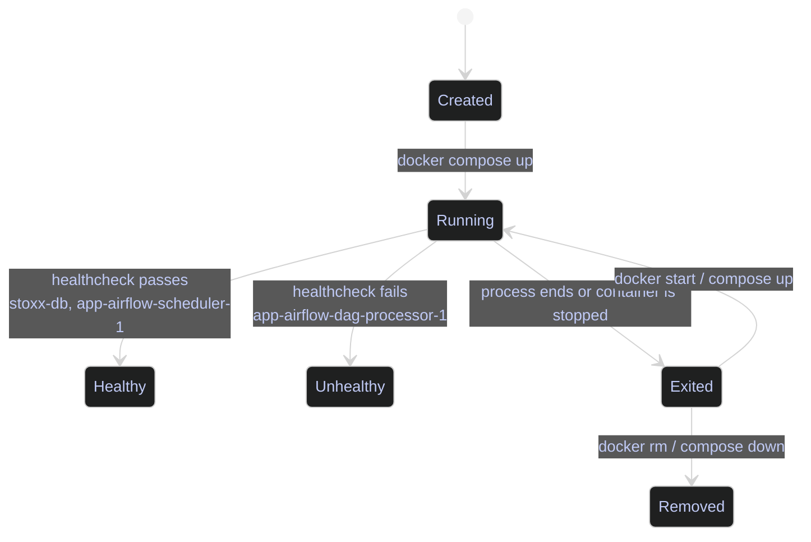

# Container Lifecycle

> [!abstract]- Summary
>
> Documents the real container runtime state for the ESG local `stoxx` compose project and the live `stoxx-airflow` VM so operators can inventory containers, validate in-container behavior, and interpret health and lifecycle signals against current infrastructure rather than stale repo assumptions.
>
> **Runtime inventory**
> - Compare the local Windows compose project and the live GCP VM with `docker compose ps`, including concrete container names, service keys, `STATUS`, and published `PORTS`
> - Distinguish the compose model from actual runtime state, including stopped `stoxx-dashboard`, active `stoxx-db`, and the current Airflow 3.2.0 `app` stack
>
> **Exec and logs**
> - Verify live scheduler behavior from inside running containers with `docker exec`, including Airflow version, `CeleryExecutor`, and PostgreSQL readiness
> - Read scheduler activity with `docker logs --tail 30`, including task enqueue events, executor success callbacks, and `CloudRunExecuteJobOperator` completion lines
>
> **Lifecycle signals**
> - Interpret `healthy`, `Exited (0)`, `Exited (nonzero)`, and `unhealthy` as different operational states with different next actions
> - Separate process liveness from readiness and healthcheck failure so degraded Airflow services are diagnosed rather than blindly restarted
>
> **Operations and safety**
> - Warnings: local and VM topologies differ, `docker exec` is only read-only if the executed command is read-only, and `docker logs` is complete only when the application writes to stdout or stderr
> - Recommendations table: runtime-state interpretation guidance covering normal, review, and act paths for `STATUS` values

> [!note]- Glossary
>
> **Container lifecycle**
> - The sequence of runtime states a container can move through from creation to active service, failure, exit, restart, and removal.
> - The note uses lifecycle state as the primary diagnostic frame before it looks at logs or in-container commands.
>
> > [!warning] State is not health
> >
> > A container can exist, be running, and still be unusable. Always pair lifecycle state with health output and recent logs.
>
> ---
>
> **Image**
> - A read-only build artifact that packages a filesystem, default command, metadata, and configuration for creating containers.
> - The local and VM containers in this note are derived from different images, so image identity explains why their runtime behavior differs.
>
> > [!info] Immutable build template
> >
> > Docker does not mutate an image when a container writes files or changes state. Runtime changes live in the container layer or attached storage.
>
> ---
>
> **Container**
> - A running or stopped instance of an image with its own process tree, network identity, mounts, and state.
> - Every command in the note ultimately targets containers, not abstract services, which is why real container names matter.
>
> > [!warning] Running is not ready
> >
> > A running container only proves the main process exists. Healthchecks and logs are required to decide whether the service is actually usable.
>
> ---
>
> **Compose project**
> - A named group of services, networks, and volumes managed together by `docker compose`.
> - The note contrasts the local `stoxx` project with the VM `app` project so operators do not misread prefixed object names.
>
> > [!info] Name prefixes everything
> >
> > Compose project names are baked into container, network, and volume names. A mismatched project name changes every runtime identifier you inspect.
>
> ---
>
> **Service**
> - A logical workload definition inside a compose file that tells Docker how a container should be created and run.
> - The note repeatedly distinguishes defined services from containers that actually exist right now, which is critical during drift analysis.
>
> > [!warning] Definition is not instance
> >
> > A service can be declared in YAML and still have no container on the host. `docker compose ps` shows only created containers, not every possible service.
>
> ---
>
> **Healthcheck**
> - A probe Docker runs inside a container to decide whether the service is operational beyond simple process existence.
> - Health output is what separates healthy SQL Server and Airflow services from containers that are merely alive but degraded.
>
> > [!danger] Alive can still fail
> >
> > A bad or slow healthcheck can mark a working process unhealthy, while a missing healthcheck can leave a broken service looking superficially fine.
>
> ---
>
> **Published port**
> - A host-to-container port mapping that exposes a container service beyond the container network namespace.
> - The `PORTS` column in `docker compose ps` uses published ports to show which services are reachable from the host and which remain internal.
>
> > [!info] Internal is still reachable
> >
> > A service without a published host port can still be fully available to peer containers on the compose network. Host reachability and container-network reachability are separate questions.
>
> ---
>
> **Bind mount**
> - A direct mapping from a host path into a container path.
> - Bind mounts explain why host files such as code, config, or logs can appear immediately inside a container during inspection.
>
> > [!warning] Host semantics leak through
> >
> > Windows and Linux path rules, permissions, and line endings flow straight through bind mounts. Runtime bugs often come from host filesystem behavior rather than the container image.
>
> ---
>
> **Named volume**
> - Docker-managed persistent storage addressed by a logical volume name rather than an explicit host path.
> - The note uses named volumes to reason about data that survives container recreation and should not be confused with ephemeral container layers.
>
> > [!info] Backing path is hidden
> >
> > Docker chooses the host storage location for a named volume. Inspect the volume when persistence, cleanup, or disk usage is the real question.
>
> ---
>
> **`docker compose ps`**
> - A Docker Compose command that lists created containers in a compose project along with service name, status, and published ports.
> - It is the note's primary inventory command because it shows current runtime truth faster than reading YAML or broader inspect output.
>
> > [!warning] Add `-a` for exits
> >
> > Without `-a`, stopped containers disappear from the listing and clean exits look like missing services. The local dashboard state in this note depends on including stopped containers.
>
> ---
>
> **`docker exec`**
> - A Docker command that runs another process inside an already existing container.
> - The note uses it to prove what the live Airflow scheduler container can actually report about its version, executor, and database connectivity.
>
> > [!warning] The command defines safety
> >
> > `docker exec` is only observational if the command you run is observational. A write-capable command mutates the live container immediately.
>
> ---
>
> **`docker logs`**
> - A Docker command that reads a container's stdout and stderr streams, either as a dump or a live follow stream.
> - The note uses scheduler logs as direct evidence that work is being queued, executed, and completed.
>
> > [!warning] Log coverage is conditional
> >
> > `docker logs` only sees what the application writes to stdout or stderr. File-based application logs are invisible unless the container is configured to surface them.
>
> ---
>
> **`CeleryExecutor`**
> - The Airflow executor mode that sends task work to Celery workers through a broker instead of running tasks inside the scheduler process.
> - The note treats the executor setting as proof that the live VM is using the intended distributed execution model.
>
> > [!info] Scheduler is not worker
> >
> > Under `CeleryExecutor`, the scheduler enqueues work and workers execute it. A healthy scheduler alone does not prove task execution capacity if workers are unavailable.
>
> ---
>
> **`CloudRunExecuteJobOperator`**
> - An Airflow operator that triggers a Cloud Run job execution from a DAG task.
> - Its presence in the scheduler logs is the concrete signal that the Airflow stack is dispatching the project's Cloud Run workload rather than only scheduling internally.
>
> > [!info] Operator names reveal workload
> >
> > Airflow log lines often expose the operator class used by a task. Reading that class name tells you which external platform the scheduler is orchestrating.




## Runtime Inventory

The first lifecycle question is always the same: what exists right now, what is running, and what is only defined on disk? In this project, the answer is different locally and on the Airflow VM, so inspect them separately instead of assuming the two environments mirror each other.

### Compose Service Inventory

`docker compose ps` is the fastest high-signal runtime inventory command in this chapter because it shows lifecycle state, service identity, and published ports in one view. The output below is not theoretical. It comes from the local `ESG` repo and the live Airflow VM on April 13, 2026.

| Field | Source column | Unit / type | Meaning |
|---|---|---|---|
| `NAME` | Compose-generated container name | string | The concrete container identifier used in `docker logs`, `docker exec`, and `docker inspect`. |
| `SERVICE` | Compose service key | string | The logical service defined in the compose file. |
| `STATUS` | Runtime and health state | string | Whether the process is running, exited, healthy, or unhealthy. |
| `PORTS` | Published port map | string | Which ports are reachable from the host, if any. |

#### PowerShell | docker compose ps | inspect the local Windows compose project

**When to run:** After `docker compose up`, after a reboot, or when a host-side tool cannot reach the local SQL Server or dashboard.
**Trigger:** The repo appears partially up, or you need to verify whether a service exists as a container versus only as a compose definition.
**Context:** PowerShell on the Windows host in `C:\Users\aperi\DEV\ESG`. This is a read-only inventory command.
**Purpose:** Confirm which local services are present and whether they are actually serving traffic.

*Lists the current local `stoxx` compose containers and their lifecycle state.*

```powershell
docker compose -f C:\Users\aperi\DEV\ESG\docker-compose.yml ps -a
```

```text
NAME              IMAGE                                        COMMAND                  SERVICE     CREATED       STATUS                   PORTS
stoxx-dashboard   stoxx-dashboard                              "dotnet ESG.Dashboar…"   dashboard   4 weeks ago   Exited (0) 4 weeks ago
stoxx-db          mcr.microsoft.com/mssql/server:2022-latest   "/bin/bash /entrypoi…"   db          4 weeks ago   Up 9 hours (healthy)     0.0.0.0:1434->1433/tcp, [::]:1434->1433/tcp
```

This output proves three useful facts immediately. First, the local dashboard exists as a container but is not currently serving traffic because it exited cleanly with code `0`. Second, the local SQL Server container is the only active service in the local stack at the moment and its healthcheck is succeeding. Third, the `pipeline` service is defined in the compose file but has no current container, so any expectation that it is "already up" is wrong until `docker compose up pipeline` or `docker compose up` is run.

| Column | Value | Watch | Meaning | Implication |
|---|---|---|---|---|
| `STATUS` | `Up ... (healthy)` | Normal | The main process is running and the healthcheck is succeeding. | Safe as a dependency target for other local services. |
| `STATUS` | `Exited (0)` | Review | The main process stopped cleanly. | The service is not available until it is recreated or started again. |
| `STATUS` | `Exited (nonzero)` | Act | The container process failed. | Inspect logs immediately before recreating the container. |
| `STATUS` | `Up ... (unhealthy)` | Act | The main process is alive but the healthcheck is failing. | The problem may be readiness, not process death. |

#### Linux | docker compose ps | inspect the live Airflow VM compose project

**When to run:** After any VM reboot, Airflow outage, DAG deployment, or healthcheck alarm.
**Trigger:** The Airflow UI, scheduler, worker, or broker appears unavailable, or you need to verify the live container topology before debugging.
**Context:** Linux shell on `stoxx-airflow`, reached through `gcloud compute ssh`. This is a read-only inventory command against the live VM.
**Purpose:** Confirm the real Airflow stack that is currently running in GCP and identify which services expose host ports.

*Lists the current live Airflow compose containers on the GCP VM.*

```bash
gcloud compute ssh stoxx-airflow --project bq-wh-nb --zone europe-west1-b --tunnel-through-iap --command "cd /home/alexper_recovery_gmail_com/app && docker compose ps"
```

```text
NAME                          IMAGE                 COMMAND                  SERVICE                 CREATED         STATUS                     PORTS
app-airflow-apiserver-1       stoxx-airflow:3.2.0   "/usr/bin/dumb-init …"   airflow-apiserver       9 minutes ago   Up 8 minutes (healthy)     0.0.0.0:8080->8080/tcp, [::]:8080->8080/tcp
app-airflow-dag-processor-1   stoxx-airflow:3.2.0   "/usr/bin/dumb-init …"   airflow-dag-processor   9 minutes ago   Up 8 minutes (unhealthy)   8080/tcp
app-airflow-scheduler-1       stoxx-airflow:3.2.0   "/usr/bin/dumb-init …"   airflow-scheduler       9 minutes ago   Up 8 minutes (healthy)     8080/tcp
app-airflow-triggerer-1       stoxx-airflow:3.2.0   "/usr/bin/dumb-init …"   airflow-triggerer       9 minutes ago   Up 8 minutes (unhealthy)   8080/tcp
app-airflow-worker-1          stoxx-airflow:3.2.0   "/usr/bin/dumb-init …"   airflow-worker          9 minutes ago   Up 7 minutes (healthy)     8080/tcp
app-postgres-1                postgres:16           "docker-entrypoint.s…"   postgres                3 hours ago     Up 3 hours (healthy)       5432/tcp
app-redis-1                   redis:7.2-bookworm    "docker-entrypoint.s…"   redis                   3 hours ago     Up 3 hours (healthy)       6379/tcp
```

This output is the operational truth for the live VM. The stack is a Compose project named `app`, not the older repo-documented `docker run` layout with `airflow-webserver`, `airflow-scheduler`, and `airflow-triggerer` as standalone containers. The VM is running Airflow 3.2.0 with `airflow-apiserver`, `airflow-scheduler`, `airflow-worker`, `airflow-dag-processor`, `airflow-triggerer`, PostgreSQL, and Redis. Only the API server publishes host port `8080`, which is why UI reachability issues should start with that container and not with the internal services.

| Flag | Syntax | Description |
|---|---|---|
| `-f` | `docker compose -f <file> ps -a` | Forces Docker to use the intended compose file instead of auto-discovery. |
| `-a` | `docker compose ps -a` | Includes stopped containers, which is why the exited local dashboard appears in the output. |
| `--project` | `gcloud compute ssh ... --project bq-wh-nb` | Targets the actual GCP project that currently owns `stoxx-airflow`. |
| `--zone` | `gcloud compute ssh ... --zone europe-west1-b` | Targets the correct zone for the VM instance. |
| `--tunnel-through-iap` | `gcloud compute ssh ... --tunnel-through-iap` | Uses IAP to reach the VM instead of depending on direct public SSH. |
| `--command` | `gcloud compute ssh ... --command "<cmd>"` | Runs a non-interactive remote command without opening a full shell session. |

## Exec And Logs

Once the inventory is clear, the next step is to prove what the running container can actually do. In this project, `docker exec` is the fastest way to validate executor mode and database reachability on the Airflow VM, while `docker logs` is the fastest way to prove that the scheduler is dispatching real work.

### Live Runtime Verification

These commands are operationally different from `docker compose ps`. They do not just report metadata. They cross the container boundary and ask the process itself to identify its version, configuration, database connectivity, and recent background work.

#### Linux | docker exec | verify the live Airflow scheduler runtime from inside the containers

**When to run:** After Airflow startup, after a Compose refresh, or when task execution does not match the expected executor model.
**Trigger:** The scheduler is running but you need proof that it is on the intended Airflow version, using the intended executor, and still connected to PostgreSQL.
**Context:** Linux shell on `stoxx-airflow`. The commands below are read-only checks executed inside existing containers.
**Purpose:** Prove that the live scheduler is really Airflow 3.2.0, that it is using `CeleryExecutor`, and that the metadata database is reachable from the stack itself.

*Reads the Airflow version, executor setting, and PostgreSQL readiness from the live VM containers.*

```bash
gcloud compute ssh stoxx-airflow --project bq-wh-nb --zone europe-west1-b --tunnel-through-iap --command "docker exec app-airflow-scheduler-1 airflow version && echo '---' && docker exec app-airflow-scheduler-1 airflow config get-value core executor && echo '---' && docker exec app-postgres-1 pg_isready -U airflow"
```

```text
3.2.0
---
CeleryExecutor
---
/var/run/postgresql:5432 - accepting connections
```

This is a decisive runtime check. The container is not only present; it is the expected Airflow release, it is running `CeleryExecutor` rather than `LocalExecutor` or `SequentialExecutor`, and PostgreSQL is reachable from inside the stack. That matches the live `docker-compose.yaml` on the VM, which wires Redis as the broker and PostgreSQL as both metadata database and Celery result backend.

#### Linux | docker logs | read the scheduler's recent operational trail

**When to run:** When tasks stay queued, when a DAG appears idle, or when you need to prove that the scheduler is dispatching Cloud Run work.
**Trigger:** Airflow UI symptoms do not tell you whether the scheduler is making forward progress.
**Context:** Linux shell on `stoxx-airflow`. This is a read-only log inspection against the running scheduler container.
**Purpose:** Show recent scheduling decisions, queue transitions, and successful task completion directly from the scheduler logs.

*Dumps the most recent scheduler log lines from the live Airflow VM.*

```bash
gcloud compute ssh stoxx-airflow --project bq-wh-nb --zone europe-west1-b --tunnel-through-iap --command "docker logs app-airflow-scheduler-1 --tail 30"
```

```text
2026-04-13T17:30:26.242448Z [info     ] 1 tasks up for execution:
        <TaskInstance: stoxx_stage_yfinance.fetch_bronze_stage_into_gcs manual__2026-04-13T17:28:30Z_serving [scheduled]> [airflow.jobs.scheduler_job_runner.SchedulerJobRunner] loc=scheduler_job_runner.py:665
2026-04-13T17:30:26.249277Z [info     ] Trying to enqueue tasks: [<TaskInstance: stoxx_stage_yfinance.fetch_bronze_stage_into_gcs manual__2026-04-13T17:28:30Z_serving [scheduled]>] for executor: CeleryExecutor(parallelism=32) [airflow.jobs.scheduler_job_runner.SchedulerJobRunner] loc=scheduler_job_runner.py:1030
2026-04-13T17:31:54.635402Z [info     ] Received executor event with state success for task instance TaskInstanceKey(dag_id='stoxx_stage_yfinance', task_id='fetch_bronze_stage_into_gcs', run_id='manual__2026-04-13T17:28:30Z_serving', try_number=1, map_index=-1) [airflow.jobs.scheduler_job_runner.SchedulerJobRunner] loc=scheduler_job_runner.py:1187
2026-04-13T17:31:54.678124Z [info     ] TaskInstance Finished: dag_id=stoxx_stage_yfinance, task_id=fetch_bronze_stage_into_gcs, run_id=manual__2026-04-13T17:28:30Z_serving, map_index=-1, run_start_date=2026-04-13 17:30:27.650234+00:00, run_end_date=2026-04-13 17:31:54.180281+00:00, run_duration=86.530047, state=success, executor=CeleryExecutor(parallelism=32), executor_state=success, try_number=1, max_tries=1, pool=default_pool, queue=default, priority_weight=11, operator=CloudRunExecuteJobOperator, queued_dttm=2026-04-13 17:30:26.244615+00:00, scheduled_dttm=2026-04-13 17:30:26.200354+00:00,queued_by_job_id=13, pid=93 [airflow.jobs.scheduler_job_runner.SchedulerJobRunner] loc=scheduler_job_runner.py:1276
127.0.0.1 - - [13/Apr/2026 17:31:39] "GET /health HTTP/1.1" 200 -
```

This log proves that the live scheduler is not idle. It is identifying tasks, queueing them for `CeleryExecutor`, receiving success events back from the executor, and finishing `CloudRunExecuteJobOperator` tasks for the `stoxx_stage_yfinance` DAG. The trailing `GET /health` line also shows that the scheduler health endpoint is answering, which matters because the VM's scheduler container is currently marked healthy by Docker.

| Flag | Syntax | Description |
|---|---|---|
| `--tail` | `docker logs --tail 30 <container>` | Limits the log output to the most recent lines so the signal is readable. |
| `--project` | `gcloud compute ssh ... --project bq-wh-nb` | Forces the command to the live GCP project instead of the outdated repo value. |
| `--zone` | `gcloud compute ssh ... --zone europe-west1-b` | Reaches the correct VM zone. |
| `--tunnel-through-iap` | `gcloud compute ssh ... --tunnel-through-iap` | Uses IAP for VM access. |
| `--command` | `gcloud compute ssh ... --command "<cmd>"` | Runs the container inspection non-interactively from the host shell. |

## Lifecycle Signals

The current project exposes all three lifecycle states that matter in day-to-day Docker operations: healthy long-running services, cleanly exited containers, and running-but-unhealthy containers. Do not flatten those into a single "up" or "down" mental model.

| Observed state | Real example | What it means here | Next move |
|---|---|---|---|
| `Up ... (healthy)` | `stoxx-db`, `app-airflow-scheduler-1`, `app-postgres-1` | The main process is alive and the probe succeeded. | Treat the service as a valid dependency target. |
| `Exited (0)` | `stoxx-dashboard` | The process ended cleanly, but the service is not currently serving traffic. | Restart or recreate it only if you need that service now. |
| `Up ... (unhealthy)` | `app-airflow-dag-processor-1`, `app-airflow-triggerer-1` | The process is alive, but the probe is failing or timing out. | Diagnose the healthcheck before restarting the container blindly. |

The Airflow VM's current unhealthy state is not a generic Docker lesson. It is a real compose-health issue in the live stack, and it is analyzed in detail in [[03-docker-compose]] because the root cause sits in the Compose healthcheck definition rather than in the container process model itself.

## Related

- [[02-image-management]]
- [[03-docker-compose]]
