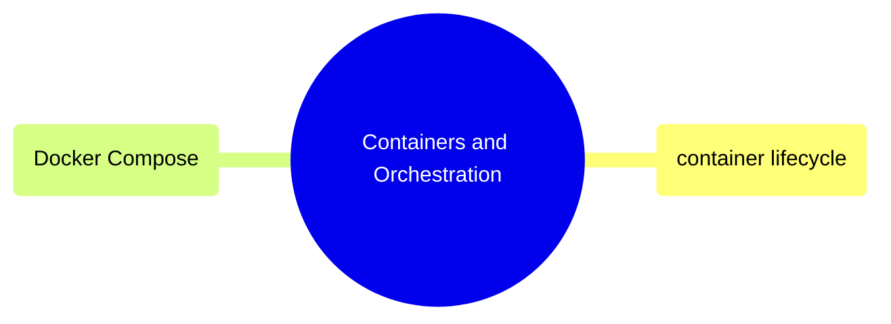

# Containers and Orchestration

Running, managing, and debugging containers, plus multi-container orchestration with Docker Compose.

> [!abstract]- [[01-container-lifecycle]]
>
> - [[container-lifecycle#Running Containers (`docker run`)|Running containers]]
> - [[container-lifecycle#Lifecycle Management|Lifecycle management]]
> - [[container-lifecycle#Viewing Logs|Viewing logs]]
> - [[container-lifecycle#Exec and Attach|Exec and attach]]
> - [[container-lifecycle#Inspection and Debugging|Inspection and debugging]]
> - [[container-lifecycle#Container Debugging Checklist|Debugging checklist]]

> [!abstract]- [[03-docker-compose]]
>
> - [[docker-compose#Compose File Structure|Compose file structure]]
> - [[docker-compose#Lifecycle Commands|Lifecycle commands]]
> - [[docker-compose#Updating Images (Rolling Updates)|Rolling updates]]
> - [[docker-compose#Configuration: Validation and Overrides|Config validation and overrides]]

