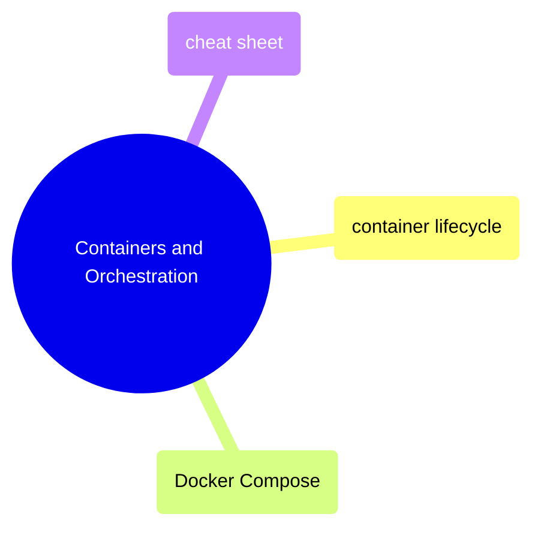

# Containers and Orchestration

Running, managing, and debugging containers, plus multi-container orchestration with Docker Compose.

> [!abstract]- [[container-lifecycle]]
>
> - [[container-lifecycle#Running Containers (`docker run`)|Running containers]]
> - [[container-lifecycle#Lifecycle Management|Lifecycle management]]
> - [[container-lifecycle#Viewing Logs|Viewing logs]]
> - [[container-lifecycle#Exec and Attach|Exec and attach]]
> - [[container-lifecycle#Inspection and Debugging|Inspection and debugging]]
> - [[container-lifecycle#Container Debugging Checklist|Debugging checklist]]

> [!abstract]- [[docker-compose]]
>
> - [[docker-compose#Compose File Structure|Compose file structure]]
> - [[docker-compose#Lifecycle Commands|Lifecycle commands]]
> - [[docker-compose#Updating Images (Rolling Updates)|Rolling updates]]
> - [[docker-compose#Configuration: Validation and Overrides|Config validation and overrides]]

> [!abstract]- [[docker-cheat-sheet]]
>
> - [[docker-cheat-sheet#Container Lifecycle|Container lifecycle]]
> - [[docker-cheat-sheet#Image Management|Image management]]
> - [[docker-cheat-sheet#Docker Compose|Docker Compose]]
> - [[docker-cheat-sheet#Volume Management|Volume management]]
> - [[docker-cheat-sheet#Network Management|Network management]]
> - [[docker-cheat-sheet#Dockerfile Reference|Dockerfile reference]]
