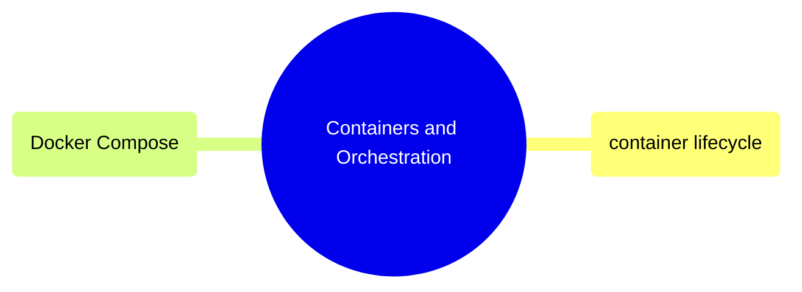

# Containers and Orchestration

Running, managing, and debugging containers, plus multi-container orchestration with Docker Compose.

> [!abstract]- [[01-container-lifecycle]]

> [!abstract]- [[03-docker-compose]]

