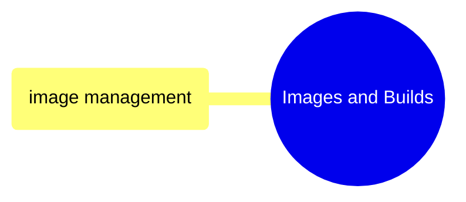

# Images and Builds

Dockerfile authoring, image building, multi-stage builds, registry operations, and size optimization.

> [!abstract]- [[02-image-management]]
>
> - [[image-management#Dockerfile Fundamentals|Dockerfile fundamentals]]
> - [[image-management#Building Images|Building images]]
> - [[image-management#Multi-Stage Builds|Multi-stage builds]]
> - [[image-management#Registry Operations|Registry operations]]
> - [[image-management#Image Size Optimization|Size optimization]]
> - [[image-management#Cleanup|Image cleanup]]
