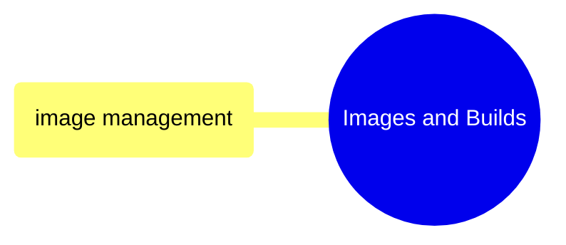
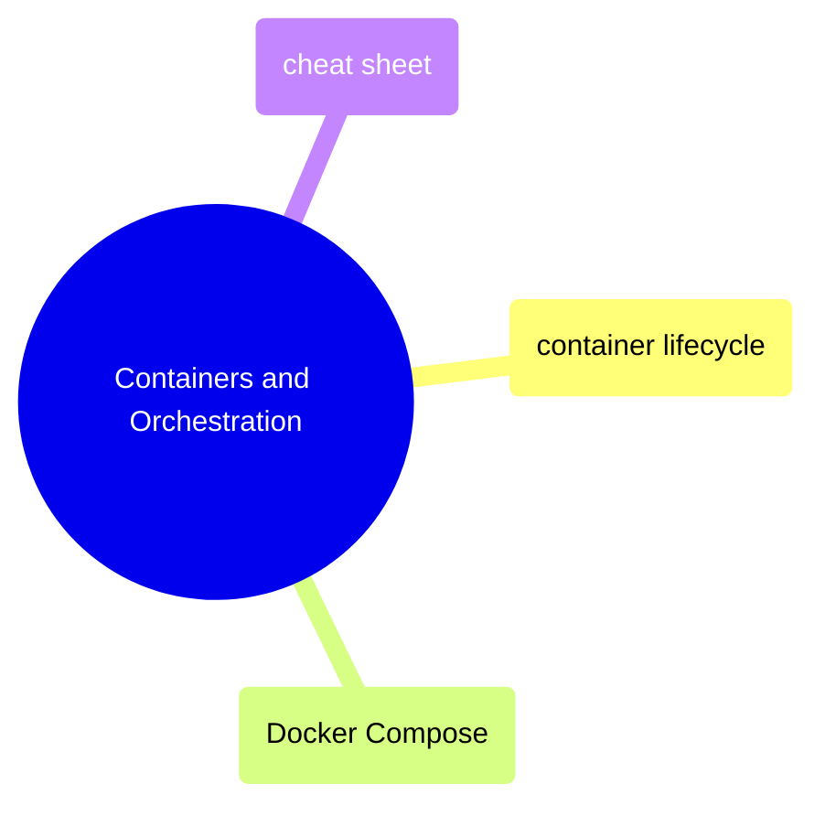

# MOC: Docker

Container management from building images to orchestrating multi-container
applications. Expand any section below for page contents.

> [!example]- Images and Builds
>
> > [!abstract]- [[image-management]]
> >
> > - [[image-management#Dockerfile Fundamentals|Dockerfile fundamentals]]
> > - [[image-management#Building Images|Building images]]
> > - [[image-management#Multi-Stage Builds|Multi-stage builds]]
> > - [[image-management#Registry Operations|Registry operations]]
> > - [[image-management#Image Size Optimization|Size optimization]]
> > - [[image-management#Cleanup|Image cleanup]]

> [!example]- Containers and Orchestration
>
> > [!abstract]- [container-lifecycle](/09-Docker/container-lifecycle)
> >
> > - [Running containers](/09-Docker/container-lifecycle#running-containers)
> > - [Lifecycle management](/09-Docker/container-lifecycle#lifecycle-management)
> > - [Viewing logs](/09-Docker/container-lifecycle#viewing-logs)
> > - [Exec and attach](/09-Docker/container-lifecycle#exec-and-attach)
> > - [Inspection and debugging](/09-Docker/container-lifecycle#inspection-and-debugging)
> > - [Debugging checklist](/09-Docker/container-lifecycle#container-debugging-checklist)
>
> > [!abstract]- [[docker-compose]]
> >
> > - [[docker-compose#Compose File Structure|Compose file structure]]
> > - [[docker-compose#Lifecycle Commands|Lifecycle commands]]
> > - [[docker-compose#Updating Images (Rolling Updates)|Rolling updates]]
> > - [[docker-compose#Configuration: Validation and Overrides|Config validation and overrides]]
>
> > [!abstract]- [[docker-cheat-sheet]]
> >
> > - [[docker-cheat-sheet#Container Lifecycle|Container lifecycle]]
> > - [[docker-cheat-sheet#Image Management|Image management]]
> > - [[docker-cheat-sheet#Docker Compose|Docker Compose]]
> > - [[docker-cheat-sheet#Volume Management|Volume management]]
> > - [[docker-cheat-sheet#Network Management|Network management]]
> > - [[docker-cheat-sheet#Dockerfile Reference|Dockerfile reference]]

## Cross-References

- [Terraform](/07-Terraform/moc-terraform) — Cloud Run services run Docker images
- [GitHub Actions](/10-GitHub-Actions/moc-github-actions) — CI/CD builds and pushes images
- [Shell](/01-Shell/moc-shell) — Docker commands run from shell
