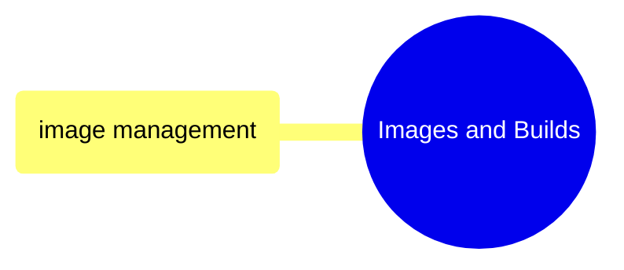
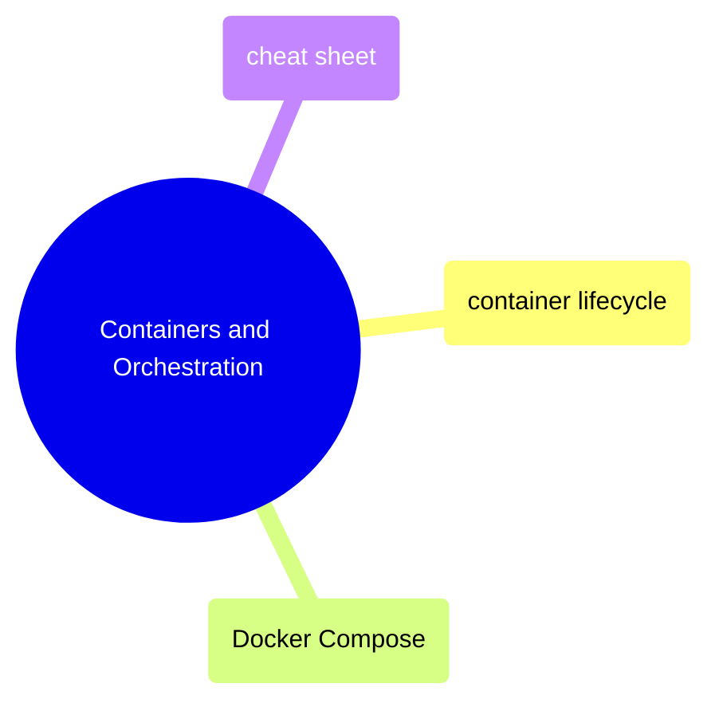

# MOC: Docker

Container management from building images to orchestrating multi-container
applications. Expand any section below for page contents.

> [!example]- Images and Builds
>
> > [!abstract]- [[image-management]]
> >
> > - [[image-management#Dockerfile Fundamentals|Dockerfile fundamentals]]
> > - [[image-management#Building Images|Building images]]
> > - [[image-management#Multi-Stage Builds|Multi-stage builds]]
> > - [[image-management#Registry Operations|Registry operations]]
> > - [[image-management#Image Size Optimization|Size optimization]]
> > - [[image-management#Cleanup|Image cleanup]]

> [!example]- Containers and Orchestration
>
> > [!abstract]- [[container-lifecycle]]
> >
> > - [[container-lifecycle#Running Containers|Running containers]]
> > - [[container-lifecycle#Lifecycle Management|Lifecycle management]]
> > - [[container-lifecycle#Viewing Logs|Viewing logs]]
> > - [[container-lifecycle#Exec and Attach|Exec and attach]]
> > - [[container-lifecycle#Inspection and Debugging|Inspection and debugging]]
> > - [[container-lifecycle#Container Debugging Checklist|Debugging checklist]]
>
> > [!abstract]- [[docker-compose]]
> >
> > - [[docker-compose#Compose File Structure|Compose file structure]]
> > - [[docker-compose#Lifecycle Commands|Lifecycle commands]]
> > - [[docker-compose#Updating Images (Rolling Updates)|Rolling updates]]
> > - [[docker-compose#Configuration: Validation and Overrides|Config validation and overrides]]
>
> > [!abstract]- [[docker-cheat-sheet]]
> >
> > - [[docker-cheat-sheet#Container Lifecycle|Container lifecycle]]
> > - [[docker-cheat-sheet#Image Management|Image management]]
> > - [[docker-cheat-sheet#Docker Compose|Docker Compose]]
> > - [[docker-cheat-sheet#Volume Management|Volume management]]
> > - [[docker-cheat-sheet#Network Management|Network management]]
> > - [[docker-cheat-sheet#Dockerfile Reference|Dockerfile reference]]

## Cross-References

- [[moc-terraform|Terraform]] — Cloud Run services run Docker images
- [[moc-github-actions|GitHub Actions]] — CI/CD builds and pushes images
- [[moc-shell|Shell]] — Docker commands run from shell
