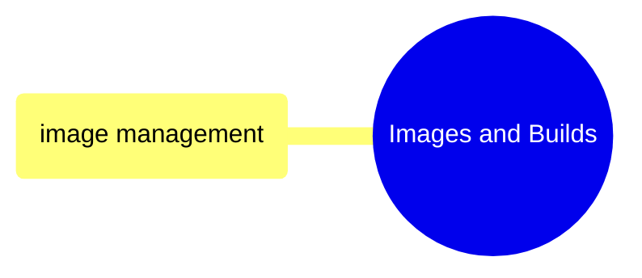
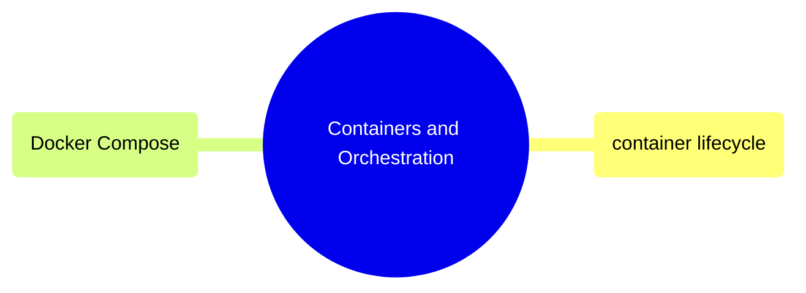

# MOC: Docker

> [!abstract]- Summary
>
> Maps the Docker chapter at a glance so readers can move from image build topics to container runtime and orchestration topics without scanning the full chapter tree.
>
> **Images and builds**
> - Links to the Docker image domain page for Dockerfile authoring, image building, multi-stage patterns, registry operations, and size optimization
>
> **Containers and orchestration**
> - Links to the runtime and orchestration domain page for container lifecycle inspection, debugging, and Docker Compose operations
>
> **Cross-references**
> - Connects Docker material to Terraform for Cloud Run usage, GitHub Actions for CI/CD image pipelines, and Shell for the command surface used to drive Docker

> [!note]- Glossary
>
> **MOC**
> - A map-of-content note that routes readers to the main topic pages in a chapter instead of teaching the topic inline.
> - This note is a navigational index for the Docker chapter, so its job is fast orientation rather than deep explanation.
>
> > [!info] Navigation, not tutorial
> >
> > A MOC is supposed to reduce scanning time by linking outward. If it starts duplicating full chapter content, it stops doing its navigation job well.
>
> ---
>
> **Domain page**
> - A higher-level note that groups related leaf notes under one conceptual topic such as images, builds, containers, or orchestration.
> - The guide callouts in this MOC point to domain pages because those pages are the next layer of structured navigation.
>
> > [!info] One level deeper
> >
> > Domain pages sit between the MOC and the detailed chapter notes. They help readers narrow to the right subdomain before opening implementation-heavy pages.
>
> ---
>
> **Docker image**
> - A packaged filesystem and metadata artifact used to create containers.
> - The Images and Builds branch of this MOC points readers toward notes that explain how images are authored, built, tagged, and published.
>
> > [!warning] Images are not containers
> >
> > An image is a build artifact, not a running workload. The chapter splits build concerns from runtime concerns for that reason.
>
> ---
>
> **Image build**
> - The process of turning a Dockerfile and a build context into a reusable image artifact.
> - It anchors the first navigation branch because build strategy affects registry usage, final size, and downstream deployment behavior.
>
> > [!info] Build choices propagate
> >
> > Decisions made during image build, such as base image and stage layout, carry forward into runtime behavior, patching, and deployment cost.
>
> ---
>
> **Container lifecycle**
> - The sequence of states and operational checks a container moves through after it is created and while it is running.
> - The Containers and Orchestration branch points readers to notes that focus on inspection, logs, health, and day-to-day runtime control.
>
> > [!info] Runtime has its own tools
> >
> > Build-time commands and runtime commands solve different problems. The chapter separates them so readers can go directly to the right operational surface.
>
> ---
>
> **Docker Compose**
> - Docker's multi-container orchestration tool for defining and managing related services together.
> - It is the main orchestration topic in this chapter and the bridge from single-container inspection to stack-level behavior.
>
> > [!warning] Compose adds naming rules
> >
> > Once Compose is involved, project names, service names, networks, and volumes become part of the operational model. That changes how you inspect and debug the runtime.
>
> ---
>
> **Cross-reference**
> - A link to a related chapter outside the current topic domain that shares tooling, deployment targets, or workflows.
> - The cross-reference section helps readers follow Docker usage into Terraform, GitHub Actions, and Shell without duplicating those chapters here.
>
> > [!info] Follow the workflow
> >
> > Docker rarely operates alone in this vault. Cross-references capture where build and runtime work continue in adjacent chapters.

> [!guide]+ Images and Builds
>
> [[domain-images-and-builds]]
>
> Dockerfile authoring, image building, multi-stage builds, registry operations, and size optimization.

> [!guide]+ Containers and Orchestration
>
> [[domain-containers-and-orchestration]]
>
> Running, managing, and debugging containers, plus multi-container orchestration with Docker Compose.

## Cross-References

- [Terraform](https://alp78.github.io/elysium/07-Terraform/moc-terraform) — Cloud Run services run Docker images
- [GitHub Actions](https://alp78.github.io/elysium/10-GitHub-Actions/moc-github-actions) — CI/CD builds and pushes images
- [Shell](https://alp78.github.io/elysium/01-Shell/moc-shell) — Docker commands run from shell
