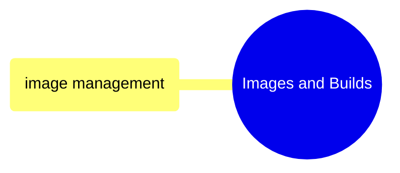
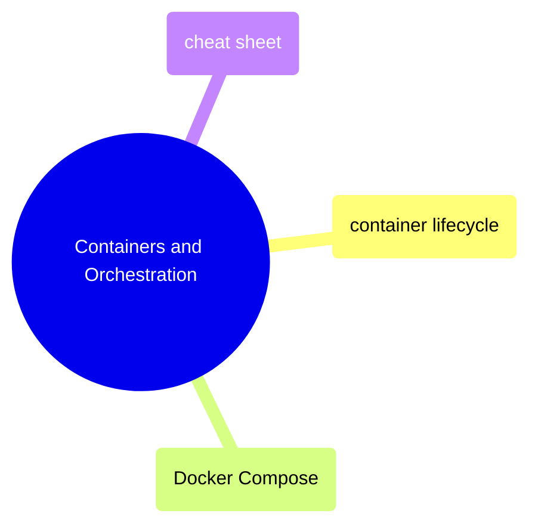

# MOC: Docker

Container management from building images to orchestrating multi-container
applications. Expand any section below for page contents.

> [!example]- Images and Builds
>
> [[domain-images-and-builds]]
>
> Dockerfile authoring, image building, multi-stage builds, registry operations, and size optimization.

> [!example]- Containers and Orchestration
>
> [[domain-containers-and-orchestration]]
>
> Running, managing, and debugging containers, plus multi-container orchestration with Docker Compose.

## Cross-References

- [Terraform](https://alp78.github.io/elysium/07-Terraform/moc-terraform) — Cloud Run services run Docker images
- [GitHub Actions](https://alp78.github.io/elysium/10-GitHub-Actions/moc-github-actions) — CI/CD builds and pushes images
- [Shell](https://alp78.github.io/elysium/01-Shell/moc-shell) — Docker commands run from shell
