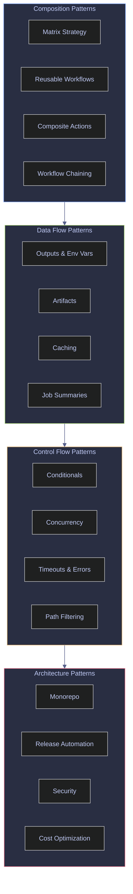

# GitHub Actions Patterns

> [!abstract]- Summary
>
> Explains reusable GitHub Actions design patterns so you can scale workflow composition, data movement, execution control, and repository architecture without duplicating YAML or creating fragile automation edges.
>
> **Pattern model and composition**
> - Defines matrix mechanics, reusable workflows, composite actions, container and JavaScript actions, and workflow chaining as the core ways to structure reusable automation units
> - Distinguishes caller versus callee behavior, static versus dynamic matrices, and how each composition mechanism changes runner isolation, input handling, and maintenance cost
>
> **Data flow and control flow**
> - Covers outputs, environment variables, artifacts, caches, job summaries, concurrency groups, conditionals, timeouts, path filters, and status-check functions as the runtime channels that connect and gate jobs
> - Explains exact cache keys, restore keys, branch scoping, retention, and execution cancellation semantics so patterns remain predictable under reruns and parallel activity
>
> **Architecture patterns and applied scenarios**
> - Maps the building blocks into monorepo CI, release automation, security-hardening, cost optimization, and data-engineering workflow designs that combine reuse, isolation, and scoped deployment behavior
> - Connects pattern choice to blast radius, maintainability, and reviewability instead of presenting matrix fan-out or workflow reuse as purely syntactic conveniences
>
> **Operations and safety**
> - Warnings: matrix explosion, cache misuse, untrusted workflow chaining, over-broad environment access, mutable third-party actions, and hidden coupling between caller and callee workflows
> - Recommendations: choose the smallest reusable unit that fits, keep data channels explicit, bound concurrency deliberately, pin third-party actions, and optimize patterns for review clarity as well as YAML reuse
> - Troubleshooting: guidance for matrix fan-out issues, cache misses, artifact handoff problems, workflow-call input mismatches, path-filter surprises, and control-flow dead ends

> [!note]- Glossary
>
> **matrix strategy**
> - Job-level configuration that creates multiple parallel job instances from a set of variable combinations
> - It matters in this note because the workflows for workflow composition, data flow, execution control, and reusable GitHub Actions architecture depend on choosing this mechanism deliberately instead of treating nearby GitHub Actions features as interchangeable.
>
> > [!warning] Operational blast radius
> >
> > This changes execution shape, state reuse, or deployment behavior. Misconfiguring it tends to create expensive failures that are visible only after the workflow starts.
>
> ---
>
> **`fail-fast`**
> - Matrix property that cancels all in-progress jobs when any combination fails (default: `true`)
> - It matters in this note because the workflows for workflow composition, data flow, execution control, and reusable GitHub Actions architecture read, scope, or constrain this part of the Actions runtime directly, and misunderstanding it leads to the wrong safety or execution assumption.
>
> > [!warning] Operational blast radius
> >
> > This changes execution shape, state reuse, or deployment behavior. Misconfiguring it tends to create expensive failures that are visible only after the workflow starts.
>
> ---
>
> **`max-parallel`**
> - Matrix property that limits the number of concurrently running combinations
> - It matters in this note because the workflows for workflow composition, data flow, execution control, and reusable GitHub Actions architecture read, scope, or constrain this part of the Actions runtime directly, and misunderstanding it leads to the wrong safety or execution assumption.
>
> > [!warning] Operational blast radius
> >
> > This changes execution shape, state reuse, or deployment behavior. Misconfiguring it tends to create expensive failures that are visible only after the workflow starts.
>
> ---
>
> **`include`**
> - Matrix modifier that adds extra variable combinations or attaches additional variables to existing ones
> - It matters in this note because the workflows for workflow composition, data flow, execution control, and reusable GitHub Actions architecture read, scope, or constrain this part of the Actions runtime directly, and misunderstanding it leads to the wrong safety or execution assumption.
>
> > [!warning] Operational blast radius
> >
> > This changes execution shape, state reuse, or deployment behavior. Misconfiguring it tends to create expensive failures that are visible only after the workflow starts.
>
> ---
>
> **`exclude`**
> - Matrix modifier that removes specific variable combinations from the cross-product
> - It matters in this note because the workflows for workflow composition, data flow, execution control, and reusable GitHub Actions architecture read, scope, or constrain this part of the Actions runtime directly, and misunderstanding it leads to the wrong safety or execution assumption.
>
> > [!warning] Operational blast radius
> >
> > This changes execution shape, state reuse, or deployment behavior. Misconfiguring it tends to create expensive failures that are visible only after the workflow starts.
>
> ---
>
> **dynamic matrix**
> - Matrix whose values are computed at runtime by a previous job and passed via `fromJSON()`
> - It matters in this note because the workflows for workflow composition, data flow, execution control, and reusable GitHub Actions architecture depend on choosing this mechanism deliberately instead of treating nearby GitHub Actions features as interchangeable.
>
> > [!warning] Operational blast radius
> >
> > This changes execution shape, state reuse, or deployment behavior. Misconfiguring it tends to create expensive failures that are visible only after the workflow starts.
>
> ---
>
> **reusable workflow**
> - A workflow file with `on: workflow_call` that can be invoked by other workflows as a job
> - It matters in this note because the workflows for workflow composition, data flow, execution control, and reusable GitHub Actions architecture depend on choosing this mechanism deliberately instead of treating nearby GitHub Actions features as interchangeable.
>
> > [!warning] Evaluation scope matters
> >
> > GitHub Actions resolves different values at different times and scopes. Confusing workflow-processing state with shell runtime state is a common source of broken YAML and misleading conditions.
>
> ---
>
> **composite action**
> - An `action.yml` that bundles multiple steps into a single reusable step, running in the caller's environment
> - It matters in this note because the workflows for workflow composition, data flow, execution control, and reusable GitHub Actions architecture depend on choosing this mechanism deliberately instead of treating nearby GitHub Actions features as interchangeable.
>
> > [!warning] Operational blast radius
> >
> > This changes execution shape, state reuse, or deployment behavior. Misconfiguring it tends to create expensive failures that are visible only after the workflow starts.
>
> ---
>
> **Docker container action**
> - An `action.yml` that runs inside a Docker container, providing full environment isolation
> - It matters in this note because the workflows for workflow composition, data flow, execution control, and reusable GitHub Actions architecture depend on choosing this mechanism deliberately instead of treating nearby GitHub Actions features as interchangeable.
>
> > [!warning] Operational blast radius
> >
> > This changes execution shape, state reuse, or deployment behavior. Misconfiguring it tends to create expensive failures that are visible only after the workflow starts.
>
> ---
>
> **JavaScript action**
> - An `action.yml` that runs Node.js code directly on the runner
> - It matters in this note because the workflows for workflow composition, data flow, execution control, and reusable GitHub Actions architecture depend on choosing this mechanism deliberately instead of treating nearby GitHub Actions features as interchangeable.
>
> > [!warning] Operational blast radius
> >
> > This changes execution shape, state reuse, or deployment behavior. Misconfiguring it tends to create expensive failures that are visible only after the workflow starts.
>
> ---
>
> **`workflow_call`**
> - The trigger event that makes a workflow reusable — it accepts typed inputs, secrets, and returns outputs
> - It matters in this note because the workflows for workflow composition, data flow, execution control, and reusable GitHub Actions architecture depend on choosing this mechanism deliberately instead of treating nearby GitHub Actions features as interchangeable.
>
> > [!danger] Security boundary
> >
> > This term affects trust, identity, or supply-chain integrity. Scope it deliberately and avoid broad defaults that let untrusted workflow code inherit high privilege.
>
> ---
>
> **`caller`**
> - The workflow that invokes a reusable workflow with `uses:` at the job level
> - It matters in this note because the workflows for workflow composition, data flow, execution control, and reusable GitHub Actions architecture read, scope, or constrain this part of the Actions runtime directly, and misunderstanding it leads to the wrong safety or execution assumption.
>
> > [!warning] Evaluation scope matters
> >
> > GitHub Actions resolves different values at different times and scopes. Confusing workflow-processing state with shell runtime state is a common source of broken YAML and misleading conditions.
>
> ---
>
> **`callee`**
> - The reusable workflow being invoked — it receives inputs and secrets from the caller
> - It matters in this note because the workflows for workflow composition, data flow, execution control, and reusable GitHub Actions architecture read, scope, or constrain this part of the Actions runtime directly, and misunderstanding it leads to the wrong safety or execution assumption.
>
> > [!danger] Security boundary
> >
> > This term affects trust, identity, or supply-chain integrity. Scope it deliberately and avoid broad defaults that let untrusted workflow code inherit high privilege.
>
> ---
>
> **`workflow_run`**
> - Event that triggers a workflow when another named workflow completes, succeeds, or fails
> - It matters in this note because the workflows for workflow composition, data flow, execution control, and reusable GitHub Actions architecture depend on choosing this mechanism deliberately instead of treating nearby GitHub Actions features as interchangeable.
>
> > [!warning] Evaluation scope matters
> >
> > GitHub Actions resolves different values at different times and scopes. Confusing workflow-processing state with shell runtime state is a common source of broken YAML and misleading conditions.
>
> ---
>
> **`workflow_dispatch`**
> - Event that enables manual triggering of a workflow via the GitHub UI or API, with optional typed inputs
> - It matters in this note because the workflows for workflow composition, data flow, execution control, and reusable GitHub Actions architecture depend on choosing this mechanism deliberately instead of treating nearby GitHub Actions features as interchangeable.
>
> > [!warning] Evaluation scope matters
> >
> > GitHub Actions resolves different values at different times and scopes. Confusing workflow-processing state with shell runtime state is a common source of broken YAML and misleading conditions.
>
> ---
>
> **service container**
> - A Docker container that runs alongside a job, providing services like databases or caches
> - It matters in this note because the workflows for workflow composition, data flow, execution control, and reusable GitHub Actions architecture read, scope, or constrain this part of the Actions runtime directly, and misunderstanding it leads to the wrong safety or execution assumption.
>
> > [!warning] Operational blast radius
> >
> > This changes execution shape, state reuse, or deployment behavior. Misconfiguring it tends to create expensive failures that are visible only after the workflow starts.
>
> ---
>
> **concurrency group**
> - A named group that serializes or cancels workflow runs sharing the same group identifier
> - It matters in this note because the workflows for workflow composition, data flow, execution control, and reusable GitHub Actions architecture read, scope, or constrain this part of the Actions runtime directly, and misunderstanding it leads to the wrong safety or execution assumption.
>
> > [!warning] Operational blast radius
> >
> > This changes execution shape, state reuse, or deployment behavior. Misconfiguring it tends to create expensive failures that are visible only after the workflow starts.
>
> ---
>
> **`cancel-in-progress`**
> - Concurrency option that cancels the currently running job when a new run enters the same group
> - It matters in this note because the workflows for workflow composition, data flow, execution control, and reusable GitHub Actions architecture read, scope, or constrain this part of the Actions runtime directly, and misunderstanding it leads to the wrong safety or execution assumption.
>
> > [!warning] Operational blast radius
> >
> > This changes execution shape, state reuse, or deployment behavior. Misconfiguring it tends to create expensive failures that are visible only after the workflow starts.
>
> ---
>
> **`artifact`**
> - A file or directory uploaded during a workflow run, downloadable by other jobs or after the run completes
> - It matters in this note because the workflows for workflow composition, data flow, execution control, and reusable GitHub Actions architecture depend on choosing this mechanism deliberately instead of treating nearby GitHub Actions features as interchangeable.
>
> > [!warning] Operational blast radius
> >
> > This changes execution shape, state reuse, or deployment behavior. Misconfiguring it tends to create expensive failures that are visible only after the workflow starts.
>
> ---
>
> **`cache`**
> - A persistent store for dependencies or build outputs, keyed by a hash, shared across runs on the same branch
> - It matters in this note because the workflows for workflow composition, data flow, execution control, and reusable GitHub Actions architecture depend on choosing this mechanism deliberately instead of treating nearby GitHub Actions features as interchangeable.
>
> > [!warning] Operational blast radius
> >
> > This changes execution shape, state reuse, or deployment behavior. Misconfiguring it tends to create expensive failures that are visible only after the workflow starts.
>
> ---
>
> **cache key**
> - The exact string used to store and retrieve a cache entry — a miss triggers a fresh download
> - It matters in this note because the workflows for workflow composition, data flow, execution control, and reusable GitHub Actions architecture depend on choosing this mechanism deliberately instead of treating nearby GitHub Actions features as interchangeable.
>
> > [!warning] Operational blast radius
> >
> > This changes execution shape, state reuse, or deployment behavior. Misconfiguring it tends to create expensive failures that are visible only after the workflow starts.
>
> ---
>
> **cache scope**
> - Branch-level isolation — caches are scoped to the branch where they were created, plus the default branch
> - It matters in this note because the workflows for workflow composition, data flow, execution control, and reusable GitHub Actions architecture depend on choosing this mechanism deliberately instead of treating nearby GitHub Actions features as interchangeable.
>
> > [!warning] Operational blast radius
> >
> > This changes execution shape, state reuse, or deployment behavior. Misconfiguring it tends to create expensive failures that are visible only after the workflow starts.
>
> ---
>
> **`restore-keys`**
> - Ordered fallback prefixes tried when the exact cache key misses
> - It matters in this note because the workflows for workflow composition, data flow, execution control, and reusable GitHub Actions architecture read, scope, or constrain this part of the Actions runtime directly, and misunderstanding it leads to the wrong safety or execution assumption.
>
> > [!warning] Operational blast radius
> >
> > This changes execution shape, state reuse, or deployment behavior. Misconfiguring it tends to create expensive failures that are visible only after the workflow starts.
>
> ---
>
> **`retention`**
> - The number of days an artifact or cache is kept before automatic deletion (artifact default: 90 days, cache: 7 days unused)
> - It matters in this note because the workflows for workflow composition, data flow, execution control, and reusable GitHub Actions architecture read, scope, or constrain this part of the Actions runtime directly, and misunderstanding it leads to the wrong safety or execution assumption.
>
> > [!warning] Operational blast radius
> >
> > This changes execution shape, state reuse, or deployment behavior. Misconfiguring it tends to create expensive failures that are visible only after the workflow starts.
>
> ---
>
> **path filter**
> - An `on.push.paths` or `on.pull_request.paths` condition that limits workflow triggers to changes in specific files
> - It matters in this note because the workflows for workflow composition, data flow, execution control, and reusable GitHub Actions architecture read, scope, or constrain this part of the Actions runtime directly, and misunderstanding it leads to the wrong safety or execution assumption.
>
> > [!warning] Evaluation scope matters
> >
> > GitHub Actions resolves different values at different times and scopes. Confusing workflow-processing state with shell runtime state is a common source of broken YAML and misleading conditions.
>
> ---
>
> **`monorepo`**
> - A single repository containing multiple projects, services, or packages with independent CI needs
> - It matters in this note because the workflows for workflow composition, data flow, execution control, and reusable GitHub Actions architecture read, scope, or constrain this part of the Actions runtime directly, and misunderstanding it leads to the wrong safety or execution assumption.
>
> > [!info] Operational nuance
> >
> > Treat this as a concrete GitHub Actions object, runtime surface, or workflow control rather than as a loose synonym. The surrounding YAML behaves differently depending on this exact meaning.
>
> ---
>
> **`environment`**
> - A named deployment target (e.g., `staging`, `production`) with optional protection rules and scoped secrets
> - It matters in this note because the workflows for workflow composition, data flow, execution control, and reusable GitHub Actions architecture depend on choosing this mechanism deliberately instead of treating nearby GitHub Actions features as interchangeable.
>
> > [!danger] Security boundary
> >
> > This term affects trust, identity, or supply-chain integrity. Scope it deliberately and avoid broad defaults that let untrusted workflow code inherit high privilege.
>
> ---
>
> **protection rule**
> - A constraint on an environment requiring reviewers, wait timers, or branch restrictions before deployment
> - It matters in this note because the workflows for workflow composition, data flow, execution control, and reusable GitHub Actions architecture read, scope, or constrain this part of the Actions runtime directly, and misunderstanding it leads to the wrong safety or execution assumption.
>
> > [!warning] Operational blast radius
> >
> > This changes execution shape, state reuse, or deployment behavior. Misconfiguring it tends to create expensive failures that are visible only after the workflow starts.
>
> ---
>
> **deployment branch policy**
> - An environment setting that restricts which branches can deploy to that environment
> - It matters in this note because the workflows for workflow composition, data flow, execution control, and reusable GitHub Actions architecture depend on choosing this mechanism deliberately instead of treating nearby GitHub Actions features as interchangeable.
>
> > [!warning] Operational blast radius
> >
> > This changes execution shape, state reuse, or deployment behavior. Misconfiguring it tends to create expensive failures that are visible only after the workflow starts.
>
> ---
>
> **`OIDC`**
> - OpenID Connect — a protocol that lets GitHub mint short-lived tokens for authenticating to cloud providers without stored secrets
> - It matters in this note because the workflows for workflow composition, data flow, execution control, and reusable GitHub Actions architecture read, scope, or constrain this part of the Actions runtime directly, and misunderstanding it leads to the wrong safety or execution assumption.
>
> > [!danger] Security boundary
> >
> > This term affects trust, identity, or supply-chain integrity. Scope it deliberately and avoid broad defaults that let untrusted workflow code inherit high privilege.
>
> ---
>
> **Workload Identity Federation**
> - Cloud-provider mechanism (GCP, AWS, Azure) that trusts GitHub's OIDC tokens to grant temporary credentials
> - It matters in this note because the workflows for workflow composition, data flow, execution control, and reusable GitHub Actions architecture read, scope, or constrain this part of the Actions runtime directly, and misunderstanding it leads to the wrong safety or execution assumption.
>
> > [!danger] Security boundary
> >
> > This term affects trust, identity, or supply-chain integrity. Scope it deliberately and avoid broad defaults that let untrusted workflow code inherit high privilege.
>
> ---
>
> **SHA pin**
> - Referencing a third-party action by its full commit SHA instead of a mutable tag, preventing supply-chain attacks
> - It matters in this note because the workflows for workflow composition, data flow, execution control, and reusable GitHub Actions architecture read, scope, or constrain this part of the Actions runtime directly, and misunderstanding it leads to the wrong safety or execution assumption.
>
> > [!warning] Evaluation scope matters
> >
> > GitHub Actions resolves different values at different times and scopes. Confusing workflow-processing state with shell runtime state is a common source of broken YAML and misleading conditions.
>
> ---
>
> **immutable tag**
> - A tag that cannot be moved after creation — SHA pins are immutable; version tags like `v4` are not
> - It matters in this note because the workflows for workflow composition, data flow, execution control, and reusable GitHub Actions architecture read, scope, or constrain this part of the Actions runtime directly, and misunderstanding it leads to the wrong safety or execution assumption.
>
> > [!info] Operational nuance
> >
> > Treat this as a concrete GitHub Actions object, runtime surface, or workflow control rather than as a loose synonym. The surrounding YAML behaves differently depending on this exact meaning.
>
> ---
>
> **`provenance`**
> - Cryptographic metadata proving where and how an artifact was built, enabling supply-chain verification
> - It matters in this note because the workflows for workflow composition, data flow, execution control, and reusable GitHub Actions architecture read, scope, or constrain this part of the Actions runtime directly, and misunderstanding it leads to the wrong safety or execution assumption.
>
> > [!danger] Security boundary
> >
> > This term affects trust, identity, or supply-chain integrity. Scope it deliberately and avoid broad defaults that let untrusted workflow code inherit high privilege.
>
> ---
>
> **job summary**
> - Markdown content written to `$GITHUB_STEP_SUMMARY` that renders on the workflow run page in GitHub
> - It matters in this note because the workflows for workflow composition, data flow, execution control, and reusable GitHub Actions architecture depend on choosing this mechanism deliberately instead of treating nearby GitHub Actions features as interchangeable.
>
> > [!warning] Evaluation scope matters
> >
> > GitHub Actions resolves different values at different times and scopes. Confusing workflow-processing state with shell runtime state is a common source of broken YAML and misleading conditions.
>
> ---
>
> **`annotation`**
> - A notice, warning, or error message attached to a specific file and line in the workflow run and PR diff
> - It matters in this note because the workflows for workflow composition, data flow, execution control, and reusable GitHub Actions architecture read, scope, or constrain this part of the Actions runtime directly, and misunderstanding it leads to the wrong safety or execution assumption.
>
> > [!warning] Evaluation scope matters
> >
> > GitHub Actions resolves different values at different times and scopes. Confusing workflow-processing state with shell runtime state is a common source of broken YAML and misleading conditions.
>
> ---
>
> **`expression`**
> - A `${{ }}` syntax for accessing contexts, evaluating conditions, and computing values in workflow YAML
> - It matters in this note because the workflows for workflow composition, data flow, execution control, and reusable GitHub Actions architecture read, scope, or constrain this part of the Actions runtime directly, and misunderstanding it leads to the wrong safety or execution assumption.
>
> > [!warning] Evaluation scope matters
> >
> > GitHub Actions resolves different values at different times and scopes. Confusing workflow-processing state with shell runtime state is a common source of broken YAML and misleading conditions.
>
> ---
>
> **`context`**
> - A named object (e.g., `github`, `env`, `steps`, `needs`, `matrix`) providing runtime data to expressions
> - It matters in this note because the workflows for workflow composition, data flow, execution control, and reusable GitHub Actions architecture read, scope, or constrain this part of the Actions runtime directly, and misunderstanding it leads to the wrong safety or execution assumption.
>
> > [!warning] Operational blast radius
> >
> > This changes execution shape, state reuse, or deployment behavior. Misconfiguring it tends to create expensive failures that are visible only after the workflow starts.
>
> ---
>
> **status check function**
> - Built-in functions (`success()`, `failure()`, `always()`, `cancelled()`) that test the aggregate result of prior steps or jobs
> - It matters in this note because the workflows for workflow composition, data flow, execution control, and reusable GitHub Actions architecture read, scope, or constrain this part of the Actions runtime directly, and misunderstanding it leads to the wrong safety or execution assumption.
>
> > [!warning] Evaluation scope matters
> >
> > GitHub Actions resolves different values at different times and scopes. Confusing workflow-processing state with shell runtime state is a common source of broken YAML and misleading conditions.
>
> ---
>
> **`fromJSON()`**
> - Expression function that parses a JSON string into a native object, commonly used for dynamic matrices
> - It matters in this note because the workflows for workflow composition, data flow, execution control, and reusable GitHub Actions architecture read, scope, or constrain this part of the Actions runtime directly, and misunderstanding it leads to the wrong safety or execution assumption.
>
> > [!warning] Evaluation scope matters
> >
> > GitHub Actions resolves different values at different times and scopes. Confusing workflow-processing state with shell runtime state is a common source of broken YAML and misleading conditions.
>
> ---
>
> **`toJSON()`**
> - Expression function that serializes an object to a JSON string, useful for debugging context values
> - It matters in this note because the workflows for workflow composition, data flow, execution control, and reusable GitHub Actions architecture read, scope, or constrain this part of the Actions runtime directly, and misunderstanding it leads to the wrong safety or execution assumption.
>
> > [!warning] Evaluation scope matters
> >
> > GitHub Actions resolves different values at different times and scopes. Confusing workflow-processing state with shell runtime state is a common source of broken YAML and misleading conditions.


## How the main pattern categories fit together

GitHub Actions patterns fall into four categories. Each category builds on the previous one: composition patterns define what runs, data flow patterns move information between those units, control flow patterns decide when and whether they run, and architecture patterns combine all three into production-grade designs.



*Pattern categories form a layered architecture: composition defines the units of work, data flow connects them, control flow governs execution order, and architecture patterns combine all three for real-world systems. Each category in this page has a dedicated H2 section.*

## Ways to compose and reuse workflow logic

Composition patterns define how work is structured and reused across workflows. The four mechanisms differ in scope: matrix fans out a single job, reusable workflows share entire jobs, composite actions share step sequences, and workflow chaining coordinates independent workflows.

### composition | matrix strategy

The matrix strategy creates multiple parallel instances of a job by computing the cross-product of variable lists. Each combination runs as an independent job with its own runner.

#### Define a static matrix with include and exclude

When a job must run against multiple versions, platforms, or configurations. It is typically triggered by any event — matrix applies at the job level regardless of trigger. Each matrix combination gets its own runner. All combinations share the same workflow run ID. Validate compatibility across Python versions, OS variants, or database backends without writing separate jobs.

> [!info]- Workflow YAML breakdown
>
> - `strategy.matrix.python-version`: list of Python versions to test — creates one job per version
> - `strategy.matrix.os`: list of runner images — cross-multiplied with python-version
> - `strategy.fail-fast: false`: all combinations run to completion even if one fails (default `true` would cancel siblings)
> - `strategy.max-parallel: 3`: at most 3 combinations run simultaneously (controls runner cost)
> - `include`: adds the `experimental: true` variable to the 3.12/ubuntu combination without creating a new one
> - `exclude`: removes the 3.10/ubuntu combination from the cross-product entirely

*Run a matrix build across Python 3.11 and 3.12, with include adding an experimental flag and exclude dropping 3.10.*

```yaml
name: "Demo: Matrix Strategy"
on:
  push:
    branches: [main]
    paths:
      - ".github/workflows/demo-matrix.yml"
  workflow_dispatch:

permissions:
  contents: read

jobs:
  matrix-test:
    runs-on: ubuntu-latest
    strategy:
      fail-fast: false
      max-parallel: 3
      matrix:
        python-version: ["3.10", "3.11", "3.12"]
        os: [ubuntu-latest]
        include:
          - python-version: "3.12"
            os: ubuntu-latest
            experimental: true
        exclude:
          - python-version: "3.10"
            os: ubuntu-latest
    steps:
      - uses: actions/checkout@v4
      - uses: actions/setup-python@v5
        with:
          python-version: ${{ matrix.python-version }}

      - name: Show matrix values
        run: |
          echo "=== Matrix combination ==="
          echo "Python: ${{ matrix.python-version }}"
          echo "OS: ${{ matrix.os }}"
          echo "Experimental: ${{ matrix.experimental }}"
          echo ""
          python --version
          echo ""
          echo "Matrix context (full):"
          echo '${{ toJSON(matrix) }}'
```

*Workflow run output (run 24312297704, triggered by push to main):*

```text
✓ main Demo: Matrix Strategy · 24312297704
Triggered via push

JOBS
✓ matrix-test (3.11, ubuntu-latest) in 3s (ID 70983934648)
✓ matrix-test (3.12, ubuntu-latest) in 4s (ID 70983934660)
```

*Job output for matrix-test (3.11):*

```text
=== Matrix combination ===
Python: 3.11
OS: ubuntu-latest
Experimental:
```

*Job output for matrix-test (3.12):*

```text
=== Matrix combination ===
Python: 3.12
OS: ubuntu-latest
Experimental: true
```

> [!warning] Matrix explosion with too many dimensions
>
> - A matrix with 3 Python versions x 3 OS x 3 database backends = 27 parallel jobs
> - GitHub limits to 256 jobs per workflow run
> - Each job consumes runner minutes — a 3x3x3 matrix at 5 min/job = 135 minutes of billing

> [!success] Control matrix size
>
> - Use `max-parallel` to limit concurrent runners
> - Use `exclude` to drop known-incompatible combinations
> - Use `include` to add specific combinations instead of full cross-products
> - Consider testing the full matrix only on PRs to main, not on every push

| Key | Type | Default | Description |
|-----|------|---------|-------------|
| `matrix.<variable>` | list | required | Values to iterate — creates the cross-product |
| `fail-fast` | boolean | `true` | Cancel all jobs if any combination fails |
| `max-parallel` | integer | unlimited | Maximum concurrent combinations |
| `include` | list of maps | none | Add variables to matching combinations or create new ones |
| `exclude` | list of maps | none | Remove matching combinations from the cross-product |

### composition | reusable workflows

A reusable workflow is a complete workflow file with `on: workflow_call` that another workflow can invoke as a job. The caller passes inputs and secrets; the callee returns outputs. This enables standardized CI/CD patterns across repositories.

#### Define a reusable workflow (callee)

When multiple repositories or workflows need the same job logic (e.g., deploy, test, validate). It is typically triggered by `workflow_call` — this workflow cannot be triggered directly, only by a caller. Runs on its own runner. Has access to the caller's repository code and the caller's `GITHUB_TOKEN` permissions. Centralize and standardize workflow logic so teams share a single tested implementation.

> [!info]- Workflow YAML breakdown
>
> - `on.workflow_call.inputs`: typed parameters the caller provides — `environment` (required string) and `python-version` (optional string, default `"3.12"`)
> - `on.workflow_call.outputs.deploy-url`: value surfaced back to the caller via `jobs.deploy.outputs.url`
> - `on.workflow_call.secrets.deploy-token`: an explicit secret the caller must pass (or use `secrets: inherit`)
> - `jobs.deploy.outputs.url`: promotes the step output to the job level, making it available to the caller

*Define a reusable workflow that accepts environment, Python version, and a deploy token, then returns a deployment URL.*

```yaml
name: "Demo: Reusable Workflow (Called)"
on:
  workflow_call:
    inputs:
      environment:
        description: "Target environment name"
        required: true
        type: string
      python-version:
        description: "Python version to use"
        required: false
        type: string
        default: "3.12"
    outputs:
      deploy-url:
        description: "The deployment URL"
        value: ${{ jobs.deploy.outputs.url }}
    secrets:
      deploy-token:
        description: "Deployment authentication token"
        required: false

jobs:
  deploy:
    runs-on: ubuntu-latest
    outputs:
      url: ${{ steps.deploy.outputs.url }}
    steps:
      - uses: actions/checkout@v4

      - name: Show reusable workflow inputs
        run: |
          echo "=== Reusable workflow (called) ==="
          echo "Environment: ${{ inputs.environment }}"
          echo "Python version: ${{ inputs.python-version }}"
          echo "Deploy token provided: ${{ secrets.deploy-token != '' }}"
          echo ""
          echo "This workflow was invoked by a caller workflow."
          echo "It receives inputs, secrets, and can return outputs."

      - name: Simulate deployment
        id: deploy
        run: |
          URL="https://${{ inputs.environment }}.example.com"
          echo "url=$URL" >> "$GITHUB_OUTPUT"
          echo "Deployed to $URL"
```

#### Call a reusable workflow (caller)

When your workflow needs to invoke shared logic from another workflow file. It is typically triggered by any event on the caller side — `push`, `workflow_dispatch`, `pull_request`, etc. The `uses:` key at the job level (not step level) references the callee. Inputs go in `with:`, secrets in `secrets:`. Invoke the standardized deploy workflow with environment-specific parameters.

> [!info]- Workflow YAML breakdown
>
> - `jobs.call-reusable.uses`: references the callee workflow by path — `./.github/workflows/` for same-repo, `org/repo/.github/workflows/file.yml@ref` for cross-repo
> - `with:`: passes input values matching the callee's `inputs` declarations
> - `secrets:`: passes secret values matching the callee's `secrets` declarations
> - `needs.call-reusable.outputs.deploy-url`: reads the output returned by the callee workflow

*Call the reusable workflow with staging environment inputs, then read the returned deploy URL in a downstream job.*

```yaml
name: "Demo: Reusable Workflow (Caller)"
on:
  push:
    branches: [main]
    paths:
      - ".github/workflows/demo-reusable-caller.yml"
      - ".github/workflows/demo-reusable-called.yml"
  workflow_dispatch:

permissions:
  contents: read

jobs:
  call-reusable:
    uses: ./.github/workflows/demo-reusable-called.yml
    with:
      environment: staging
      python-version: "3.12"
    secrets:
      deploy-token: ${{ secrets.DEMO_SECRET }}

  show-result:
    needs: call-reusable
    runs-on: ubuntu-latest
    steps:
      - name: Show reusable workflow output
        run: |
          echo "=== Caller workflow ==="
          echo "Deploy URL from reusable workflow: ${{ needs.call-reusable.outputs.deploy-url }}"
          echo ""
          echo "The caller invokes the reusable workflow with 'uses:'"
          echo "and passes inputs via 'with:' and secrets via 'secrets:'."
          echo "Outputs flow back through needs.<job>.outputs.<name>."
```

*Workflow run output (run 24312297695, triggered by push to main):*

```text
✓ main Demo: Reusable Workflow (Caller) · 24312297695
Triggered via push

JOBS
✓ call-reusable / deploy in 4s (ID 70983934723)
✓ show-result in 4s (ID 70983938911)
```

*Callee job output:*

```text
=== Reusable workflow (called) ===
Environment: staging
Python version: 3.12
Deploy token provided: true
Deployed to https://staging.example.com
```

*Caller show-result job output:*

```text
=== Caller workflow ===
Deploy URL from reusable workflow: https://staging.example.com
The caller invokes the reusable workflow with 'uses:'
and passes inputs via 'with:' and secrets via 'secrets:'.
Outputs flow back through needs.<job>.outputs.<name>.
```

> [!danger] secrets: inherit widens the blast radius
>
> - `secrets: inherit` passes all secrets from the caller to the callee — including secrets the callee does not need
> - If the callee is in another repository or maintained by another team, those secrets could be logged, exfiltrated, or leaked via a compromised action

> [!success] Pass secrets explicitly
>
> - Always enumerate secrets by name: `secrets: { deploy-token: ${{ secrets.DEPLOY_TOKEN }} }`
> - This documents which secrets the callee needs and limits exposure
> - Use `secrets: inherit` only for same-repo callees where all secrets are relevant

> [!question] Reusable workflow vs composite action
>
> - **Reusable workflow:** replaces an entire job — has its own runner, can use `services`, `environment`, and `strategy`. Maximum 4 levels of nesting. Called with `uses:` at the job level.
> - **Composite action:** replaces a sequence of steps — runs on the caller's runner, sharing the same workspace. No service containers or environments. Called with `uses:` at the step level.
> - **Rule of thumb:** if the shared logic needs its own runner, environment, or matrix, use a reusable workflow. If it is a step-level utility (setup, validation, notification), use a composite action.

| Key | Scope | Type | Description |
|-----|-------|------|-------------|
| `on.workflow_call.inputs.<name>` | callee | string, number, boolean | Typed input parameter with optional default |
| `on.workflow_call.outputs.<name>` | callee | string | Value returned to the caller |
| `on.workflow_call.secrets.<name>` | callee | secret | Named secret the caller must provide |
| `jobs.<id>.uses` | caller | path/ref | Path to the callee workflow file |
| `jobs.<id>.with` | caller | map | Input values matching callee's declarations |
| `jobs.<id>.secrets` | caller | map or `inherit` | Secret values or blanket inheritance |
| `needs.<job>.outputs.<name>` | caller | string | Read callee's returned outputs |

### composition | composite actions

A composite action bundles multiple steps into a single reusable step defined in an `action.yml` file. Unlike reusable workflows, composite actions run on the caller's runner and share the caller's workspace.

#### Create a composite action

When multiple workflows repeat the same step sequence (setup, validation, notification). It is typically triggered by not triggered independently — invoked with `uses:` at the step level. Runs in the caller's job, on the caller's runner. Has access to the caller's workspace, environment variables, and `GITHUB_TOKEN`. Encapsulate Python setup + pip cache + dependency install into a single reusable step.

> [!info]- action.yml breakdown
>
> - `inputs.python-version`: typed parameter with default `"3.12"` — accessed via `${{ inputs.python-version }}`
> - `inputs.requirements-file`: path to requirements file — default `"requirements.txt"`
> - `outputs.cache-hit`: surfaces the cache step's output to the caller
> - `outputs.python-path`: surfaces the setup-python step's output
> - `runs.using: "composite"`: declares this as a composite action (not JavaScript or Docker)
> - Each step must specify `shell:` explicitly — composite actions do not inherit `defaults.run.shell`

*Define a composite action that installs Python, restores pip cache, and installs dependencies.*

```yaml
name: "Setup Python Environment"
description: "Install Python, restore pip cache, and install dependencies from requirements.txt"

inputs:
  python-version:
    description: "Python version to install"
    required: false
    default: "3.12"
  requirements-file:
    description: "Path to requirements file"
    required: false
    default: "requirements.txt"

outputs:
  cache-hit:
    description: "Whether the pip cache was restored"
    value: ${{ steps.pip-cache.outputs.cache-hit }}
  python-path:
    description: "Path to the installed Python binary"
    value: ${{ steps.setup-python.outputs.python-path }}

runs:
  using: "composite"
  steps:
    - name: Set up Python
      id: setup-python
      uses: actions/setup-python@v5
      with:
        python-version: ${{ inputs.python-version }}

    - name: Cache pip packages
      id: pip-cache
      uses: actions/cache@v4
      with:
        path: ~/.cache/pip
        key: pip-${{ runner.os }}-py${{ inputs.python-version }}-${{ hashFiles(inputs.requirements-file) }}
        restore-keys: |
          pip-${{ runner.os }}-py${{ inputs.python-version }}-

    - name: Install dependencies
      shell: bash
      run: |
        python -m pip install --upgrade pip
        pip install -r ${{ inputs.requirements-file }}

    - name: Show environment summary
      shell: bash
      run: |
        echo "=== Python environment ready ==="
        echo "Python: $(python --version)"
        echo "Pip: $(pip --version)"
        echo "Cache hit: ${{ steps.pip-cache.outputs.cache-hit }}"
        echo "Packages installed: $(pip list --format=columns | tail -n +3 | wc -l)"
```

#### Use the composite action in a workflow

When a workflow needs the Python environment setup without repeating the step sequence. It is typically triggered by any workflow event — the composite action is called at the step level. Runs on the same runner as the calling job. The action's steps appear in the calling job's logs. Replace three manual steps (setup-python, cache, pip install) with a single `uses:` step.

*Call the composite action with default inputs, then with custom Python 3.11.*

```yaml
name: "Demo: Composite Action"
on:
  push:
    branches: [main]
    paths:
      - ".github/actions/setup-python-env/**"
      - ".github/workflows/demo-composite-action.yml"
  workflow_dispatch:

permissions:
  contents: read

jobs:
  use-composite:
    runs-on: ubuntu-latest
    steps:
      - uses: actions/checkout@v4

      - name: Use composite action with defaults
        id: setup
        uses: ./.github/actions/setup-python-env

      - name: Show composite action outputs
        run: |
          echo "=== Composite action outputs ==="
          echo "Cache hit: ${{ steps.setup.outputs.cache-hit }}"
          echo "Python path: ${{ steps.setup.outputs.python-path }}"
          echo ""
          echo "The composite action encapsulated:"
          echo "  1. Python installation (setup-python)"
          echo "  2. Pip cache restore (actions/cache)"
          echo "  3. Dependency installation (pip install)"
          echo ""
          echo "Callers get a single 'uses:' step instead of three."
          python --version
          pip list --format=columns | head -10

  use-composite-custom:
    runs-on: ubuntu-latest
    steps:
      - uses: actions/checkout@v4

      - name: Use composite action with custom inputs
        id: setup
        uses: ./.github/actions/setup-python-env
        with:
          python-version: "3.11"
          requirements-file: "requirements.txt"

      - name: Verify custom version
        run: |
          echo "=== Custom inputs ==="
          echo "Requested Python 3.11, got: $(python --version)"
          echo "Cache hit: ${{ steps.setup.outputs.cache-hit }}"
```

*Workflow run output (run 24313636452, triggered by push to main):*

```text
✓ main Demo: Composite Action · 24313636452
Triggered via push

JOBS
✓ use-composite in 9s (ID 70987459777)
✓ use-composite-custom in 11s (ID 70987459778)
```

*Job output (use-composite, Python 3.12 defaults):*

```text
Successfully set up CPython (3.12.13)
Cache key: pip-Linux-py3.12-dc48ecd8592482cb31ac7d505da3fa4609591b66318c3c507821649953f1be8e
```

*Job output (use-composite-custom, Python 3.11):*

```text
Successfully set up CPython (3.11.15)
```

| Key | Scope | Description |
|-----|-------|-------------|
| `name` | action.yml | Display name for the action |
| `description` | action.yml | One-line description shown in the marketplace |
| `inputs.<name>` | action.yml | Input parameter with description, required flag, and optional default |
| `outputs.<name>` | action.yml | Output value surfaced to the caller via `steps.<id>.outputs.<name>` |
| `runs.using` | action.yml | Runtime: `"composite"`, `"node20"`, or `"docker"` |
| `runs.steps[].shell` | composite only | Required on every `run:` step — composite actions do not inherit `defaults.run.shell` |

### composition | workflow chaining

Workflow chaining coordinates independent workflows by triggering one workflow after another completes. The `workflow_run` event fires when a named workflow finishes, and `workflow_dispatch` enables manual or API-driven triggering with typed inputs.

#### Chain workflows with workflow_run

When a workflow should execute after another workflow completes (e.g., deploy after CI). It is typically triggered by `workflow_run` event — fires when the named workflow completes, succeeds, or fails. Always runs on the default branch (main), not the triggering branch. This is a security feature — the chained workflow uses trusted code from main. Decouple CI from deployment: let CI run on the PR branch, then trigger deployment from main after success.

> [!info]- Workflow YAML breakdown
>
> - `on.workflow_run.workflows`: list of workflow names (not file names) that trigger this workflow
> - `on.workflow_run.types: [completed]`: fires when the upstream completes (regardless of success/failure)
> - `if: github.event.workflow_run.conclusion == 'success'`: guard that only runs on upstream success
> - `github.event.workflow_run.*`: context fields providing the upstream workflow's ID, branch, SHA, conclusion, and actor

*Trigger a post-processing workflow after the push trigger workflow completes successfully.*

```yaml
name: "Demo: Workflow Run Trigger"
on:
  workflow_run:
    workflows: ["Demo: Push Trigger"]
    types: [completed]

permissions:
  contents: read

jobs:
  post-push:
    runs-on: ubuntu-latest
    if: ${{ github.event.workflow_run.conclusion == 'success' }}
    steps:
      - name: Show workflow_run context
        run: |
          echo "=== workflow_run trigger ==="
          echo "This workflow was triggered by the completion of another workflow."
          echo ""
          echo "Triggering workflow: ${{ github.event.workflow_run.name }}"
          echo "Triggering workflow ID: ${{ github.event.workflow_run.id }}"
          echo "Triggering conclusion: ${{ github.event.workflow_run.conclusion }}"
          echo "Triggering branch: ${{ github.event.workflow_run.head_branch }}"
          echo "Triggering SHA: ${{ github.event.workflow_run.head_sha }}"
          echo "Triggering actor: ${{ github.event.workflow_run.actor.login }}"
          echo ""
          echo "IMPORTANT: workflow_run always runs on the DEFAULT branch (main)."
          echo "It does NOT run the code from the triggering branch."
          echo "This has security implications — the called workflow is trusted code."
          echo ""
          echo "Common use case: run deployment after CI passes,"
          echo "or aggregate results from fork PR workflows."
```

*Workflow run output (run 24313244786, triggered by workflow_run):*

```text
✓ main Demo: Workflow Run Trigger · 24313244786
Triggered via workflow_run

JOBS
✓ post-push in 2s (ID 70986424498)
```

*Job output:*

```text
=== workflow_run trigger ===
Triggering workflow: Demo: Push Trigger
Triggering workflow ID: 24313241487
Triggering conclusion: success
Triggering branch: main
Triggering SHA: 03c544c113225f4310d28f09352a5cd6343d12b1
Triggering actor: alp78
```

> [!warning] workflow_run fires on completion, not just success
>
> - Without the `if:` guard, the chained workflow runs even when the upstream fails
> - Always add `if: ${{ github.event.workflow_run.conclusion == 'success' }}` unless you intentionally handle failure cases

> [!success] Guard on conclusion
>
> - Use `conclusion == 'success'` for deploy-after-CI patterns
> - Use `conclusion == 'failure'` for failure notification or rollback patterns
> - Use `types: [completed]` (not `[requested]`) to ensure the upstream has finished

> [!tip] Chaining vs dependent jobs
>
> - **Workflow chaining** (`workflow_run`): the chained workflow is independent — it has its own trigger, permissions, and code version (always from main). Best for cross-concern boundaries (CI → deploy, PR → aggregate).
> - **Dependent jobs** (`needs:`): jobs within the same workflow share the trigger, run, and code version. Best for build → test → deploy within a single pipeline.
> - Use chaining when the second workflow should run different code (from main) than the first (from a PR branch).

## Ways to move data across steps, jobs, and workflows

Data flow patterns move information between steps, jobs, and workflows. Each mechanism has different scope, persistence, and size limits.

### data flow | outputs and environment variables

Steps within a job communicate through `$GITHUB_OUTPUT` (step outputs) and `$GITHUB_ENV` (dynamic environment variables). Cross-job communication uses job-level `outputs` read via the `needs` context.

#### Pass data between steps and jobs

When a step produces a value (version string, timestamp, computed path) that later steps or jobs need. It is typically triggered by any event — data flow is independent of the trigger. `GITHUB_OUTPUT` and `GITHUB_ENV` are scoped to the current job. Only values promoted to `jobs.<id>.outputs` are visible to downstream jobs via `needs.<id>.outputs.<name>`. Propagate build metadata from a producer job to a consumer job without using artifacts.

> [!info]- Workflow YAML breakdown
>
> - `$GITHUB_OUTPUT`: file where steps write `key=value` pairs — read via `steps.<id>.outputs.<key>`
> - `$GITHUB_ENV`: file where steps write `KEY=value` pairs — sets environment variables for all subsequent steps in the same job only
> - `jobs.producer.outputs`: map that promotes step outputs to the job level for cross-job access
> - `needs.producer.outputs.version`: reads the promoted value from the upstream job

*Set version and timestamp via GITHUB_OUTPUT, set BUILD_TAG via GITHUB_ENV, then read them in a downstream job.*

```yaml
name: "Demo: Outputs and Data Flow"
on:
  push:
    branches: [main]
    paths:
      - ".github/workflows/demo-outputs.yml"
  workflow_dispatch:

permissions:
  contents: read

jobs:
  producer:
    runs-on: ubuntu-latest
    outputs:
      version: ${{ steps.set_version.outputs.version }}
      timestamp: ${{ steps.set_timestamp.outputs.ts }}
    steps:
      - name: Set version via GITHUB_OUTPUT
        id: set_version
        run: |
          echo "version=1.2.3" >> "$GITHUB_OUTPUT"
          echo "Wrote version=1.2.3 to GITHUB_OUTPUT"

      - name: Set timestamp via GITHUB_OUTPUT
        id: set_timestamp
        run: |
          TS=$(date -u '+%Y%m%d-%H%M%S')
          echo "ts=$TS" >> "$GITHUB_OUTPUT"
          echo "Wrote ts=$TS to GITHUB_OUTPUT"

      - name: Set dynamic env via GITHUB_ENV
        run: |
          echo "BUILD_TAG=build-$(date -u '+%Y%m%d')" >> "$GITHUB_ENV"
          echo "Wrote BUILD_TAG to GITHUB_ENV"

      - name: Use dynamic env
        run: |
          echo "BUILD_TAG from GITHUB_ENV: $BUILD_TAG"
          echo "(This variable was set dynamically in the previous step)"

  consumer:
    needs: producer
    runs-on: ubuntu-latest
    steps:
      - name: Read job outputs via needs context
        run: |
          echo "=== Data received from producer job ==="
          echo "Version: ${{ needs.producer.outputs.version }}"
          echo "Timestamp: ${{ needs.producer.outputs.timestamp }}"
          echo "Producer result: ${{ needs.producer.result }}"
          echo ""
          echo "Key point: GITHUB_ENV does NOT cross job boundaries."
          echo "Only values declared in jobs.<id>.outputs and written"
          echo "to GITHUB_OUTPUT are available via needs.<id>.outputs."
```

*Workflow run output (run 24312297707, triggered by push to main):*

```text
✓ main Demo: Outputs and Data Flow · 24312297707
Triggered via push

JOBS
✓ producer in 3s (ID 70983934709)
✓ consumer in 3s (ID 70983938140)
```

*Producer job output:*

```text
Wrote version=1.2.3 to GITHUB_OUTPUT
Wrote ts=20260412-172939 to GITHUB_OUTPUT
```

*Consumer job output:*

```text
=== Data received from producer job ===
Version: 1.2.3
Timestamp: 20260412-172939
Producer result: success

Key point: GITHUB_ENV does NOT cross job boundaries.
Only values declared in jobs.<id>.outputs and written
to GITHUB_OUTPUT are available via needs.<id>.outputs.
```

> [!danger] GITHUB_ENV does not cross job boundaries
>
> - Variables set via `$GITHUB_ENV` are only available to subsequent steps within the same job
> - A downstream job using `needs:` cannot read `$GITHUB_ENV` from the upstream job
> - Attempting to access it will silently return an empty string — no error is raised

> [!success] Use GITHUB_OUTPUT for cross-job data
>
> - Write values to `$GITHUB_OUTPUT` and promote them via `jobs.<id>.outputs`
> - Downstream jobs read them via `needs.<id>.outputs.<name>`
> - For large payloads (>1 KB), use artifacts instead of outputs (outputs are limited to 1 MB total per job)

| Channel | Scope | Setter | Reader | Cross-job |
|---------|-------|--------|--------|-----------|
| `GITHUB_OUTPUT` | step → step/job | `echo "key=value" >> "$GITHUB_OUTPUT"` | `steps.<id>.outputs.<key>` | Yes (via `jobs.<id>.outputs`) |
| `GITHUB_ENV` | step → step | `echo "KEY=value" >> "$GITHUB_ENV"` | `$KEY` in subsequent steps | No |
| `env:` (workflow/job) | workflow/job | YAML declaration | `${{ env.KEY }}` or `$KEY` | No |
| `vars.*` | repo/env/org | GitHub Settings | `${{ vars.NAME }}` | Yes (static) |
| `secrets.*` | repo/env/org | GitHub Settings | `${{ secrets.NAME }}` | Yes (static) |

### data flow | artifacts

Artifacts are files uploaded during a workflow run that persist beyond the job's lifetime. They enable cross-job data passing and post-run inspection of build outputs, test reports, and manifests.

#### Upload and download artifacts across jobs

When a build job produces files that a deploy or test job needs, or when you need to preserve test reports for later inspection. It is typically triggered by any event — artifacts are a data flow mechanism. Artifacts are scoped to the workflow run. Cross-run artifact sharing requires the GitHub API. Different artifact names within the same run are independent. Pass build outputs from a build job to a deploy job, and preserve test reports with longer retention.

> [!info]- Workflow YAML breakdown
>
> - `actions/upload-artifact@v4` with `name:` creates a named artifact in the run's artifact store
> - `retention-days:` controls how long the artifact is kept (default: 90 days, max: 400 days for public repos)
> - `actions/download-artifact@v4` with `name:` downloads a specific artifact; omitting `name:` downloads all
> - `path:` in the download step controls where files are extracted — each artifact gets its own subdirectory when downloading all

*Upload build artifacts and test reports in a build job, download them in deploy and summary jobs.*

```yaml
name: "Demo: Artifacts"
on:
  push:
    branches: [main]
    paths:
      - ".github/workflows/demo-artifacts.yml"
  workflow_dispatch:

permissions:
  contents: read

jobs:
  build:
    runs-on: ubuntu-latest
    steps:
      - name: Generate build artifacts
        run: |
          mkdir -p dist reports
          echo '{"version": "1.0.0", "build": "${{ github.run_number }}"}' > dist/manifest.json
          echo "SELECT COUNT(*) FROM orders;" > dist/validation_query.sql
          echo "Test results: 42 passed, 0 failed" > reports/test-results.txt
          echo "Coverage: 87.3%" > reports/coverage.txt
          echo "Generated artifacts in dist/ and reports/"
          ls -la dist/ reports/

      - name: Upload build artifacts
        uses: actions/upload-artifact@v4
        with:
          name: build-output
          path: dist/
          retention-days: 5

      - name: Upload test reports
        uses: actions/upload-artifact@v4
        with:
          name: test-reports
          path: reports/
          retention-days: 30

  deploy:
    needs: build
    runs-on: ubuntu-latest
    steps:
      - name: Download build artifacts
        uses: actions/download-artifact@v4
        with:
          name: build-output
          path: ./downloaded-build

      - name: Verify downloaded artifacts
        run: |
          echo "=== Downloaded artifacts ==="
          ls -la downloaded-build/
          echo ""
          echo "Manifest contents:"
          cat downloaded-build/manifest.json
          echo ""
          echo "SQL contents:"
          cat downloaded-build/validation_query.sql

  summary:
    needs: [build, deploy]
    runs-on: ubuntu-latest
    steps:
      - name: Download all artifacts
        uses: actions/download-artifact@v4
        with:
          path: ./all-artifacts

      - name: Show all artifacts
        run: |
          echo "=== All downloaded artifacts ==="
          find ./all-artifacts -type f -exec echo {} \; -exec cat {} \; -exec echo "---" \;
```

*Workflow run output (run 24312297699, triggered by push to main):*

```text
✓ main Demo: Artifacts · 24312297699
Triggered via push

JOBS
✓ build in 4s (ID 70983934624)
✓ deploy in 6s (ID 70983939017)
✓ summary in 4s (ID 70983945066)

ARTIFACTS
test-reports
build-output
```

*Build job output:*

```text
Artifact build-output.zip successfully finalized. Artifact ID 6394260342
Artifact build-output has been successfully uploaded! Final size is 337 bytes.
Artifact test-reports.zip successfully finalized. Artifact ID 6394260393
Artifact test-reports has been successfully uploaded! Final size is 316 bytes.
```

> [!warning] Artifact retention defaults silently delete data
>
> - Default retention is 90 days — after that, artifacts are permanently deleted
> - For compliance-critical outputs (audit logs, signed attestations), 90 days may not be enough
> - Repository-level retention settings override per-upload `retention-days` if the per-upload value is higher

> [!success] Set explicit retention and name artifacts clearly
>
> - Use `retention-days:` on every upload to match your operational needs
> - Use descriptive names: `build-output-${{ github.sha }}` instead of `artifact`
> - For long-term storage, upload to external storage (GCS, S3) instead of relying on GitHub artifact retention

| Key | Action | Default | Description |
|-----|--------|---------|-------------|
| `name` | upload | `artifact` | Unique name for the artifact within the run |
| `path` | upload | required | File or directory to upload |
| `retention-days` | upload | 90 | Days to keep the artifact (max 400 public, configurable) |
| `if-no-files-found` | upload | `warn` | Behavior when path matches no files: `warn`, `error`, or `ignore` |
| `compression-level` | upload | 6 | zlib compression level (0=none, 9=max) |
| `overwrite` | upload | `false` | Replace an existing artifact with the same name |
| `name` | download | all | Download a specific artifact or all if omitted |
| `path` | download | `.` | Directory to extract to — each artifact gets a subdirectory |

### data flow | caching

Caching persists dependencies and build outputs across workflow runs to avoid redundant downloads. The cache is keyed by an exact string and scoped to the branch where it was created plus the default branch.

#### Design cache keys with fallback

When a workflow installs dependencies (pip, npm, Maven) or builds artifacts that rarely change. It is typically triggered by any event — caching applies at the step level. Caches are scoped to the branch and the default branch. A PR branch can read caches from `main` but not from other PR branches. Cache entries expire after 7 days of no access, with a 10 GB total limit per repository. Avoid downloading and installing the same pip packages on every run.

> [!info]- Workflow YAML breakdown
>
> - `actions/cache@v4` with `key:` tries an exact match first
> - `restore-keys:` provides ordered prefix fallbacks — the most recent cache matching the prefix is restored
> - `steps.pip-cache.outputs.cache-hit`: `"true"` on exact match, `"false"` on miss or prefix match
> - Cache is automatically saved after the job completes if the exact key did not match (new cache entry)

*Cache pip packages with a hash-based key and OS-based fallback.*

```yaml
name: "Demo: Caching"
on:
  push:
    branches: [main]
    paths:
      - ".github/workflows/demo-cache.yml"
      - "requirements.txt"
  workflow_dispatch:

permissions:
  contents: read

jobs:
  cache-demo:
    runs-on: ubuntu-latest
    steps:
      - uses: actions/checkout@v4

      - uses: actions/setup-python@v5
        with:
          python-version: "3.12"

      - name: Cache pip packages
        id: pip-cache
        uses: actions/cache@v4
        with:
          path: ~/.cache/pip
          key: pip-${{ runner.os }}-${{ hashFiles('requirements.txt') }}
          restore-keys: |
            pip-${{ runner.os }}-

      - name: Show cache result
        run: |
          echo "=== Cache result ==="
          echo "Cache hit: ${{ steps.pip-cache.outputs.cache-hit }}"
          echo ""
          if [ "${{ steps.pip-cache.outputs.cache-hit }}" = "true" ]; then
            echo "Cache was restored from an exact key match."
          else
            echo "Cache miss — packages will be downloaded and cached after the job."
            echo "If a restore-key matched, a partial cache was restored."
          fi

      - name: Install dependencies
        run: |
          pip install -r requirements.txt
          echo ""
          echo "Installed packages:"
          pip list --format=columns | head -20
```

*Workflow run output (run 24313241469, triggered by push to main):*

```text
✓ main Demo: Caching · 24313241469
Triggered via push

JOBS
✓ cache-demo in 9s (ID 70986415672)
```

> [!danger] Stale or poisoned caches in sensitive workflows
>
> - A cache entry from a previous run could contain outdated or malicious content
> - If a dependency is compromised and cached, the poisoned cache persists until the key changes or the cache expires
> - PR workflows on fork branches can read (but not write) caches from the default branch

> [!success] Defensive cache patterns
>
> - Include the lock file hash in the cache key: `key: pip-${{ runner.os }}-${{ hashFiles('requirements.txt') }}`
> - Any change to dependencies produces a new key, forcing a fresh download
> - For security-sensitive workflows, add `${{ github.run_id }}` to the key to prevent cache reuse entirely
> - Periodically delete stale caches via `gh actions-cache delete`

| Key | Default | Description |
|-----|---------|-------------|
| `path` | required | Directory or file to cache |
| `key` | required | Exact cache key — a match skips the download |
| `restore-keys` | none | Ordered prefix fallbacks for partial matches |
| `enableCrossOsArchive` | `false` | Allow restoring caches created on a different OS |
| `fail-on-cache-miss` | `false` | Fail the step if no cache is found |
| `lookup-only` | `false` | Check if a cache exists without downloading it |
| `save-always` | `false` | Save the cache even if the job fails |

### data flow | job summaries and annotations

Job summaries write GitHub-flavored markdown to the workflow run page. Annotations attach notices, warnings, or errors to specific files and lines, visible in the PR diff.

#### Write a markdown job summary

When a workflow produces human-readable results (test reports, build stats, deployment URLs) that should be visible without downloading artifacts. It is typically triggered by any event. `$GITHUB_STEP_SUMMARY` is a file path that accepts markdown. Multiple steps can append to it. Maximum 1 MiB per step, 1 MiB total per job. Surface a build report with run metadata directly on the workflow run page.

*Write a markdown table and additional notes to the job summary.*

```yaml
name: "Demo: Job Summary"
on:
  push:
    branches: [main]
    paths:
      - ".github/workflows/demo-summary.yml"
  workflow_dispatch:

permissions:
  contents: read

jobs:
  create-summary:
    runs-on: ubuntu-latest
    steps:
      - name: Write markdown summary
        run: |
          echo "## Build Report" >> "$GITHUB_STEP_SUMMARY"
          echo "" >> "$GITHUB_STEP_SUMMARY"
          echo "| Metric | Value |" >> "$GITHUB_STEP_SUMMARY"
          echo "|--------|-------|" >> "$GITHUB_STEP_SUMMARY"
          echo "| Run | #${{ github.run_number }} |" >> "$GITHUB_STEP_SUMMARY"
          echo "| Branch | \`${{ github.ref_name }}\` |" >> "$GITHUB_STEP_SUMMARY"
          echo "| Actor | ${{ github.actor }} |" >> "$GITHUB_STEP_SUMMARY"
          echo "| Status | :white_check_mark: Passed |" >> "$GITHUB_STEP_SUMMARY"
          echo "" >> "$GITHUB_STEP_SUMMARY"
          echo "> GITHUB_STEP_SUMMARY accepts full GitHub-flavored markdown." >> "$GITHUB_STEP_SUMMARY"
          echo "> Multiple steps can append to the same summary." >> "$GITHUB_STEP_SUMMARY"
          echo "" >> "$GITHUB_STEP_SUMMARY"
          echo "Summary written to GITHUB_STEP_SUMMARY."

      - name: Append to summary
        run: |
          echo "### Additional Notes" >> "$GITHUB_STEP_SUMMARY"
          echo "- Each step appends to the same file" >> "$GITHUB_STEP_SUMMARY"
          echo "- The summary renders on the workflow run page in GitHub" >> "$GITHUB_STEP_SUMMARY"
          echo "- Maximum size: 1 MiB per step, 1 MiB total per job" >> "$GITHUB_STEP_SUMMARY"
          echo "Appended additional notes to summary."
```

*Workflow run output (run 24312297701, triggered by push to main):*

```text
✓ main Demo: Job Summary · 24312297701
Triggered via push

JOBS
✓ create-summary in 5s (ID 70983934669)
```

*Job output:*

```text
Summary written to GITHUB_STEP_SUMMARY.
Appended additional notes to summary.
```

> [!tip] When summaries replace artifacts
>
> - Use summaries for human-readable reports that reviewers need to see immediately (test results, plan output, deployment URLs)
> - Use artifacts for machine-readable files that downstream jobs consume (manifests, binaries, coverage JSON)
> - Summaries render directly on the run page — no download required

#### Add annotations to files

Annotations attach messages to specific files and lines, appearing inline in the PR diff and on the workflow run page. Use the `::notice`, `::warning`, and `::error` workflow commands.

*Add an annotation to a specific file and line.*

```yaml
      - name: Annotate code
        run: |
          echo "::notice file=src/main.py,line=42::This function needs documentation"
          echo "::warning file=src/config.py,line=10::Deprecated configuration key"
          echo "::error file=src/auth.py,line=5::Missing input validation"
```

| Command | Severity | Effect |
|---------|----------|--------|
| `::notice file=F,line=L::msg` | info | Blue badge on the run, inline annotation in PR diff |
| `::warning file=F,line=L::msg` | warning | Yellow badge on the run, inline annotation in PR diff |
| `::error file=F,line=L::msg` | error | Red badge on the run, inline annotation in PR diff |
| `::group::title` / `::endgroup::` | grouping | Collapsible section in the log output |

## Ways to control execution, timing, and conditions

Control flow patterns determine when and whether jobs and steps execute. They cover conditional logic, concurrency management, timeouts, error handling, and path filtering.

### control flow | conditional expressions

The `if:` key on jobs and steps accepts expressions that evaluate to a boolean. Expressions can test context values, use status check functions, and perform string operations.

#### Use status check functions

Status check functions test the aggregate result of all previous steps in a job. They are the primary mechanism for conditional execution after failures.

| Function | Returns true when | Default behavior |
|----------|-------------------|------------------|
| `success()` | All previous steps succeeded | Implicit — every step has `if: success()` unless overridden |
| `failure()` | Any previous step failed | Step only runs after a failure |
| `always()` | Always — even if the run is cancelled | Step runs regardless of any outcome, including cancellation |
| `cancelled()` | The workflow run was cancelled | Step only runs on cancellation |

> [!warning] always() runs even when the workflow is cancelled
>
> - `if: always()` means the step executes even when a user cancels the run or a concurrency group cancels it
> - This may not be desired for cleanup steps that should only run on success or failure

> [!success] Use failure() || cancelled() instead of always()
>
> - For cleanup that should run on failure but not on cancellation: `if: failure()`
> - For cleanup that should run on both failure and cancellation but not on success: `if: failure() || cancelled()`
> - Reserve `always()` for steps that truly must run in every case (e.g., releasing a lock)

#### Guard with context-based conditions

Expressions can test any context value to conditionally run steps or jobs based on the event, branch, actor, or labels.

*Common conditional patterns.*

```yaml
      # Run only on main branch
      - if: github.ref == 'refs/heads/main'

      # Run only on pull requests
      - if: github.event_name == 'pull_request'

      # Run only for a specific actor
      - if: github.actor == 'dependabot[bot]'

      # Run only when a PR has a specific label
      - if: contains(github.event.pull_request.labels.*.name, 'deploy')

      # Ternary pattern using && / ||
      - run: echo "env=${{ github.ref == 'refs/heads/main' && 'production' || 'staging' }}"
```

> [!danger] Type coercion gotchas in expressions
>
> - The string `"false"` is truthy — only the boolean `false`, the number `0`, and `null` are falsy
> - Version numbers like `3.10` are parsed as the float `3.1` unless quoted: always use `"3.10"` in matrix values
> - `fromJSON()` silently returns `null` on invalid JSON — no error is raised, and downstream comparisons may pass unexpectedly

> [!success] Defensive expression patterns
>
> - Always quote version numbers in matrix values: `["3.10", "3.11", "3.12"]`
> - Test `fromJSON()` results for `null` before using them: `if: fromJSON(steps.data.outputs.config) != null`
> - Use `== true` or `== 'true'` explicitly instead of relying on truthy evaluation

### control flow | concurrency

The `concurrency:` key serializes or cancels workflow runs sharing the same group identifier. It prevents conflicting deployments and reduces waste from redundant runs.

#### Configure concurrency groups

When parallel runs of the same workflow on the same branch would conflict (e.g., deploying to the same environment). It is typically triggered by any event — concurrency applies at the workflow or job level. Concurrency groups are global to the repository. The group identifier is a string that can include expressions. Cancel redundant CI runs on push, or serialize deployments to prevent conflicts.

> [!info]- Workflow YAML breakdown
>
> - `concurrency.group`: a string expression that defines the group — runs with the same group value are serialized
> - `concurrency.cancel-in-progress: true`: cancels any currently running job in the group when a new run starts
> - `demo-${{ github.ref }}`: scopes the group to the branch — different branches have different groups

*Configure concurrency to cancel redundant runs on the same branch.*

```yaml
name: "Demo: Concurrency"
on:
  push:
    branches: [main]
    paths:
      - ".github/workflows/demo-concurrency.yml"
  workflow_dispatch:

concurrency:
  group: demo-${{ github.ref }}
  cancel-in-progress: true

permissions:
  contents: read

jobs:
  deploy-simulation:
    runs-on: ubuntu-latest
    steps:
      - name: Show concurrency info
        run: |
          echo "=== Concurrency demo ==="
          echo "Concurrency group: demo-${{ github.ref }}"
          echo "cancel-in-progress: true"
          echo ""
          echo "If another push happens to this branch while this run is active,"
          echo "this run will be cancelled and replaced by the new one."
          echo ""
          echo "Simulating a 30-second deployment..."

      - name: Simulate deploy
        run: |
          for i in $(seq 1 6); do
            echo "Deploy step $i/6..."
            sleep 5
          done
          echo "Deployment simulation complete."
```

*Workflow run output (run 24312297705, triggered by push to main):*

```text
✓ main Demo: Concurrency · 24312297705
Triggered via push

JOBS
✓ deploy-simulation in 33s (ID 70983934713)
```

> [!danger] cancel-in-progress can kill deployment jobs mid-flight
>
> - If a deployment is in progress and a new push triggers the same concurrency group with `cancel-in-progress: true`, the running deployment is cancelled
> - This can leave the target environment in a partially deployed state
> - The cancelled run does not automatically roll back

> [!success] Separate CI and deploy concurrency groups
>
> - Use `cancel-in-progress: true` for CI (lint, test) — cancelling redundant checks is safe
> - Use `cancel-in-progress: false` for deployments — let the running deploy finish, queue the new one
> - Scope deploy groups to the environment: `group: deploy-${{ inputs.environment }}`

| Pattern | Group expression | cancel-in-progress | Use case |
|---------|-----------------|-------------------|----------|
| Per-branch CI | `ci-${{ github.ref }}` | `true` | Cancel stale CI on new push |
| Per-environment deploy | `deploy-${{ inputs.environment }}` | `false` | Serialize deploys, never cancel |
| Per-PR | `pr-${{ github.event.pull_request.number }}` | `true` | Cancel stale PR checks |
| Global deploy | `deploy-production` | `false` | One production deploy at a time |

### control flow | timeouts and error handling

Timeouts prevent runaway jobs from consuming runner hours. The `continue-on-error` flag controls whether a failed step or job blocks downstream execution.

#### Configure timeouts and continue-on-error

When a job or step could hang indefinitely, or when a step's failure should not block the rest of the job. It is typically triggered by any event. Default timeout is 360 minutes (6 hours). Step-level timeout overrides job-level for that step. `continue-on-error` applies independently of timeouts. Prevent stuck jobs from burning runner hours and allow flaky steps to fail without blocking the pipeline.

> [!info]- Workflow YAML breakdown (timeout)
>
> - `timeout-minutes:` at job level: maximum duration for the entire job (default: 360)
> - `timeout-minutes:` at step level: overrides the job-level timeout for that specific step
> - Best practice: always set an explicit timeout — a stuck job at default timeout burns 6 hours

*Set job-level and step-level timeouts.*

```yaml
name: "Demo: Timeout"
on:
  push:
    branches: [main]
    paths:
      - ".github/workflows/demo-timeout.yml"
  workflow_dispatch:

permissions:
  contents: read

jobs:
  timeout-demo:
    runs-on: ubuntu-latest
    timeout-minutes: 5
    steps:
      - name: Show timeout config
        run: |
          echo "=== Timeout demo ==="
          echo "Job timeout: 5 minutes (set via timeout-minutes at job level)"
          echo ""
          echo "Default timeout: 360 minutes (6 hours) if not specified."
          echo "Maximum: 360 minutes for GitHub-hosted runners."
          echo ""
          echo "Best practice: always set an explicit timeout."
          echo "A stuck job at default timeout burns 6 hours of runner time."

      - name: Step with timeout
        timeout-minutes: 1
        run: |
          echo "This step has a 1-minute timeout."
          echo "Step-level timeout overrides job-level for this step."
          echo "Simulating a quick task..."
          sleep 2
          echo "Task completed within timeout."
```

*Workflow run output (run 24312297693, triggered by push to main):*

```text
✓ main Demo: Timeout · 24312297693
Triggered via push

JOBS
✓ timeout-demo in 6s (ID 70983934668)
```

> [!info]- Workflow YAML breakdown (continue-on-error)
>
> - `continue-on-error: true` at step level: the step's `conclusion` becomes `success` even if it fails, but `outcome` still shows `failure`
> - `continue-on-error: true` at job level: the job's failure does not block downstream `needs:` jobs, and the workflow reports success
> - `steps.<id>.outcome`: raw result before `continue-on-error` is applied
> - `steps.<id>.conclusion`: result after `continue-on-error` is applied

*Demonstrate step-level and job-level continue-on-error with outcome vs conclusion.*

```yaml
name: "Demo: Continue on Error"
on:
  push:
    branches: [main]
    paths:
      - ".github/workflows/demo-continue-on-error.yml"
  workflow_dispatch:

permissions:
  contents: read

jobs:
  step-level:
    runs-on: ubuntu-latest
    steps:
      - name: Failing step (with continue-on-error)
        id: flaky
        continue-on-error: true
        run: |
          echo "This step will fail but the job continues."
          exit 1

      - name: Check outcome after failure
        run: |
          echo "=== Step-level continue-on-error ==="
          echo "flaky.outcome: ${{ steps.flaky.outcome }}"
          echo "flaky.conclusion: ${{ steps.flaky.conclusion }}"
          echo ""
          echo "outcome = raw result: failure"
          echo "conclusion = after continue-on-error applied: success"
          echo ""
          echo "The job status is still 'success' because"
          echo "continue-on-error converted the failure."

      - name: Conditional cleanup
        if: ${{ steps.flaky.outcome == 'failure' }}
        run: echo "Running cleanup because the flaky step failed."

  job-level:
    runs-on: ubuntu-latest
    continue-on-error: true
    steps:
      - name: Fail the entire job
        run: |
          echo "This job will fail, but downstream jobs still run"
          echo "because continue-on-error is set at the JOB level."
          exit 1

  downstream:
    needs: job-level
    runs-on: ubuntu-latest
    steps:
      - name: Check upstream job
        run: |
          echo "=== Job-level continue-on-error ==="
          echo "job-level.result: ${{ needs.job-level.result }}"
          echo ""
          echo "The upstream job failed, but this job still ran because"
          echo "the upstream had continue-on-error: true at the job level."
          echo ""
          echo "WARNING: Job-level continue-on-error makes the overall"
          echo "workflow show as 'success' even when jobs fail."
          echo "Use sparingly — it hides real failures."
```

*Workflow run output (run 24312297700, triggered by push to main):*

```text
✓ main Demo: Continue on Error · 24312297700
Triggered via push

JOBS
X job-level in 4s (ID 70983934633)
✓ step-level in 2s (ID 70983934634)
✓ downstream in 2s (ID 70983938933)
```

*Step-level job output:*

```text
=== Step-level continue-on-error ===
flaky.outcome: failure
flaky.conclusion: success

outcome = raw result: failure
conclusion = after continue-on-error applied: success
```

> [!warning] Job-level continue-on-error hides real failures
>
> - The overall workflow reports `success` even though the job failed
> - Required status checks on PRs will pass despite the failure
> - Use job-level `continue-on-error` only for genuinely optional jobs (e.g., experimental matrix combinations)

> [!success] Prefer step-level continue-on-error
>
> - Step-level gives you `outcome` vs `conclusion` to inspect the raw result
> - Use `if: steps.<id>.outcome == 'failure'` for targeted cleanup or notification
> - Keep job-level `continue-on-error` for optional matrix combinations marked with `experimental: true`

### control flow | path filtering

Path filters limit workflow triggers to changes in specific files or directories. This is essential for monorepos where unrelated changes should not trigger unrelated workflows.

#### Filter by paths on the trigger

Path filtering at the trigger level prevents the entire workflow from running when changes are outside the specified paths.

*Filter a workflow to only run on changes in the services/api directory.*

```yaml
on:
  push:
    branches: [main]
    paths:
      - "services/api/**"
      - "shared/lib/**"
    paths-ignore:
      - "**/*.md"
      - "docs/**"
```

> [!info]- Path filter rules
>
> - `paths:` is an allowlist — the workflow only triggers when at least one changed file matches
> - `paths-ignore:` is a denylist — the workflow triggers unless all changed files match the ignore patterns
> - You cannot use both `paths:` and `paths-ignore:` on the same event — choose one
> - `**` matches any directory depth, `*` matches within a single directory level

#### Detect changes with dorny/paths-filter

For per-job path filtering within a single workflow (monorepo pattern), use `dorny/paths-filter` to detect which directories have changes and conditionally run downstream jobs.

*Detect changes per service and conditionally run jobs.*

```yaml
jobs:
  detect-changes:
    runs-on: ubuntu-latest
    outputs:
      api: ${{ steps.filter.outputs.api }}
      web: ${{ steps.filter.outputs.web }}
      infra: ${{ steps.filter.outputs.infra }}
    steps:
      - uses: actions/checkout@v4
      - uses: dorny/paths-filter@v3
        id: filter
        with:
          filters: |
            api:
              - 'services/api/**'
            web:
              - 'services/web/**'
            infra:
              - 'terraform/**'

  test-api:
    needs: detect-changes
    if: needs.detect-changes.outputs.api == 'true'
    runs-on: ubuntu-latest
    steps:
      - run: echo "Running API tests..."

  test-web:
    needs: detect-changes
    if: needs.detect-changes.outputs.web == 'true'
    runs-on: ubuntu-latest
    steps:
      - run: echo "Running web tests..."
```

> [!warning] Required status checks and skipped jobs
>
> - When a job is skipped via `if:` on a path filter, its status check is not reported — not failed, not passed, just absent
> - If that job is a required status check on the PR, the PR cannot be merged
> - This is the single most common frustration with path filtering in monorepos

> [!success] Report skipped jobs as passing
>
> - Add an `if: always()` workaround job that reports success when the conditional job is skipped:
>
> ```yaml
>   api-status:
>     needs: test-api
>     if: always()
>     runs-on: ubuntu-latest
>     steps:
>       - run: |
>           if [ "${{ needs.test-api.result }}" = "failure" ]; then
>             exit 1
>           fi
> ```
>
> - Make `api-status` the required check instead of `test-api`

## Architecture patterns for larger workflow systems

Architecture patterns combine composition, data flow, and control flow into production-grade designs for specific organizational needs.

### architecture | monorepo workflows

Monorepo workflows use path filtering and change detection to run only the CI/CD that is relevant to the changed code. The key challenge is making required status checks work with conditionally skipped jobs.

The path filtering and `dorny/paths-filter` patterns in the Control Flow section above are the building blocks for monorepo workflows. The complete monorepo architecture additionally requires:

- Per-service workflow files with path-scoped triggers
- A shared library of reusable workflows for common patterns (lint, test, deploy)
- Branch protection rules with the `api-status` workaround pattern for required checks
- CODEOWNERS to route PR reviews to the team owning each service directory

### architecture | release automation

Release automation patterns standardize how versions are bumped, changelogs are generated, tags are created, and packages are published.

#### Automate releases with Release Please

After merging Conventional Commits to main — Release Please creates a release PR that bumps the version and generates a changelog. It is typically triggered by `push` to main (for the Release Please action) and `release: published` (for publishing). Requires `contents: write` and `pull-requests: write` permissions. Remove manual version management — merge PRs with conventional commit messages, and Release Please handles the rest.

*Release Please + PyPI publish with OIDC trusted publishing.*

```yaml
name: Release
on:
  push:
    branches: [main]

permissions:
  contents: write
  pull-requests: write

jobs:
  release-please:
    runs-on: ubuntu-latest
    outputs:
      release_created: ${{ steps.release.outputs.release_created }}
      tag_name: ${{ steps.release.outputs.tag_name }}
    steps:
      - uses: googleapis/release-please-action@v4
        id: release
        with:
          release-type: python

  publish:
    needs: release-please
    if: needs.release-please.outputs.release_created == 'true'
    runs-on: ubuntu-latest
    permissions:
      id-token: write
    environment: pypi
    steps:
      - uses: actions/checkout@v4
      - uses: actions/setup-python@v5
        with:
          python-version: "3.12"
      - run: pip install build && python -m build
      - uses: pypa/gh-action-pypi-publish@release/v1
```

> [!tip] OIDC trusted publishing for PyPI
>
> - PyPI supports OIDC: no API token needed — the GitHub Actions runner proves its identity via OIDC
> - Configure the trusted publisher on pypi.org under your project settings
> - Requires `permissions: id-token: write` and an `environment: pypi` with protection rules

### architecture | self-hosted runner routing

Self-hosted runners provide custom hardware, pre-installed tools, network access to internal resources, and cost control. Label-based routing directs jobs to the appropriate runner.

#### Route jobs by runner labels

*Use label arrays to target specific runner configurations.*

```yaml
jobs:
  build:
    runs-on: [self-hosted, linux, gpu]  # requires all three labels

  test:
    runs-on: ubuntu-latest  # GitHub-hosted for portability

  deploy:
    runs-on: [self-hosted, linux, production]  # production-network runner
```

> [!danger] Self-hosted runners with public repos
>
> - Public repository forks can trigger workflows on your self-hosted runners
> - A malicious fork PR could execute arbitrary code on your internal network
> - GitHub-hosted runners are ephemeral and isolated; self-hosted runners may persist state between runs

> [!success] Secure self-hosted runner usage
>
> - Use self-hosted runners only with private repositories or organization-scoped runner groups
> - Enable `--ephemeral` mode so the runner accepts one job and then re-registers (JIT pattern)
> - Use `pull_request_target` with explicit checkout controls for fork PR workflows
> - Restrict runner groups to specific repositories via organization settings

| Pattern | `runs-on` | Use case |
|---------|-----------|----------|
| GitHub-hosted only | `ubuntu-latest` | Default for all CI — no setup overhead |
| Self-hosted by label | `[self-hosted, linux, gpu]` | GPU training, internal network access |
| Dynamic selection | Matrix with `${{ matrix.runner }}` | Hosted for PRs, self-hosted for deploys |
| Ephemeral/JIT | `--ephemeral` flag on registration | One-shot runners for security isolation |
| Larger runners | `ubuntu-latest-8-cores` | Compute-intensive builds on GitHub's infra |

### architecture | security patterns

Security patterns protect the CI/CD pipeline from supply-chain attacks, credential leaks, and over-privileged workflows.

#### Pin actions by SHA

*Reference actions by their full commit SHA instead of a mutable tag.*

```yaml
      # Mutable tag — can be replaced by the action author
      - uses: actions/checkout@v4

      # Immutable SHA pin — locked to a specific commit
      - uses: actions/checkout@11bd71901bbe5b1630ceea73d27597364c9af683  # v4.2.2
```

> [!danger] Mutable action tags are a supply-chain risk
>
> - Version tags like `v4` can be moved to point to a different commit at any time
> - A compromised action author could replace the tag with malicious code
> - Every workflow run using the tag would execute the compromised version

> [!success] SHA pin all third-party actions
>
> - Use the full 40-character commit SHA: `actions/checkout@11bd71901bbe5b1630ceea73d27597364c9af683`
> - Add a comment with the version: `# v4.2.2`
> - Use Dependabot or Renovate to automate SHA pin updates when new versions are released
> - First-party actions (actions/checkout, actions/cache) are lower risk but should still be pinned

#### Configure least-privilege permissions

*Set explicit permissions at the workflow level — all unspecified scopes default to none.*

```yaml
name: "Demo: Permissions"
on:
  push:
    branches: [main]
    paths:
      - ".github/workflows/demo-permissions.yml"
  workflow_dispatch:

permissions:
  contents: read

jobs:
  least-privilege:
    runs-on: ubuntu-latest
    permissions:
      contents: read
    steps:
      - uses: actions/checkout@v4
      - name: Show permissions info
        run: |
          echo "=== Permissions demo ==="
          echo "This job has read-only access to repository contents."
          echo ""
          echo "When 'permissions' is set at workflow level:"
          echo "  - All unspecified scopes default to 'none'"
          echo "  - This is least-privilege: only grant what you need"
          echo ""
          echo "Without a permissions block:"
          echo "  - GITHUB_TOKEN gets the repo's default permissions"
          echo "  - For public repos: read for all scopes"
          echo "  - For private repos: read/write for most scopes"
          echo ""
          echo "SECURITY: Always set explicit permissions."
          echo "Over-broad defaults are a common attack vector."

      - name: Verify read-only access
        env:
          GH_TOKEN: ${{ github.token }}
        run: |
          echo "Attempting to read repo info (should succeed)..."
          gh api repos/${{ github.repository }} --jq '.full_name' || echo "Read failed"
          echo ""
          echo "The GITHUB_TOKEN for this job cannot write to the repo."
```

*Workflow run output (run 24312297703, triggered by push to main):*

```text
✓ main Demo: Permissions · 24312297703
Triggered via push

JOBS
✓ least-privilege in 3s (ID 70983934659)
```

| Scope | Read | Write | Common use |
|-------|------|-------|-----------|
| `contents` | checkout, read files | push commits, create releases | Most workflows |
| `pull-requests` | read PR data | comment, approve, label | PR automation |
| `issues` | read issues | create, comment, label | Issue automation |
| `packages` | read packages | publish packages | Package publishing |
| `id-token` | — | request OIDC token | Cloud authentication |
| `actions` | read workflow data | manage cache, approve runs | Workflow management |
| `deployments` | read deployments | create deployment status | Deployment tracking |
| `security-events` | read alerts | upload SARIF results | Security scanning |
| `statuses` | read commit statuses | create commit statuses | Custom status checks |
| `attestations` | — | create attestations | Supply-chain provenance |

### architecture | notifications and status

Notification patterns inform teams about workflow outcomes through external channels (Slack, email, PR comments) or GitHub-native mechanisms (commit statuses, check runs).

#### Notify Slack on workflow failure

*Send a Slack notification when any job in the workflow fails.*

```yaml
  notify-failure:
    needs: [build, test, deploy]
    if: failure()
    runs-on: ubuntu-latest
    steps:
      - uses: slackapi/slack-github-action@v2.1.0
        with:
          webhook: ${{ secrets.SLACK_WEBHOOK_URL }}
          webhook-type: incoming-webhook
          payload: |
            {
              "text": ":x: Workflow *${{ github.workflow }}* failed on `${{ github.ref_name }}`",
              "blocks": [
                {
                  "type": "section",
                  "text": {
                    "type": "mrkdwn",
                    "text": ":x: *${{ github.workflow }}* failed\n*Branch:* `${{ github.ref_name }}`\n*Actor:* ${{ github.actor }}\n*Run:* <${{ github.server_url }}/${{ github.repository }}/actions/runs/${{ github.run_id }}|View Run>"
                  }
                }
              ]
            }
```

#### Comment deployment status on PRs

*Post a deployment URL as a PR comment after a successful preview deployment.*

```yaml
      - uses: actions/github-script@v7
        with:
          script: |
            github.rest.issues.createComment({
              issue_number: context.issue.number,
              owner: context.repo.owner,
              repo: context.repo.repo,
              body: `## Preview Deployment\n\n:white_check_mark: Deployed to: ${process.env.DEPLOY_URL}\n\nCommit: \`${context.sha.substring(0, 7)}\``
            })
        env:
          DEPLOY_URL: ${{ steps.deploy.outputs.url }}
```

### architecture | cost optimization

Cost optimization patterns reduce runner minutes, cache usage, and API calls without sacrificing CI quality.

| Pattern | Mechanism | Savings |
|---------|-----------|---------|
| Timeouts | `timeout-minutes:` on every job | Prevents 6-hour runaway jobs |
| Concurrency cancellation | `cancel-in-progress: true` | Kills redundant CI runs on rapid pushes |
| Path filtering | `on.push.paths` or `dorny/paths-filter` | Skips irrelevant workflows entirely |
| Skip CI | `if: !contains(github.event.head_commit.message, '[skip ci]')` | Lets doc-only commits skip CI |
| Aggressive caching | `actions/cache` for pip, npm, Docker layers | Avoids re-downloading dependencies |
| Runner sizing | `ubuntu-latest` for most, larger runners only when needed | Avoids paying for unused CPU/RAM |
| Matrix pruning | `exclude` + `max-parallel` | Reduces combination count and concurrent runners |
| Artifact cleanup | Low `retention-days`, avoid uploading large binaries | Reduces storage costs |

> [!tip] Quick wins for data-engineering workflows
>
> - Cache pip and dbt packages — `~/.cache/pip` and `~/.dbt/packages`
> - Set `timeout-minutes: 15` on BigQuery validation jobs — they should never run more than a few minutes
> - Use path filtering to skip pipeline CI when only docs or dashboards change
> - Run expensive warehouse tests (full table scans, backfill validation) only on PRs to main, not on every push

## Pattern choices for common data-engineering workflows

This table maps patterns from this page to common data-engineering CI/CD needs. Each scenario references the pattern category and specific section.

| Scenario | Pattern | Section |
|----------|---------|---------|
| Test Python pipelines across 3.11 and 3.12 | Matrix strategy | Composition: matrix |
| Standardize dbt CI across 10 repos | Reusable workflows | Composition: reusable |
| Setup Python + pip cache in one step | Composite action | Composition: composite |
| Deploy staging after CI passes | Workflow chaining | Composition: chaining |
| Pass dbt manifest from build to deploy | Artifacts | Data flow: artifacts |
| Cache pip and dbt packages | Caching | Data flow: caching |
| Surface BQ dry-run cost in PR | Job summaries | Data flow: summaries |
| Skip CI on config-only changes | Path filtering | Control flow: paths |
| Serialize expensive BQ backfill jobs | Concurrency | Control flow: concurrency |
| CI for services + infra + pipelines | Monorepo | Architecture: monorepo |
| Auto-version dbt packages | Release automation | Architecture: release |
| Notify on pipeline failure | Notifications | Architecture: notifications |
| SHA-pin all third-party actions | Security | Architecture: security |
| Limit BigQuery job timeouts | Cost optimization | Architecture: cost |

## Common pattern failures and how to fix them

| Problem | Symptom | Fix |
|---------|---------|-----|
| Matrix combination skipped | Job shows "skipped" in UI | Check `exclude` rules — the combination may be excluded |
| Reusable workflow not found | `error: .github/workflows/X.yml not found` | Verify the file path and ref — cross-repo needs `@ref` |
| Composite action missing shell | `A shell must be specified` | Add `shell: bash` to every `run:` step in composite actions |
| Cache never hits | `cache-hit` always false | Check cache key — `hashFiles()` is case-sensitive, paths must match exactly |
| Cache scope isolation | PR can't read main's cache | Caches are branch-scoped — PRs can read from the default branch |
| Concurrency cancels wrong run | Expected run cancelled | Check concurrency group expression — overly broad groups cancel unrelated runs |
| Required check missing | PR blocked, check never reports | Skipped jobs don't report status — use the `if: always()` workaround |
| Artifact not found | `Unable to find artifact` | Artifact names are case-sensitive — verify exact match |
| Timeout too aggressive | Job cancelled mid-deploy | Increase `timeout-minutes` — measure actual duration first |
| continue-on-error hides failure | Workflow green despite failure | Move to step-level and check `outcome` instead of `conclusion` |
| fromJSON returns null | Unexpected conditional behavior | Validate JSON input — `fromJSON()` silently returns null on parse error |
| secrets: inherit leaks secrets | All caller secrets passed to callee | Switch to explicit secret enumeration |
| Mutable tag compromised | Action behavior changed unexpectedly | SHA-pin the action and add a version comment |
| Self-hosted runner persists state | Test pollution between runs | Enable `--ephemeral` mode or clean workspace in pre-job hook |
| Summary exceeds limit | Summary truncated or missing | Each step: 1 MiB max. Split content across steps or use artifacts |

## Operating rules for production-ready workflow patterns

1. **Pin all third-party actions by SHA** — use Dependabot or Renovate to keep them updated.
2. **Set explicit `permissions:` on every workflow** — never rely on repository defaults.
3. **Set `timeout-minutes:` on every job** — the 6-hour default wastes money on stuck jobs.
4. **Use `cancel-in-progress: true` for CI, `false` for deploys** — redundant CI is waste, cancelled deploys are dangerous.
5. **Prefer composite actions for step-level reuse, reusable workflows for job-level reuse** — do not use reusable workflows to share a 3-step setup sequence.
6. **Cache dependencies aggressively** — include the lock file hash in the key and the OS as a prefix.
7. **Pass secrets explicitly, never use `secrets: inherit` cross-repo** — document which secrets each callee needs.
8. **Use path filtering in monorepos** — both at the trigger level and with `dorny/paths-filter` for per-job control.
9. **Write job summaries instead of downloading artifacts for human-readable output** — summaries render inline.
10. **Test with `workflow_dispatch` before relying on push triggers** — manual dispatch lets you iterate without pushing commits.

## Key pattern primitives at a glance

| Pattern | Key | Where | Purpose |
|---------|-----|-------|---------|
| Matrix | `strategy.matrix` | job | Fan out across combinations |
| Fail-fast | `strategy.fail-fast: false` | job | Let all matrix jobs complete |
| Max parallel | `strategy.max-parallel: N` | job | Limit concurrent matrix jobs |
| Include | `strategy.matrix.include` | job | Add variables to specific combos |
| Exclude | `strategy.matrix.exclude` | job | Remove specific combos |
| Reusable callee | `on: workflow_call` | workflow | Accept inputs/secrets, return outputs |
| Reusable caller | `jobs.<id>.uses:` | job | Invoke a reusable workflow |
| Composite action | `runs.using: "composite"` | action.yml | Bundle steps into one action |
| Workflow chain | `on: workflow_run` | workflow | Trigger after another workflow |
| Manual trigger | `on: workflow_dispatch` | workflow | Enable UI/API triggering |
| Step output | `$GITHUB_OUTPUT` | step | Pass data between steps |
| Dynamic env | `$GITHUB_ENV` | step | Set env vars for subsequent steps |
| Job output | `jobs.<id>.outputs` | job | Expose data to downstream jobs |
| Upload artifact | `actions/upload-artifact@v4` | step | Persist files across jobs |
| Download artifact | `actions/download-artifact@v4` | step | Retrieve uploaded files |
| Cache | `actions/cache@v4` | step | Persist dependencies across runs |
| Job summary | `$GITHUB_STEP_SUMMARY` | step | Write markdown to run page |
| Annotation | `::warning file=F,line=L::msg` | step | Attach messages to code |
| Conditional | `if:` | job/step | Gate execution on expressions |
| Status function | `success()` / `failure()` | `if:` | Test prior step/job results |
| Concurrency group | `concurrency.group:` | workflow/job | Serialize or cancel runs |
| Cancel in progress | `concurrency.cancel-in-progress` | workflow/job | Cancel stale runs |
| Timeout | `timeout-minutes:` | job/step | Prevent runaway execution |
| Continue on error | `continue-on-error: true` | job/step | Allow failure without blocking |
| Path filter | `on.push.paths:` | workflow | Trigger only on file changes |
| Change detection | `dorny/paths-filter@v3` | step | Per-directory change flags |
| SHA pin | `uses: action@<sha>` | step | Lock to immutable commit |
| Permissions | `permissions:` | workflow/job | Least-privilege GITHUB_TOKEN |
| Self-hosted | `runs-on: [self-hosted, label]` | job | Target specific runners |
| Release Please | `googleapis/release-please-action` | step | Automated version + changelog |
| Slack notify | `slackapi/slack-github-action` | step | Channel notifications |

## Reference links for deeper documentation

- [GitHub Actions documentation](https://docs.github.com/en/actions)
- [Workflow syntax reference](https://docs.github.com/en/actions/using-workflows/workflow-syntax-for-github-actions)
- [Reusable workflows](https://docs.github.com/en/actions/using-workflows/reusing-workflows)
- [Composite actions](https://docs.github.com/en/actions/creating-actions/creating-a-composite-action)
- [actions/cache documentation](https://github.com/actions/cache)
- [actions/upload-artifact documentation](https://github.com/actions/upload-artifact)
- [dorny/paths-filter](https://github.com/dorny/paths-filter)
- [Release Please](https://github.com/googleapis/release-please)
- [Security hardening for GitHub Actions](https://docs.github.com/en/actions/security-guides/security-hardening-for-github-actions)
- [GITHUB_STEP_SUMMARY](https://docs.github.com/en/actions/using-workflows/workflow-commands-for-github-actions#adding-a-job-summary)
- [Concurrency](https://docs.github.com/en/actions/using-jobs/using-concurrency)
- [Expressions](https://docs.github.com/en/actions/learn-github-actions/expressions)
