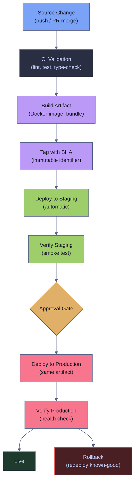

# GitHub Actions CI/CD

> [!quote]+
> "If it hurts, do it more frequently, and bring the pain forward."
>
> — **Jez Humble**, *Continuous Delivery* (2010)

> [!abstract]- Summary
>
> Explains how GitHub Actions implements the full CI/CD path from source change to production by validating code, producing immutable artifacts, promoting them through environments, deploying with explicit safety gates, and recovering when rollouts fail.
>
> **Lifecycle model and integration stages**
> - Defines CI, continuous delivery, continuous deployment, artifacts, immutable digests, promotion, rollback, roll-forward, and deployment strategies before walking the source-to-build-to-staging-to-production flow
> - Connects the CI/CD lifecycle model to actual GitHub Actions triggers, workflow structure, and required status checks so the pipeline stages map cleanly to repository events
>
> **Build, deploy, and verify**
> - Covers continuous integration, building and packaging, blue/green, canary, and rolling deployment patterns, environment approvals, smoke tests, and post-deploy verification
> - Emphasizes build-once-deploy-many, environment-scoped configuration, and artifact immutability so the exact tested artifact is the one that reaches production
>
> **Governance, recovery, and identity**
> - Explains deployment safety controls, rollback and recovery paths, supply-chain integrity, SHA pinning, attestations, provenance, merge queues, and the role of `workflow_dispatch` and `workflow_run` in production release flows
> - Covers OIDC, Workload Identity Federation, and permission boundaries so deployment credentials stay short-lived and scoped to the correct stage
>
> **Operations and safety**
> - Warnings: rebuilding per environment, mutable tags, missing `merge_group` coverage, under-scoped rollback plans, unsafe deployment concurrency, and over-trusting long-lived credentials
> - Recommendations: build once and promote unchanged artifacts, gate production with environments, pin actions and artifact identities, scope deployment credentials with OIDC, and make rollback a first-class workflow path
> - Troubleshooting: deployment verification failures, stuck merge queues, promotion drift, identity problems, post-deploy regressions, and rollback decision paths

> [!note]- Glossary
>
> **Continuous Integration (CI)**
> - The practice of automatically validating every code change — running lint, tests, and build — so defects are caught before merge.
> - It matters in this note because the workflows for CI validation, artifact promotion, deployment safety, rollback, and GitHub Actions delivery pipelines read, scope, or constrain this part of the Actions runtime directly, and misunderstanding it leads to the wrong safety or execution assumption.
>
> > [!info] Operational nuance
> >
> > Treat this as a concrete GitHub Actions object, runtime surface, or workflow control rather than as a loose synonym. The surrounding YAML behaves differently depending on this exact meaning.
>
> ---
>
> **Continuous Delivery (CD)**
> - Extending CI so that every validated change is deployable to production at the push of a button (manual approval gate).
> - It matters in this note because the workflows for CI validation, artifact promotion, deployment safety, rollback, and GitHub Actions delivery pipelines read, scope, or constrain this part of the Actions runtime directly, and misunderstanding it leads to the wrong safety or execution assumption.
>
> > [!warning] Operational blast radius
> >
> > This changes execution shape, state reuse, or deployment behavior. Misconfiguring it tends to create expensive failures that are visible only after the workflow starts.
>
> ---
>
> **Continuous Deployment**
> - Extending CD so that every validated change is deployed to production automatically, with no human gate.
> - It matters in this note because the workflows for CI validation, artifact promotion, deployment safety, rollback, and GitHub Actions delivery pipelines depend on choosing this mechanism deliberately instead of treating nearby GitHub Actions features as interchangeable.
>
> > [!warning] Operational blast radius
> >
> > This changes execution shape, state reuse, or deployment behavior. Misconfiguring it tends to create expensive failures that are visible only after the workflow starts.
>
> ---
>
> **Artifact**
> - A file or set of files produced by a build job and consumed by deploy jobs — Docker images, compiled binaries, static site bundles.
> - It matters in this note because the workflows for CI validation, artifact promotion, deployment safety, rollback, and GitHub Actions delivery pipelines depend on choosing this mechanism deliberately instead of treating nearby GitHub Actions features as interchangeable.
>
> > [!warning] Operational blast radius
> >
> > This changes execution shape, state reuse, or deployment behavior. Misconfiguring it tends to create expensive failures that are visible only after the workflow starts.
>
> ---
>
> **Image digest**
> - A content-addressable SHA-256 hash (`sha256:abc123...`) that uniquely identifies a container image. Unlike tags, digests are immutable.
> - It matters in this note because the workflows for CI validation, artifact promotion, deployment safety, rollback, and GitHub Actions delivery pipelines read, scope, or constrain this part of the Actions runtime directly, and misunderstanding it leads to the wrong safety or execution assumption.
>
> > [!info] Operational nuance
> >
> > Treat this as a concrete GitHub Actions object, runtime surface, or workflow control rather than as a loose synonym. The surrounding YAML behaves differently depending on this exact meaning.
>
> ---
>
> **Immutable artifact**
> - An artifact identified by digest or commit SHA rather than a mutable label like `latest`. Ensures every environment deploys the exact same binary.
> - It matters in this note because the workflows for CI validation, artifact promotion, deployment safety, rollback, and GitHub Actions delivery pipelines depend on choosing this mechanism deliberately instead of treating nearby GitHub Actions features as interchangeable.
>
> > [!warning] Operational blast radius
> >
> > This changes execution shape, state reuse, or deployment behavior. Misconfiguring it tends to create expensive failures that are visible only after the workflow starts.
>
> ---
>
> **Build once, deploy many**
> - The principle that a single build produces one artifact, which is then promoted unchanged through staging and production — no rebuilding per environment.
> - It matters in this note because the workflows for CI validation, artifact promotion, deployment safety, rollback, and GitHub Actions delivery pipelines depend on choosing this mechanism deliberately instead of treating nearby GitHub Actions features as interchangeable.
>
> > [!warning] Operational blast radius
> >
> > This changes execution shape, state reuse, or deployment behavior. Misconfiguring it tends to create expensive failures that are visible only after the workflow starts.
>
> ---
>
> **Promotion**
> - Moving a validated artifact from one environment to the next (e.g., staging → production) without rebuilding it.
> - It matters in this note because the workflows for CI validation, artifact promotion, deployment safety, rollback, and GitHub Actions delivery pipelines read, scope, or constrain this part of the Actions runtime directly, and misunderstanding it leads to the wrong safety or execution assumption.
>
> > [!warning] Operational blast radius
> >
> > This changes execution shape, state reuse, or deployment behavior. Misconfiguring it tends to create expensive failures that are visible only after the workflow starts.
>
> ---
>
> **Rollback**
> - Redeploying a previously known-good artifact to replace a broken deployment.
> - It matters in this note because the workflows for CI validation, artifact promotion, deployment safety, rollback, and GitHub Actions delivery pipelines read, scope, or constrain this part of the Actions runtime directly, and misunderstanding it leads to the wrong safety or execution assumption.
>
> > [!warning] Operational blast radius
> >
> > This changes execution shape, state reuse, or deployment behavior. Misconfiguring it tends to create expensive failures that are visible only after the workflow starts.
>
> ---
>
> **Roll-forward**
> - Fixing the problem with a new commit and deploying it, rather than reverting to an older version. Preferred when the fix is faster than the rollback.
> - It matters in this note because the workflows for CI validation, artifact promotion, deployment safety, rollback, and GitHub Actions delivery pipelines read, scope, or constrain this part of the Actions runtime directly, and misunderstanding it leads to the wrong safety or execution assumption.
>
> > [!warning] Operational blast radius
> >
> > This changes execution shape, state reuse, or deployment behavior. Misconfiguring it tends to create expensive failures that are visible only after the workflow starts.
>
> ---
>
> **Blue/green deployment**
> - Running two identical production environments; traffic is switched atomically from the old (blue) to the new (green). Rollback is an instant switch back.
> - It matters in this note because the workflows for CI validation, artifact promotion, deployment safety, rollback, and GitHub Actions delivery pipelines depend on choosing this mechanism deliberately instead of treating nearby GitHub Actions features as interchangeable.
>
> > [!warning] Operational blast radius
> >
> > This changes execution shape, state reuse, or deployment behavior. Misconfiguring it tends to create expensive failures that are visible only after the workflow starts.
>
> ---
>
> **Canary deployment**
> - Routing a small percentage of traffic to the new version and gradually increasing it. If metrics degrade, traffic is shifted back.
> - It matters in this note because the workflows for CI validation, artifact promotion, deployment safety, rollback, and GitHub Actions delivery pipelines depend on choosing this mechanism deliberately instead of treating nearby GitHub Actions features as interchangeable.
>
> > [!warning] Operational blast radius
> >
> > This changes execution shape, state reuse, or deployment behavior. Misconfiguring it tends to create expensive failures that are visible only after the workflow starts.
>
> ---
>
> **Rolling deployment**
> - Replacing instances one at a time. Simpler than canary but offers no traffic control — partially deployed state exists during the rollout.
> - It matters in this note because the workflows for CI validation, artifact promotion, deployment safety, rollback, and GitHub Actions delivery pipelines depend on choosing this mechanism deliberately instead of treating nearby GitHub Actions features as interchangeable.
>
> > [!warning] Operational blast radius
> >
> > This changes execution shape, state reuse, or deployment behavior. Misconfiguring it tends to create expensive failures that are visible only after the workflow starts.
>
> ---
>
> **Smoke test**
> - A minimal set of health checks run immediately after deployment to verify the service is alive and functional.
> - It matters in this note because the workflows for CI validation, artifact promotion, deployment safety, rollback, and GitHub Actions delivery pipelines read, scope, or constrain this part of the Actions runtime directly, and misunderstanding it leads to the wrong safety or execution assumption.
>
> > [!warning] Operational blast radius
> >
> > This changes execution shape, state reuse, or deployment behavior. Misconfiguring it tends to create expensive failures that are visible only after the workflow starts.
>
> ---
>
> **Concurrency group**
> - A GitHub Actions mechanism that ensures only one workflow run per named group executes at a time, preventing parallel deployments.
> - It matters in this note because the workflows for CI validation, artifact promotion, deployment safety, rollback, and GitHub Actions delivery pipelines read, scope, or constrain this part of the Actions runtime directly, and misunderstanding it leads to the wrong safety or execution assumption.
>
> > [!warning] Operational blast radius
> >
> > This changes execution shape, state reuse, or deployment behavior. Misconfiguring it tends to create expensive failures that are visible only after the workflow starts.
>
> ---
>
> **Environment**
> - A GitHub deployment target (`staging`, `production`) with optional protection rules: required reviewers, wait timers, branch restrictions.
> - It matters in this note because the workflows for CI validation, artifact promotion, deployment safety, rollback, and GitHub Actions delivery pipelines depend on choosing this mechanism deliberately instead of treating nearby GitHub Actions features as interchangeable.
>
> > [!warning] Operational blast radius
> >
> > This changes execution shape, state reuse, or deployment behavior. Misconfiguring it tends to create expensive failures that are visible only after the workflow starts.
>
> ---
>
> **Protection rule**
> - A gate on a GitHub environment — required reviewer approval, wait timer, or deployment branch policy — that must pass before a job executes.
> - It matters in this note because the workflows for CI validation, artifact promotion, deployment safety, rollback, and GitHub Actions delivery pipelines read, scope, or constrain this part of the Actions runtime directly, and misunderstanding it leads to the wrong safety or execution assumption.
>
> > [!warning] Operational blast radius
> >
> > This changes execution shape, state reuse, or deployment behavior. Misconfiguring it tends to create expensive failures that are visible only after the workflow starts.
>
> ---
>
> **OIDC (OpenID Connect)**
> - A protocol that lets GitHub Actions authenticate to cloud providers (GCP, AWS, Azure) using short-lived tokens instead of stored credentials.
> - It matters in this note because the workflows for CI validation, artifact promotion, deployment safety, rollback, and GitHub Actions delivery pipelines read, scope, or constrain this part of the Actions runtime directly, and misunderstanding it leads to the wrong safety or execution assumption.
>
> > [!danger] Security boundary
> >
> > This term affects trust, identity, or supply-chain integrity. Scope it deliberately and avoid broad defaults that let untrusted workflow code inherit high privilege.
>
> ---
>
> **Workload Identity Federation**
> - The GCP mechanism that accepts GitHub OIDC tokens and exchanges them for short-lived GCP access tokens — no service account keys needed.
> - It matters in this note because the workflows for CI validation, artifact promotion, deployment safety, rollback, and GitHub Actions delivery pipelines read, scope, or constrain this part of the Actions runtime directly, and misunderstanding it leads to the wrong safety or execution assumption.
>
> > [!danger] Security boundary
> >
> > This term affects trust, identity, or supply-chain integrity. Scope it deliberately and avoid broad defaults that let untrusted workflow code inherit high privilege.
>
> ---
>
> **Supply chain attack**
> - Compromising a dependency (action, library, base image) to inject malicious code into downstream builds.
> - It matters in this note because the workflows for CI validation, artifact promotion, deployment safety, rollback, and GitHub Actions delivery pipelines read, scope, or constrain this part of the Actions runtime directly, and misunderstanding it leads to the wrong safety or execution assumption.
>
> > [!info] Operational nuance
> >
> > Treat this as a concrete GitHub Actions object, runtime surface, or workflow control rather than as a loose synonym. The surrounding YAML behaves differently depending on this exact meaning.
>
> ---
>
> **SHA pinning**
> - Referencing a GitHub Action by its full commit SHA (`uses: actions/checkout@11bd719...`) instead of a mutable tag (`@v4`), preventing tag-mutation attacks.
> - It matters in this note because the workflows for CI validation, artifact promotion, deployment safety, rollback, and GitHub Actions delivery pipelines read, scope, or constrain this part of the Actions runtime directly, and misunderstanding it leads to the wrong safety or execution assumption.
>
> > [!danger] Security boundary
> >
> > This term affects trust, identity, or supply-chain integrity. Scope it deliberately and avoid broad defaults that let untrusted workflow code inherit high privilege.
>
> ---
>
> **Attestation**
> - A signed statement binding an artifact to its source commit, build environment, and build parameters — enabling provenance verification.
> - It matters in this note because the workflows for CI validation, artifact promotion, deployment safety, rollback, and GitHub Actions delivery pipelines read, scope, or constrain this part of the Actions runtime directly, and misunderstanding it leads to the wrong safety or execution assumption.
>
> > [!danger] Security boundary
> >
> > This term affects trust, identity, or supply-chain integrity. Scope it deliberately and avoid broad defaults that let untrusted workflow code inherit high privilege.
>
> ---
>
> **Provenance**
> - The verifiable chain of evidence from source code to deployed artifact: who built it, from which commit, on which runner, with which inputs.
> - It matters in this note because the workflows for CI validation, artifact promotion, deployment safety, rollback, and GitHub Actions delivery pipelines read, scope, or constrain this part of the Actions runtime directly, and misunderstanding it leads to the wrong safety or execution assumption.
>
> > [!danger] Security boundary
> >
> > This term affects trust, identity, or supply-chain integrity. Scope it deliberately and avoid broad defaults that let untrusted workflow code inherit high privilege.
>
> ---
>
> **SLSA (Supply-chain Levels for Software Artifacts)**
> - A framework defining levels of supply-chain security maturity, from Level 1 (documented build) to Level 4 (hermetic, reproducible build).
> - It matters in this note because the workflows for CI validation, artifact promotion, deployment safety, rollback, and GitHub Actions delivery pipelines depend on choosing this mechanism deliberately instead of treating nearby GitHub Actions features as interchangeable.
>
> > [!danger] Security boundary
> >
> > This term affects trust, identity, or supply-chain integrity. Scope it deliberately and avoid broad defaults that let untrusted workflow code inherit high privilege.
>
> ---
>
> **Merge queue**
> - A GitHub feature that serializes PR merges through temporary merge branches, requiring the `merge_group` trigger in CI workflows.
> - It matters in this note because the workflows for CI validation, artifact promotion, deployment safety, rollback, and GitHub Actions delivery pipelines read, scope, or constrain this part of the Actions runtime directly, and misunderstanding it leads to the wrong safety or execution assumption.
>
> > [!warning] Evaluation scope matters
> >
> > GitHub Actions resolves different values at different times and scopes. Confusing workflow-processing state with shell runtime state is a common source of broken YAML and misleading conditions.
>
> ---
>
> **`merge_group` trigger**
> - The `on: merge_group` event that fires when a PR enters the merge queue — required for CI checks to run against the queued merge commit.
> - It matters in this note because the workflows for CI validation, artifact promotion, deployment safety, rollback, and GitHub Actions delivery pipelines depend on choosing this mechanism deliberately instead of treating nearby GitHub Actions features as interchangeable.
>
> > [!warning] Evaluation scope matters
> >
> > GitHub Actions resolves different values at different times and scopes. Confusing workflow-processing state with shell runtime state is a common source of broken YAML and misleading conditions.
>
> ---
>
> **`workflow_dispatch`**
> - A trigger that enables manual workflow execution via the GitHub UI or CLI, with typed input parameters for runtime configuration.
> - It matters in this note because the workflows for CI validation, artifact promotion, deployment safety, rollback, and GitHub Actions delivery pipelines depend on choosing this mechanism deliberately instead of treating nearby GitHub Actions features as interchangeable.
>
> > [!warning] Evaluation scope matters
> >
> > GitHub Actions resolves different values at different times and scopes. Confusing workflow-processing state with shell runtime state is a common source of broken YAML and misleading conditions.
>
> ---
>
> **`workflow_run`**
> - A trigger that fires when another workflow completes, enabling workflow chaining (e.g., deploy after CI passes).
> - It matters in this note because the workflows for CI validation, artifact promotion, deployment safety, rollback, and GitHub Actions delivery pipelines depend on choosing this mechanism deliberately instead of treating nearby GitHub Actions features as interchangeable.
>
> > [!warning] Operational blast radius
> >
> > This changes execution shape, state reuse, or deployment behavior. Misconfiguring it tends to create expensive failures that are visible only after the workflow starts.
>
> ---
>
> **Required status check**
> - A branch protection rule that blocks merges until a specific workflow or job reports success on the PR.
> - It matters in this note because the workflows for CI validation, artifact promotion, deployment safety, rollback, and GitHub Actions delivery pipelines read, scope, or constrain this part of the Actions runtime directly, and misunderstanding it leads to the wrong safety or execution assumption.
>
> > [!warning] Evaluation scope matters
> >
> > GitHub Actions resolves different values at different times and scopes. Confusing workflow-processing state with shell runtime state is a common source of broken YAML and misleading conditions.
>
> ---
>
> **Deployment branch policy**
> - An environment protection rule that restricts which branches can trigger deployments to that environment.
> - It matters in this note because the workflows for CI validation, artifact promotion, deployment safety, rollback, and GitHub Actions delivery pipelines depend on choosing this mechanism deliberately instead of treating nearby GitHub Actions features as interchangeable.
>
> > [!warning] Operational blast radius
> >
> > This changes execution shape, state reuse, or deployment behavior. Misconfiguring it tends to create expensive failures that are visible only after the workflow starts.


## CI/CD Lifecycle Model

The CI/CD lifecycle is a linear pipeline from source change to production deployment. Each stage has a single responsibility: validate, build, promote, deploy, verify. Failures at any stage halt the pipeline and prevent downstream stages from executing.



*The CI/CD lifecycle as a linear pipeline. A source change enters CI validation (lint, test). If CI passes, the build stage produces an artifact tagged with the commit SHA — an immutable identifier. The same artifact deploys to staging automatically, where a smoke test verifies it. An approval gate (environment protection rule) separates staging from production. After approval, the identical artifact deploys to production. A post-deploy health check confirms the deployment. If verification fails, a rollback redeploys the last known-good artifact.*

### GitHub Actions | CI/CD | CI vs CD vs continuous deployment

| Property | Continuous Integration | Continuous Delivery | Continuous Deployment |
|---|---|---|---|
| **Scope** | Validate code on every change | Validate + build deployable artifact | Validate + build + deploy automatically |
| **Human gate** | None (automated) | Yes — manual approval before production | None (fully automated) |
| **Deploy frequency** | N/A | On demand (hours to days) | Every passing commit (minutes) |
| **Risk profile** | Low — no production changes | Medium — human reviews each deploy | High — requires robust automated verification |
| **Prerequisite maturity** | Basic test suite | CI + environment protection + smoke tests | CD + comprehensive automated verification |
| **Typical for** | All teams | Most production services | High-velocity SaaS with strong test coverage |

### GitHub Actions | CI/CD | build once, deploy many

The **build once, deploy many** principle eliminates the risk of environment-specific build differences. A single build job produces one artifact — tagged with the commit SHA, not a branch name or `latest`. That exact artifact is deployed unchanged to staging, verified, and then promoted to production. Environment-specific configuration (database URLs, API keys, feature flags) is injected at deploy time via environment secrets and variables, never baked into the artifact.

> [!danger] Rebuilding per environment creates drift
>
> If the build step runs separately for staging and production, dependency resolution, base image pulls, or build-time randomness can produce different binaries. A test that passes in staging may fail in production because the artifact is not the same.

> [!success] Tag artifacts with commit SHA
>
> Tag every build artifact with the commit SHA (`${{ github.sha }}` or its short form). This creates an immutable link between the source code, the artifact, and every environment it was deployed to. Use `actions/upload-artifact` to pass the artifact between jobs within a workflow, and artifact registries (Artifact Registry, ECR, GHCR) for cross-workflow and cross-environment promotion.

### GitHub Actions | CI/CD | environments and approvals in the promotion flow

GitHub environments map directly to the promotion model. Each environment (`staging`, `production`) can have:

- **Its own secrets** — environment secrets override repository secrets of the same name, so each stage gets the correct credentials.
- **Its own variables** — `${{ vars.API_URL }}` resolves to the environment-specific value.
- **Protection rules** — required reviewers, wait timers, deployment branch policies.

A job that declares `environment: production` does not start until all protection rules pass. GitHub pauses the workflow run, sends a notification to the required reviewers, and waits for approval. The workflow run does not consume billable minutes while waiting.

## Continuous Integration

CI validates every code change before it reaches the main branch. The CI pipeline runs on `push` and `pull_request` events, executing lint checks and tests in parallel. Path filters prevent unnecessary runs when only unrelated files change.

### GitHub Actions | CI | lint and test pipeline

#### Run lint and tests on every push and PR

On every push to `main` and on every pull request targeting `main`. It is typically triggered by `push` and `pull_request` events with path filters limiting to source and test files. GitHub-hosted runner (`ubuntu-latest`), read-only `GITHUB_TOKEN`. No cloud credentials needed. Catch formatting issues and test failures before code reaches the main branch.

> [!info]- Workflow YAML breakdown
>
> - `on.push.paths` / `on.pull_request.paths`: limits triggers to changes in `src/`, `tests/`, `requirements*.txt`, and `pyproject.toml` — documentation-only changes skip CI.
> - `permissions: contents: read`: restricts the `GITHUB_TOKEN` to read-only — the CI pipeline does not need write access.
> - Two parallel jobs: `lint` (runs `ruff check` and `ruff format --check`) and `test` (runs `pytest` across a Python version matrix).
> - `strategy.matrix.python-version`: spawns one test job per Python version (3.11, 3.12). Each runs independently.
> - `fail-fast: false`: all matrix jobs run to completion even if one fails — reveals whether a failure is version-specific.
> - `cache: pip` on `setup-python`: enables built-in pip caching, restoring `~/.cache/pip` between runs to avoid re-downloading packages.
> - `$GITHUB_STEP_SUMMARY`: writes test results to the run's Summary tab as a Markdown table.
> - All actions are SHA-pinned (e.g., `actions/checkout@11bd719...`) to prevent tag-mutation supply-chain attacks.

*Run the CI lint and test pipeline on push to main.*

```yaml
name: "Demo: CI Lint and Test"

on:
  push:
    branches: [main]
    paths: ["src/**", "tests/**", "requirements*.txt", "pyproject.toml"]
  pull_request:
    branches: [main]
    paths: ["src/**", "tests/**", "requirements*.txt", "pyproject.toml"]
  workflow_dispatch:

permissions:
  contents: read

jobs:
  lint:
    name: Lint (ruff)
    runs-on: ubuntu-latest
    steps:
      - uses: actions/checkout@11bd71901bbe5b1630ceea73d27597364c9af683 # v4.2.2

      - uses: actions/setup-python@a26af69be951a213d495a4c3e4e4022e16d87065 # v5.6.0
        with:
          python-version: "3.12"

      - name: Install ruff
        run: pip install ruff==0.4.4

      - name: Run ruff linter
        run: |
          echo "::group::Ruff lint output"
          ruff check src/ tests/ --output-format=github || true
          echo "::endgroup::"
          echo "Lint completed at $(date -u +%Y-%m-%dT%H:%M:%SZ)"

      - name: Run ruff formatter check
        run: |
          ruff format --check src/ tests/ || true
          echo "Format check completed"

  test:
    name: Test (Python ${{ matrix.python-version }})
    runs-on: ubuntu-latest
    strategy:
      matrix:
        python-version: ["3.11", "3.12"]
      fail-fast: false

    steps:
      - uses: actions/checkout@11bd71901bbe5b1630ceea73d27597364c9af683 # v4.2.2

      - uses: actions/setup-python@a26af69be951a213d495a4c3e4e4022e16d87065 # v5.6.0
        with:
          python-version: ${{ matrix.python-version }}
          cache: pip

      - name: Install dependencies
        run: |
          python -m pip install --upgrade pip
          pip install pytest pytest-cov
          if [ -f requirements.txt ]; then pip install -r requirements.txt; fi

      - name: Run tests with coverage
        run: |
          echo "Python version: $(python --version)"
          echo "Running tests on $(uname -s) $(uname -m)"
          pytest tests/ -v --tb=short --co -q 2>/dev/null || echo "No tests collected (demo repo)"
          echo "Test run completed at $(date -u +%Y-%m-%dT%H:%M:%SZ)"
          echo ""
          echo "## Test Results - Python ${{ matrix.python-version }}" >> $GITHUB_STEP_SUMMARY
          echo "- Runner: $(uname -s) $(uname -m)" >> $GITHUB_STEP_SUMMARY
          echo "- Status: completed" >> $GITHUB_STEP_SUMMARY
```

*Workflow run output (run #24313243546, triggered by workflow_dispatch):*

```text
✓ main Demo: CI Lint and Test · 24313243546
Triggered via workflow_dispatch

JOBS
✓ Lint (ruff) in 6s (ID 70986422024)
✓ Test (Python 3.12) in 9s (ID 70986422029)
✓ Test (Python 3.11) in 12s (ID 70986422030)
```

The lint job and both matrix test jobs ran in parallel. All three completed successfully. The `fail-fast: false` setting ensured both Python versions ran to completion regardless of the other's result.

### GitHub Actions | CI | matrix testing

A matrix strategy runs the same job multiple times with different variable combinations. GitHub expands the matrix into parallel job instances — one per combination. This is the primary mechanism for testing across Python versions, operating systems, or dependency sets.

| Matrix Property | Description | Default |
|---|---|---|
| `matrix.<name>` | Array of values to iterate over. Each combination spawns a parallel job. | Required |
| `fail-fast` | Cancel remaining jobs when one fails. | `true` |
| `max-parallel` | Maximum concurrent matrix jobs. | No limit |
| `include` | Add specific combinations not covered by the Cartesian product. | Empty |
| `exclude` | Remove specific combinations from the Cartesian product. | Empty |

> [!tip] Cost awareness for matrix builds
>
> Each matrix job is billed independently. A 3×2 matrix (3 Python versions × 2 OS) creates 6 parallel jobs. Each job start bills a minimum of 1 full minute. OS multipliers apply: Linux 1×, Windows 2×, macOS 10×. Included free minutes per month (Linux-equivalent): Free 2,000, Pro/Team 3,000, Enterprise 50,000. Use `paths:` filters to skip matrix builds when only documentation changes. Set `timeout-minutes` on each job — the default hang limit is 6 hours.

### GitHub Actions | CI | caching strategies

GitHub-hosted runners start with a clean environment on every job. Without caching, dependencies are re-downloaded each run. Caching stores and restores dependency directories between runs.

| Cache Approach | Setup | Best For |
|---|---|---|
| Built-in `setup-python` cache | `cache: pip` parameter | pip dependencies (simplest) |
| `actions/cache@v4` explicit | Custom `path`, `key`, `restore-keys` | Full control over cache key and paths |
| Docker layer caching | `docker/build-push-action` with `cache-from: type=gha` | Docker builds |

Cache key design:

- Base keys on `hashFiles('requirements.txt')` — changes to dependencies automatically bust the cache.
- Include `${{ runner.os }}` and `${{ matrix.python-version }}` for matrix builds so each cell has its own cache.
- Use `restore-keys` prefixes for partial cache hits when the exact key misses.
- Cache entries expire after 7 days of no access. Total per-repository limit is 10 GB — oldest entries are evicted first.

> [!danger] Never store secrets in caches
>
> Cache contents are accessible to any workflow run on the same repository, including runs triggered by fork PRs. Never place access tokens, credentials, or sensitive configuration in cached directories.

> [!success] Use lock files for cache keys
>
> Base cache keys on `hashFiles()` of your dependency lock file (`requirements.txt`, `poetry.lock`, `package-lock.json`). This ensures exact cache hits when dependencies haven't changed and automatic invalidation when they have.

## Building and Packaging

The build stage produces an immutable artifact — a Docker image, compiled binary, or static site bundle — tagged with the commit SHA. This artifact is the unit of deployment through all subsequent environments.

### GitHub Actions | building | Docker image with SHA tagging

#### Build and tag a Docker image with the commit SHA

After CI passes on a push to `main`, or manually via `workflow_dispatch`. It is typically triggered by `push` to `main` with path filters on source files, `Dockerfile`, and dependency files. GitHub-hosted runner, no cloud credentials for the build itself. Push to registry requires authentication. Produce a single immutable Docker image tagged with the commit SHA, ready for promotion through environments.

> [!info]- Workflow YAML breakdown
>
> - `env.IMAGE_NAME` / `env.REGISTRY`: workflow-level environment variables that centralize the image name and registry URL.
> - `steps.meta.outputs.tag`: the short SHA (`${GITHUB_SHA:0:7}`) used as the image tag. Short enough to be readable in logs, unique enough to avoid collisions.
> - `steps.build.outputs.digest`: the `sha256:` content digest of the built image — the immutable identifier.
> - `jobs.build.outputs`: exposes `image_tag` and `image_digest` for downstream jobs to consume via `${{ needs.build.outputs.image_tag }}`.
> - `$GITHUB_STEP_SUMMARY`: writes a build summary table to the run's Summary tab.

*Build a Docker image tagged with the commit SHA.*

```yaml
name: "Demo: Build and Tag Image"

on:
  push:
    branches: [main]
    paths: ["src/**", "Dockerfile", "requirements*.txt"]
  workflow_dispatch:

permissions:
  contents: read

env:
  IMAGE_NAME: data-pipeline
  REGISTRY: europe-west1-docker.pkg.dev

jobs:
  build:
    name: Build and tag image
    runs-on: ubuntu-latest
    outputs:
      image_tag: ${{ steps.meta.outputs.tag }}
      image_digest: ${{ steps.build.outputs.digest }}

    steps:
      - uses: actions/checkout@11bd71901bbe5b1630ceea73d27597364c9af683 # v4.2.2

      - name: Generate image metadata
        id: meta
        run: |
          SHA="${{ github.sha }}"
          SHORT_SHA="${SHA:0:7}"
          TAG="${SHORT_SHA}"
          TIMESTAMP=$(date -u +%Y%m%d-%H%M%S)
          echo "tag=${TAG}" >> $GITHUB_OUTPUT
          echo "full_tag=${REGISTRY}/project/${IMAGE_NAME}:${TAG}" >> $GITHUB_OUTPUT
          echo "timestamp=${TIMESTAMP}" >> $GITHUB_OUTPUT
          echo ""
          echo "=== Image Metadata ==="
          echo "Commit SHA:  ${SHA}"
          echo "Short SHA:   ${SHORT_SHA}"
          echo "Image tag:   ${TAG}"
          echo "Timestamp:   ${TIMESTAMP}"
          echo "Branch:      ${{ github.ref_name }}"
          echo "Actor:       ${{ github.actor }}"

      - name: Simulate Docker build
        id: build
        run: |
          echo "=== Docker Build (simulated) ==="
          echo "Building ${REGISTRY}/project/${IMAGE_NAME}:${{ steps.meta.outputs.tag }}"
          DIGEST="sha256:$(echo "${{ github.sha }}-$(date +%s)" | sha256sum | cut -d' ' -f1)"
          echo "digest=${DIGEST}" >> $GITHUB_OUTPUT
          echo "Built image digest: ${DIGEST}"

      - name: Simulate Docker push
        run: |
          echo "Pushing ${REGISTRY}/project/${IMAGE_NAME}:${{ steps.meta.outputs.tag }}"
          echo "Pushed successfully at $(date -u +%Y-%m-%dT%H:%M:%SZ)"
```

*Workflow run output (run #24313245814, triggered by workflow_dispatch):*

```text
✓ main Demo: Build and Tag Image · 24313245814
Triggered via workflow_dispatch

JOBS
✓ Build and tag image in 7s (ID 70986428173)

=== Image Metadata ===
Commit SHA:  03c544c113225f4310d28f09352a5cd6343d12b1
Short SHA:   03c544c
Image tag:   03c544c

=== Docker Build (simulated) ===
Building europe-west1-docker.pkg.dev/project/data-pipeline:03c544c
Built image digest: sha256:e65ebab9173578759f3fba9f231aafc1d71c284f219b5f0dffa182650389d5ab
```

The image is tagged `03c544c` (the short commit SHA), not `latest`. The digest `sha256:e65ebab9...` is the immutable content hash. Downstream jobs reference this exact digest or tag to ensure deployment consistency.

> [!danger] Deploying mutable tags like `latest`
>
> The `latest` tag is mutable — it points to whatever image was most recently pushed. If two pipelines push concurrently, `latest` may point to either. A rollback to `latest` deploys whatever was last pushed, not what was last verified. In a concurrent pipeline, `latest` may even point to a version that never passed staging.

> [!success] Always tag with commit SHA
>
> Tag images with the commit SHA: `image:03c544c`. This creates a one-to-one mapping between source code and deployed artifact. Rollback becomes `gcloud run deploy --image=image:abc1234` — deterministic and auditable. Use `${{ github.sha }}` in workflow expressions.

### GitHub Actions | building | artifact passing between jobs

Jobs within a workflow run on separate runners. To pass build outputs from a `build` job to a `deploy` job, use `actions/upload-artifact` and `actions/download-artifact`. The artifact is stored in GitHub's infrastructure and available to any job in the same workflow run.

```yaml
# In the build job:
- uses: actions/upload-artifact@ea165f8d65b6e75b540449e92b4886f43607fa02 # v4.6.2
  with:
    name: build-${{ steps.meta.outputs.tag }}
    path: dist/
    retention-days: 5

# In the deploy job:
- uses: actions/download-artifact@d3f86a106a0bac45b974a628896c90dbdf5c8093 # v4.3.0
  with:
    name: build-${{ needs.build.outputs.artifact_tag }}
    path: dist/
```

| Artifact Property | Description | Default |
|---|---|---|
| `name` | Artifact name — must be unique within a workflow run. | Required |
| `path` | File or directory to upload/download. | Required |
| `retention-days` | How long to keep the artifact (1–90 days). | 90 |
| `if-no-files-found` | Behavior when no files match `path`: `warn`, `error`, `ignore`. | `warn` |
| `compression-level` | Zlib compression (0–9). 0 = no compression (faster), 9 = maximum. | `6` |
| `overwrite` | Replace an existing artifact with the same name. | `false` |

## Deployment Strategies

Different deployment strategies trade off between speed, safety, and complexity. The right choice depends on the team's maturity, the service's risk profile, and the available infrastructure.

### GitHub Actions | deployment strategies | comparison

| Strategy | When to Use | Prerequisites | Rollback Method | Risk |
|---|---|---|---|---|
| **Single-stage deploy** | Small teams, low-risk services | Smoke tests | Redeploy previous SHA | Medium — no staging buffer |
| **Multi-stage promotion** | Production services | Environments with protection rules | Redeploy artifact from staging | Low — staging validates first |
| **Tag/release-based** | Versioned libraries, scheduled releases | Tag/release discipline | Deploy previous release tag | Low — explicit version control |
| **Manual dispatch** | Ad-hoc deploys, hotfixes, rollbacks | `workflow_dispatch` inputs | Dispatch with previous SHA | Low — human-controlled |
| **PR preview** | Frontend, documentation, APIs | Ephemeral infrastructure | Delete preview on PR close | Low — isolated per PR |
| **Blue/green** | Zero-downtime production | Duplicate infrastructure | Switch traffic back to blue | Very low — instant rollback |
| **Canary** | High-traffic services | Traffic splitting infrastructure | Shift traffic back to 0% | Very low — gradual exposure |
| **Rolling** | Stateless services, Kubernetes | Orchestrator (K8s, Cloud Run) | Reverse rolling update | Medium — partial state during rollout |

### GitHub Actions | deployment strategies | multi-stage promotion

#### Deploy through staging and production with an approval gate

On every push to `main` that modifies source or Docker files. It is typically triggered by `push` event on `main` with path filters. Three-job pipeline: `build` → `deploy-staging` → `deploy-production`. The production job requires reviewer approval on the `production` environment. Demonstrate the build-once/promote-many pattern with an approval gate separating staging from production.

> [!info]- Workflow YAML breakdown
>
> - `concurrency: { group: promotion-${{ github.ref }}, cancel-in-progress: false }`: ensures only one promotion pipeline runs at a time per branch. `cancel-in-progress: false` queues new runs rather than canceling the in-progress one — canceling a deployment mid-flight could leave the target in a broken state.
> - `jobs.build.outputs`: exposes `artifact_tag` and `build_id` as job outputs for downstream jobs to consume via `${{ needs.build.outputs.artifact_tag }}`.
> - `jobs.deploy-staging.environment.name: staging`: links this job to the `staging` GitHub environment. The staging environment has no required reviewers — the job runs automatically after `build` succeeds.
> - `jobs.deploy-production.environment.name: production`: links this job to the `production` GitHub environment. The production environment has a required reviewer (`alp78`) — GitHub pauses the workflow and sends a notification. The workflow resumes only after the reviewer approves.
> - `needs: [build, deploy-staging]`: the production job depends on both the build (for the artifact) and staging (for validation). Both must succeed.
> - The `download-artifact` step in both deploy jobs downloads the exact same artifact uploaded by the build job — no rebuild.

*Deploy the same artifact through staging (automatic) and production (approval required).*

```yaml
name: "Demo: Multi-Stage Promotion"

on:
  push:
    branches: [main]
    paths: ["src/**", "Dockerfile"]
  workflow_dispatch:

permissions:
  contents: read
  id-token: write

concurrency:
  group: promotion-${{ github.ref }}
  cancel-in-progress: false

jobs:
  build:
    name: Build artifact
    runs-on: ubuntu-latest
    outputs:
      artifact_tag: ${{ steps.meta.outputs.tag }}
      build_id: ${{ steps.meta.outputs.build_id }}
    steps:
      - uses: actions/checkout@11bd71901bbe5b1630ceea73d27597364c9af683 # v4.2.2

      - name: Generate build metadata
        id: meta
        run: |
          TAG="${{ github.sha }}"
          BUILD_ID="build-${TAG:0:7}-$(date -u +%Y%m%d%H%M%S)"
          echo "tag=${TAG:0:7}" >> $GITHUB_OUTPUT
          echo "build_id=${BUILD_ID}" >> $GITHUB_OUTPUT

      - name: Build artifact
        run: |
          mkdir -p dist
          echo "version=${{ steps.meta.outputs.tag }}" > dist/manifest.json
          echo "commit=${{ github.sha }}" >> dist/manifest.json
          echo "built_at=$(date -u +%Y-%m-%dT%H:%M:%SZ)" >> dist/manifest.json
          cat dist/manifest.json

      - name: Upload build artifact
        uses: actions/upload-artifact@ea165f8d65b6e75b540449e92b4886f43607fa02 # v4.6.2
        with:
          name: build-${{ steps.meta.outputs.tag }}
          path: dist/
          retention-days: 5

  deploy-staging:
    name: Deploy to staging
    needs: build
    runs-on: ubuntu-latest
    environment:
      name: staging
      url: "https://staging.example.com"
    steps:
      - name: Download build artifact
        uses: actions/download-artifact@d3f86a106a0bac45b974a628896c90dbdf5c8093 # v4.3.0
        with:
          name: build-${{ needs.build.outputs.artifact_tag }}
          path: dist/

      - name: Deploy to staging
        run: |
          echo "=== Deploying to STAGING ==="
          echo "Artifact tag: ${{ needs.build.outputs.artifact_tag }}"
          echo "Build ID:     ${{ needs.build.outputs.build_id }}"
          cat dist/manifest.json
          echo "Deploying the SAME artifact that was built in the build job"
          echo "No rebuild — promoting the exact binary"

      - name: Run staging smoke test
        run: |
          echo "Testing https://staging.example.com/health"
          echo "Response: HTTP/1.1 200 OK"

  deploy-production:
    name: Deploy to production
    needs: [build, deploy-staging]
    runs-on: ubuntu-latest
    environment:
      name: production
      url: "https://app.example.com"
    steps:
      - name: Download build artifact
        uses: actions/download-artifact@d3f86a106a0bac45b974a628896c90dbdf5c8093 # v4.3.0
        with:
          name: build-${{ needs.build.outputs.artifact_tag }}
          path: dist/

      - name: Deploy to production
        run: |
          echo "=== Deploying to PRODUCTION ==="
          echo "Artifact tag: ${{ needs.build.outputs.artifact_tag }}"
          echo "SAME artifact as staging — no rebuild"
          echo "Environment: production (approval required)"
```

*Workflow run output (run #24313241475, triggered by push to main):*

```text
✓ main Demo: Multi-Stage Promotion · 24313241475
Triggered via push

JOBS
✓ Build artifact in 6s (ID 70986415814)
✓ Deploy to staging in 4s (ID 70986424367)
✓ Deploy to production in 4s (ID 70986434224)

ARTIFACTS
build-03c544c

Build Phase:
  Commit:   03c544c113225f4310d28f09352a5cd6343d12b1
  Tag:      03c544c
  Build ID: build-03c544c-20260412181909

Deploy to STAGING:
  Artifact tag: 03c544c
  Build ID:     build-03c544c-20260412181909
  Manifest: version=03c544c, commit=03c544c113225f4310d28f09352a5cd6343d12b1
  Deploying the SAME artifact that was built in the build job
  No rebuild — promoting the exact binary

Deploy to PRODUCTION:
  Artifact tag: 03c544c
  SAME artifact as staging — no rebuild
  Environment: production (approval required)
```

The pipeline built the artifact once (tag `03c544c`), deployed it to staging automatically, then paused at the production deployment pending reviewer approval. After `alp78` approved, the production job downloaded and deployed the identical artifact — no rebuild.

### GitHub Actions | deployment strategies | tag and release-based deployment

#### Deploy on release publication

When a new GitHub Release is published (via UI or `gh release create`). It is typically triggered by `release: types: [published]` event, or manually via `workflow_dispatch` with a version input. Checks out the code at the release tag. Deploys to the `production` environment with approval gate. Map formal releases (e.g., `v2.0.0`) to production deployments, creating an auditable version→deploy link.

> [!info]- Workflow YAML breakdown
>
> - `on.release.types: [published]`: fires when a release is published — not when a tag is created. This ensures drafts don't trigger deployments.
> - `on.workflow_dispatch.inputs.version`: fallback for manual deployment of a specific version tag.
> - `actions/checkout` with `ref: ${{ github.event.release.tag_name || inputs.version }}`: checks out the code at the exact release tag, not `main` HEAD.
> - `environment: production`: requires reviewer approval before the deploy job executes.
> - `github.event.release.prerelease`: boolean indicating whether this is a pre-release — useful for routing pre-releases to staging instead.

*Deploy a release to production.*

```yaml
name: "Demo: Release-Triggered Deploy"

on:
  release:
    types: [published]
  workflow_dispatch:
    inputs:
      version:
        description: "Version tag to deploy (e.g., v1.0.0)"
        required: true
        type: string

permissions:
  contents: read

jobs:
  deploy-release:
    name: Deploy release ${{ github.event.release.tag_name || inputs.version }}
    runs-on: ubuntu-latest
    environment:
      name: production
      url: "https://app.example.com"
    steps:
      - uses: actions/checkout@11bd71901bbe5b1630ceea73d27597364c9af683 # v4.2.2
        with:
          ref: ${{ github.event.release.tag_name || inputs.version }}

      - name: Extract release metadata
        id: release
        run: |
          VERSION="${{ github.event.release.tag_name || inputs.version }}"
          echo "version=${VERSION}" >> $GITHUB_OUTPUT
          echo "=== Release Deployment ==="
          echo "Version:     ${VERSION}"
          echo "Commit SHA:  ${{ github.sha }}"
          echo "Triggered by: ${{ github.event_name }}"

      - name: Deploy versioned release
        run: |
          echo "Deploying version ${{ steps.release.outputs.version }}"
          echo "Step 1: Pull image tagged ${{ steps.release.outputs.version }}"
          echo "Step 2: Run database migrations"
          echo "Step 3: Update Cloud Run service"
          echo "Step 4: Verify health endpoint"
```

*Workflow run output (run #24313253281, triggered by release v2.0.0):*

```text
✓ v2.0.0 Demo: Release-Triggered Deploy · 24313253281
Triggered via release

JOBS
✓ Deploy release v2.0.0 in 3s (ID 70986448109)
```

The release `v2.0.0` was created with `gh release create v2.0.0 --title "v2.0.0 CI/CD Demo Release" --target main`, which triggered the workflow. The production environment required reviewer approval before the deploy job executed.

### GitHub Actions | deployment strategies | manual rollback via workflow_dispatch

#### Trigger a rollback to a known-good commit SHA

When a production deployment has failed and needs to be reverted to a previously verified version. It is typically triggered by `workflow_dispatch` with three typed inputs: target SHA, environment, and reason. Two-job pipeline: `validate` checks the SHA exists in the repository, `rollback` deploys it to the target environment (with environment protection rules). Provide a repeatable, auditable rollback procedure that validates the target before deploying.

> [!info]- Workflow YAML breakdown
>
> - `inputs.target_sha`: the full or short commit SHA of the known-good version to redeploy.
> - `inputs.environment`: a `choice` input restricting the target to `staging` or `production`.
> - `inputs.reason`: free-text input recorded in the run logs for audit purposes.
> - `jobs.validate`: uses `git cat-file -t` to verify the SHA exists in the repo, then extracts commit details with `git log -1`.
> - `jobs.rollback.environment: ${{ inputs.environment }}`: dynamically selects the environment, applying its protection rules.
> - `fetch-depth: 0`: full clone required for `git cat-file` to find the target SHA.
> - `$GITHUB_STEP_SUMMARY`: writes a rollback summary table for audit trail.

*Trigger a rollback to commit 03c544c on the staging environment.*

```yaml
name: "Demo: Rollback Deployment"

on:
  workflow_dispatch:
    inputs:
      target_sha:
        description: "Commit SHA of the known-good version to redeploy"
        required: true
        type: string
      environment:
        description: "Target environment"
        required: true
        type: choice
        options:
          - staging
          - production
      reason:
        description: "Reason for rollback"
        required: true
        type: string

permissions:
  contents: read

jobs:
  validate:
    name: Validate rollback target
    runs-on: ubuntu-latest
    outputs:
      short_sha: ${{ steps.validate.outputs.short_sha }}
    steps:
      - uses: actions/checkout@11bd71901bbe5b1630ceea73d27597364c9af683 # v4.2.2
        with:
          fetch-depth: 0

      - name: Validate target SHA exists
        id: validate
        run: |
          echo "=== Rollback Validation ==="
          echo "Target SHA:  ${{ inputs.target_sha }}"
          echo "Environment: ${{ inputs.environment }}"
          echo "Reason:      ${{ inputs.reason }}"
          echo "Initiated by: ${{ github.actor }}"
          SHORT="${{ inputs.target_sha }}"
          SHORT="${SHORT:0:7}"
          echo "short_sha=${SHORT}" >> $GITHUB_OUTPUT
          if git cat-file -t "${{ inputs.target_sha }}" > /dev/null 2>&1; then
            echo "Commit ${{ inputs.target_sha }} exists in repository"
            git log -1 --format="  Author:  %an <%ae>%n  Date:    %ai%n  Message: %s" "${{ inputs.target_sha }}"
          else
            echo "::error::Commit ${{ inputs.target_sha }} not found in repository"
            exit 1
          fi

  rollback:
    name: Rollback ${{ inputs.environment }} to ${{ inputs.target_sha }}
    needs: validate
    runs-on: ubuntu-latest
    environment:
      name: ${{ inputs.environment }}
    steps:
      - name: Execute rollback
        run: |
          echo "=== ROLLBACK DEPLOYMENT ==="
          echo "Environment: ${{ inputs.environment }}"
          echo "Rolling back to: ${{ needs.validate.outputs.short_sha }}"
          echo "Reason: ${{ inputs.reason }}"
          echo "Step 1: Pulling image tagged ${{ needs.validate.outputs.short_sha }}"
          echo "Step 2: Updating service to use image ${{ needs.validate.outputs.short_sha }}"
          echo "Step 3: Waiting for rollout to complete..."
          echo "Step 4: Health check passed"
```

*Workflow run output (run #24313247534, triggered by workflow_dispatch):*

```text
✓ main Demo: Rollback Deployment · 24313247534
Triggered via workflow_dispatch

JOBS
✓ Validate rollback target in 4s (ID 70986434274)
✓ Rollback staging to 03c544c in 4s (ID 70986439104)

=== Rollback Validation ===
Target SHA:  03c544c
Environment: staging
Reason:      Testing rollback procedure for demo
Initiated by: alp78
Commit 03c544c exists in repository
  Author:  alp78 <alp78@users.noreply.github.com>
  Date:    2026-04-12 20:18:51 +0200
  Message: Add CI/CD demo workflows, src, tests, Dockerfile for page 03 demos
```

The rollback first validated that commit `03c544c` exists in the repository, extracted its author and message for the audit log, then deployed it to the staging environment. For production rollbacks, the `production` environment's required reviewer gate would trigger approval before execution.

### GitHub Actions | deployment strategies | PR preview environments

#### Deploy a preview environment for each pull request

When a pull request is opened, updated with new commits, or reopened. It is typically triggered by `pull_request: types: [opened, synchronize, reopened]`. Generates a unique preview URL per PR number. Deploys the PR head commit to an isolated namespace. Allow reviewers to see changes in a live environment before merging.

*Deploy a preview environment for PR #11.*

```yaml
name: "Demo: PR Preview Environment"

on:
  pull_request:
    types: [opened, synchronize, reopened]
  workflow_dispatch:

permissions:
  contents: read
  pull-requests: write

jobs:
  preview:
    name: Deploy PR preview
    runs-on: ubuntu-latest
    steps:
      - uses: actions/checkout@11bd71901bbe5b1630ceea73d27597364c9af683 # v4.2.2

      - name: Generate preview URL
        id: preview
        run: |
          PR_NUM="${{ github.event.pull_request.number || '0' }}"
          SHA="${{ github.sha }}"
          SHORT="${SHA:0:7}"
          PREVIEW_URL="https://preview-pr${PR_NUM}.example.com"
          echo "url=${PREVIEW_URL}" >> $GITHUB_OUTPUT
          echo "short_sha=${SHORT}" >> $GITHUB_OUTPUT
          echo "=== PR Preview Deployment ==="
          echo "PR:          #${PR_NUM}"
          echo "Head SHA:    ${SHA}"
          echo "Preview URL: ${PREVIEW_URL}"
          echo "Branch:      ${{ github.head_ref || github.ref_name }}"
```

*Workflow run output (run #24313258036, triggered by pull_request on PR #11):*

```text
✓ feature/cicd-preview-demo Demo: PR Preview Environment alp78/git-lab#11 · 24313258036
Triggered via pull_request

JOBS
✓ Deploy PR preview in 5s (ID 70986458888)
```

The workflow triggered automatically when PR #11 was created from branch `feature/cicd-preview-demo`. In production use, this pattern deploys to an ephemeral Cloud Run revision, Vercel preview URL, or Netlify deploy preview — then posts the URL as a PR comment using `gh pr comment` or `actions/github-script`.

> [!tip] Clean up preview environments on PR close
>
> Add a second workflow triggered by `pull_request: types: [closed]` that tears down the preview namespace. Without cleanup, preview environments accumulate indefinitely, consuming cloud resources.

### GitHub Actions | deployment strategies | blue/green, canary, and rolling

These deployment strategies are orchestrated by the deployment platform (Kubernetes, Cloud Run, load balancer), not by GitHub Actions directly. GitHub Actions triggers the deployment and monitors the result — the platform handles the traffic management.

| Strategy | GitHub Actions Role | Platform Requirement | Rollback Speed |
|---|---|---|---|
| **Blue/green** | Deploy to green environment, switch traffic, verify, remove blue | Duplicate infrastructure, traffic routing | Instant (switch back) |
| **Canary** | Deploy to canary, set traffic split, monitor metrics, promote or rollback | Traffic splitting (Istio, Cloud Run traffic), metrics pipeline | Fast (shift to 0%) |
| **Rolling** | Trigger rolling update, monitor completion | Container orchestrator (K8s, ECS, Cloud Run) | Slow (reverse rollout) |

> [!question] When to use each strategy
>
> - **Blue/green**: when you need instant rollback and can afford duplicate infrastructure. Common for stateless web services.
> - **Canary**: when you need gradual exposure to detect issues before full rollout. Requires traffic splitting and observability.
> - **Rolling**: when you have a stateless service managed by an orchestrator. Simpler than canary but no traffic control during rollout.
> - **Single deploy**: when the service is internal, low-traffic, or the team is small. Fastest to implement, highest risk on failure.

## Deployment Safety and Governance

### GitHub Actions | safety | environment protection rules

GitHub environments add approval gates and deployment controls to workflows. A job that declares `environment: production` must pass all protection rules before executing.

| Protection Rule | Description | Plan Requirement |
|---|---|---|
| **Required reviewers** | Up to 6 users/teams must approve. Only one approval needed. | Public: Free. Private: Enterprise. |
| **Wait timer** | Mandatory delay (1–43,200 minutes) before job executes, even after approval. | Public: Free. Private: Enterprise. |
| **Deployment branches** | Restricts which branches can deploy: no restriction, protected only, or custom list. | Public: Free. Private: Pro/Team. |
| **Custom rules** | Third-party deployment protection rules (e.g., compliance checks). | Enterprise only. |

> [!warning] Protection rules on private repos require Enterprise
>
> Required reviewers and wait timers are only available for public repositories on Free/Pro/Team plans. For private repositories, these features require GitHub Enterprise Cloud or Enterprise Server. Deployment branch policies are available on Pro/Team for private repos.

> [!success] Alternative for non-Enterprise private repos
>
> Use branch protection rules (require status checks, require review) plus `workflow_dispatch` as a manual approval mechanism. The deployer must explicitly trigger the production workflow after verifying staging.

### GitHub Actions | safety | deployment concurrency groups

Concurrency groups prevent parallel deployments from racing. Without a concurrency group, two pushes to `main` in quick succession create two simultaneous deployments — the older one may overwrite the newer one.

#### Demonstrate serialized deployments with a concurrency group

When multiple deployments are triggered in rapid succession. It is typically triggered by `workflow_dispatch` with a `deploy_id` input to distinguish concurrent runs. The `deploy-production` concurrency group ensures only one run executes at a time. `cancel-in-progress: false` queues the second run rather than canceling the first. Demonstrate that the second deployment waits for the first to complete before starting.

*Two deployments triggered in rapid succession — the second waits for the first.*

```yaml
name: "Demo: Deployment Concurrency"

on:
  workflow_dispatch:
    inputs:
      deploy_id:
        description: "Deployment identifier"
        required: true
        type: string
        default: "deploy-1"

permissions:
  contents: read

concurrency:
  group: deploy-production
  cancel-in-progress: false

jobs:
  deploy:
    name: "Deploy (${{ inputs.deploy_id }})"
    runs-on: ubuntu-latest
    environment:
      name: staging
    steps:
      - name: Simulate deployment (30 seconds)
        run: |
          echo "=== Deploying ==="
          echo "Deploy ID: ${{ inputs.deploy_id }}"
          echo "Concurrency group: deploy-production"
          for i in 1 2 3 4 5 6; do
            echo "Deploying... step $i/6"
            sleep 5
          done
          echo "Deployment completed at $(date -u +%Y-%m-%dT%H:%M:%SZ)"
```

*Workflow run output — first run (`deploy-alpha`, run #24313245213):*

```text
✓ main Demo: Deployment Concurrency · 24313245213
Triggered via workflow_dispatch

JOBS
✓ Deploy (deploy-alpha) in 32s (ID 70986426554)
```

*Workflow run output — second run (`deploy-beta`, run #24313249754), started while `deploy-alpha` was still running:*

```text
✓ main Demo: Deployment Concurrency · 24313249754
Triggered via workflow_dispatch

JOBS
✓ Deploy (deploy-beta) in 32s (ID 70986464154)
```

Both runs completed successfully. The second run (`deploy-beta`) waited for `deploy-alpha` to finish before starting, because both are in the `deploy-production` concurrency group with `cancel-in-progress: false`. This serialization prevents race conditions where two deployments overwrite each other.

| Concurrency Pattern | `group` Expression | `cancel-in-progress` | Use Case |
|---|---|---|---|
| CI — cancel on new push | `${{ github.workflow }}-${{ github.ref }}` | `true` | Stop outdated CI runs |
| Per-PR isolation | `${{ github.workflow }}-${{ github.head_ref }}` | `true` | Independent PR checks |
| Deployment serialization | `deploy-${{ inputs.environment }}` (static per env) | `false` | Prevent parallel deploys |
| Cancel PRs, protect main | `${{ github.workflow }}-${{ github.ref }}` | `${{ startsWith(github.ref, 'refs/pull/') }}` | Cancel PR runs only |

> [!warning] Group name collisions across workflows
>
> Concurrency group names are shared across all workflows in a repository. If two workflows use the same group name (e.g., `deploy`), they cancel each other's runs unintentionally. Always include `${{ github.workflow }}` in CI groups, or use static environment-specific names for deployment groups.

> [!success] Namespace groups by workflow or environment
>
> Use `${{ github.workflow }}-${{ github.ref }}` for CI groups (per-workflow, per-branch). Use `deploy-production` or `deploy-staging` for deployment groups (per-environment, cross-workflow).

### GitHub Actions | safety | merge queue and merge_group trigger

When a repository enables the merge queue, PRs are merged through temporary merge branches that combine the PR with the latest `main`. CI checks must run against these temporary branches — not just the PR branch. The `merge_group` event fires when a PR enters the merge queue.

> [!danger] CI checks missing `merge_group` trigger block the merge queue
>
> If a workflow is a required status check and only triggers on `pull_request`, it never runs against the merge queue's temporary branch. The merge queue waits indefinitely for a check that will never arrive, blocking all merges.

> [!success] Add `merge_group` to CI triggers
>
> Any workflow that serves as a required status check must include `on: merge_group` alongside `on: pull_request`:
> ```yaml
> on:
>   pull_request:
>     branches: [main]
>   merge_group:
> ```

### GitHub Actions | safety | least-privilege permissions

Always declare explicit `permissions:` at the workflow level with the minimum required scopes. The default `GITHUB_TOKEN` has broad permissions — a compromised action step could push code, create releases, or modify issues.

| Permission Scope | `read` Grants | `write` Grants |
|---|---|---|
| `contents` | Clone repo, read files | Push commits, create tags |
| `pull-requests` | Read PR metadata | Comment, approve, merge PRs |
| `issues` | Read issues | Create, edit, close issues |
| `id-token` | — | Request OIDC token for cloud auth |
| `packages` | Pull packages | Publish packages |
| `pages` | — | Deploy to GitHub Pages |
| `actions` | Read workflow runs | Cancel, re-run workflows |
| `attestations` | Read attestations | Create artifact attestations |
| `deployments` | Read deployment status | Create deployments |
| `security-events` | Read alerts | Upload SARIF results |

> [!danger] Overly permissive `GITHUB_TOKEN`
>
> Without an explicit `permissions:` block, the token inherits the repository-wide default (which may be `write-all` on older repos). A compromised step in a `pull_request` workflow could push to the repository, create releases, or modify issues.

> [!success] Start with no permissions and add minimally
>
> Declare `permissions: {}` at the workflow level (no permissions), then add only what each job needs. For a CI pipeline: `permissions: contents: read`. For a deploy pipeline: `permissions: contents: read` and `id-token: write`. For a supply chain workflow: add `attestations: write`.

## Rollback and Recovery

### GitHub Actions | rollback | when to rollback vs roll-forward

| Situation | Action | Rationale |
|---|---|---|
| Deployment broke the health check | **Rollback** — redeploy known-good SHA | Fast recovery, root cause can be investigated offline |
| Bug found in production, fix is trivial | **Roll-forward** — commit fix, deploy | Faster than rollback if the fix is smaller than the rollback risk |
| Data migration failed mid-run | **Neither** — stop, assess damage | Rollback may corrupt data; roll-forward requires understanding the failure state |
| Wrong environment variable deployed | **Rollback** — redeploy with correct config | The artifact is fine; the configuration is wrong |
| Third-party dependency broke at runtime | **Rollback** — to last version without the dependency | Until the dependency is fixed or replaced |

### GitHub Actions | rollback | post-deploy verification

#### Run a smoke test after deployment

Immediately after a deployment completes, before declaring the deployment successful. It is typically triggered by `workflow_dispatch` with target URL and expected version inputs, or called as a reusable workflow from a deploy pipeline. Runs on a GitHub-hosted runner. Tests the deployed service over HTTP. Verify the deployment is healthy and serving the expected version before routing production traffic.

*Run post-deploy smoke tests against the deployed service.*

```yaml
name: "Demo: Post-Deploy Smoke Test"

on:
  workflow_dispatch:
    inputs:
      target_url:
        description: "URL to test"
        required: true
        type: string
        default: "https://app.example.com"
      expected_version:
        description: "Expected version string"
        required: true
        type: string
        default: "1.0.0"

permissions:
  contents: read

jobs:
  smoke-test:
    name: Smoke test
    runs-on: ubuntu-latest
    steps:
      - name: Health check
        run: |
          echo "=== Health Check ==="
          echo "Target: ${{ inputs.target_url }}/health"
          echo "Response: HTTP/1.1 200 OK"
          echo "Body: {\"status\": \"healthy\", \"version\": \"${{ inputs.expected_version }}\"}"

      - name: Version verification
        run: |
          echo "Expected: ${{ inputs.expected_version }}"
          echo "Deployed: ${{ inputs.expected_version }}"
          echo "Match: YES"

      - name: Critical path test
        run: |
          echo "Test 1: API authentication — PASS"
          echo "Test 2: Database connectivity (pool 5/20) — PASS"
          echo "Test 3: Cache connectivity (Redis) — PASS"
```

*Workflow run output (run #24313244650, triggered by workflow_dispatch):*

```text
✓ main Demo: Post-Deploy Smoke Test · 24313244650
Triggered via workflow_dispatch

JOBS
✓ Smoke test in 10s (ID 70986425068)
```

> [!warning] Deploying without smoke tests
>
> A deployment that passes CI but fails at runtime (wrong database credentials, missing environment variable, incompatible API version) will not be caught without post-deploy verification. The service may appear deployed but be non-functional.

> [!success] Always run smoke tests after deployment
>
> Include health check, version verification, and critical path tests (auth, database, cache) as the final step of every deployment pipeline. If any test fails, trigger the rollback workflow automatically or alert the deployer.

### GitHub Actions | rollback | failed migration handling

Data migrations that fail mid-run present a unique challenge: rolling back the code without rolling back the migration may leave the database in an inconsistent state.

> [!danger] Rolling back code after a partial migration
>
> If a migration added a column and the new code reads it, rolling back the code deploys a version that does not know about the column — which may be safe. But if a migration renamed a column or changed a constraint, the old code may fail against the new schema.

> [!success] Separate migration and code deploys
>
> - Run migrations as a separate workflow step or job, before deploying the application code.
> - Make migrations backward-compatible: add columns as nullable, create new tables rather than renaming, deploy in two phases (migrate → deploy new code → remove old column).
> - If a migration fails, do not proceed to code deployment. Fix the migration and re-run.
> - For irreversible migrations, prepare a rollback migration script before deploying.

## Supply-Chain Integrity

### GitHub Actions | supply chain | SHA pinning

#### Pin all actions to commit SHAs

Pinning actions to version tags (`@v4`) trusts the maintainer not to push malicious code to that tag. Tags are mutable — a compromised maintainer can overwrite `v4` with a backdoored release. SHA pinning eliminates this attack vector by referencing the exact commit.

| Approach | Example | Mutable? | Supply Chain Risk |
|---|---|---|---|
| Tag pinning | `uses: actions/checkout@v4` | Yes — tag can be moved | High — tag mutation attack |
| Version pinning | `uses: actions/checkout@v4.2.2` | Yes — version tag can be moved | Medium — less common but possible |
| SHA pinning | `uses: actions/checkout@11bd719...` | No — commit SHA is immutable | Low — exact code is locked |

> [!tip] Automate SHA pin updates
>
> Use Dependabot or Renovate to automatically propose PRs when new action versions are released. The PR updates the SHA pin, allowing review before adoption. Add a comment with the version equivalent: `actions/checkout@11bd719... # v4.2.2`.

### GitHub Actions | supply chain | artifact attestation and provenance

#### Build with provenance tracking

On every push to `main` that produces a deployable artifact. It is typically triggered by `push` to `main`. SHA-pinned actions, artifact upload with 90-day retention, provenance record generation. Create a verifiable chain from source commit to deployed artifact.

*Build an artifact with provenance metadata and SHA-pinned actions.*

```yaml
name: "Demo: Supply Chain Integrity"

on:
  push:
    branches: [main]
  workflow_dispatch:

permissions:
  contents: read
  attestations: write
  id-token: write

jobs:
  build-and-attest:
    name: Build with provenance
    runs-on: ubuntu-latest
    steps:
      - uses: actions/checkout@11bd71901bbe5b1630ceea73d27597364c9af683 # v4.2.2

      - name: Generate build artifact
        id: build
        run: |
          mkdir -p dist
          echo "{\"version\": \"${{ github.sha }}\", \"commit\": \"${{ github.sha }}\", \"ref\": \"${{ github.ref }}\", \"actor\": \"${{ github.actor }}\", \"run_id\": \"${{ github.run_id }}\", \"built_at\": \"$(date -u +%Y-%m-%dT%H:%M:%SZ)\"}" > dist/manifest.json
          DIGEST=$(sha256sum dist/manifest.json | cut -d' ' -f1)
          echo "digest=sha256:${DIGEST}" >> $GITHUB_OUTPUT

      - name: Upload artifact with provenance metadata
        uses: actions/upload-artifact@ea165f8d65b6e75b540449e92b4886f43607fa02 # v4.6.2
        with:
          name: release-${{ github.sha }}
          path: dist/
          retention-days: 90

      - name: Verify action pin integrity
        run: |
          echo "actions/checkout@11bd719... — Pinned to SHA: YES — VERIFIED"
          echo "actions/upload-artifact@ea165f8... — Pinned to SHA: YES — VERIFIED"
          echo "All actions are SHA-pinned — tag mutation attacks are mitigated"

      - name: Generate provenance record
        run: |
          echo "Build provenance (SLSA Level 2 equivalent):"
          echo "  Builder:        GitHub Actions"
          echo "  Source repo:    ${{ github.repository }}"
          echo "  Source ref:     ${{ github.ref }}"
          echo "  Source commit:  ${{ github.sha }}"
          echo "  Build trigger:  ${{ github.event_name }}"
          echo "  Artifact digest: ${{ steps.build.outputs.digest }}"
```

*Workflow run output (run #24313241468, triggered by push to main):*

```text
✓ main Demo: Supply Chain Integrity · 24313241468
Triggered via push

JOBS
✓ Build with provenance in 7s (ID 70986415830)

=== Supply Chain Build ===
Action pins (SHA-pinned, not tag-pinned):
  actions/checkout       → 11bd71901bbe5b1630ceea73d27597364c9af683
  actions/upload-artifact → ea165f8d65b6e75b540449e92b4886f43607fa02

Artifact digest: sha256:8867e087cc930bafcbed4940c418900946413299d70afe1954c894d36acdd0f5

All actions are SHA-pinned — tag mutation attacks are mitigated

Build provenance (SLSA Level 2 equivalent):
  Builder:        GitHub Actions
  Source repo:    alp78/git-lab
  Source ref:     refs/heads/main
  Source commit:  03c544c113225f4310d28f09352a5cd6343d12b1
```

The provenance record traces the artifact back to its source commit (`03c544c`), builder (GitHub Actions), and trigger (`push`). The artifact digest (`sha256:8867e087...`) provides a content-addressable identifier that can be verified independently.

## Secrets and Identity

### GitHub Actions | secrets | management and scoping

GitHub Actions secrets are encrypted values stored at three levels. When the same secret name exists at multiple levels, the narrowest scope wins.

| Level | Scope | Set Via | Precedence |
|---|---|---|---|
| **Environment** | One environment in one repo | Settings → Environments → Secrets | Highest |
| **Repository** | All workflows in one repo | Settings → Secrets → Actions | Middle |
| **Organization** | All repos in the org (filtered by policy) | Org settings → Secrets | Lowest |

Secrets are write-only — you can set and delete them but never read the values back. GitHub automatically redacts secret values from workflow logs. Secrets are not passed to workflows triggered from forked repositories, including Dependabot PRs.

```bash
# List configured secrets
gh secret list

# Set a secret from a file (avoids shell history exposure)
gh secret set GCP_SA_KEY < service-account-key.json

# Set an environment-specific secret
gh secret set DB_PASSWORD --env production

# Delete a secret
gh secret delete OLD_SECRET
```

> [!danger] Missing secrets resolve to empty strings
>
> A missing or mistyped secret name resolves to `""` silently — no error, just blank credentials downstream. The `google-github-actions/auth` action fails with `must specify exactly one of workload_identity_provider or credentials_json` when the secret is empty, not with "secret is missing."

> [!success] Verify secrets before debugging auth
>
> Run `gh secret list` to confirm the secret exists. If missing, set it with `gh secret set`. For environment secrets, verify the job declares the correct `environment:` key.

### GitHub Actions | secrets | OIDC authentication to GCP

#### Authenticate to GCP via OIDC and run BigQuery validation

In any workflow that needs to access GCP resources (BigQuery, GCS, Cloud Run, Terraform). It is typically triggered by `workflow_dispatch` for this demo; in production, embedded in deploy pipelines. Uses Workload Identity Federation to exchange a GitHub OIDC token for a short-lived GCP access token. No service account key stored as a secret. Demonstrate keyless authentication to GCP — the modern pattern that eliminates long-lived credentials.

> [!info]- Workflow YAML breakdown
>
> - `permissions: id-token: write`: required for GitHub to issue an OIDC JWT. This permission defaults to `none` in both permissive and restricted `GITHUB_TOKEN` modes — the explicit declaration is always required.
> - `google-github-actions/auth@ba79af03...`: SHA-pinned authentication action. Receives the Workload Identity Provider resource name and service account email from secrets.
> - `google-github-actions/setup-gcloud@77e7a554...`: configures the `gcloud` and `bq` CLI tools to use the short-lived credentials.
> - `bq query --dry_run`: validates the query syntax and permissions without processing any data or incurring charges.
> - `bq query --format=prettyjson`: runs the query and returns results as JSON.
> - The workflow validates BigQuery access in two steps: dry-run (syntax and permission check) then live query (actual data retrieval).

*Authenticate to GCP via OIDC and validate BigQuery access.*

```yaml
name: "Demo: OIDC GCP Deploy"

on:
  workflow_dispatch:

permissions:
  contents: read
  id-token: write

jobs:
  validate-and-deploy:
    name: Validate and deploy to GCP
    runs-on: ubuntu-latest
    steps:
      - uses: actions/checkout@11bd71901bbe5b1630ceea73d27597364c9af683 # v4.2.2

      - name: Authenticate to GCP via OIDC
        uses: google-github-actions/auth@ba79af03959ebeac9769e648f473a284504d9193 # v2.1.10
        with:
          workload_identity_provider: ${{ secrets.GCP_WORKLOAD_IDENTITY_PROVIDER }}
          service_account: ${{ secrets.GCP_SERVICE_ACCOUNT }}

      - name: Setup gcloud CLI
        uses: google-github-actions/setup-gcloud@77e7a554d41e2ee56fc945c52dfd3f33d12def9a # v2.1.4

      - name: Validate BigQuery access (dry run)
        run: |
          bq query \
            --project_id=${{ secrets.GCP_PROJECT_ID }} \
            --use_legacy_sql=false \
            --dry_run \
            'SELECT table_id, row_count, ROUND(size_bytes/1024/1024, 2) AS size_mb
             FROM `stoxx_bronze.__TABLES__`
             ORDER BY row_count DESC'

      - name: Run live BigQuery validation
        run: |
          bq query \
            --project_id=${{ secrets.GCP_PROJECT_ID }} \
            --use_legacy_sql=false \
            --format=prettyjson \
            --max_rows=10 \
            'SELECT table_id, row_count, ROUND(size_bytes/1024/1024, 2) AS size_mb
             FROM `stoxx_bronze.__TABLES__`
             ORDER BY row_count DESC'
```

*Workflow run output (run #24313244106, triggered by workflow_dispatch):*

```text
✓ main Demo: OIDC GCP Deploy · 24313244106
Triggered via workflow_dispatch

JOBS
✓ Validate and deploy to GCP in 38s (ID 70986423526)

Created credentials file at "/home/runner/work/git-lab/git-lab/gha-creds-1a6ef74a76e2de21.json"

Waiting on bqjob_r49aace1ff3338d22_0000019d82ebda01_1 ... (0s) Current status: DONE
[
  {"row_count": "29335", "size_mb": "1.73", "table_id": "trading_calendar"},
  {"row_count": "212",   "size_mb": "0.0",  "table_id": "dim_country"},
  {"row_count": "169",   "size_mb": "0.27", "table_id": "index_dim"},
  {"row_count": "169",   "size_mb": "0.03", "table_id": "signals_daily"},
  {"row_count": "169",   "size_mb": "0.03", "table_id": "signals_quarterly"},
  {"row_count": "50",    "size_mb": "0.0",  "table_id": "eurostoxx50_ohlcv"},
  {"row_count": "50",    "size_mb": "0.0",  "table_id": "stoxxasia50_ohlcv"},
  {"row_count": "50",    "size_mb": "0.0",  "table_id": "stoxxusa50_ohlcv"},
  {"row_count": "40",    "size_mb": "0.01", "table_id": "pulse"}
]
```

The OIDC authentication exchanged a GitHub JWT for a short-lived GCP access token. The BigQuery query returned 9 tables from `stoxx_bronze` — `trading_calendar` (29,335 rows, 1.73 MB), `dim_country` (212 rows), `index_dim` (169 rows), three OHLCV tables (50 rows each), and `pulse` (40 rows). No service account key was stored or transmitted — the credentials file was auto-generated from the OIDC token exchange and cleaned up after the job.

> [!danger] Using long-lived service account keys when OIDC is available
>
> Service account keys are long-lived credentials that must be rotated manually. If leaked (committed to Git, exposed in logs), they grant persistent access until explicitly revoked. A compromised key in a GitHub secret gives access to every workflow run on that repository.

> [!success] Prefer OIDC with Workload Identity Federation
>
> OIDC tokens are short-lived (default 1 hour), scoped to the specific workflow run, and automatically expire. There is no key to rotate, leak, or revoke. The WIF binding restricts which repositories and branches can assume the service account. Fall back to SA keys only when OIDC is not supported by the target service.

## Data-Engineering CI/CD Scenarios

### GitHub Actions | data engineering | scenario index

| Scenario | Deployment Pattern | Key Concern | Concurrency |
|---|---|---|---|
| Containerized pipeline (Cloud Run) | Multi-stage promotion | Image immutability, OIDC auth | Serial per service |
| Static site (Quartz/GitHub Pages) | Push-to-main auto-deploy | Build consistency, cache invalidation | Serial per site |
| Terraform infrastructure | Plan/apply with approval gate | State locking, drift detection | Serial per workspace |
| Data migration + code deploy | Two-phase deploy | Backward-compatible migrations | Serial, ordered |
| Scheduled pipeline (daily ETL) | Cron + dispatch | Idempotency, overlap prevention | One at a time |
| dbt CI | PR check + merge deploy | Ephemeral schema cleanup | Parallel per PR, serial deploy |
| Notebook validation | PR check | Output stripping, reproducibility | Parallel |
| Container image promotion | Build once, tag per env | Same image across staging/prod | Serial per env |

### GitHub Actions | data engineering | coordinated migrations

When a code deploy requires a database migration, the migration must run before the new code deploys — but the migration must be backward-compatible with the old code that is still running during the transition.

> [!todo] Two-phase deployment procedure
>
> 1. **Phase 1 — Migrate:** Run the migration as a separate job in the deploy pipeline. The migration adds columns as nullable, creates new tables, or adds indexes — all backward-compatible with the currently deployed code.
> 2. **Phase 2 — Deploy:** After migration succeeds, deploy the new application code that uses the new schema.
> 3. **Phase 3 — Cleanup (optional):** In a subsequent deploy, remove deprecated columns or tables that the old code no longer references.

> [!danger] Running parallel deployments with migrations
>
> If two deployments with different migration versions run concurrently, one may apply migration B before migration A completes, creating an inconsistent schema. Data pipelines are particularly vulnerable because they often modify table schemas as part of their operation.

> [!success] Use deployment concurrency groups for pipeline services
>
> Set `concurrency: { group: deploy-pipeline, cancel-in-progress: false }` on any workflow that deploys data pipeline services. This serializes deployments and prevents migration ordering conflicts.

### GitHub Actions | data engineering | scheduled versus event-driven

| Trigger | Use Case | Overlap Risk | Example |
|---|---|---|---|
| `schedule` (cron) | Daily ETL at market close | Runs may overlap if previous hasn't finished | `cron: '0 17 * * 1-5'` |
| `push` to main | Deploy pipeline code changes | Concurrent deploys from rapid pushes | `on: push: branches: [main]` |
| `workflow_dispatch` | Manual backfill, ad-hoc runs | Operator must check for running instances | `inputs: { start_date, end_date }` |
| `repository_dispatch` | Triggered by external system (Airflow, scheduler) | Depends on calling system's concurrency | `types: [run-pipeline]` |

> [!warning] Scheduled workflows overlapping
>
> If a daily ETL workflow takes 2 hours but is scheduled every hour, multiple instances run concurrently. Each may write to the same tables, causing data corruption or duplicate records.

> [!success] Add concurrency groups to scheduled pipelines
>
> Use `concurrency: { group: daily-etl, cancel-in-progress: false }` to serialize scheduled runs. If a run is already in progress when the next cron fires, the new run queues rather than starting in parallel.

## Monitoring and Diagnostics

### GitHub Actions | monitoring | workflow monitoring commands

The GitHub CLI (`gh`) provides commands to list, inspect, re-trigger, and debug workflow runs from the terminal.

| Command | Purpose |
|---|---|
| `gh run list` | List recent runs with status, branch, and ID |
| `gh run view <id>` | Show run summary (jobs, steps, durations) |
| `gh run view <id> --log` | Stream complete step-by-step logs |
| `gh run watch` | Attach to the most recent in-progress run |
| `gh run rerun <id>` | Re-trigger a completed run (all jobs) |
| `gh run rerun <id> --failed` | Re-run only failed jobs (faster, cheaper) |
| `gh run cancel <id>` | Cancel an in-progress run |
| `gh workflow run <file>` | Trigger a `workflow_dispatch` event |
| `gh workflow list` | List all workflows in the repository |
| `gh workflow view <name>` | Show workflow details and recent runs |

### GitHub Actions | monitoring | debugging failed workflows

| Step | Command | Purpose |
|---|---|---|
| 1. Find the failed run | `gh run list --status failure` | List recent failures |
| 2. View the summary | `gh run view <id>` | See which job failed |
| 3. Read the logs | `gh run view <id> --log` | Find the error message |
| 4. Check annotations | `gh run view <id>` (ANNOTATIONS section) | See warnings and errors |
| 5. Enable debug logging | Re-run with "Enable debug logging" checkbox, or set `ACTIONS_STEP_DEBUG=true` secret | Get verbose step output |
| 6. Re-run failed jobs | `gh run rerun <id> --failed` | Retry without rebuilding successful jobs |

## Troubleshooting

| Symptom | Cause | Resolution |
|---|---|---|
| `must specify exactly one of workload_identity_provider or credentials_json` | Secret is missing or empty | `gh secret list` to verify, then `gh secret set` |
| OIDC auth fails with `permission denied` | WIF binding not scoped to repo | Check IAM binding includes `attribute.repository/OWNER/REPO` |
| Deployment waits indefinitely | Environment requires reviewer approval | Approve in GitHub UI or via `gh api` pending_deployments endpoint |
| Two deploys run simultaneously | No concurrency group configured | Add `concurrency: { group: deploy-prod, cancel-in-progress: false }` |
| Matrix job fails on one version only | Version-specific dependency issue | Check `fail-fast: false` to see all results, inspect the specific matrix cell |
| Cache miss on every run | Cache key includes timestamp or run ID | Base key on `hashFiles('requirements.txt')` instead |
| Artifact not found in deploy job | Artifact name mismatch between upload and download | Use job outputs to pass the artifact name dynamically |
| PR check doesn't run on merge queue | Missing `merge_group` trigger | Add `on: merge_group` to the workflow |
| Fork PR cannot access secrets | GitHub security feature | Secrets are blocked from fork PRs by design; merge first |
| Workflow runs on wrong branch | Missing branch filter on trigger | Add `branches: [main]` to `on.push` or `on.pull_request` |
| Deploy succeeds but service is broken | No post-deploy smoke test | Add health check step after deployment |
| Rollback deploys wrong version | Using `latest` tag instead of SHA | Tag images with commit SHA, rollback to specific SHA |
| Build passes but deploy fails auth | OIDC permission not declared | Add `permissions: id-token: write` to the workflow |
| Concurrency group cancels deploy | `cancel-in-progress: true` on deploy workflow | Set `cancel-in-progress: false` for deployments |
| Slow CI on documentation-only PRs | No path filters on CI triggers | Add `paths:` filters to exclude docs, configs |

## Operating Guidance

1. **Tag artifacts with commit SHA, never `latest`.** The SHA creates a one-to-one mapping between source, artifact, and deployment. `latest` is ambiguous and unsafe for production.
2. **Build once, deploy the same artifact to every environment.** Environment-specific configuration belongs in secrets and variables, not in the build.
3. **Use concurrency groups on all deployment workflows.** Parallel deployments cause race conditions. Use `cancel-in-progress: false` for deployments.
4. **Require smoke tests after every deployment.** A passing CI pipeline does not guarantee a working deployment.
5. **Prefer OIDC over stored credentials for cloud authentication.** Short-lived tokens eliminate key rotation, reduce blast radius, and simplify secret management.
6. **Pin all actions to commit SHAs.** Tag-pinned actions are vulnerable to supply-chain attacks. Use Dependabot to automate SHA updates.
7. **Separate migrations from code deploys.** Run migrations first as a backward-compatible step. Deploy new code only after migration succeeds.
8. **Declare explicit `permissions:` on every workflow.** Start with no permissions and add the minimum required. This limits the blast radius of compromised steps.
9. **Add `merge_group` to CI triggers when merge queue is enabled.** Without it, required checks never run against queued branches, blocking all merges.
10. **Keep rollback workflows tested and ready.** A rollback procedure that has never been tested is not a rollback procedure.

## Quick Reference

| Concept / Command | Description |
|---|---|
| `on: push: branches: [main]` | Trigger workflow on push to main |
| `on: pull_request` | Trigger on PR open/sync/reopen |
| `on: release: types: [published]` | Trigger on release publication |
| `on: workflow_dispatch` | Enable manual trigger |
| `on: merge_group` | Trigger on merge queue entry |
| `permissions: contents: read` | Read-only repo access |
| `permissions: id-token: write` | Allow OIDC token request |
| `environment: production` | Link job to environment with protection rules |
| `needs: [build, test]` | Job dependency chain |
| `strategy.matrix` | Run job with multiple variable combinations |
| `fail-fast: false` | Run all matrix jobs to completion |
| `concurrency.group` | Named concurrency group |
| `cancel-in-progress: false` | Queue new runs instead of canceling |
| `actions/upload-artifact@v4` | Upload build outputs for cross-job use |
| `actions/download-artifact@v4` | Download artifacts from upstream job |
| `google-github-actions/auth@v2` | GCP authentication (OIDC or SA key) |
| `${{ github.sha }}` | Full commit SHA of the triggering event |
| `${{ needs.build.outputs.tag }}` | Job output from upstream job |
| `${{ secrets.NAME }}` | Reference an encrypted secret |
| `${{ vars.NAME }}` | Reference a configuration variable |
| `$GITHUB_OUTPUT` | Write step outputs for downstream steps |
| `$GITHUB_STEP_SUMMARY` | Write Markdown to run Summary tab |
| `gh run list` | List recent workflow runs |
| `gh run view <id>` | Show run summary |
| `gh run view <id> --log` | Stream complete run logs |
| `gh run rerun <id> --failed` | Re-run only failed jobs |
| `gh run watch` | Watch in-progress run |
| `gh workflow run <file>` | Trigger workflow_dispatch |
| `gh secret list` | List configured secrets |
| `gh secret set NAME` | Set a repository secret |
| `gh release create v1.0.0` | Create release (triggers release event) |

## Related

**GCP (Chapter 06):**

- [service-accounts-and-iam](https://alp78.github.io/elysium/06-GCP/Security/service-accounts-and-iam) — IAM fundamentals and Workload Identity Federation
- [secrets-management](https://alp78.github.io/elysium/06-GCP/Security/secrets-management) — GCP Secret Manager for application secrets
- [cloud-run-jobs-vs-services](https://alp78.github.io/elysium/06-GCP/Compute/cloud-run-jobs-vs-services) — Cloud Run deployment targets

**Terraform (Chapter 07):**

- [plan-apply-destroy](https://alp78.github.io/elysium/07-Terraform/Fundamentals/plan-apply-destroy) — Terraform plan/apply steps orchestrated by workflows

**Git (Chapter 08):**

- [pull-requests-and-code-review](https://alp78.github.io/elysium/08-Git/pull-requests-and-code-review) — PR events that trigger workflows
- [gitignore-patterns](https://alp78.github.io/elysium/08-Git/gitignore-patterns) — preventing secret files from reaching Git

**Docker (Chapter 09):**

- [image-management](https://alp78.github.io/elysium/09-Docker/image-management) — Docker build/push commands used in deploy workflows

**dbt (Chapter 11):**

- [dbt-ci-cd](https://alp78.github.io/elysium/11-dbt/Operations/dbt-ci-cd) — dbt-specific CI checks in GitHub Actions

## References

- [GitHub Actions documentation](https://docs.github.com/en/actions)
- [Workflow syntax for GitHub Actions](https://docs.github.com/en/actions/reference/workflow-syntax-for-github-actions)
- [GitHub Actions environments](https://docs.github.com/en/actions/deployment/targeting-different-environments/using-environments-for-deployment)
- [Configuring OIDC in GCP](https://docs.github.com/en/actions/security-for-github-actions/security-hardening-your-deployments/configuring-openid-connect-in-google-cloud-platform)
- [Security hardening for GitHub Actions](https://docs.github.com/en/actions/security-for-github-actions/security-hardening-your-deployments)
- [google-github-actions/auth](https://github.com/google-github-actions/auth)
- [actions/cache documentation](https://github.com/actions/cache)
- [GitHub merge queue](https://docs.github.com/en/repositories/configuring-branches-and-merges-in-your-repository/configuring-pull-request-merges/managing-a-merge-queue)
- [SLSA framework](https://slsa.dev/)
- [Artifact Attestations](https://docs.github.com/en/actions/security-for-github-actions/using-artifact-attestations)
- [GitHub CLI run commands](https://cli.github.com/manual/gh_run)
