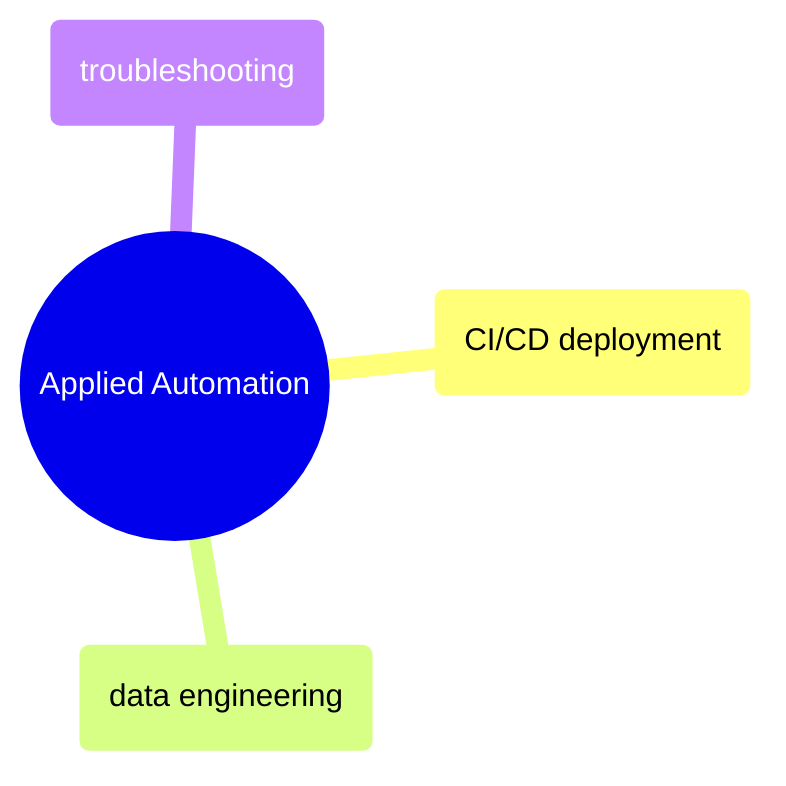

# Applied Automation

Real-world CI/CD deployment, data engineering pipeline automation, and troubleshooting common GitHub Actions failures.

> [!abstract]- [[03-github-actions-ci-cd]]

> [!abstract]- [[04-github-actions-data-engineering]]

> [!abstract]- [[05-github-actions-problems]]
