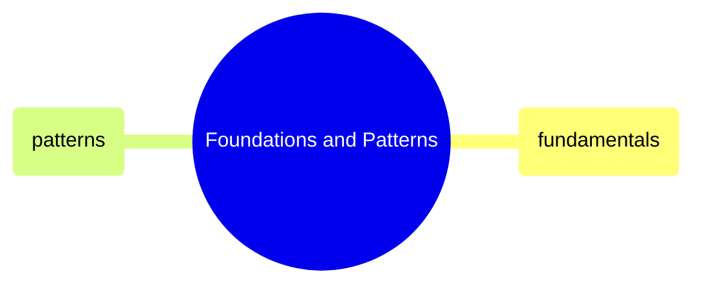

# Foundations and Patterns

GitHub Actions YAML syntax, triggers, jobs, expressions, secrets, caching, matrix builds, reusable workflows, and cost optimization patterns.

> [!abstract]- [[01-github-actions-fundamentals]]

> [!abstract]- [[02-github-actions-patterns]]
