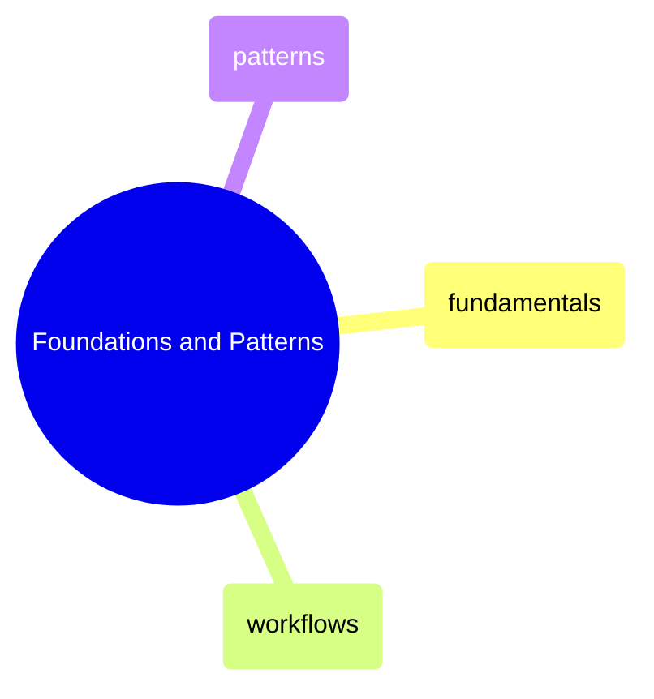
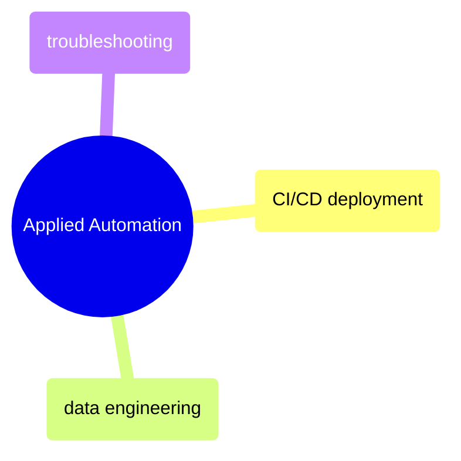

# MOC: GitHub Actions

CI/CD automation from YAML fundamentals to data engineering pipelines —
6 pages covering workflow syntax, reusable patterns, deployment automation,
and troubleshooting. Expand any section to browse page contents.

> [!guide]+ Foundations and Patterns
>
> [[domain-foundations-and-patterns]]
>
> GitHub Actions YAML syntax, triggers, jobs, expressions, secrets, caching, matrix builds, reusable workflows, and cost optimization patterns.

> [!guide]+ Applied Automation
>
> [[domain-applied-automation]]
>
> Real-world CI/CD deployment, data engineering pipeline automation, and troubleshooting common GitHub Actions failures.

## Cross-References

- [Git](https://alp78.github.io/elysium/08-Git/moc-git) — Git events that trigger GitHub Actions workflows
- [Terraform](https://alp78.github.io/elysium/07-Terraform/moc-terraform) — Terraform plan/apply automated via GitHub Actions
- [Docker](https://alp78.github.io/elysium/09-Docker/moc-docker) — Docker build and push in CI/CD pipelines
- [Data Architecture](https://alp78.github.io/elysium/14-Data-Architecture/moc-data-architecture) — Testing strategy that coordinates CI with quality gates
