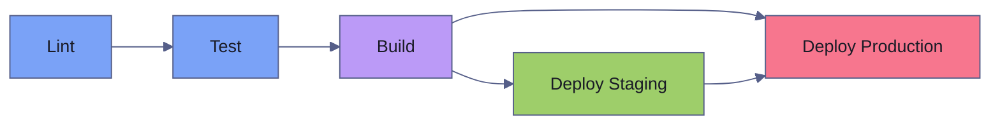

# GitHub Actions Patterns

> [!quote]
> "The third time you do something, it should be done using an automated process."
>
> — **Jez Humble**, *Continuous Delivery* (2010)

This file contains reusable patterns for production-grade GitHub Actions workflows. Each section is a self-contained pattern with a complete, runnable YAML example. For core concepts (triggers, runners, expressions), see [github-actions-fundamentals](https://alp78.github.io/elysium/10-GitHub-Actions/github-actions-fundamentals). For applied data engineering workflows (pipeline CI, dbt, Cloud Run CD), see [github-actions-data-engineering](https://alp78.github.io/elysium/10-GitHub-Actions/github-actions-data-engineering). Many shell steps rely on [defensive scripting](https://alp78.github.io/elysium/01-Shell/Scripting/defensive-scripting) practices. To practice applying these patterns, work through [github-actions-problems](https://alp78.github.io/elysium/10-GitHub-Actions/github-actions-problems).

## Matrix Builds

Matrix strategies run the same job across multiple variable combinations in parallel. Each combination spawns a separate job on its own runner. This is essential for testing across Python versions, operating systems, or database backends.

### Python Version × OS Matrix

This workflow tests across 3 Python versions and 3 operating systems, with `include` to flag one cell for coverage upload and `exclude` to skip expensive combinations. The `fail-fast: false` setting lets all cells complete even if one fails.

```yaml
name: Test Matrix

on:
  push:
    branches: [main]
  pull_request:
    branches: [main]

jobs:
  test:
    name: Python ${{ matrix.python-version }} / ${{ matrix.os }}
    runs-on: ${{ matrix.os }}
    strategy:
      fail-fast: false
      max-parallel: 6
      matrix:
        python-version: ["3.10", "3.11", "3.12"]
        os: [ubuntu-latest, windows-latest, macos-latest]
        include:
          - python-version: "3.12"
            os: ubuntu-latest
            upload-coverage: true
        exclude:
          - python-version: "3.10"
            os: macos-latest
          - python-version: "3.10"
            os: windows-latest

    steps:
      - uses: actions/checkout@v4

      - uses: actions/setup-python@v5
        with:
          python-version: ${{ matrix.python-version }}
          cache: pip

      - run: pip install -e ".[dev]"

      - run: pytest tests/ --cov=src --cov-report=xml

      - name: Upload coverage (only for flagged cell)
        if: matrix.upload-coverage
        uses: actions/upload-artifact@v4
        with:
          name: coverage
          path: coverage.xml
```

### Dynamic Matrix from Script

When the matrix values aren't known at write time (e.g., they depend on which services changed in a monorepo), compute them dynamically in a setup job. The `fromJSON()` function parses the JSON output into a matrix object.

```yaml
jobs:
  set-matrix:
    runs-on: ubuntu-latest
    outputs:
      matrix: ${{ steps.compute.outputs.matrix }}
    steps:
      - uses: actions/checkout@v4
      - id: compute
        run: |
          MATRIX=$(python scripts/compute_matrix.py)
          echo "matrix=$MATRIX" >> $GITHUB_OUTPUT

  test:
    needs: set-matrix
    strategy:
      matrix: ${{ fromJSON(needs.set-matrix.outputs.matrix) }}
    runs-on: ubuntu-latest
    steps:
      - run: echo "Testing ${{ matrix.service }}"
```

### Matrix with Services (Databases)

Matrix builds can combine with service containers to test against multiple database backends. The `services:` key starts a Docker container alongside the runner, accessible via `localhost`.

```yaml
jobs:
  test:
    runs-on: ubuntu-latest
    strategy:
      matrix:
        db: [postgres, mysql]
    services:
      postgres:
        image: postgres:15
        env:
          POSTGRES_PASSWORD: postgres
        ports:
          - 5432:5432
        options: >-
          --health-cmd pg_isready
          --health-interval 10s
          --health-timeout 5s
          --health-retries 5
    steps:
      - uses: actions/checkout@v4
      - run: pytest tests/db/ --db=${{ matrix.db }}
```

## Reusable Workflows

A reusable workflow is a complete workflow file (with `on: workflow_call`) that can be called from other workflows using `uses:`. It accepts typed inputs, secrets, and can return outputs. Reusable workflows run as a separate workflow in the caller's context — they appear as a collapsed job in the GitHub UI.

> [!question] Reusable workflows vs composite actions
> **Reusable workflows** are complete workflow files with their own `jobs:` and `runs-on:`. Best for encapsulating multi-job pipelines (e.g., a standard test → build → deploy pipeline shared across repos).
> **Composite actions** bundle multiple steps into a single action called with `uses:`. Best for reusable step sequences within a job (e.g., "setup Python with caching"). Composite actions cannot define their own jobs or runners — they inherit from the calling job.

### Defining a Reusable Workflow

The workflow file uses `on: workflow_call` to declare it as callable. The `inputs`, `secrets`, and `outputs` blocks define the contract with callers. Convention: prefix the filename with `_` (e.g., `_reusable-test.yml`) to indicate it is not triggered directly.

```yaml
name: Reusable — Test

on:
  workflow_call:
    inputs:
      python-version:
        required: false
        type: string
        default: "3.12"
      working-directory:
        required: false
        type: string
        default: "."
      coverage-threshold:
        required: false
        type: number
        default: 80
    secrets:
      CODECOV_TOKEN:
        required: false
    outputs:
      coverage-pct:
        description: "Coverage percentage"
        value: ${{ jobs.test.outputs.coverage-pct }}

jobs:
  test:
    runs-on: ubuntu-latest
    defaults:
      run:
        working-directory: ${{ inputs.working-directory }}
    outputs:
      coverage-pct: ${{ steps.coverage.outputs.pct }}
    steps:
      - uses: actions/checkout@v4

      - uses: actions/setup-python@v5
        with:
          python-version: ${{ inputs.python-version }}
          cache: pip

      - run: pip install -e ".[dev]"

      - run: |
          pytest tests/ \
            --cov=src \
            --cov-report=xml \
            --cov-fail-under=${{ inputs.coverage-threshold }}

      - id: coverage
        run: |
          PCT=$(python -c "import xml.etree.ElementTree as ET; t=ET.parse('coverage.xml').getroot(); print(round(float(t.get('line-rate'))*100))")
          echo "pct=$PCT" >> $GITHUB_OUTPUT
```

### Calling a Reusable Workflow

The caller uses `uses:` at the job level (not the step level) to invoke the reusable workflow. Local workflows use `./.github/workflows/<name>.yml`. Cross-org workflows use `org/repo/.github/workflows/<name>.yml@ref`. The `secrets: inherit` shorthand passes all caller secrets to the callee.

```yaml
name: CI

on:
  pull_request:
    branches: [main]

jobs:
  test-api:
    uses: ./.github/workflows/_reusable-test.yml
    with:
      python-version: "3.12"
      working-directory: api/
      coverage-threshold: 85
    secrets:
      CODECOV_TOKEN: ${{ secrets.CODECOV_TOKEN }}

  test-worker:
    uses: ./.github/workflows/_reusable-test.yml
    with:
      working-directory: worker/

  # Cross-org reusable workflow
  test-shared:
    uses: my-org/shared-workflows/.github/workflows/test.yml@main
    with:
      python-version: "3.12"
    secrets: inherit
```

> [!warning] secrets: inherit passes everything
> `secrets: inherit` passes **all** caller secrets to the reusable workflow, including secrets the callee doesn't need. This widens the blast radius if the callee is compromised.

> [!success] Map secrets explicitly
> Use specific secret mapping (e.g., `secrets: { CODECOV_TOKEN: ${{ secrets.CODECOV_TOKEN }} }`) to pass only the secrets the callee requires. Reserve `secrets: inherit` for trusted, same-repo workflows.

## Composite Actions

Composite actions bundle multiple steps into a reusable action called with `uses:` at the step level. Unlike reusable workflows, composite actions run **within** the calling job — they share the runner, filesystem, and environment. They are defined in an `action.yml` file, typically at `.github/actions/<name>/action.yml`.

### Creating a Composite Action

This composite action sets up a Python environment with caching. It accepts `python-version` and `install-extras` as inputs and outputs whether the cache was hit. The file lives at `.github/actions/setup-python-env/action.yml`.

```yaml
name: Setup Python Environment
description: Install Python and project dependencies with caching

inputs:
  python-version:
    description: Python version
    required: false
    default: "3.12"
  install-extras:
    description: pip extras to install (e.g. "dev,test")
    required: false
    default: "dev"

outputs:
  cache-hit:
    description: Whether the cache was restored
    value: ${{ steps.cache.outputs.cache-hit }}

runs:
  using: composite
  steps:
    - uses: actions/setup-python@v5
      with:
        python-version: ${{ inputs.python-version }}

    - uses: actions/cache@v4
      id: cache
      with:
        path: .venv
        key: ${{ runner.os }}-py${{ inputs.python-version }}-${{ hashFiles('**/pyproject.toml', '**/requirements*.txt') }}
        restore-keys: |
          ${{ runner.os }}-py${{ inputs.python-version }}-

    - name: Install dependencies
      if: steps.cache.outputs.cache-hit != 'true'
      shell: bash
      run: |
        python -m venv .venv
        . .venv/bin/activate
        pip install -e ".[${{ inputs.install-extras }}]"
```

### Using the Composite Action

Call the composite action with `uses:` pointing to its directory. The `with:` key passes inputs.

```yaml
steps:
  - uses: actions/checkout@v4

  - uses: ./.github/actions/setup-python-env
    with:
      python-version: "3.11"
      install-extras: "dev,test"

  - run: |
      . .venv/bin/activate
      pytest tests/
```

### Docker Container Actions

Docker container actions run their logic inside a Docker container rather than directly on the runner. The `using: docker` field tells GitHub to build the image from the `Dockerfile` in the action's directory. Inputs are passed as command-line arguments. This is useful for tools that require a specific environment (e.g., sqlfluff with specific Python dependencies).

```yaml
name: SQL Lint
description: Run sqlfluff on SQL files

inputs:
  dialect:
    description: SQL dialect
    required: false
    default: bigquery
  path:
    description: Path to lint
    required: false
    default: "."

runs:
  using: docker
  image: Dockerfile
  args:
    - ${{ inputs.dialect }}
    - ${{ inputs.path }}
```

## Deployment Strategies

Deployment workflows promote code through environments with increasing protection. GitHub environments provide approval gates, wait timers, and branch restrictions. For environment configuration details, see the Environment Protection Rules section in [github-actions-ci-cd](https://alp78.github.io/elysium/10-GitHub-Actions/github-actions-ci-cd).

### Environment Protection Setup

Create environments in **Settings → Environments**:
- `staging` — no protection rules (auto-deploy)
- `production` — required reviewers, deployment branch restricted to `main` only

### Staged Deployment with Approval Gate

This workflow demonstrates the staging → integration test → production pattern. The `production` environment triggers a required reviewer approval before the deploy job executes. The `build` job passes the image tag to both deploy jobs via `outputs:`.


```yaml
# .github/workflows/deploy.yml
name: Deploy

on:
  push:
    branches: [main]

jobs:
  build:
    runs-on: ubuntu-latest
    outputs:
      image: ${{ steps.build.outputs.image }}
    steps:
      - uses: actions/checkout@v4
      - id: build
        run: echo "image=myapp:${{ github.sha }}" >> $GITHUB_OUTPUT

  deploy-staging:
    needs: build
    runs-on: ubuntu-latest
    environment:
      name: staging
      url: https://staging.myapp.com
    steps:
      - name: Deploy to staging
        run: |
          echo "Deploying ${{ needs.build.outputs.image }} to staging"
          ./scripts/deploy.sh staging ${{ needs.build.outputs.image }}

  integration-test:
    needs: deploy-staging
    runs-on: ubuntu-latest
    steps:
      - uses: actions/checkout@v4
      - run: pytest tests/integration/ --base-url=https://staging.myapp.com

  deploy-production:
    needs: [build, integration-test]
    runs-on: ubuntu-latest
    environment:
      name: production
      url: https://myapp.com
    steps:
      - name: Deploy to production
        run: |
          echo "Deploying ${{ needs.build.outputs.image }} to production"
          ./scripts/deploy.sh production ${{ needs.build.outputs.image }}
```

### Deployment to Cloud Run

This two-job workflow builds a Docker image, pushes it to Artifact Registry, and deploys to [Cloud Run](https://alp78.github.io/elysium/06-GCP/Compute/cloud-run-jobs-vs-services) with a health check. It authenticates via Workload Identity Federation (see [service-accounts-and-iam](https://alp78.github.io/elysium/06-GCP/Security/service-accounts-and-iam)). For Docker build details, see [image-management](https://alp78.github.io/elysium/09-Docker/image-management).

```yaml
name: Build and Deploy to Cloud Run

on:
  push:
    branches: [main]

env:
  PROJECT_ID: my-gcp-project
  REGION: us-central1
  SERVICE: my-service
  REGISTRY: us-central1-docker.pkg.dev
  REPO: my-repo

permissions:
  contents: read
  id-token: write

jobs:
  build:
    runs-on: ubuntu-latest
    outputs:
      image: ${{ steps.image.outputs.value }}
    steps:
      - uses: actions/checkout@v4

      - name: Authenticate to GCP
        uses: google-github-actions/auth@v2
        with:
          workload_identity_provider: ${{ secrets.WIF_PROVIDER }}
          service_account: ${{ secrets.WIF_SERVICE_ACCOUNT }}

      - name: Configure Docker for Artifact Registry
        run: gcloud auth configure-docker ${{ env.REGISTRY }} --quiet

      - name: Set up Buildx
        uses: docker/setup-buildx-action@v3

      - uses: actions/cache@v4
        with:
          path: /tmp/.buildx-cache
          key: ${{ runner.os }}-buildx-${{ github.sha }}
          restore-keys: |
            ${{ runner.os }}-buildx-

      - name: Set image name
        id: image
        run: |
          IMAGE="${{ env.REGISTRY }}/${{ env.PROJECT_ID }}/${{ env.REPO }}/${{ env.SERVICE }}:${{ github.sha }}"
          echo "value=$IMAGE" >> $GITHUB_OUTPUT

      - name: Build and push
        uses: docker/build-push-action@v5
        with:
          context: .
          push: true
          tags: ${{ steps.image.outputs.value }}
          cache-from: type=local,src=/tmp/.buildx-cache
          cache-to: type=local,dest=/tmp/.buildx-cache-new,mode=max

      - name: Move cache
        run: |
          rm -rf /tmp/.buildx-cache
          mv /tmp/.buildx-cache-new /tmp/.buildx-cache

  deploy:
    needs: build
    runs-on: ubuntu-latest
    environment:
      name: production
      url: ${{ steps.deploy.outputs.url }}
    steps:
      - name: Authenticate to GCP
        uses: google-github-actions/auth@v2
        with:
          workload_identity_provider: ${{ secrets.WIF_PROVIDER }}
          service_account: ${{ secrets.WIF_SERVICE_ACCOUNT }}

      - name: Deploy to Cloud Run
        id: deploy
        uses: google-github-actions/deploy-cloudrun@v2
        with:
          service: ${{ env.SERVICE }}
          region: ${{ env.REGION }}
          image: ${{ needs.build.outputs.image }}
          flags: >-
            --memory=1Gi
            --cpu=1
            --min-instances=1
            --max-instances=10
            --concurrency=80
            --timeout=300
          env_vars: |
            ENVIRONMENT=production
            LOG_LEVEL=INFO

      - name: Verify deployment
        run: |
          URL=${{ steps.deploy.outputs.url }}
          STATUS=$(curl -s -o /dev/null -w "%{http_code}" $URL/health)
          if [ "$STATUS" != "200" ]; then
            echo "Health check failed: HTTP $STATUS"
            exit 1
          fi
          echo "Deployment verified: $URL"
```

## Terraform CI/CD

These workflows implement the plan-on-PR, apply-on-merge pattern for Terraform infrastructure changes. For Terraform fundamentals, see [terraform-plan-apply-destroy](https://alp78.github.io/elysium/07-Terraform/Fundamentals/terraform-plan-apply-destroy).

### Plan on PR with Comment

This workflow runs `terraform plan` on every PR that touches `infra/` and posts the output as a collapsible PR comment. If a previous plan comment exists, it updates it in place. The plan artifact is uploaded for use in the apply workflow.

```yaml
name: Terraform Plan

on:
  pull_request:
    paths:
      - "infra/**"
      - ".github/workflows/terraform*.yml"

permissions:
  contents: read
  pull-requests: write
  id-token: write

jobs:
  plan:
    runs-on: ubuntu-latest
    defaults:
      run:
        working-directory: infra/
    steps:
      - uses: actions/checkout@v4

      - uses: hashicorp/setup-terraform@v3
        with:
          terraform_version: "1.7.0"

      - name: Authenticate to GCP
        uses: google-github-actions/auth@v2
        with:
          workload_identity_provider: ${{ secrets.WIF_PROVIDER }}
          service_account: ${{ secrets.TF_SERVICE_ACCOUNT }}

      - name: Terraform Init
        id: init
        run: terraform init

      - name: Terraform Validate
        id: validate
        run: terraform validate -no-color

      - name: Terraform Plan
        id: plan
        run: terraform plan -no-color -out=tfplan 2>&1
        continue-on-error: true

      - name: Comment Plan on PR
        uses: actions/github-script@v7
        with:
          github-token: ${{ secrets.GITHUB_TOKEN }}
          script: |
            const plan = `${{ steps.plan.outputs.stdout }}`;
            const status = '${{ steps.plan.outcome }}';
            const body = `## Terraform Plan
            **Status:** ${status === 'success' ? '✅ Success' : '❌ Failed'}

            <details><summary>Show Plan</summary>

            \`\`\`terraform
            ${plan}
            \`\`\`

            </details>

            *Workflow: \`${{ github.workflow }}\` | Run: \`${{ github.run_id }}\`*`;

            // Find existing bot comment
            const { data: comments } = await github.rest.issues.listComments({
              owner: context.repo.owner,
              repo: context.repo.repo,
              issue_number: context.issue.number,
            });
            const botComment = comments.find(c =>
              c.user.type === 'Bot' && c.body.includes('Terraform Plan'));

            if (botComment) {
              await github.rest.issues.updateComment({
                owner: context.repo.owner,
                repo: context.repo.repo,
                comment_id: botComment.id,
                body,
              });
            } else {
              await github.rest.issues.createComment({
                owner: context.repo.owner,
                repo: context.repo.repo,
                issue_number: context.issue.number,
                body,
              });
            }

      - name: Fail if plan failed
        if: steps.plan.outcome == 'failure'
        run: exit 1

      - uses: actions/upload-artifact@v4
        with:
          name: tfplan
          path: infra/tfplan
          retention-days: 7
```

> [!danger] Auto-approve can destroy resources
>
> The `apply` job below runs `terraform apply -auto-approve` on merge to main. A bad Terraform change that passes plan review can still destroy resources if state drift occurred between plan and apply. Mitigations: (1) always use the `production` environment with required reviewers, (2) pin `terraform_version` to avoid behavior changes, (3) consider downloading the plan artifact from the PR workflow and running `terraform apply tfplan` instead of a fresh apply.

> [!success] Safe apply pattern
>
> Use the `production` GitHub environment with required reviewers on the apply job. Upload the `tfplan` artifact in the plan job and download it in the apply job — this guarantees the apply executes exactly the reviewed plan, not a new one that may reflect state drift. Pin `terraform_version` in `hashicorp/setup-terraform` to prevent behavior changes on runner upgrades.

### Apply on Merge to Main

This workflow runs `terraform apply -auto-approve` when changes to `infra/` are merged to `main`. The `production` environment provides an approval gate.

```yaml
name: Terraform Apply

on:
  push:
    branches: [main]
    paths:
      - "infra/**"

permissions:
  contents: read
  id-token: write

jobs:
  apply:
    runs-on: ubuntu-latest
    environment: production
    defaults:
      run:
        working-directory: infra/
    steps:
      - uses: actions/checkout@v4

      - uses: hashicorp/setup-terraform@v3
        with:
          terraform_version: "1.7.0"

      - name: Authenticate to GCP
        uses: google-github-actions/auth@v2
        with:
          workload_identity_provider: ${{ secrets.WIF_PROVIDER }}
          service_account: ${{ secrets.TF_SERVICE_ACCOUNT }}

      - run: terraform init
      - run: terraform apply -auto-approve -no-color
```

### Drift Detection (Scheduled)

This workflow runs `terraform plan -detailed-exitcode` on a weekday schedule to detect configuration drift — changes made outside of Terraform (e.g., manual console edits). Exit code `2` means changes were detected. The workflow can alert via Slack or create a GitHub issue.

```yaml
name: Terraform Drift Detection

on:
  schedule:
    - cron: "0 8 * * 1-5"
  workflow_dispatch:

jobs:
  drift:
    runs-on: ubuntu-latest
    defaults:
      run:
        working-directory: infra/
    steps:
      - uses: actions/checkout@v4
      - uses: hashicorp/setup-terraform@v3
      - uses: google-github-actions/auth@v2
        with:
          workload_identity_provider: ${{ secrets.WIF_PROVIDER }}
          service_account: ${{ secrets.TF_SERVICE_ACCOUNT }}
      - run: terraform init
      - name: Detect drift
        id: plan
        run: |
          terraform plan -detailed-exitcode -no-color 2>&1
          echo "exitcode=$?" >> $GITHUB_OUTPUT
        continue-on-error: true
      - name: Alert on drift
        if: steps.plan.outputs.exitcode == '2'
        run: |
          echo "DRIFT DETECTED — notify Slack or create issue"
          # curl -X POST ${{ secrets.SLACK_WEBHOOK }} ...
```

## Docker Builds

Docker build workflows produce container images and push them to a registry. For Docker image management details, see [image-management](https://alp78.github.io/elysium/09-Docker/image-management).

### Build and Push to Artifact Registry

This workflow builds a Docker image on push to `main` or version tags, computes semantic tags using `docker/metadata-action`, and pushes to Google Artifact Registry with BuildKit layer caching.

```yaml
name: Docker Build & Push

on:
  push:
    branches: [main]
    tags: ["v*"]

env:
  REGISTRY: us-central1-docker.pkg.dev
  PROJECT: my-project
  REPO: docker-repo
  IMAGE: my-app

permissions:
  contents: read
  id-token: write

jobs:
  build-push:
    runs-on: ubuntu-latest
    steps:
      - uses: actions/checkout@v4

      - name: Compute tags
        id: meta
        uses: docker/metadata-action@v5
        with:
          images: ${{ env.REGISTRY }}/${{ env.PROJECT }}/${{ env.REPO }}/${{ env.IMAGE }}
          tags: |
            type=ref,event=branch
            type=ref,event=pr
            type=semver,pattern={{version}}
            type=semver,pattern={{major}}.{{minor}}
            type=sha,prefix=sha-,format=short

      - uses: google-github-actions/auth@v2
        with:
          workload_identity_provider: ${{ secrets.WIF_PROVIDER }}
          service_account: ${{ secrets.WIF_SA }}

      - name: Configure Docker auth
        run: gcloud auth configure-docker ${{ env.REGISTRY }} --quiet

      - uses: docker/setup-buildx-action@v3

      - uses: actions/cache@v4
        with:
          path: /tmp/.buildx-cache
          key: ${{ runner.os }}-buildx-${{ github.sha }}
          restore-keys: |
            ${{ runner.os }}-buildx-

      - uses: docker/build-push-action@v5
        with:
          context: .
          push: true
          tags: ${{ steps.meta.outputs.tags }}
          labels: ${{ steps.meta.outputs.labels }}
          build-args: |
            GIT_SHA=${{ github.sha }}
            BUILD_DATE=${{ github.event.head_commit.timestamp }}
          cache-from: type=local,src=/tmp/.buildx-cache
          cache-to: type=local,dest=/tmp/.buildx-cache-new,mode=max
          provenance: false

      - run: |
          rm -rf /tmp/.buildx-cache
          mv /tmp/.buildx-cache-new /tmp/.buildx-cache
```

### Multi-Environment Deployment

This workflow dynamically selects the target environment based on the trigger: `workflow_dispatch` uses the user's choice, pushes to `main` deploy to staging, and all other branches deploy to dev. The `set-env` job computes the environment name and URL, which the `deploy` job reads.

```yaml
name: Multi-Environment Deploy

on:
  push:
    branches: [main, develop]
  workflow_dispatch:
    inputs:
      environment:
        type: choice
        options: [dev, staging, prod]
        required: true

jobs:
  set-env:
    runs-on: ubuntu-latest
    outputs:
      environment: ${{ steps.env.outputs.name }}
      url: ${{ steps.env.outputs.url }}
    steps:
      - id: env
        run: |
          if [[ "${{ github.event_name }}" == "workflow_dispatch" ]]; then
            NAME="${{ inputs.environment }}"
          elif [[ "${{ github.ref }}" == "refs/heads/main" ]]; then
            NAME="staging"
          else
            NAME="dev"
          fi
          declare -A URLS=([dev]="https://dev.myapp.com" [staging]="https://staging.myapp.com" [prod]="https://myapp.com")
          echo "name=$NAME" >> $GITHUB_OUTPUT
          echo "url=${URLS[$NAME]}" >> $GITHUB_OUTPUT

  deploy:
    needs: set-env
    runs-on: ubuntu-latest
    environment:
      name: ${{ needs.set-env.outputs.environment }}
      url: ${{ needs.set-env.outputs.url }}
    steps:
      - uses: actions/checkout@v4
      - name: Deploy
        run: |
          ENV="${{ needs.set-env.outputs.environment }}"
          echo "Deploying to $ENV at ${{ needs.set-env.outputs.url }}"
```

## Monorepo Patterns

Monorepos contain multiple services, libraries, or infrastructure in a single repository. The challenge is running CI only for the services that changed, avoiding wasted compute on unaffected code. The `dorny/paths-filter` action detects which directories changed and sets boolean outputs that gate downstream jobs.

### Path-Based Change Detection

This workflow uses `dorny/paths-filter` to detect which services changed, then conditionally runs CI for each affected service. Shared library changes (`shared/**`) trigger CI for all dependent services.

```yaml
name: Monorepo CI

on:
  pull_request:
    branches: [main]

jobs:
  detect-changes:
    runs-on: ubuntu-latest
    outputs:
      api: ${{ steps.filter.outputs.api }}
      worker: ${{ steps.filter.outputs.worker }}
      infra: ${{ steps.filter.outputs.infra }}
      shared: ${{ steps.filter.outputs.shared }}
    steps:
      - uses: actions/checkout@v4
      - uses: dorny/paths-filter@v3
        id: filter
        with:
          filters: |
            api:
              - 'services/api/**'
              - 'shared/**'
            worker:
              - 'services/worker/**'
              - 'shared/**'
            infra:
              - 'infra/**'
            shared:
              - 'shared/**'

  test-api:
    needs: detect-changes
    if: needs.detect-changes.outputs.api == 'true'
    runs-on: ubuntu-latest
    defaults:
      run:
        working-directory: services/api/
    steps:
      - uses: actions/checkout@v4
      - run: pip install -e ".[dev]"
      - run: pytest

  test-worker:
    needs: detect-changes
    if: needs.detect-changes.outputs.worker == 'true'
    runs-on: ubuntu-latest
    defaults:
      run:
        working-directory: services/worker/
    steps:
      - uses: actions/checkout@v4
      - run: pip install -e ".[dev]"
      - run: pytest

  terraform-plan:
    needs: detect-changes
    if: needs.detect-changes.outputs.infra == 'true'
    uses: ./.github/workflows/_reusable-terraform-plan.yml
    secrets: inherit
```

### Branch Protection and Required Status Checks

Required status checks ensure PRs cannot merge until specific jobs pass. Configure in **Settings → Branches → Add rule**:
- Require status checks: `lint`, `test (3.12)`, `build-check`
- Require branches to be up to date
- Require linear history
- Restrict pushes to `main`

For monorepos, required status checks create a problem: if a job is skipped (because no relevant files changed), GitHub treats it as "not run" and blocks the merge. The workaround is an always-running job that either executes tests or reports "no changes."

```yaml
test-api:
  needs: detect-changes
  if: always()          # always run
  runs-on: ubuntu-latest
  steps:
    - name: Run tests
      if: needs.detect-changes.outputs.api == 'true'
      run: pytest
    - name: Skip (no changes)
      if: needs.detect-changes.outputs.api != 'true'
      run: echo "No API changes — skipping tests"
```

## Release Automation

Release workflows automate version bumping, changelog generation, and package publishing. Two patterns are common: automated releases via Release Please (convention-based) and manual tag-based releases.

### Semantic Versioning + Changelog

The `release-please-action` analyzes commit messages (following Conventional Commits) and automatically creates a release PR with version bump and changelog. When the release PR is merged, it creates a GitHub Release, and the workflow publishes the package to PyPI.

```yaml
name: Release

on:
  push:
    branches: [main]

permissions:
  contents: write
  pull-requests: write

jobs:
  release:
    runs-on: ubuntu-latest
    steps:
      - uses: actions/checkout@v4
        with:
          fetch-depth: 0

      - name: Release Please
        uses: google-github-actions/release-please-action@v4
        id: release
        with:
          release-type: python
          package-name: my-package

      - name: Build and publish (on release)
        if: ${{ steps.release.outputs.release_created }}
        run: |
          pip install build twine
          python -m build
          twine upload dist/*
        env:
          TWINE_USERNAME: __token__
          TWINE_PASSWORD: ${{ secrets.PYPI_TOKEN }}
```

### Manual Tag-Based Release

This workflow triggers when a GitHub Release is published (created via the UI or `gh release create`). It builds the Python package and publishes to PyPI using OIDC trusted publishing — no API token needed.

```yaml
name: Publish

on:
  release:
    types: [published]

jobs:
  publish:
    runs-on: ubuntu-latest
    environment: pypi
    permissions:
      id-token: write
    steps:
      - uses: actions/checkout@v4
      - uses: actions/setup-python@v5
        with:
          python-version: "3.12"
      - run: |
          pip install build
          python -m build
      - uses: pypa/gh-action-pypi-publish@release/v1
```

## Self-Hosted Runners

Self-hosted runners are machines you manage that execute GitHub Actions jobs. Use cases include: private network access, GPU hardware, licensed software, or large disk for data processing. For security hardening details, see the self-hosted runner section in [github-actions-ci-cd](https://alp78.github.io/elysium/10-GitHub-Actions/github-actions-ci-cd).

### Setup

Install the runner agent on the target machine. The `--token` is a short-lived registration token from Settings → Actions → Runners → New self-hosted runner.

```bash
mkdir actions-runner && cd actions-runner
curl -o actions-runner-linux-x64-2.316.0.tar.gz -L \
  https://github.com/actions/runner/releases/download/v2.316.0/actions-runner-linux-x64-2.316.0.tar.gz
tar xzf actions-runner-linux-x64-2.316.0.tar.gz
./config.sh --url https://github.com/OWNER/REPO --token TOKEN
./run.sh
```

### Using Self-Hosted Runners

Use label arrays in `runs-on:` to target runners with specific capabilities. Labels are assigned during runner registration.

```yaml
jobs:
  gpu-training:
    runs-on: [self-hosted, linux, gpu, high-memory]
    steps:
      - uses: actions/checkout@v4
      - run: python train.py
```

### Security Considerations

> [!warning] Self-hosted runner security
> Never use self-hosted runners with public repos — PRs from forks can execute arbitrary code. For public repos, use GitHub-hosted runners exclusively.

> [!success] Safe self-hosted runner configuration
>
> For private repos, restrict self-hosted runners to specific branch patterns and require PR approval before running workflows from new contributors (Settings → Actions → General → "Require approval for first-time contributors"). For public repos, use GitHub-hosted runners exclusively to isolate untrusted code.

```yaml
# Only allow self-hosted runners for internal branches
jobs:
  build:
    runs-on: ${{ github.event_name == 'pull_request' && 'ubuntu-latest' || 'self-hosted' }}
```

### Runner Labels for Routing

Custom labels enable routing jobs to runners with specific hardware or network access. Register labels during setup and reference them in `runs-on:`.

```bash
./config.sh --url ... --token ... --labels "linux,x64,high-memory,us-central1"
```

```yaml
runs-on: [self-hosted, high-memory, us-central1]
```

## Cost Optimization

GitHub Actions bills per-minute for private repositories. These patterns minimize billable minutes without sacrificing CI quality.

### Timeout (Prevent Runaway Jobs)

Always set `timeout-minutes` to prevent hanging jobs from consuming the 6-hour default timeout. A typical lint job needs 10 minutes; a test suite needs 20–30.

```yaml
jobs:
  test:
    timeout-minutes: 20
    runs-on: ubuntu-latest
    steps:
      - timeout-minutes: 10   # step-level
        run: pytest
```

### Cancel Redundant Runs

> [!warning] Cancel-in-progress kills deploys
>
> Setting `cancel-in-progress: true` at the workflow level cancels any in-flight run when a new push arrives. This is safe for PR checks but dangerous for deploy workflows -- cancelling a deployment mid-flight can leave infrastructure in an inconsistent state. Use `cancel-in-progress: ${{ github.event_name == 'pull_request' }}` to limit cancellation to PR events only.

> [!success] Safe concurrency for mixed workflows
>
> Use `cancel-in-progress: ${{ github.event_name == 'pull_request' }}` — this cancels redundant PR runs (safe) but queues rather than cancels deploy runs triggered by push to main (safe). For deploy workflows, set a separate concurrency group per environment with `cancel-in-progress: false`.

```yaml
concurrency:
  group: ${{ github.workflow }}-${{ github.ref }}
  cancel-in-progress: true
```

### Skip CI

Skip CI runs for commits that don't need testing (e.g., documentation-only changes). The `[skip ci]` or `[ci skip]` convention in the commit message is checked via an `if:` condition on the job.

```yaml
on:
  push:
    branches: [main]

jobs:
  test:
    if: >-
      !contains(github.event.head_commit.message, '[skip ci]') &&
      !contains(github.event.head_commit.message, '[ci skip]')
    runs-on: ubuntu-latest
    steps:
      - run: pytest
```

### Path Filtering (Skip Unaffected Jobs)

The `paths:` and `paths-ignore:` filters on the `on:` trigger skip the entire workflow when only irrelevant files change. This is the simplest cost optimization — no workflow run, no billing.

```yaml
on:
  push:
    paths:
      - "src/**"
      - "tests/**"
      - "pyproject.toml"
    paths-ignore:
      - "docs/**"
      - "**.md"
      - ".gitignore"
```

### Use Caching Aggressively

Caching saves 30–60 seconds per run for Python dependencies and 2–5 minutes for Docker layer builds. Use both local and GitHub Actions cache backends depending on the tool.

```yaml
- uses: actions/cache@v4
  with:
    path: .venv
    key: venv-${{ runner.os }}-py${{ matrix.python-version }}-${{ hashFiles('pyproject.toml') }}

# Cache Docker layers — saves 2-5 min per build
- uses: docker/build-push-action@v5
  with:
    cache-from: type=gha
    cache-to: type=gha,mode=max
```

### Smaller Runners When Possible

Use the cheapest runner that meets the job's needs. Reserve larger runners (and their higher per-minute cost) for compute-heavy builds.

```yaml
jobs:
  lint:
    runs-on: ubuntu-latest
  build:
    runs-on: ubuntu-latest-4-cores
```

## Complete Pipeline Example

This workflow combines all patterns from this file into a single end-to-end pipeline: lint → test → build → deploy staging → deploy production. On PRs, only lint and test run. On pushes to `main`, the full pipeline executes with environment protection on production.

### Job Dependency Graph



### Full Pipeline Workflow

```yaml
name: Full Pipeline

on:
  push:
    branches: [main]
  pull_request:
    branches: [main]

permissions:
  contents: read
  pull-requests: write
  id-token: write

concurrency:
  group: ${{ github.workflow }}-${{ github.ref }}
  cancel-in-progress: ${{ github.event_name == 'pull_request' }}

env:
  PYTHON_VERSION: "3.12"
  REGISTRY: us-central1-docker.pkg.dev
  PROJECT: my-project
  REPO: docker
  SERVICE: my-service
  REGION: us-central1

jobs:
  lint:
    name: Lint
    runs-on: ubuntu-latest
    timeout-minutes: 10
    steps:
      - uses: actions/checkout@v4
      - uses: actions/setup-python@v5
        with:
          python-version: ${{ env.PYTHON_VERSION }}
          cache: pip
      - run: pip install ruff
      - run: ruff check . --output-format=github
      - run: ruff format --check .

  test:
    name: Test
    runs-on: ubuntu-latest
    needs: lint
    timeout-minutes: 20
    steps:
      - uses: actions/checkout@v4
      - uses: actions/setup-python@v5
        with:
          python-version: ${{ env.PYTHON_VERSION }}
          cache: pip
      - run: pip install -e ".[dev]"
      - run: pytest --cov=src --cov-report=xml --junit-xml=results.xml
      - uses: actions/upload-artifact@v4
        if: always()
        with:
          name: test-results
          path: results.xml

  build:
    name: Build
    runs-on: ubuntu-latest
    needs: test
    if: github.ref == 'refs/heads/main'
    outputs:
      image: ${{ steps.image.outputs.value }}
    steps:
      - uses: actions/checkout@v4
      - id: image
        run: |
          echo "value=${{ env.REGISTRY }}/${{ env.PROJECT }}/${{ env.REPO }}/${{ env.SERVICE }}:${{ github.sha }}" >> $GITHUB_OUTPUT
      - uses: google-github-actions/auth@v2
        with:
          workload_identity_provider: ${{ secrets.WIF_PROVIDER }}
          service_account: ${{ secrets.WIF_SA }}
      - run: gcloud auth configure-docker ${{ env.REGISTRY }} --quiet
      - uses: docker/setup-buildx-action@v3
      - uses: actions/cache@v4
        with:
          path: /tmp/.buildx-cache
          key: buildx-${{ github.sha }}
          restore-keys: buildx-
      - uses: docker/build-push-action@v5
        with:
          context: .
          push: true
          tags: ${{ steps.image.outputs.value }}
          cache-from: type=local,src=/tmp/.buildx-cache
          cache-to: type=local,dest=/tmp/.buildx-cache-new,mode=max
      - run: rm -rf /tmp/.buildx-cache && mv /tmp/.buildx-cache-new /tmp/.buildx-cache

  deploy-staging:
    name: Deploy Staging
    needs: build
    runs-on: ubuntu-latest
    environment:
      name: staging
      url: https://staging.myapp.com
    steps:
      - uses: google-github-actions/auth@v2
        with:
          workload_identity_provider: ${{ secrets.WIF_PROVIDER }}
          service_account: ${{ secrets.WIF_SA }}
      - uses: google-github-actions/deploy-cloudrun@v2
        with:
          service: ${{ env.SERVICE }}-staging
          region: ${{ env.REGION }}
          image: ${{ needs.build.outputs.image }}

  deploy-production:
    name: Deploy Production
    needs: [build, deploy-staging]
    runs-on: ubuntu-latest
    environment:
      name: production
      url: https://myapp.com
    steps:
      - uses: google-github-actions/auth@v2
        with:
          workload_identity_provider: ${{ secrets.WIF_PROVIDER }}
          service_account: ${{ secrets.WIF_SA }}
      - uses: google-github-actions/deploy-cloudrun@v2
        with:
          service: ${{ env.SERVICE }}
          region: ${{ env.REGION }}
          image: ${{ needs.build.outputs.image }}
```

## Related

**Terraform (Chapter 07):**
- [terraform-plan-apply-destroy](https://alp78.github.io/elysium/07-Terraform/Fundamentals/terraform-plan-apply-destroy) — Terraform workflow details

**Docker (Chapter 09):**
- [image-management](https://alp78.github.io/elysium/09-Docker/image-management) — Docker build/push commands

**GCP (Chapter 06):**
- [service-accounts-and-iam](https://alp78.github.io/elysium/06-GCP/Security/service-accounts-and-iam) — Workload Identity Federation
- [cloud-run-jobs-vs-services](https://alp78.github.io/elysium/06-GCP/Compute/cloud-run-jobs-vs-services) — Cloud Run deployment targets

**Data Architecture (Chapter 14):**
- [environment-management-strategy](https://alp78.github.io/elysium/14-Data-Architecture/Pipeline-Patterns/environment-management-strategy) — environment promotion workflow

**Shell (Chapter 01):**
- [defensive-scripting](https://alp78.github.io/elysium/01-Shell/Scripting/defensive-scripting) — shell practices for `run:` steps

## References

- [GitHub Actions documentation](https://docs.github.com/en/actions)
- [Workflow syntax for GitHub Actions](https://docs.github.com/en/actions/reference/workflow-syntax-for-github-actions)
- [dorny/paths-filter](https://github.com/dorny/paths-filter)
- [docker/metadata-action](https://github.com/docker/metadata-action)
- [google-github-actions/release-please-action](https://github.com/google-github-actions/release-please-action)
- [pypa/gh-action-pypi-publish](https://github.com/pypa/gh-action-pypi-publish)
- [hashicorp/setup-terraform](https://github.com/hashicorp/setup-terraform)
- [Security hardening for GitHub Actions](https://docs.github.com/en/actions/security-for-github-actions/security-hardening-your-deployments)
