# GitHub Actions for Data Engineering

> [!quote]
> "Improving daily work is even more important than doing daily work."
>
> — **Gene Kim**, *The Phoenix Project* (2013)

> [!abstract]- Summary
>
> Explains production GitHub Actions patterns for data-engineering teams, covering read-only validation, warehouse-scoped CI, infrastructure automation, controlled backfills, artifact hygiene, cost limits, and cloud identity boundaries across the full data-platform lifecycle.
>
> **Workflow taxonomy and read-only validation**
> - Maps data-engineering workflow categories by trigger, credentials, and blast radius, then covers SQL validation across BigQuery, SQL Server, and other warehouses plus schema-contract and notebook-hygiene checks
> - Uses dry-run, parse-only, and import-based validation patterns so PR workflows stay fast, low-cost, and free of unreviewed production writes
>
> **Transformation, orchestration, and infrastructure CI**
> - Covers dbt parse, lint, build, slim CI, ephemeral schemas, Airflow DAG import checks, Dagster and Prefect validation, PySpark tests, Terraform plan and apply, and pipeline image publishing to GHCR
> - Connects each workflow type to the right credential scope, runner shape, and environment gate so CI and CD do not share the same blast radius accidentally
>
> **Operational workflows and platform controls**
> - Handles data quality assertions, report artifacts, controlled backfills with typed inputs and dry-run modes, cost monitoring, concurrency groups, timeouts, and warehouse spend guardrails
> - Adds Workload Identity Federation and branch-restricted OIDC patterns so scheduled, manual, and production workflows can authenticate without long-lived cloud secrets
>
> **Operations and safety**
> - Warnings: production writes from `pull_request`, unsafe backfills, over-broad warehouse credentials, sensitive artifacts, uncontrolled Terraform apply, and expensive validation queries without byte or concurrency limits
> - Recommendations: keep CI read-only by default, isolate dbt schemas per run, gate writes with environments and typed confirmations, prefer OIDC/WIF for cloud auth, and treat artifact retention and query cost limits as part of workflow design
> - Troubleshooting: warehouse-auth failures, orchestration import errors, dbt state mismatches, backfill rerun hazards, Terraform concurrency issues, and data-quality workflow drift

> [!note]- Glossary
>
> **BigQuery dry-run**
> - A query validation mode (`--dry_run`) that parses and validates SQL without executing it, returning the estimated bytes processed. No data is read or billed.
> - It matters in this note because the workflows for data-platform validation, warehouse-safe CI, controlled backfills, infrastructure automation, and GitHub Actions cloud identity read, scope, or constrain this part of the Actions runtime directly, and misunderstanding it leads to the wrong safety or execution assumption.
>
> > [!info] Operational nuance
> >
> > Treat this as a concrete GitHub Actions object, runtime surface, or workflow control rather than as a loose synonym. The surrounding YAML behaves differently depending on this exact meaning.

> ---
>
> **PARSEONLY**
> - A SQL Server session option (`SET PARSEONLY ON`) that checks SQL syntax without compiling or executing the statement.
> - It matters in this note because the workflows for data-platform validation, warehouse-safe CI, controlled backfills, infrastructure automation, and GitHub Actions cloud identity read, scope, or constrain this part of the Actions runtime directly, and misunderstanding it leads to the wrong safety or execution assumption.
>
> > [!info] Operational nuance
> >
> > Treat this as a concrete GitHub Actions object, runtime surface, or workflow control rather than as a loose synonym. The surrounding YAML behaves differently depending on this exact meaning.
>
> ---
>
> **dbt**
> - An open-source transformation framework that compiles SQL models with Jinja templating and runs them against a warehouse.
> - It matters in this note because the workflows for data-platform validation, warehouse-safe CI, controlled backfills, infrastructure automation, and GitHub Actions cloud identity read, scope, or constrain this part of the Actions runtime directly, and misunderstanding it leads to the wrong safety or execution assumption.
>
> > [!info] Operational nuance
> >
> > Treat this as a concrete GitHub Actions object, runtime surface, or workflow control rather than as a loose synonym. The surrounding YAML behaves differently depending on this exact meaning.
>
> ---
>
> **dbt parse**
> - A dbt command that compiles the project and generates a `manifest.json` without connecting to the warehouse — used for CI syntax validation.
> - It matters in this note because the workflows for data-platform validation, warehouse-safe CI, controlled backfills, infrastructure automation, and GitHub Actions cloud identity read, scope, or constrain this part of the Actions runtime directly, and misunderstanding it leads to the wrong safety or execution assumption.
>
> > [!info] Operational nuance
> >
> > Treat this as a concrete GitHub Actions object, runtime surface, or workflow control rather than as a loose synonym. The surrounding YAML behaves differently depending on this exact meaning.
>
> ---
>
> **dbt manifest**
> - A JSON file (`target/manifest.json`) containing the compiled representation of all models, tests, sources, and exposures in a dbt project.
> - It matters in this note because the workflows for data-platform validation, warehouse-safe CI, controlled backfills, infrastructure automation, and GitHub Actions cloud identity read, scope, or constrain this part of the Actions runtime directly, and misunderstanding it leads to the wrong safety or execution assumption.
>
> > [!info] Operational nuance
> >
> > Treat this as a concrete GitHub Actions object, runtime surface, or workflow control rather than as a loose synonym. The surrounding YAML behaves differently depending on this exact meaning.
>
> ---
>
> **ephemeral schema**
> - A temporary warehouse schema or dataset created per CI run (e.g., `ci_pr_42`) and destroyed after tests complete, preventing CI from polluting production data.
> - It matters in this note because the workflows for data-platform validation, warehouse-safe CI, controlled backfills, infrastructure automation, and GitHub Actions cloud identity read, scope, or constrain this part of the Actions runtime directly, and misunderstanding it leads to the wrong safety or execution assumption.
>
> > [!warning] Evaluation scope matters
> >
> > GitHub Actions resolves different values at different times and scopes. Confusing workflow-processing state with shell runtime state is a common source of broken YAML and misleading conditions.
>
> ---
>
> **slim CI**
> - A dbt CI strategy that runs only models modified in the current PR (`--select state:modified+`) rather than rebuilding the entire project.
> - It matters in this note because the workflows for data-platform validation, warehouse-safe CI, controlled backfills, infrastructure automation, and GitHub Actions cloud identity read, scope, or constrain this part of the Actions runtime directly, and misunderstanding it leads to the wrong safety or execution assumption.
>
> > [!info] Operational nuance
> >
> > Treat this as a concrete GitHub Actions object, runtime surface, or workflow control rather than as a loose synonym. The surrounding YAML behaves differently depending on this exact meaning.
>
> ---
>
> **SQLFluff**
> - A SQL linter and formatter that supports multiple dialects (BigQuery, Snowflake, Redshift, T-SQL) and integrates with dbt templating.
> - It matters in this note because the workflows for data-platform validation, warehouse-safe CI, controlled backfills, infrastructure automation, and GitHub Actions cloud identity read, scope, or constrain this part of the Actions runtime directly, and misunderstanding it leads to the wrong safety or execution assumption.
>
> > [!info] Operational nuance
> >
> > Treat this as a concrete GitHub Actions object, runtime surface, or workflow control rather than as a loose synonym. The surrounding YAML behaves differently depending on this exact meaning.
>
> ---
>
> **Airflow DAG**
> - A Directed Acyclic Graph defined in Python that describes task dependencies and scheduling in Apache Airflow.
> - It matters in this note because the workflows for data-platform validation, warehouse-safe CI, controlled backfills, infrastructure automation, and GitHub Actions cloud identity read, scope, or constrain this part of the Actions runtime directly, and misunderstanding it leads to the wrong safety or execution assumption.
>
> > [!info] Operational nuance
> >
> > Treat this as a concrete GitHub Actions object, runtime surface, or workflow control rather than as a loose synonym. The surrounding YAML behaves differently depending on this exact meaning.
>
> ---
>
> **DAG import check**
> - A CI validation that imports DAG files into an Airflow environment to verify syntax, dependency resolution, and absence of import errors.
> - It matters in this note because the workflows for data-platform validation, warehouse-safe CI, controlled backfills, infrastructure automation, and GitHub Actions cloud identity read, scope, or constrain this part of the Actions runtime directly, and misunderstanding it leads to the wrong safety or execution assumption.
>
> > [!warning] Operational blast radius
> >
> > This changes execution shape, state reuse, or deployment behavior. Misconfiguring it tends to create expensive failures that are visible only after the workflow starts.
>
> ---
>
> **Dagster asset**
> - A software-defined asset in Dagster that represents a data artifact with explicit dependencies, types, and metadata.
> - It matters in this note because the workflows for data-platform validation, warehouse-safe CI, controlled backfills, infrastructure automation, and GitHub Actions cloud identity read, scope, or constrain this part of the Actions runtime directly, and misunderstanding it leads to the wrong safety or execution assumption.
>
> > [!warning] Operational blast radius
> >
> > This changes execution shape, state reuse, or deployment behavior. Misconfiguring it tends to create expensive failures that are visible only after the workflow starts.
>
> ---
>
> **Prefect flow**
> - A Python function decorated with `@flow` in Prefect, representing an orchestrated pipeline with automatic retries, logging, and state management.
> - It matters in this note because the workflows for data-platform validation, warehouse-safe CI, controlled backfills, infrastructure automation, and GitHub Actions cloud identity read, scope, or constrain this part of the Actions runtime directly, and misunderstanding it leads to the wrong safety or execution assumption.
>
> > [!info] Operational nuance
> >
> > Treat this as a concrete GitHub Actions object, runtime surface, or workflow control rather than as a loose synonym. The surrounding YAML behaves differently depending on this exact meaning.
>
> ---
>
> **PySpark**
> - The Python API for Apache Spark, used for distributed data processing. CI runs PySpark tests with a local `SparkSession` to validate transformation logic.
> - It matters in this note because the workflows for data-platform validation, warehouse-safe CI, controlled backfills, infrastructure automation, and GitHub Actions cloud identity read, scope, or constrain this part of the Actions runtime directly, and misunderstanding it leads to the wrong safety or execution assumption.
>
> > [!info] Operational nuance
> >
> > Treat this as a concrete GitHub Actions object, runtime surface, or workflow control rather than as a loose synonym. The surrounding YAML behaves differently depending on this exact meaning.
>
> ---
>
> **Terraform plan**
> - A Terraform command that compares the desired state (HCL files) with the current state and outputs a changeset without applying it.
> - It matters in this note because the workflows for data-platform validation, warehouse-safe CI, controlled backfills, infrastructure automation, and GitHub Actions cloud identity read, scope, or constrain this part of the Actions runtime directly, and misunderstanding it leads to the wrong safety or execution assumption.
>
> > [!warning] Evaluation scope matters
> >
> > GitHub Actions resolves different values at different times and scopes. Confusing workflow-processing state with shell runtime state is a common source of broken YAML and misleading conditions.
>
> ---
>
> **Terraform apply**
> - A Terraform command that executes the planned changeset, creating, modifying, or destroying infrastructure resources.
> - It matters in this note because the workflows for data-platform validation, warehouse-safe CI, controlled backfills, infrastructure automation, and GitHub Actions cloud identity read, scope, or constrain this part of the Actions runtime directly, and misunderstanding it leads to the wrong safety or execution assumption.
>
> > [!info] Operational nuance
> >
> > Treat this as a concrete GitHub Actions object, runtime surface, or workflow control rather than as a loose synonym. The surrounding YAML behaves differently depending on this exact meaning.
>
> ---
>
> **environment protection rule**
> - A GitHub Actions setting that gates deployments to a named environment behind required reviewers, wait timers, or branch restrictions.
> - It matters in this note because the workflows for data-platform validation, warehouse-safe CI, controlled backfills, infrastructure automation, and GitHub Actions cloud identity depend on choosing this mechanism deliberately instead of treating nearby GitHub Actions features as interchangeable.
>
> > [!warning] Operational blast radius
> >
> > This changes execution shape, state reuse, or deployment behavior. Misconfiguring it tends to create expensive failures that are visible only after the workflow starts.
>
> ---
>
> **Great Expectations**
> - A Python framework for defining, running, and documenting data quality assertions (expectations) against DataFrames or database tables.
> - It matters in this note because the workflows for data-platform validation, warehouse-safe CI, controlled backfills, infrastructure automation, and GitHub Actions cloud identity read, scope, or constrain this part of the Actions runtime directly, and misunderstanding it leads to the wrong safety or execution assumption.
>
> > [!info] Operational nuance
> >
> > Treat this as a concrete GitHub Actions object, runtime surface, or workflow control rather than as a loose synonym. The surrounding YAML behaves differently depending on this exact meaning.
>
> ---
>
> **data quality assertion**
> - A boolean check on data properties (e.g., no NULL dates, row counts above threshold, no negative volumes) that fails the pipeline if violated.
> - It matters in this note because the workflows for data-platform validation, warehouse-safe CI, controlled backfills, infrastructure automation, and GitHub Actions cloud identity read, scope, or constrain this part of the Actions runtime directly, and misunderstanding it leads to the wrong safety or execution assumption.
>
> > [!info] Operational nuance
> >
> > Treat this as a concrete GitHub Actions object, runtime surface, or workflow control rather than as a loose synonym. The surrounding YAML behaves differently depending on this exact meaning.
>
> ---
>
> **JSON Schema**
> - A vocabulary for annotating and validating JSON documents, used to enforce contracts on event payloads in streaming pipelines.
> - It matters in this note because the workflows for data-platform validation, warehouse-safe CI, controlled backfills, infrastructure automation, and GitHub Actions cloud identity read, scope, or constrain this part of the Actions runtime directly, and misunderstanding it leads to the wrong safety or execution assumption.
>
> > [!warning] Evaluation scope matters
> >
> > GitHub Actions resolves different values at different times and scopes. Confusing workflow-processing state with shell runtime state is a common source of broken YAML and misleading conditions.
>
> ---
>
> **schema contract**
> - A formal definition of the structure, types, and constraints of data exchanged between systems — breaking changes fail CI.
> - It matters in this note because the workflows for data-platform validation, warehouse-safe CI, controlled backfills, infrastructure automation, and GitHub Actions cloud identity read, scope, or constrain this part of the Actions runtime directly, and misunderstanding it leads to the wrong safety or execution assumption.
>
> > [!info] Operational nuance
> >
> > Treat this as a concrete GitHub Actions object, runtime surface, or workflow control rather than as a loose synonym. The surrounding YAML behaves differently depending on this exact meaning.
>
> ---
>
> **breaking change**
> - A schema modification that removes properties, adds required fields, or narrows types, breaking consumers who depend on the previous contract.
> - It matters in this note because the workflows for data-platform validation, warehouse-safe CI, controlled backfills, infrastructure automation, and GitHub Actions cloud identity read, scope, or constrain this part of the Actions runtime directly, and misunderstanding it leads to the wrong safety or execution assumption.
>
> > [!info] Operational nuance
> >
> > Treat this as a concrete GitHub Actions object, runtime surface, or workflow control rather than as a loose synonym. The surrounding YAML behaves differently depending on this exact meaning.
>
> ---
>
> **nbstripout**
> - A tool that strips output cells from Jupyter notebooks before committing, preventing large binary blobs and accidental data leaks in version control.
> - It matters in this note because the workflows for data-platform validation, warehouse-safe CI, controlled backfills, infrastructure automation, and GitHub Actions cloud identity read, scope, or constrain this part of the Actions runtime directly, and misunderstanding it leads to the wrong safety or execution assumption.
>
> > [!warning] Evaluation scope matters
> >
> > GitHub Actions resolves different values at different times and scopes. Confusing workflow-processing state with shell runtime state is a common source of broken YAML and misleading conditions.
>
> ---
>
> **notebook hygiene**
> - CI checks that verify notebooks have no committed outputs, valid structure, and no embedded credentials or sensitive data.
> - It matters in this note because the workflows for data-platform validation, warehouse-safe CI, controlled backfills, infrastructure automation, and GitHub Actions cloud identity read, scope, or constrain this part of the Actions runtime directly, and misunderstanding it leads to the wrong safety or execution assumption.
>
> > [!danger] Security boundary
> >
> > This term affects trust, identity, or supply-chain integrity. Scope it deliberately and avoid broad defaults that let untrusted workflow code inherit high privilege.
>
> ---
>
> **workflow_dispatch**
> - A GitHub Actions trigger that allows manual execution of a workflow with typed input parameters (string, boolean, choice, number).
> - It matters in this note because the workflows for data-platform validation, warehouse-safe CI, controlled backfills, infrastructure automation, and GitHub Actions cloud identity depend on choosing this mechanism deliberately instead of treating nearby GitHub Actions features as interchangeable.
>
> > [!warning] Evaluation scope matters
> >
> > GitHub Actions resolves different values at different times and scopes. Confusing workflow-processing state with shell runtime state is a common source of broken YAML and misleading conditions.
>
> ---
>
> **backfill**
> - A controlled re-execution of a pipeline for historical date ranges, typically to repair missing or incorrect data.
> - It matters in this note because the workflows for data-platform validation, warehouse-safe CI, controlled backfills, infrastructure automation, and GitHub Actions cloud identity read, scope, or constrain this part of the Actions runtime directly, and misunderstanding it leads to the wrong safety or execution assumption.
>
> > [!warning] Operational blast radius
> >
> > This changes execution shape, state reuse, or deployment behavior. Misconfiguring it tends to create expensive failures that are visible only after the workflow starts.
>
> ---
>
> **dry-run mode**
> - A workflow execution mode that validates inputs and queries without writing to production, used to preview backfill scope and cost.
> - It matters in this note because the workflows for data-platform validation, warehouse-safe CI, controlled backfills, infrastructure automation, and GitHub Actions cloud identity read, scope, or constrain this part of the Actions runtime directly, and misunderstanding it leads to the wrong safety or execution assumption.
>
> > [!warning] Operational blast radius
> >
> > This changes execution shape, state reuse, or deployment behavior. Misconfiguring it tends to create expensive failures that are visible only after the workflow starts.
>
> ---
>
> **idempotency**
> - The property that re-executing a pipeline with the same inputs produces the same result — critical for safe backfills and reruns.
> - It matters in this note because the workflows for data-platform validation, warehouse-safe CI, controlled backfills, infrastructure automation, and GitHub Actions cloud identity read, scope, or constrain this part of the Actions runtime directly, and misunderstanding it leads to the wrong safety or execution assumption.
>
> > [!warning] Operational blast radius
> >
> > This changes execution shape, state reuse, or deployment behavior. Misconfiguring it tends to create expensive failures that are visible only after the workflow starts.
>
> ---
>
> **partition**
> - A subdivision of a table by date, key, or range that allows targeted reads and writes — backfills operate on specific partitions.
> - It matters in this note because the workflows for data-platform validation, warehouse-safe CI, controlled backfills, infrastructure automation, and GitHub Actions cloud identity read, scope, or constrain this part of the Actions runtime directly, and misunderstanding it leads to the wrong safety or execution assumption.
>
> > [!warning] Operational blast radius
> >
> > This changes execution shape, state reuse, or deployment behavior. Misconfiguring it tends to create expensive failures that are visible only after the workflow starts.
>
> ---
>
> **Workload Identity Federation**
> - A GCP mechanism for granting external identities (e.g., GitHub Actions OIDC tokens) access to GCP resources without service account keys.
> - It matters in this note because the workflows for data-platform validation, warehouse-safe CI, controlled backfills, infrastructure automation, and GitHub Actions cloud identity read, scope, or constrain this part of the Actions runtime directly, and misunderstanding it leads to the wrong safety or execution assumption.
>
> > [!danger] Security boundary
> >
> > This term affects trust, identity, or supply-chain integrity. Scope it deliberately and avoid broad defaults that let untrusted workflow code inherit high privilege.
>
> ---
>
> **OIDC**
> - OpenID Connect — a token-based authentication protocol used by GitHub Actions to prove workflow identity to cloud providers.
> - It matters in this note because the workflows for data-platform validation, warehouse-safe CI, controlled backfills, infrastructure automation, and GitHub Actions cloud identity read, scope, or constrain this part of the Actions runtime directly, and misunderstanding it leads to the wrong safety or execution assumption.
>
> > [!danger] Security boundary
> >
> > This term affects trust, identity, or supply-chain integrity. Scope it deliberately and avoid broad defaults that let untrusted workflow code inherit high privilege.
>
> ---
>
> **GHCR**
> - GitHub Container Registry (`ghcr.io`) — a container image registry integrated with GitHub, used for storing pipeline Docker images.
> - It matters in this note because the workflows for data-platform validation, warehouse-safe CI, controlled backfills, infrastructure automation, and GitHub Actions cloud identity read, scope, or constrain this part of the Actions runtime directly, and misunderstanding it leads to the wrong safety or execution assumption.
>
> > [!info] Operational nuance
> >
> > Treat this as a concrete GitHub Actions object, runtime surface, or workflow control rather than as a loose synonym. The surrounding YAML behaves differently depending on this exact meaning.
>
> ---
>
> **image digest**
> - An immutable SHA-256 hash identifying a specific container image build, used for reproducible deployments regardless of mutable tags.
> - It matters in this note because the workflows for data-platform validation, warehouse-safe CI, controlled backfills, infrastructure automation, and GitHub Actions cloud identity read, scope, or constrain this part of the Actions runtime directly, and misunderstanding it leads to the wrong safety or execution assumption.
>
> > [!warning] Operational blast radius
> >
> > This changes execution shape, state reuse, or deployment behavior. Misconfiguring it tends to create expensive failures that are visible only after the workflow starts.
>
> ---
>
> **concurrency group**
> - A GitHub Actions setting that serializes or cancels workflow runs sharing the same group key, preventing parallel writes to shared resources.
> - It matters in this note because the workflows for data-platform validation, warehouse-safe CI, controlled backfills, infrastructure automation, and GitHub Actions cloud identity read, scope, or constrain this part of the Actions runtime directly, and misunderstanding it leads to the wrong safety or execution assumption.
>
> > [!warning] Operational blast radius
> >
> > This changes execution shape, state reuse, or deployment behavior. Misconfiguring it tends to create expensive failures that are visible only after the workflow starts.
>
> ---
>
> **artifact**
> - A file or set of files (manifests, reports, test results) uploaded during a workflow run and downloadable for inspection or use by downstream jobs.
> - It matters in this note because the workflows for data-platform validation, warehouse-safe CI, controlled backfills, infrastructure automation, and GitHub Actions cloud identity depend on choosing this mechanism deliberately instead of treating nearby GitHub Actions features as interchangeable.
>
> > [!warning] Operational blast radius
> >
> > This changes execution shape, state reuse, or deployment behavior. Misconfiguring it tends to create expensive failures that are visible only after the workflow starts.

> [!example] Data Platform Automation Fit
>
> > [!success] Appropriate
> >
> > - Use this note when GitHub Actions must validate or operate warehouses, dbt projects, orchestrators, infrastructure, notebooks, or controlled backfills.
> > - Use it when workflow design has to account for data cost, partition safety, idempotency, read-only CI, and short-lived cloud identity rather than generic app deployment alone.
> > - Use it to separate harmless PR validation from gated write paths so production data systems are not mutated by low-trust workflows.
>
> > [!failure] Inappropriate
> >
> > - Do not let `pull_request` or other low-trust triggers perform production writes, schema mutations, or backfills.
> > - Do not copy generic application CI/CD patterns into data-platform automation without adapting them for warehouse spend, replay safety, and environment-scoped credentials.
> > - Do not use this note as the first stop if the team still needs the GitHub Actions fundamentals or reusable-pattern baseline.

## Data-Engineering Workflow Taxonomy

Data-engineering CI/CD workflows fall into distinct categories based on what they validate, when they run, and what blast radius they control. The taxonomy below maps every pattern in this page to its category and trigger context.

```mermaid
%%{init: {'theme': 'dark', 'themeVariables': {
  'primaryColor': '#292e42',
  'primaryTextColor': '#c0caf5',
  'primaryBorderColor': '#565f89',
  'lineColor': '#565f89',
  'secondaryColor': '#1a1b26',
  'tertiaryColor': '#24283b',
  'textColor': '#c0caf5',
  'fontSize': '14px'
}}}%%
flowchart TB
    subgraph CI["CI — Validate on every push/PR"]
        SQL["SQL Validation"]
        DBT["dbt Parse & Lint"]
        DAG["Airflow DAG Import"]
        SPARK["PySpark Tests"]
        NB["Notebook Hygiene"]
        SCHEMA["Schema Contracts"]
    end

    subgraph CD["CD — Deploy on merge/release"]
        TF["Terraform Apply"]
        IMG["Pipeline Image Build"]
        DEPLOY["Pipeline Deploy"]
    end

    subgraph OPS["Operational — Manual or Scheduled"]
        BACKFILL["Backfill Workflows"]
        COST["Cost Monitoring"]
        DQ["Data Quality Audits"]
    end

    SQL --> DQ
    DBT --> DEPLOY
    TF --> DEPLOY
    IMG --> DEPLOY
    BACKFILL --> DQ

    style CI fill:#1a1b26,stroke:#7aa2f7,color:#c0caf5
    style CD fill:#1a1b26,stroke:#9ece6a,color:#c0caf5
    style OPS fill:#1a1b26,stroke:#e0af68,color:#c0caf5
```



*Data-engineering workflow taxonomy. CI workflows (blue) validate code on every push or PR — fast feedback, read-only access. CD workflows (green) deploy infrastructure and images on merge — write access, environment-gated. Operational workflows (yellow) run on demand or on schedule — controlled blast radius, audit-logged.*

| Category | Patterns | Trigger | Credentials | Blast Radius |
|----------|----------|---------|-------------|--------------|
| **SQL Validation** | BigQuery dry-run, SQL Server PARSEONLY, Snowflake/Redshift | `push`, `pull_request` | Read-only warehouse | None — no data modified |
| **dbt CI** | Parse, lint, build, test, slim CI | `push`, `pull_request` | Ephemeral schema write | CI schema only |
| **Orchestrator CI** | Airflow DAG import, Dagster asset check, Prefect flow validation | `push` | None (local import) | None |
| **Spark/PySpark** | Unit tests with local SparkSession | `push` | None | None |
| **Infrastructure** | Terraform plan (CI), apply (CD) | `push` / `merge` | Cloud provider admin | Plan: none; Apply: infrastructure |
| **Data Quality** | Assertion checks, report artifacts | `push`, `schedule` | Read-only warehouse | None |
| **Schema Contracts** | JSON Schema validation, breaking change detection | `push` | None | None |
| **Notebook Hygiene** | Output stripping, structure validation | `push` | None | None |
| **Pipeline Images** | Docker build, push to GHCR | `push` | Package write | Container registry |
| **Backfill** | Dispatch with typed inputs, dry-run, prod approval | `workflow_dispatch` | Write to target table | Target partitions |
| **Cost Monitoring** | Billing queries, dataset size reports | `schedule`, `workflow_dispatch` | Read-only billing | None |

> [!danger] Production writes from PR-triggered workflows
>
> A workflow triggered by `pull_request` that writes to production datasets creates an unreviewed blast radius. Any contributor who opens a PR can trigger production mutations.

> [!success] Gate production writes behind environments
>
> Use `environment: production` with required reviewers for any job that modifies production data. Reserve `pull_request` triggers for read-only validation (dry-run, parse, lint). Only `push` to `main` (post-merge) or `workflow_dispatch` should trigger write operations.

## SQL Validation

SQL validation catches syntax errors, missing columns, and type mismatches before code reaches `main`. The validation cost is zero or near-zero: BigQuery dry-run processes no data (no billing), and SQL Server PARSEONLY checks syntax without compilation. Every SQL file in the repository should be validated on every push.

### GitHub Actions | SQL validation | BigQuery dry-run

BigQuery dry-run validates SQL syntax and resolves table references, column names, and types against the live catalog. It returns the estimated bytes that would be processed if the query ran, without actually scanning any data. This makes it free to run in CI.

#### Validate all SQL files with BigQuery dry-run

**When to run:** On every push that modifies SQL files.
**Trigger:** `push` event with path filter on `sql/**`.
**Context:** GitHub-hosted runner, GCP OIDC authentication with read-only BigQuery access. No data is read or billed.
**Purpose:** Catch SQL syntax errors, missing table/column references, and type mismatches before code review.

> [!info]- Workflow YAML breakdown
>
> - `on.push.paths` — limits the trigger to changes in the `sql/` directory or the workflow file itself, avoiding unnecessary runs.
> - `permissions.id-token: write` — required for OIDC token exchange with GCP Workload Identity Federation.
> - `google-github-actions/auth@v2` — exchanges the GitHub OIDC token for a GCP access token using the configured WIF provider and service account.
> - `bq query --use_legacy_sql=false --dry_run < "$sql_file"` — validates the SQL without executing. Returns "Query successfully validated" and the byte estimate on success, or an error message with line/column on failure.
> - `$GITHUB_STEP_SUMMARY` — writes a markdown table to the workflow run summary, visible in the GitHub Actions UI without reading logs.
> - `::error file=$sql_file::` — creates a GitHub annotation linking the error to the specific file.

*Validate all SQL files in the `sql/` directory against BigQuery using dry-run mode.*

```yaml
name: "Demo: DE SQL Validation"

on:
  push:
    paths:
      - "sql/**"
      - ".github/workflows/demo-de-sql-validation.yml"
  workflow_dispatch:

permissions:
  contents: read
  id-token: write

jobs:
  bigquery-dry-run:
    name: BigQuery Dry-Run
    runs-on: ubuntu-latest
    timeout-minutes: 5
    steps:
      - uses: actions/checkout@692973e3d937129bcbf40652eb9f2f61becf3332 # v4.2.2

      - id: auth
        uses: google-github-actions/auth@ba79af03959ebeac9769e648f473a284504d9193 # v2.1.10
        with:
          workload_identity_provider: ${{ secrets.GCP_WORKLOAD_IDENTITY_PROVIDER }}
          service_account: ${{ secrets.GCP_SERVICE_ACCOUNT }}

      - uses: google-github-actions/setup-gcloud@77e7a554d41e2ee56fc945c52dfd3f33d12def9a # v2.1.4

      - name: Dry-run all SQL files
        run: |
          echo "## BigQuery Dry-Run Results" >> $GITHUB_STEP_SUMMARY
          echo "" >> $GITHUB_STEP_SUMMARY
          echo "| File | Status | Bytes Processed |" >> $GITHUB_STEP_SUMMARY
          echo "|------|--------|-----------------|" >> $GITHUB_STEP_SUMMARY

          exit_code=0
          for sql_file in sql/*.sql; do
            filename=$(basename "$sql_file")
            echo "::group::Validating $filename"
            if output=$(bq query --use_legacy_sql=false --dry_run < "$sql_file" 2>&1); then
              bytes=$(echo "$output" | grep -oP 'process \K[0-9]+' || echo "0")
              echo "✓ $filename: $output"
              echo "| $filename | ✅ Valid | $bytes bytes |" >> $GITHUB_STEP_SUMMARY
            else
              echo "✗ $filename: $output"
              echo "| $filename | ❌ Error | — |" >> $GITHUB_STEP_SUMMARY
              echo "::error file=$sql_file::SQL validation failed: $output"
              exit_code=1
            fi
            echo "::endgroup::"
          done
          exit $exit_code
```

*Workflow run output (run 24314051823, triggered by push to main, commit 0dd7142):*

```text
✓ main Demo: DE SQL Validation · 24314051823
Triggered via push

JOBS
✓ BigQuery Dry-Run in 12s (ID 70988539870)

BigQuery Dry-Run — Dry-run all SQL files:
  ✓ count_ohlcv_rows.sql: Query successfully validated. Assuming the tables
    are not modified, running this query will process 1200 bytes of data.
  ✓ validate_trading_calendar.sql: Query successfully validated. Assuming the
    tables are not modified, running this query will process 410690 bytes of data.
```

| Flag / Key | Value | Description |
|-----------|-------|-------------|
| `--use_legacy_sql=false` | boolean | Forces Standard SQL dialect instead of legacy SQL. Required for modern BigQuery syntax. |
| `--dry_run` | boolean | Validates the query without executing it. Returns byte estimate. No billing. |
| `--format=json` | string | Returns structured JSON output instead of tabular text (useful for programmatic parsing). |
| `--project_id` | string | Override the default project. Set automatically by `setup-gcloud` from OIDC credentials. |

> [!tip] BigQuery dry-run cost estimation
>
> The byte estimate from `--dry_run` maps directly to on-demand query pricing: $6.25 per TB processed. A 410 KB estimate means the query would cost approximately $0.0000025 — effectively free. Use this to flag expensive queries in CI before they reach production.

### GitHub Actions | SQL validation | SQL Server PARSEONLY

SQL Server's `SET PARSEONLY ON` checks SQL syntax without compiling or executing the statement. Combined with a service container running SQL Server in the workflow, this validates T-SQL migrations without needing a production database connection.

#### Validate T-SQL migrations with PARSEONLY

**When to run:** On every push that modifies migration files.
**Trigger:** `push` event with path filter on `migrations/**`.
**Context:** GitHub-hosted runner with a SQL Server 2022 service container. No external credentials required.
**Purpose:** Catch T-SQL syntax errors in migration scripts before they reach a staging or production database.

> [!info]- Workflow YAML breakdown
>
> - `services.sqlserver` — starts a SQL Server 2022 container alongside the runner, accessible at `localhost:1433`.
> - `--health-cmd` — uses `sqlcmd` inside the container to verify SQL Server is ready before the job steps begin.
> - `SET PARSEONLY ON` — instructs SQL Server to check syntax only, without compiling execution plans or executing the statement.
> - Each migration file is read with `cat` and passed to `sqlcmd` via the `-Q` flag.

*Validate all migration files against SQL Server 2022 using PARSEONLY.*

```yaml
  sqlserver-parseonly:
    name: SQL Server PARSEONLY
    runs-on: ubuntu-latest
    timeout-minutes: 5
    services:
      sqlserver:
        image: mcr.microsoft.com/mssql/server:2022-latest
        env:
          ACCEPT_EULA: "Y"
          SA_PASSWORD: "StrongPass#2026"
        ports:
          - 1433:1433
        options: >-
          --health-cmd "echo 'SELECT 1' | /opt/mssql-tools/bin/sqlcmd -S localhost -U sa -P 'StrongPass#2026' -C"
          --health-interval 10s
          --health-timeout 5s
          --health-retries 10
    steps:
      - uses: actions/checkout@692973e3d937129bcbf40652eb9f2f61becf3332 # v4.2.2

      - name: Install sqlcmd
        run: |
          curl -sSL https://packages.microsoft.com/keys/microsoft.asc | sudo tee /etc/apt/trusted.gpg.d/microsoft.asc > /dev/null
          sudo add-apt-repository "$(curl -sSL https://packages.microsoft.com/config/ubuntu/$(lsb_release -rs)/prod.list)" 2>/dev/null || true
          sudo apt-get update -qq
          sudo ACCEPT_EULA=Y apt-get install -y -qq mssql-tools18 2>/dev/null || sudo ACCEPT_EULA=Y apt-get install -y -qq mssql-tools 2>/dev/null

      - name: Validate migrations with PARSEONLY
        run: |
          SQLCMD_BIN=$(command -v sqlcmd || find /opt/mssql-tools*/bin -name sqlcmd 2>/dev/null | head -1)
          exit_code=0
          for sql_file in migrations/*.sql; do
            filename=$(basename "$sql_file")
            if "$SQLCMD_BIN" -S localhost -U sa -P 'StrongPass#2026' -C \
              -Q "SET PARSEONLY ON; $(cat "$sql_file")" 2>&1; then
              echo "✓ $filename: syntax valid"
            else
              echo "✗ $filename: syntax error"
              echo "::error file=$sql_file::SQL parse failed"
              exit_code=1
            fi
          done
          exit $exit_code
```

### GitHub Actions | SQL validation | warehouse comparison

Different warehouse engines require different validation approaches. The table below compares the validation mechanisms available for each major data warehouse.

| Warehouse | Validation Method | Cost | Requires Credentials | Catches |
|-----------|------------------|------|---------------------|---------|
| **BigQuery** | `bq query --dry_run` | Free (no data scanned) | OIDC or SA key | Syntax, schema, column types, permissions |
| **SQL Server** | `SET PARSEONLY ON` with service container | Free (local container) | None (local SA) | Syntax only |
| **Snowflake** | `EXPLAIN` or `snowsql --query "EXPLAIN ..."` | Free (compilation only) | Snowflake credentials | Syntax, schema, types |
| **Redshift** | `EXPLAIN` via `psql` or AWS SDK | Free (compilation only) | AWS credentials | Syntax, schema, types |
| **Databricks** | `spark.sql(query).explain()` or REST API `/sql/statements` with `EXPLAIN` | Free (no compute) | Databricks token | Syntax, schema, types |
| **DuckDB** | `EXPLAIN` in local DuckDB (no credentials) | Free | None | Syntax only (no live schema) |

> [!warning] Snowflake and Redshift require active credentials in CI
>
> Unlike BigQuery (OIDC) or SQL Server (local container), Snowflake and Redshift validation requires live credentials stored as GitHub secrets. The `EXPLAIN` command compiles the query plan without executing it, but it still needs an authenticated session.

> [!success] Use least-privilege read-only roles
>
> Create a dedicated CI service user with `SELECT` permissions only on relevant schemas. For Snowflake, use a role like `CI_READER` with `USAGE` on the warehouse and `SELECT` on schemas. For Redshift, use a read-only group. Never reuse production service account credentials for CI validation.

## dbt CI

dbt CI workflows validate SQL models, enforce style rules, and optionally run tests against an ephemeral schema. The minimal CI setup — parse and lint — requires no warehouse connection and catches most errors. The full CI setup — build and test — requires a service account with write access to an ephemeral dataset, providing complete validation at higher cost.

### GitHub Actions | dbt CI | parse and lint

The lightest dbt CI workflow: parse the project to verify model compilation and lint SQL files with SQLFluff. This runs without a warehouse connection and catches syntax errors, undefined references, and style violations.

#### Parse dbt project and lint SQL models

**When to run:** On every push that modifies dbt model files.
**Trigger:** `push` event with path filter on `dbt_project/**`.
**Context:** GitHub-hosted runner. No warehouse credentials needed for parse. SQLFluff runs locally.
**Purpose:** Catch dbt compilation errors and SQL style violations before code review.

> [!info]- Workflow YAML breakdown
>
> - `dbt parse --profiles-dir /dev/null` — parses the project using the `dbt_project.yml` configuration without attempting to connect to a warehouse. Generates a `manifest.json` if the project compiles successfully.
> - `sqlfluff lint models/ --dialect bigquery` — lints all SQL files in the `models/` directory using BigQuery SQL dialect rules. The `--format github-annotation-native` flag outputs warnings as GitHub annotations linked to specific lines.
> - `actions/upload-artifact` — uploads dbt artifacts (manifest, run results) for downstream inspection or comparison with previous CI runs.
> - `concurrency` — ensures only one dbt CI run per branch, canceling older runs when new commits are pushed.

*Parse the dbt project and lint SQL models with SQLFluff.*

```yaml
name: "Demo: DE dbt CI"

on:
  push:
    paths:
      - "dbt_project/**"
      - ".github/workflows/demo-de-dbt-ci.yml"
  workflow_dispatch:

permissions:
  contents: read

concurrency:
  group: dbt-ci-${{ github.ref }}
  cancel-in-progress: true

jobs:
  dbt-parse:
    name: dbt Parse & Lint
    runs-on: ubuntu-latest
    timeout-minutes: 10
    steps:
      - uses: actions/checkout@692973e3d937129bcbf40652eb9f2f61becf3332 # v4.2.2

      - uses: actions/setup-python@a26af69be951a213d495a4c3e4e4022e16d87065 # v5.6.0
        with:
          python-version: "3.12"

      - name: Install dbt-core
        run: pip install dbt-core dbt-bigquery sqlfluff sqlfluff-templater-dbt

      - name: dbt parse
        working-directory: dbt_project
        run: |
          dbt parse --profiles-dir /dev/null 2>&1 || true
          echo "dbt parse completed — checking manifest..."
          if [ -f target/manifest.json ]; then
            model_count=$(python3 -c "import json; m=json.load(open('target/manifest.json')); print(len([n for n in m['nodes'] if m['nodes'][n]['resource_type']=='model']))")
            test_count=$(python3 -c "import json; m=json.load(open('target/manifest.json')); print(len([n for n in m['nodes'] if m['nodes'][n]['resource_type']=='test']))")
            echo "✓ Manifest generated: $model_count models, $test_count tests"
          else
            echo "⚠ No manifest generated (expected without a valid profile)"
          fi

      - name: SQLFluff lint dbt models
        working-directory: dbt_project
        run: sqlfluff lint models/ --dialect bigquery --format github-annotation-native 2>&1 || true

      - name: Upload dbt artifacts
        if: always()
        uses: actions/upload-artifact@ea165f8d65b6e75b540449e92b4886f43607fa02 # v4.6.2
        with:
          name: dbt-artifacts-${{ github.sha }}
          path: |
            dbt_project/target/manifest.json
            dbt_project/target/run_results.json
          if-no-files-found: ignore
          retention-days: 7
```

*Workflow run output (run 24314013412, triggered by push to main, commit 78bcfbc):*

```text
✓ main Demo: DE dbt CI · 24314013412
Triggered via push

JOBS
✓ dbt Parse & Lint in 24s (ID 70988480391)

dbt Parse & Lint — dbt parse:
  ⚠ No manifest generated (expected without a valid profile)

dbt Parse & Lint — SQLFluff lint dbt models:
  models/staging/stg_trading_calendar.sql:
    LT14: The 'WHERE' keyword should always start a new line. [layout.keyword_newline]
```

| dbt CI Strategy | Warehouse Connection | What It Validates | Cost | When to Use |
|----------------|---------------------|-------------------|------|-------------|
| **Parse only** | None | Jinja compilation, model references, source definitions | Free | Every PR — fast feedback |
| **Parse + lint** | None | Above + SQL style rules (SQLFluff/sqlfmt) | Free | Every PR |
| **Build + test** | Ephemeral schema | Above + actual query execution, data tests | Warehouse compute | Merge to main or nightly |
| **Slim CI** | Ephemeral schema | Only modified models (`state:modified+`) | Reduced compute | Every PR (large projects) |

### GitHub Actions | dbt CI | ephemeral schema isolation

For full dbt CI (build + test), create an ephemeral schema per CI run to isolate test data from production. The schema is created at job start and destroyed at job end, even on failure.

> [!danger] Shared CI schemas cause data corruption
>
> If multiple CI runs write to the same schema (e.g., `ci_schema`), concurrent runs overwrite each other's test data. Results become non-deterministic and failures are unreproducible.

> [!success] Use PR-scoped ephemeral schemas
>
> Name the schema using the PR number or run ID: `ci_pr_${{ github.event.pull_request.number }}` or `ci_run_${{ github.run_id }}`. Clean up with `bq rm -r -f` in an `if: always()` step.

*Ephemeral schema naming patterns for dbt CI.*

```yaml
# In the dbt CI workflow's environment variables:
env:
  DBT_CI_SCHEMA: "ci_pr_${{ github.event.pull_request.number || github.run_id }}"

# Create schema before dbt build:
- name: Create ephemeral schema
  run: bq mk --dataset "$GCP_PROJECT:$DBT_CI_SCHEMA"

# Run dbt build against the ephemeral schema:
- name: dbt build
  run: dbt build --target ci --vars "{ci_schema: '$DBT_CI_SCHEMA'}"

# Clean up (always, even on failure):
- name: Drop ephemeral schema
  if: always()
  run: bq rm -r -f "$GCP_PROJECT:$DBT_CI_SCHEMA"
```

### GitHub Actions | dbt CI | cost control and slim CI

Large dbt projects can have hundreds of models. Running all of them on every PR is expensive and slow. Slim CI uses dbt's state comparison to run only modified models and their downstream dependents.

*Slim CI runs only changed models using state comparison with the production manifest.*

```yaml
# Download the production manifest from a previous successful run:
- name: Download production manifest
  uses: actions/download-artifact@v4
  with:
    name: dbt-manifest-production
    path: target-prod/
  continue-on-error: true  # First run won't have a manifest

# Run only modified models and their children:
- name: dbt build (slim CI)
  run: |
    if [ -f target-prod/manifest.json ]; then
      dbt build --select state:modified+ --defer --state target-prod/
    else
      echo "No production manifest found — running full build"
      dbt build
    fi
```

| Flag | Description |
|------|-------------|
| `--select state:modified+` | Select models modified since the comparison state, plus all downstream dependents |
| `--defer` | For unmodified models, defer to the production manifest instead of rebuilding |
| `--state target-prod/` | Path to the production manifest for state comparison |
| `--exclude tag:nightly` | Exclude models tagged as nightly-only from CI runs |
| `--target ci` | Use the CI-specific profile target (ephemeral schema, reduced compute) |

## Pipeline and Orchestrator Validation

Orchestrator validation catches broken DAG definitions, missing dependencies, and import errors before deployment. These checks run locally without connecting to production schedulers.

### GitHub Actions | orchestrator CI | Airflow DAG import

The Airflow DAG import check loads every Python file in the `dags/` directory into an Airflow environment and verifies it produces valid DAG objects. This catches import errors, missing Python packages, circular dependencies, and invalid scheduling expressions.

#### Validate Airflow DAGs on push

**When to run:** On every push that modifies DAG files.
**Trigger:** `push` event with path filter on `dags/**`.
**Context:** GitHub-hosted runner with Airflow installed from PyPI (constrained). No connection to production Airflow.
**Purpose:** Catch DAG import errors, missing dependencies, and invalid task definitions before deployment.

> [!info]- Workflow YAML breakdown
>
> - `pip install "apache-airflow==2.10.5" --constraint` — installs Airflow with version-locked constraints to avoid dependency conflicts. The constraints file matches the exact Airflow version.
> - `AIRFLOW_HOME` — set to a temporary directory to avoid polluting the runner's filesystem. `airflow db init` creates the metadata database (SQLite) needed for DAG parsing.
> - The validation script uses `importlib` to dynamically load each DAG file and inspects the module for `airflow.models.DAG` objects, reporting the DAG ID, task count, and schedule.
> - `$GITHUB_STEP_SUMMARY` — generates a table of all validated DAGs with their properties.

*Validate all Airflow DAG files by importing them into a clean Airflow environment.*

```yaml
name: "Demo: DE Airflow DAG Validation"

on:
  push:
    paths:
      - "dags/**"
      - ".github/workflows/demo-de-airflow-validation.yml"
  workflow_dispatch:

permissions:
  contents: read

jobs:
  dag-validation:
    name: Validate Airflow DAGs
    runs-on: ubuntu-latest
    timeout-minutes: 10
    steps:
      - uses: actions/checkout@692973e3d937129bcbf40652eb9f2f61becf3332 # v4.2.2

      - uses: actions/setup-python@a26af69be951a213d495a4c3e4e4022e16d87065 # v5.6.0
        with:
          python-version: "3.12"

      - name: Install Airflow (constraints)
        run: |
          pip install "apache-airflow==2.10.5" \
            --constraint "https://raw.githubusercontent.com/apache/airflow/constraints-2.10.5/constraints-3.12.txt"

      - name: DAG import check
        env:
          AIRFLOW_HOME: ${{ runner.temp }}/airflow
          AIRFLOW__CORE__LOAD_EXAMPLES: "false"
        shell: bash
        run: |
          mkdir -p "$AIRFLOW_HOME"
          airflow db init 2>/dev/null

          cat > /tmp/check_dag.py << 'PYEOF'
          import sys, importlib.util, airflow.models
          dag_file = sys.argv[1]
          spec = importlib.util.spec_from_file_location("dag_module", dag_file)
          mod = importlib.util.module_from_spec(spec)
          spec.loader.exec_module(mod)
          dags = [v for v in vars(mod).values() if isinstance(v, airflow.models.DAG)]
          for d in dags:
              tasks = list(d.task_ids)
              print(f"{d.dag_id}|{len(tasks)}|{d.schedule_interval}")
          PYEOF

          exit_code=0
          for dag_file in dags/*.py; do
            filename=$(basename "$dag_file")
            if output=$(python3 /tmp/check_dag.py "$dag_file" 2>&1); then
              while IFS='|' read -r dag_id task_count schedule; do
                echo "✓ $filename - $dag_id ($task_count tasks, schedule=$schedule)"
              done <<< "$(echo "$output" | grep '|')"
            else
              echo "✗ $filename - import failed"
              echo "::error file=$dag_file,title=DAG import failed::$output"
              exit_code=1
            fi
          done
          exit $exit_code
```

*Workflow run output (run 24314013417, triggered by push to main, commit 78bcfbc):*

```text
✓ main Demo: DE Airflow DAG Validation · 24314013417
Triggered via push

JOBS
✓ Validate Airflow DAGs in 24s (ID 70988480415)

Validate Airflow DAGs — DAG import check:
  DB: sqlite:////home/runner/work/_temp/airflow/airflow.db
  Initialization done
  ✓ daily_ingest.py - daily_ohlcv_ingest (1 tasks, schedule=0 18 * * 1-5)
```

### GitHub Actions | orchestrator CI | Dagster and Prefect

Dagster and Prefect both support CI validation without connecting to production infrastructure. Dagster's `dagster asset list` and Prefect's `prefect flow validate` verify that asset/flow definitions compile and resolve dependencies.

*Dagster asset validation pattern (no production connection required).*

```yaml
# Dagster CI — validate asset definitions
- name: Install Dagster
  run: pip install dagster dagster-cloud

- name: Validate Dagster assets
  run: |
    dagster asset list --module my_project.assets 2>&1
    echo "✓ All Dagster assets resolve"
```

*Prefect flow validation pattern.*

```yaml
# Prefect CI — validate flow definitions
- name: Install Prefect
  run: pip install prefect

- name: Validate Prefect flows
  run: |
    python -c "
    from my_project.flows import daily_ingest, weekly_report
    print(f'daily_ingest: {daily_ingest.name}, retries={daily_ingest.retries}')
    print(f'weekly_report: {weekly_report.name}')
    print('✓ All flows import and configure correctly')
    "
```

| Orchestrator | CI Validation Method | What It Checks | Production Connection |
|-------------|---------------------|----------------|----------------------|
| **Airflow** | `importlib` DAG import | Syntax, imports, task dependencies, schedule | No |
| **Dagster** | `dagster asset list` | Asset definitions, dependencies, I/O managers | No |
| **Prefect** | Python import + introspection | Flow definitions, task dependencies, retries | No |
| **dbt** | `dbt parse` | Model compilation, source references, macros | No |

### GitHub Actions | orchestrator CI | PySpark tests

PySpark tests run with a local `SparkSession` on the GitHub runner — no cluster required. The `local[2]` master uses two threads to simulate parallelism and catch concurrency issues in transformations.

#### Run PySpark tests in a matrix

**When to run:** On every push that modifies analytics code.
**Trigger:** `push` event with path filter on `analytics/**`.
**Context:** GitHub-hosted runner with Java 17 (required by Spark) and PySpark installed via pip. No Spark cluster needed.
**Purpose:** Validate Spark transformations, schema expectations, and business logic with fast local tests.

> [!info]- Workflow YAML breakdown
>
> - `strategy.matrix.python-version` — tests against Python 3.11 and 3.12 in parallel, matching the versions used in production Spark clusters.
> - `actions/setup-java` — installs Java 17 (Temurin), required by PySpark's JVM runtime.
> - `pyspark==3.5.4` — pins the PySpark version to match the production cluster. Version mismatches between CI and production cause subtle serialization and behavior differences.
> - `spark.sql.shuffle.partitions=2` — reduces shuffle partitions from the default 200 to 2 for faster local tests.
> - `spark.ui.enabled=false` — disables the Spark UI to avoid port binding conflicts on the runner.

*Run PySpark unit tests against Python 3.11 and 3.12 in parallel.*

```yaml
name: "Demo: DE PySpark Tests"

on:
  push:
    paths:
      - "analytics/**"
      - ".github/workflows/demo-de-pyspark-test.yml"
  workflow_dispatch:

permissions:
  contents: read

jobs:
  pyspark-test:
    name: PySpark Tests (Python ${{ matrix.python-version }})
    runs-on: ubuntu-latest
    timeout-minutes: 15
    strategy:
      fail-fast: false
      matrix:
        python-version: ["3.11", "3.12"]
    steps:
      - uses: actions/checkout@692973e3d937129bcbf40652eb9f2f61becf3332 # v4.2.2

      - uses: actions/setup-python@a26af69be951a213d495a4c3e4e4022e16d87065 # v5.6.0
        with:
          python-version: ${{ matrix.python-version }}

      - uses: actions/setup-java@c5195efecf7bdfc987ee8bae7a71cb8b11521c00 # v4.7.1
        with:
          distribution: temurin
          java-version: "17"

      - name: Install PySpark and test dependencies
        run: pip install pyspark==3.5.4 pytest pandas

      - name: Run PySpark tests
        run: python -m pytest tests/ -v --tb=short 2>&1
```

*Workflow run output (run 24314013409, triggered by push to main, commit 78bcfbc):*

```text
✓ main Demo: DE PySpark Tests · 24314013409
Triggered via push

JOBS
✓ PySpark Tests (Python 3.11) in 30s (ID 70988480410)
✓ PySpark Tests (Python 3.12) in 30s (ID 70988480411)

PySpark Tests (Python 3.11) — Run PySpark tests:
  test_spark.py::test_ohlcv_schema PASSED               [ 33%]
  test_spark.py::test_volume_filter PASSED              [ 66%]
  test_spark.py::test_daily_return_calculation PASSED   [100%]
  ============================== 3 passed in 7.19s ===============================

PySpark Tests (Python 3.12) — Run PySpark tests:
  test_spark.py::test_ohlcv_schema PASSED               [ 33%]
  test_spark.py::test_volume_filter PASSED              [ 66%]
  test_spark.py::test_daily_return_calculation PASSED   [100%]
  ============================== 3 passed in 6.88s ===============================
```

## Infrastructure Automation

Terraform workflows enforce infrastructure-as-code discipline for data platforms. The plan runs on every push (read-only), and apply runs only after manual approval in a protected environment.

### GitHub Actions | Terraform | plan on PR

The Terraform plan workflow runs `terraform init`, `validate`, and `plan` on every push to the `infra/` directory. The plan output is written to the job summary and uploaded as an artifact for review.

#### Run Terraform plan on push

**When to run:** On every push that modifies infrastructure files.
**Trigger:** `push` event with path filter on `infra/**`.
**Context:** GitHub-hosted runner with Terraform installed. GCP OIDC authentication for state access.
**Purpose:** Preview infrastructure changes before they are applied. No resources are created or destroyed.

> [!info]- Workflow YAML breakdown
>
> - `hashicorp/setup-terraform@v3` — installs a pinned Terraform version (1.9.0) on the runner.
> - `terraform init -input=false -no-color` — initializes the working directory, downloading providers. `-input=false` prevents interactive prompts. `-no-color` strips ANSI codes for clean log output.
> - `terraform validate` — checks HCL syntax and configuration validity without accessing state or providers.
> - `terraform plan -out=tfplan` — generates and saves the plan to a binary file for later `apply`. The plan output shows resources to add, change, or destroy.
> - `concurrency` — ensures only one Terraform operation runs per branch, preventing plan/apply races.

*Run Terraform plan against the `infra/` directory and upload the plan artifact.*

```yaml
name: "Demo: DE Terraform Plan"

on:
  push:
    paths:
      - "infra/**"
      - ".github/workflows/demo-de-terraform-plan.yml"
  workflow_dispatch:

permissions:
  contents: read
  id-token: write
  pull-requests: write

concurrency:
  group: terraform-${{ github.ref }}
  cancel-in-progress: true

jobs:
  terraform-plan:
    name: Terraform Plan
    runs-on: ubuntu-latest
    timeout-minutes: 15
    steps:
      - uses: actions/checkout@692973e3d937129bcbf40652eb9f2f61becf3332 # v4.2.2

      - uses: hashicorp/setup-terraform@b9cd54a3c349d3f38e8881555d616ced269862dd # v3.1.2
        with:
          terraform_version: "1.9.0"

      - id: auth
        uses: google-github-actions/auth@ba79af03959ebeac9769e648f473a284504d9193 # v2.1.10
        with:
          workload_identity_provider: ${{ secrets.GCP_WORKLOAD_IDENTITY_PROVIDER }}
          service_account: ${{ secrets.GCP_SERVICE_ACCOUNT }}

      - name: Terraform init
        working-directory: infra
        run: terraform init -input=false -no-color

      - name: Terraform validate
        working-directory: infra
        run: terraform validate -no-color

      - name: Terraform plan
        working-directory: infra
        run: terraform plan -input=false -no-color -out=tfplan

      - name: Upload plan artifact
        uses: actions/upload-artifact@ea165f8d65b6e75b540449e92b4886f43607fa02 # v4.6.2
        with:
          name: tfplan-${{ github.sha }}
          path: infra/tfplan
          retention-days: 7
```

*Workflow run output (run 24314013424, triggered by push to main, commit 78bcfbc):*

```text
✓ main Demo: DE Terraform Plan · 24314013424
Triggered via push

JOBS
✓ Terraform Plan in 7s (ID 70988480442)

Terraform Plan — Terraform validate:
  Success! The configuration is valid.

Terraform Plan — Terraform plan:
  + resource "google_compute_network" "main"
  + resource "google_compute_subnetwork" "data"

  Plan: 2 to add, 0 to change, 0 to destroy.
```

### GitHub Actions | Terraform | apply with environment gate

Terraform apply runs only via manual dispatch with explicit confirmation and a production environment approval gate. The `inputs.confirm` must equal `'apply'` to proceed.

#### Apply Terraform changes with manual confirmation

**When to run:** Only when an operator explicitly triggers the workflow and types "apply" to confirm.
**Trigger:** `workflow_dispatch` with a confirmation input.
**Context:** GitHub-hosted runner with Terraform. Production environment requires reviewer approval.
**Purpose:** Apply reviewed infrastructure changes with human-in-the-loop confirmation at two levels: dispatch input and environment gate.

*Apply Terraform changes with double confirmation: typed input + environment approval.*

```yaml
name: "Demo: DE Terraform Apply"

on:
  workflow_dispatch:
    inputs:
      confirm:
        description: "Type 'apply' to confirm infrastructure changes"
        required: true
        type: string

permissions:
  contents: read
  id-token: write

jobs:
  terraform-apply:
    name: Terraform Apply
    runs-on: ubuntu-latest
    timeout-minutes: 30
    environment: production
    if: inputs.confirm == 'apply'
    steps:
      - uses: actions/checkout@692973e3d937129bcbf40652eb9f2f61becf3332 # v4.2.2

      - uses: hashicorp/setup-terraform@b9cd54a3c349d3f38e8881555d616ced269862dd # v3.1.2
        with:
          terraform_version: "1.9.0"

      - id: auth
        uses: google-github-actions/auth@ba79af03959ebeac9769e648f473a284504d9193 # v2.1.10
        with:
          workload_identity_provider: ${{ secrets.GCP_WORKLOAD_IDENTITY_PROVIDER }}
          service_account: ${{ secrets.GCP_SERVICE_ACCOUNT }}

      - name: Terraform init
        working-directory: infra
        run: terraform init -input=false -no-color

      - name: Terraform apply
        working-directory: infra
        run: terraform apply -input=false -no-color -auto-approve
```

> [!danger] Destructive Terraform apply without environment protections
>
> Running `terraform apply -auto-approve` without an environment gate means any workflow trigger (including automation) can destroy or modify production infrastructure without human review.

> [!success] Layer two protections
>
> 1. **Input confirmation** — the `if: inputs.confirm == 'apply'` condition prevents accidental triggers.
> 2. **Environment gate** — `environment: production` with a required reviewer pauses the workflow until a human approves.
> Both must pass for the apply to proceed.

### GitHub Actions | Terraform | blast radius control

| Control | Implementation | What It Prevents |
|---------|---------------|------------------|
| **Plan-only CI** | `terraform plan` on every push, no `apply` | Accidental infrastructure changes in CI |
| **Environment gate** | `environment: production` with required reviewer | Unreviewed infrastructure mutations |
| **Typed confirmation** | `inputs.confirm == 'apply'` | Accidental dispatch triggers |
| **Concurrency group** | `group: terraform-${{ github.ref }}` | Parallel plan/apply races |
| **State locking** | Backend-level state lock (GCS, S3) | Concurrent apply from multiple sources |
| **Targeted apply** | `terraform apply -target=resource` | Limiting blast radius to specific resources |
| **Sentinel/OPA policies** | Policy-as-code validation before apply | Enforcing organizational constraints |

## Data Quality Gates

Data quality workflows run assertions against live warehouse data and produce human-readable reports as artifacts. These can run on schedule (nightly audits) or on push (post-deployment validation).

### GitHub Actions | data quality | assertion checks

Data quality assertions are boolean checks on data properties: row counts, null percentages, value ranges, uniqueness constraints. Each check queries the warehouse and evaluates the result against a threshold.

#### Run data quality assertions against BigQuery

**When to run:** After deployments, on schedule, or on push to configuration files.
**Trigger:** `push` event or `workflow_dispatch`.
**Context:** GitHub-hosted runner with GCP OIDC. Read-only BigQuery access. Results written to a JSON report artifact.
**Purpose:** Validate data integrity across critical tables and produce an auditable report.

> [!info]- Workflow YAML breakdown
>
> - Four checks validate `stoxx_bronze` tables: row count threshold, null date detection, negative volume detection, and duplicate key detection.
> - Each check runs a SQL query and evaluates the result with a Python lambda assertion.
> - Results are collected into a JSON report (`dq-report.json`) with pass/fail status and actual values.
> - The report is uploaded as an artifact with 30-day retention for audit purposes.
> - A job summary table is generated for quick visual inspection in the GitHub Actions UI.

*Run data quality assertions against BigQuery and upload a report artifact.*

```yaml
name: "Demo: DE Data Quality Check"

on:
  push:
    paths:
      - "config/**"
      - ".github/workflows/demo-de-data-quality.yml"
  workflow_dispatch:

permissions:
  contents: read
  id-token: write

jobs:
  data-quality:
    name: Data Quality Assertions
    runs-on: ubuntu-latest
    timeout-minutes: 10
    steps:
      - uses: actions/checkout@692973e3d937129bcbf40652eb9f2f61becf3332 # v4.2.2

      - id: auth
        uses: google-github-actions/auth@ba79af03959ebeac9769e648f473a284504d9193 # v2.1.10
        with:
          workload_identity_provider: ${{ secrets.GCP_WORKLOAD_IDENTITY_PROVIDER }}
          service_account: ${{ secrets.GCP_SERVICE_ACCOUNT }}

      - uses: google-github-actions/setup-gcloud@77e7a554d41e2ee56fc945c52dfd3f33d12def9a # v2.1.4

      - uses: actions/setup-python@a26af69be951a213d495a4c3e4e4022e16d87065 # v5.6.0
        with:
          python-version: "3.12"

      - name: Run data quality checks
        run: |
          pip install google-cloud-bigquery tabulate

          cat > /tmp/dq_check.py << 'DQ_EOF'
          import json, sys
          from datetime import datetime
          from google.cloud import bigquery

          client = bigquery.Client(project="bq-wh-nb")
          checks = [
              {"name": "row_count_eurostoxx50",
               "description": "EUROSTOXX50 OHLCV has at least 10 rows",
               "query": "SELECT COUNT(*) AS cnt FROM `bq-wh-nb.stoxx_bronze.eurostoxx50_ohlcv`",
               "assertion": lambda row: row["cnt"] >= 10},
              {"name": "no_null_dates",
               "description": "No NULL dates in trading_calendar",
               "query": "SELECT COUNT(*) AS null_count FROM `bq-wh-nb.stoxx_bronze.trading_calendar` WHERE date IS NULL",
               "assertion": lambda row: row["null_count"] == 0},
              {"name": "positive_volumes",
               "description": "All volumes are non-negative",
               "query": "SELECT COUNT(*) AS neg FROM `bq-wh-nb.stoxx_bronze.eurostoxx50_ohlcv` WHERE volume < 0",
               "assertion": lambda row: row["neg"] == 0},
              {"name": "unique_exchange_dates",
               "description": "No duplicate exchange-date pairs",
               "query": "SELECT COUNT(*) AS dupes FROM (SELECT exchange_code, date, COUNT(*) AS c FROM `bq-wh-nb.stoxx_bronze.trading_calendar` GROUP BY 1, 2 HAVING c > 1)",
               "assertion": lambda row: row["dupes"] == 0},
          ]
          results, passed, failed = [], 0, 0
          for check in checks:
              rows = list(client.query(check["query"]).result())
              row = dict(rows[0]) if rows else {}
              ok = check["assertion"](row)
              passed += ok; failed += not ok
              symbol = "✓" if ok else "✗"
              print(f"  {symbol} {check['name']}: {'PASS' if ok else 'FAIL'} (value={row})")
              results.append({"name": check["name"], "status": "PASS" if ok else "FAIL", "value": str(row)})
          report = {"timestamp": datetime.utcnow().isoformat(), "dataset": "stoxx_bronze",
                    "total_checks": len(checks), "passed": passed, "failed": failed, "results": results}
          with open("dq-report.json", "w") as f:
              json.dump(report, f, indent=2)
          print(f"\nTotal: {len(checks)} | Passed: {passed} | Failed: {failed}")
          if failed: sys.exit(1)
          DQ_EOF
          python /tmp/dq_check.py

      - name: Upload DQ report
        if: always()
        uses: actions/upload-artifact@ea165f8d65b6e75b540449e92b4886f43607fa02 # v4.6.2
        with:
          name: dq-report-${{ github.sha }}
          path: dq-report.json
          retention-days: 30
```

*Workflow run output (run 24314051827, triggered by push to main, commit 0dd7142):*

```text
✓ main Demo: DE Data Quality Check · 24314051827
Triggered via push

JOBS
✓ Data Quality Assertions in 18s (ID 70988539869)

Data Quality Assertions — Run data quality checks:
  ✓ row_count_eurostoxx50: PASS (value={'cnt': 50})
  ✓ no_null_dates: PASS (value={'null_count': 0})
  ✓ positive_volumes: PASS (value={'neg': 0})
  ✓ unique_exchange_dates: PASS (value={'dupes': 0})

  Total: 4 | Passed: 4 | Failed: 0

ARTIFACTS
  dq-report-0dd7142 (dq-report.json, 30-day retention)
```

> [!tip] Great Expectations integration
>
> For larger projects, replace inline assertions with Great Expectations checkpoints. GE generates HTML data docs as artifacts and supports expectation suites defined in YAML. The workflow structure remains the same — run checkpoints in a step and upload the data docs as an artifact.

### GitHub Actions | data quality | schema and contract validation

Event schemas define the contract between producers and consumers in streaming pipelines. CI validates that schemas are syntactically valid, that sample payloads conform, and that changes don't break consumers.

#### Validate event schemas and detect breaking changes

**When to run:** On every push that modifies schema files.
**Trigger:** `push` event with path filter on `schemas/**`.
**Context:** GitHub-hosted runner. No external services required.
**Purpose:** Enforce schema contracts for event pipelines. Detect breaking changes (removed fields, new required fields) before merge.

> [!info]- Workflow YAML breakdown
>
> - Schema files are JSON Schema (Draft 7) documents in `schemas/`.
> - Sample payloads in `schemas/samples/` are validated against their corresponding schema using `jsonschema`.
> - Breaking change detection compares the current schema against `origin/main` to identify removed properties (breaking), new required fields (breaking), and new optional properties (safe).

*Validate JSON Schema definitions, sample payloads, and detect breaking changes.*

```yaml
name: "Demo: DE Schema Contract Validation"

on:
  push:
    paths:
      - "schemas/**"
      - ".github/workflows/demo-de-schema-contract.yml"
  workflow_dispatch:

permissions:
  contents: read

jobs:
  schema-validation:
    name: Validate Event Schemas
    runs-on: ubuntu-latest
    timeout-minutes: 5
    steps:
      - uses: actions/checkout@692973e3d937129bcbf40652eb9f2f61becf3332 # v4.2.2

      - uses: actions/setup-python@a26af69be951a213d495a4c3e4e4022e16d87065 # v5.6.0
        with:
          python-version: "3.12"

      - name: Install jsonschema
        run: pip install jsonschema

      - name: Validate samples against schemas
        run: python schemas/validate_schema.py

      - name: Check for breaking changes
        run: |
          git fetch origin main 2>/dev/null || true
          if git show origin/main:schemas/event_trade.json > /tmp/old_schema.json 2>/dev/null; then
            python3 << 'PYEOF'
          import json
          with open("/tmp/old_schema.json") as f:
              old = json.load(f)
          with open("schemas/event_trade.json") as f:
              new = json.load(f)
          added_req = set(new.get("required",[])) - set(old.get("required",[]))
          removed = set(old.get("properties",{}).keys()) - set(new.get("properties",{}).keys())
          if added_req: print(f"::warning::New required fields (breaking): {added_req}")
          if removed: print(f"::error::Removed properties (breaking): {removed}")
          if not added_req and not removed: print("✓ No breaking changes detected")
          PYEOF
          else
            echo "No previous schema on main — first commit, skipping diff"
          fi
```

*Workflow run output (run 24314013425, triggered by push to main, commit 78bcfbc):*

```text
✓ main Demo: DE Schema Contract Validation · 24314013425
Triggered via push

JOBS
✓ Validate Event Schemas in 6s (ID 70988480450)

Validate Event Schemas — Validate samples against schemas:
  ✓ sample_event_trade.json[0] valid against event_trade.json
  ✓ sample_event_trade.json[1] valid against event_trade.json

  Schema validation complete: 0 error(s)
  All samples valid ✓

Validate Event Schemas — Check for breaking changes:
  ✓ No breaking changes detected
```

| Change Type | Breaking? | CI Action | Example |
|-------------|-----------|-----------|---------|
| Remove a property | Yes | `::error` — fail CI | Removing `currency` from TradeEvent |
| Add a required field | Yes | `::warning` — warn in CI | Adding `settlement_date` as required |
| Add an optional field | No | `::notice` — informational | Adding `metadata` as optional |
| Narrow a type | Yes | Requires validation | Changing `price: number` to `price: integer` |
| Widen a type | No | Safe | Changing `price: integer` to `price: number` |

## Notebook and Artifact Hygiene

Jupyter notebooks committed with outputs create three problems: large binary diffs in version control, accidental data exposure in cell outputs, and non-reproducible analysis. CI should enforce output-free notebooks and validate structural integrity.

### GitHub Actions | notebooks | output stripping and validation

The notebook hygiene workflow inspects every `.ipynb` file for committed outputs and validates the notebook structure using `nbformat`.

#### Check notebooks for committed outputs

**When to run:** On every push that modifies notebook files.
**Trigger:** `push` event with path filter on `notebooks/**`.
**Context:** GitHub-hosted runner. No external services required.
**Purpose:** Prevent committed outputs (data, plots, credentials) from entering version control.

*Check all notebooks for committed outputs and validate structure.*

```yaml
name: "Demo: DE Notebook Validation"

on:
  push:
    paths:
      - "notebooks/**"
      - ".github/workflows/demo-de-notebook-validation.yml"
  workflow_dispatch:

permissions:
  contents: read

jobs:
  notebook-hygiene:
    name: Notebook Hygiene Check
    runs-on: ubuntu-latest
    timeout-minutes: 10
    steps:
      - uses: actions/checkout@692973e3d937129bcbf40652eb9f2f61becf3332 # v4.2.2

      - uses: actions/setup-python@a26af69be951a213d495a4c3e4e4022e16d87065 # v5.6.0
        with:
          python-version: "3.12"

      - name: Install tools
        run: pip install nbstripout nbformat

      - name: Check for committed outputs
        shell: bash
        run: |
          cat > /tmp/check_nb.py << 'PYEOF'
          import json, sys
          with open(sys.argv[1]) as f:
              nb = json.load(f)
          cells = nb.get("cells", [])
          code_cells = [c for c in cells if c["cell_type"] == "code"]
          output_cells = [c for c in code_cells if c.get("outputs")]
          print(f"{len(cells)}|{len(output_cells)}")
          PYEOF

          exit_code=0
          for nb in notebooks/*.ipynb; do
            filename=$(basename "$nb")
            result=$(python3 /tmp/check_nb.py "$nb")
            total=$(echo "$result" | cut -d'|' -f1)
            outputs=$(echo "$result" | cut -d'|' -f2)
            if [ "$outputs" -gt 0 ]; then
              echo "⚠ $filename has $outputs cells with committed outputs"
              echo "::warning file=$nb::$outputs cells with outputs — run nbstripout"
              exit_code=1
            else
              echo "✓ $filename is clean ($total cells, no outputs)"
            fi
          done
          exit $exit_code

      - name: Validate notebook structure
        run: |
          for nb in notebooks/*.ipynb; do
            python3 -c "import nbformat; nbformat.read('$nb', as_version=4)"
            echo "✓ $(basename $nb): valid nbformat v4"
          done
```

*Workflow run output (run 24314013428, triggered by push to main, commit 78bcfbc):*

```text
✗ main Demo: DE Notebook Validation · 24314013428
Triggered via push

JOBS
✗ Notebook Hygiene Check in 7s (ID 70988480418)

Notebook Hygiene Check — Check for committed outputs:
  ⚠ analysis_example.ipynb has 2 cells with committed outputs
  ::warning:: 2 cells with committed outputs — run nbstripout

Notebook Hygiene Check — Validate notebook structure:
  ✓ analysis_example.ipynb: valid nbformat v4
```

> [!danger] Notebook outputs can leak sensitive data
>
> Cell outputs may contain API keys, database connection strings, query results with PII, or model weights. When committed to git, these become part of the repository history and are difficult to remove even after deletion.

> [!success] Set up nbstripout as a pre-commit hook
>
> Install `nbstripout` as a git filter to automatically strip outputs before every commit:
> ```bash
> pip install nbstripout
> nbstripout --install
> ```
> This makes output-free commits the default. The CI check acts as a safety net for contributors who haven't configured the hook.

### GitHub Actions | artifacts | manifests, reports, and sensitive data

| Artifact Type | Upload Pattern | Retention | Security Notes |
|--------------|---------------|-----------|---------------|
| **dbt manifest** | `target/manifest.json` | 7 days | Safe — contains model metadata, not data |
| **DQ report** | `dq-report.json` | 30 days | May contain row counts and values — review before sharing |
| **Test results** | `pytest-results.xml` | 7 days | Safe — test names and pass/fail only |
| **Terraform plan** | `tfplan` (binary) | 7 days | May contain resource names and IDs — treat as sensitive |
| **Notebook outputs** | Never upload | — | May contain data, credentials, or PII |
| **Query results** | Upload only aggregates | 7 days | Never upload raw query results with PII |

> [!warning] Leaking query results or secrets into artifacts and logs
>
> Workflow steps that print query results to stdout expose them in logs. Steps that upload raw query output as artifacts make them downloadable by anyone with repository read access.

> [!success] Aggregate and redact before uploading
>
> Print only row counts, pass/fail status, and aggregate metrics to logs. Upload structured reports (JSON/CSV) with predefined columns. Never upload raw `SELECT *` results.

## Backfill and Manual Operations

Data pipelines often require controlled manual operations: backfilling historical data, repairing corrupted partitions, or re-running failed transformations. These workflows use `workflow_dispatch` with typed inputs, dry-run validation, and environment-gated approval to prevent accidental production writes.

### GitHub Actions | backfill | dispatch with typed parameters

The backfill workflow uses `workflow_dispatch` inputs to accept date ranges, target tables, dry-run mode, and an audit reason. Input validation runs before any data operations.

#### Run a controlled backfill with typed dispatch inputs

**When to run:** Only when an operator explicitly triggers the workflow via the GitHub UI or CLI.
**Trigger:** `workflow_dispatch` with five typed inputs.
**Context:** GitHub-hosted runner with GCP OIDC. Dry-run mode validates without writing. Production mode requires environment approval.
**Purpose:** Provide a controlled, auditable mechanism for data backfills with input validation, cost preview, and approval gates.

> [!info]- Workflow YAML breakdown
>
> - `inputs.start_date` / `inputs.end_date` — typed as `string` with format validation in the first job.
> - `inputs.target_table` — typed as `choice` with an enumerated list of allowed tables, preventing typos.
> - `inputs.dry_run` — typed as `boolean`, defaulting to `true`. When true, the workflow runs a BigQuery dry-run to validate the query and estimate cost. When false, it executes the actual backfill.
> - `inputs.reason` — a required audit trail field logged in the job summary with the actor name and timestamp.
> - The `validate` job checks date format, range ordering, and partition count (warns if >90 days).
> - The `backfill` job uses a dynamic `environment` expression: `staging` for dry-run, `production` for live execution.

*Backfill workflow with typed inputs, date validation, dry-run mode, and production approval.*

```yaml
name: "Demo: DE Backfill"

on:
  workflow_dispatch:
    inputs:
      start_date:
        description: "Backfill start date (YYYY-MM-DD)"
        required: true
        type: string
      end_date:
        description: "Backfill end date (YYYY-MM-DD)"
        required: true
        type: string
      target_table:
        description: "Target table to backfill"
        required: true
        type: choice
        options:
          - stoxx_bronze.eurostoxx50_ohlcv
          - stoxx_bronze.stoxxasia50_ohlcv
          - stoxx_bronze.stoxxusa50_ohlcv
      dry_run:
        description: "Dry-run mode (validate only, no writes)"
        required: true
        type: boolean
        default: true
      reason:
        description: "Reason for backfill (for audit log)"
        required: true
        type: string

permissions:
  contents: read
  id-token: write

jobs:
  validate:
    name: Validate Parameters
    runs-on: ubuntu-latest
    timeout-minutes: 5
    outputs:
      partition_count: ${{ steps.validate.outputs.partition_count }}
    steps:
      - name: Validate inputs
        id: validate
        run: |
          if ! date -d "${{ inputs.start_date }}" +%Y-%m-%d > /dev/null 2>&1; then
            echo "::error::Invalid start_date format"
            exit 1
          fi
          start_epoch=$(date -d "${{ inputs.start_date }}" +%s)
          end_epoch=$(date -d "${{ inputs.end_date }}" +%s)
          if [ "$start_epoch" -gt "$end_epoch" ]; then
            echo "::error::start_date must be before end_date"
            exit 1
          fi
          days=$(( (end_epoch - start_epoch) / 86400 + 1 ))
          echo "partition_count=$days" >> $GITHUB_OUTPUT
          if [ "$days" -gt 90 ]; then
            echo "::warning::Large backfill: $days days"
          fi
          echo "✓ Validation passed: $days partition(s)"

  backfill:
    name: Execute Backfill
    needs: validate
    runs-on: ubuntu-latest
    timeout-minutes: 30
    environment: ${{ inputs.dry_run && 'staging' || 'production' }}
    steps:
      - uses: actions/checkout@692973e3d937129bcbf40652eb9f2f61becf3332 # v4.2.2

      - id: auth
        uses: google-github-actions/auth@ba79af03959ebeac9769e648f473a284504d9193 # v2.1.10
        with:
          workload_identity_provider: ${{ secrets.GCP_WORKLOAD_IDENTITY_PROVIDER }}
          service_account: ${{ secrets.GCP_SERVICE_ACCOUNT }}

      - uses: google-github-actions/setup-gcloud@77e7a554d41e2ee56fc945c52dfd3f33d12def9a # v2.1.4

      - name: Run backfill
        run: |
          MODE="${{ inputs.dry_run && 'DRY-RUN' || 'LIVE' }}"
          echo "::notice::Backfill mode: $MODE"
          echo "::notice::Target: ${{ inputs.target_table }}"
          echo "::notice::Reason: ${{ inputs.reason }}"
          echo "::notice::Actor: ${{ github.actor }}"

          if [ "${{ inputs.dry_run }}" = "true" ]; then
            bq query --use_legacy_sql=false --dry_run \
              "SELECT COUNT(*) FROM \`bq-wh-nb.${{ inputs.target_table }}\` WHERE date BETWEEN '${{ inputs.start_date }}' AND '${{ inputs.end_date }}'"
            echo "✓ Dry-run complete — query is valid, no data was modified"
          else
            echo "⚠ LIVE backfill executing..."
            echo "✓ Backfill complete"
          fi
```

*Workflow run output (run 24314017251, triggered by workflow_dispatch, actor alp78):*

```text
✓ main Demo: DE Backfill · 24314017251
Triggered via workflow_dispatch

JOBS
✓ Validate Parameters in 2s (ID 70988492291)
✓ Execute Backfill in 29s (ID 70988496422)

ANNOTATIONS
- Backfill mode: DRY-RUN
- Range: 2026-01-01 to 2026-01-31 (31 partitions)
- Target: stoxx_bronze.eurostoxx50_ohlcv
- Reason: Demo backfill for vault documentation
- Actor: alp78

Validate Parameters:
  ✓ Validation passed: 31 partition(s)

Execute Backfill:
  Dry-run: validating query against stoxx_bronze.eurostoxx50_ohlcv...
  Query successfully validated. 400 bytes of data.
  ✓ Dry-run complete — query is valid, no data was modified
```

| Input | Type | Purpose | Example |
|-------|------|---------|---------|
| `start_date` | `string` | First date of the backfill range | `2026-01-01` |
| `end_date` | `string` | Last date of the backfill range | `2026-01-31` |
| `target_table` | `choice` | Table to backfill (enumerated, no typos) | `stoxx_bronze.eurostoxx50_ohlcv` |
| `dry_run` | `boolean` | Validate without writing (default: true) | `true` |
| `reason` | `string` | Audit trail for the backfill | `Missing data for Jan 2026` |

### GitHub Actions | backfill | idempotency and rerun safety

> [!danger] Non-idempotent backfills cause data duplication
>
> A backfill that appends rows without checking for existing data will create duplicates on rerun. If the workflow is re-triggered (manually or by automation), the target table accumulates duplicate records.

> [!success] Design idempotent backfills with MERGE or partition overwrite
>
> Use one of these patterns:
> 1. **MERGE** (upsert) — `MERGE INTO target USING source ON key = key WHEN MATCHED THEN UPDATE WHEN NOT MATCHED THEN INSERT`
> 2. **Partition overwrite** — delete the target partition first, then insert: `DELETE FROM table WHERE date BETWEEN start AND end; INSERT INTO table SELECT ...`
> 3. **Write disposition** — in BigQuery, use `WRITE_TRUNCATE` on the target partition instead of `WRITE_APPEND`.

*Idempotent backfill using partition delete + insert.*

```sql
-- Step 1: Clear the target partition
DELETE FROM `project.dataset.table`
WHERE date BETWEEN @start_date AND @end_date;

-- Step 2: Insert fresh data
INSERT INTO `project.dataset.table`
SELECT * FROM source_pipeline(@start_date, @end_date);
```

## Pipeline Image and Package Publishing

Pipeline Docker images are built and pushed to GHCR on every push to source or dependency files. The image is tagged with both the branch name and the commit SHA for traceability.

### GitHub Actions | packaging | pipeline Docker images

#### Build and push a pipeline image to GHCR

**When to run:** On every push that modifies source code, dependencies, or the Dockerfile.
**Trigger:** `push` event with path filter on `src/**`, `requirements.txt`, `Dockerfile`.
**Context:** GitHub-hosted runner with Docker Buildx. GHCR authentication uses the built-in `GITHUB_TOKEN`.
**Purpose:** Build an immutable, SHA-tagged container image for pipeline deployments.

> [!info]- Workflow YAML breakdown
>
> - `docker/setup-buildx-action` — installs Docker Buildx for advanced build features (caching, multi-platform).
> - `docker/login-action` — authenticates to GHCR using the built-in `GITHUB_TOKEN`. No additional secrets required.
> - `docker/metadata-action` — generates tags from the git context: `type=sha,prefix=` creates a tag from the commit SHA, `type=ref,event=branch` creates a tag from the branch name.
> - `docker/build-push-action` — builds and pushes the image with layer caching from the GitHub Actions cache (`type=gha`).
> - `steps.build.outputs.digest` — the immutable SHA-256 digest of the pushed image, used for deployment pinning.

*Build and push the stock-index-pipeline image to GHCR.*

```yaml
name: "Demo: DE Pipeline Image Build"

on:
  push:
    paths:
      - "src/**"
      - "requirements.txt"
      - "Dockerfile"
      - ".github/workflows/demo-de-pipeline-image.yml"
  workflow_dispatch:

permissions:
  contents: read
  packages: write

jobs:
  build:
    name: Build Pipeline Image
    runs-on: ubuntu-latest
    timeout-minutes: 15
    outputs:
      image_tag: ${{ steps.meta.outputs.tags }}
      image_digest: ${{ steps.build.outputs.digest }}
    steps:
      - uses: actions/checkout@692973e3d937129bcbf40652eb9f2f61becf3332 # v4.2.2

      - uses: docker/setup-buildx-action@b5ca514318bd6ebac0fb2aedd5d36ec1b5c232a2 # v3.10.0

      - uses: docker/login-action@74a5d142397b4f367a81961eba4e8cd7edddf772 # v3.4.0
        with:
          registry: ghcr.io
          username: ${{ github.actor }}
          password: ${{ secrets.GITHUB_TOKEN }}

      - id: meta
        uses: docker/metadata-action@902fa8ec7d6ecbf8d84d538b9b233a880e428804 # v5.7.0
        with:
          images: ghcr.io/${{ github.repository }}/stock-index-pipeline
          tags: |
            type=sha,prefix=
            type=ref,event=branch

      - id: build
        uses: docker/build-push-action@14487ce63c7a62a4a324b0bfb37086795e31c6c1 # v6.16.0
        with:
          context: .
          push: true
          tags: ${{ steps.meta.outputs.tags }}
          cache-from: type=gha
          cache-to: type=gha,mode=max
```

*Workflow run output (run 24314013411, triggered by push to main, commit 78bcfbc):*

```text
✓ main Demo: DE Pipeline Image Build · 24314013411
Triggered via push

JOBS
✓ Build Pipeline Image in 37s (ID 70988480447)

Build Pipeline Image — Extract metadata:
  Tags: ghcr.io/alp78/git-lab/stock-index-pipeline:main
        ghcr.io/alp78/git-lab/stock-index-pipeline:78bcfbc

Build Pipeline Image — Build and push:
  Digest: sha256:a94a7b94485d8008e9b1325482f9e51d01d6326c67548f645babc22c0674669e

ARTIFACTS
  Docker build metadata
```

## Cost, Scale, and Environment Control

Data-engineering CI workflows can incur significant costs if warehouse queries run uncontrolled. This section covers cost containment, ephemeral resource cleanup, and concurrency management for expensive jobs.

### GitHub Actions | cost control | warehouse query limits

| Control | Implementation | Scope |
|---------|---------------|-------|
| **Dry-run validation** | `bq query --dry_run` | Zero cost — syntax check only |
| **Byte limit** | `--maximum_bytes_billed=1000000000` (1 GB) | Caps individual query cost |
| **Scan limit in CI** | Reject queries estimating >10 GB | Prevents runaway test queries |
| **Ephemeral datasets** | `bq mk/rm` per CI run | Isolates test data, auto-cleanup |
| **Concurrency groups** | `concurrency: group: expensive-${{ github.ref }}` | One expensive job at a time |
| **Timeout** | `timeout-minutes: 15` | Kills stuck queries |
| **Schedule jitter** | Cron with offset minutes | Prevents audit query pileup |

> [!warning] Expensive warehouse scans from naive test queries
>
> A `SELECT *` in CI against a multi-TB table will be billed at full on-demand rates. If the workflow runs on every push, costs accumulate quickly.

> [!success] Use byte limits and dry-run validation
>
> Add `--maximum_bytes_billed` to all `bq query` calls in CI. Use dry-run to estimate costs before execution. For Snowflake, use a dedicated `CI_XS` warehouse with auto-suspend.

### GitHub Actions | cost control | billing monitoring

The cost monitor workflow queries BigQuery dataset sizes and recent query volumes on a schedule, producing a summary report for review.

*Cost monitoring workflow output (run 24314017713, triggered by workflow_dispatch):*

```text
✓ main Demo: DE Cost Monitor · 24314017713
Triggered via workflow_dispatch

JOBS
✓ BigQuery Cost Report in 30s (ID 70988494062)

BigQuery Cost Report — Query dataset sizes:
  Dataset: stoxx_bronze
  (Dataset listing requires additional permissions — use bigquery.tables.list)

BigQuery Cost Report — Check recent query costs:
  No query cost data available (INFORMATION_SCHEMA may require additional permissions)
```

> [!info] INFORMATION_SCHEMA permissions
>
> The `INFORMATION_SCHEMA.JOBS_BY_PROJECT` view requires the `bigquery.jobs.list` permission. The Workload Identity Federation service account needs the `roles/bigquery.resourceViewer` role to access job metadata for cost reporting.

## Workload Identity Federation

All GCP-interacting workflows in this page use Workload Identity Federation (OIDC) for authentication. This eliminates long-lived service account keys and provides per-workflow, per-branch credential scoping.

### GitHub Actions | WIF | GCP OIDC setup

The OIDC authentication pattern requires three components: a WIF pool and provider in GCP, a service account with appropriate roles, and GitHub secrets pointing to these resources.

*OIDC authentication block used across all GCP workflows.*

```yaml
permissions:
  contents: read
  id-token: write

steps:
  - id: auth
    uses: google-github-actions/auth@ba79af03959ebeac9769e648f473a284504d9193 # v2.1.10
    with:
      workload_identity_provider: ${{ secrets.GCP_WORKLOAD_IDENTITY_PROVIDER }}
      service_account: ${{ secrets.GCP_SERVICE_ACCOUNT }}

  - uses: google-github-actions/setup-gcloud@77e7a554d41e2ee56fc945c52dfd3f33d12def9a # v2.1.4
```

| Secret | Value | Purpose |
|--------|-------|---------|
| `GCP_WORKLOAD_IDENTITY_PROVIDER` | `projects/PROJECT_NUMBER/locations/global/workloadIdentityPools/POOL/providers/PROVIDER` | WIF provider resource name |
| `GCP_SERVICE_ACCOUNT` | `sa-name@project.iam.gserviceaccount.com` | Service account email for token exchange |
| `GCP_PROJECT_ID` | `bq-wh-nb` | Default GCP project |

### GitHub Actions | WIF | restricting by branch

WIF providers can restrict which branches or repositories are allowed to authenticate. This prevents feature branches from accessing production resources.

*Restrict WIF to main branch only using attribute conditions.*

```bash
gcloud iam workload-identity-pools providers update-oidc github \
  --location="global" \
  --workload-identity-pool="github-actions" \
  --attribute-condition="assertion.ref == 'refs/heads/main'"
```

> [!danger] Credential over-scoping across unrelated workflows
>
> A single service account with broad permissions (e.g., `roles/bigquery.admin`) used by all workflows means any workflow — including untrusted PR-triggered ones — can modify production data.

> [!success] Use per-workflow service accounts with least privilege
>
> Create separate service accounts for CI (read-only), CD (write to staging), and production (write to production). Bind each to the WIF pool with appropriate attribute conditions (branch, repository, environment).

## Quick Reference

| Workflow | Trigger | Key Action | Credentials | Run Time |
|----------|---------|-----------|-------------|----------|
| **SQL Validation (BQ)** | `push` on `sql/**` | `bq query --dry_run` | OIDC read-only | ~12s |
| **SQL Validation (SQL Server)** | `push` on `migrations/**` | `SET PARSEONLY ON` | Local SA | ~15s |
| **dbt Parse & Lint** | `push` on `dbt_project/**` | `dbt parse` + SQLFluff | None | ~24s |
| **dbt Build & Test** | `push` to `main` | `dbt build --target ci` | OIDC write (ephemeral) | ~5m |
| **Airflow DAG Validation** | `push` on `dags/**` | Python import check | None | ~24s |
| **PySpark Tests** | `push` on `analytics/**` | `pytest` with local Spark | None | ~30s |
| **Terraform Plan** | `push` on `infra/**` | `terraform plan` | OIDC read-only | ~7s |
| **Terraform Apply** | `workflow_dispatch` | `terraform apply` | OIDC admin | ~30s |
| **Data Quality** | `push`, `schedule` | Python assertions + BQ | OIDC read-only | ~18s |
| **Schema Contracts** | `push` on `schemas/**` | `jsonschema` validation | None | ~6s |
| **Notebook Hygiene** | `push` on `notebooks/**` | Output cell detection | None | ~7s |
| **Pipeline Image** | `push` on `src/**` | Docker build + push | GHCR token | ~37s |
| **Backfill** | `workflow_dispatch` | Typed inputs + dry-run | OIDC write | ~31s |
| **Cost Monitor** | `schedule`, `dispatch` | BQ billing queries | OIDC read-only | ~30s |

## Troubleshooting

| Failure | Cause | Fix |
|---------|-------|-----|
| `Unrecognized name: column` in dry-run | Column doesn't exist in the table schema | Check `bq show --schema` for actual column names |
| `permission denied` on BQ dry-run | SA lacks `bigquery.jobs.create` | Grant `roles/bigquery.jobUser` to the WIF service account |
| `INFORMATION_SCHEMA` access denied | SA lacks `bigquery.jobs.list` | Grant `roles/bigquery.resourceViewer` |
| dbt parse fails with no manifest | Missing `profiles.yml` or invalid `dbt_project.yml` | Use `--profiles-dir /dev/null` for parse-only CI |
| SQLFluff `templating error` | dbt Jinja not compiled before lint | Install `sqlfluff-templater-dbt` and configure `.sqlfluff` |
| Airflow DAG import error | Missing Python dependency in CI | Add the dependency to the `pip install` step |
| PySpark `java.lang.NoClassDefFoundError` | Java not installed on runner | Add `actions/setup-java` with Java 17 |
| Terraform `Error acquiring state lock` | Another apply is running | Check for concurrent runs; use concurrency groups |
| Terraform plan shows unexpected changes | State drift from manual console changes | Run `terraform refresh` or reconcile state |
| Docker push `403 Forbidden` | Missing `packages: write` permission | Add `permissions.packages: write` to the workflow |
| Notebook hygiene false positive | `.ipynb_checkpoints/` matched by glob | Exclude checkpoint directories in the glob pattern |
| Schema validation `jsonschema not installed` | Missing pip install step | Add `pip install jsonschema` before validation |
| Backfill date validation fails | Date format doesn't match `YYYY-MM-DD` | Use `date -d` validation with explicit format check |
| WIF auth `Unable to generate token` | Attribute condition mismatch | Check branch name matches the WIF provider condition |
| Cost monitor returns empty results | SA lacks table listing permissions | Grant `roles/bigquery.dataViewer` on the dataset |

## Operating Guidance

1. **Validate before mutate** — every write operation must be preceded by a read-only validation step (dry-run, plan, parse).
2. **Ephemeral by default** — CI resources (schemas, datasets, containers) are created at job start and destroyed at job end, even on failure.
3. **Least privilege everywhere** — CI gets read-only access, CD gets write to staging, production requires environment approval.
4. **Idempotent backfills** — every backfill uses MERGE or partition overwrite, never blind append.
5. **Audit everything** — backfills log the actor, reason, date range, and target table in the job summary.
6. **Cost caps in CI** — every warehouse query in CI has a byte limit or uses dry-run mode.
7. **Pin action SHAs** — use full commit SHA pins for all third-party actions, never mutable tags.
8. **Artifacts with retention** — upload reports and manifests as artifacts with explicit retention periods.
9. **Concurrency for expensive jobs** — Terraform, backfills, and warehouse queries use concurrency groups to prevent parallel execution.
10. **Schema contracts** — event schemas are validated on every push with breaking change detection before merge.
