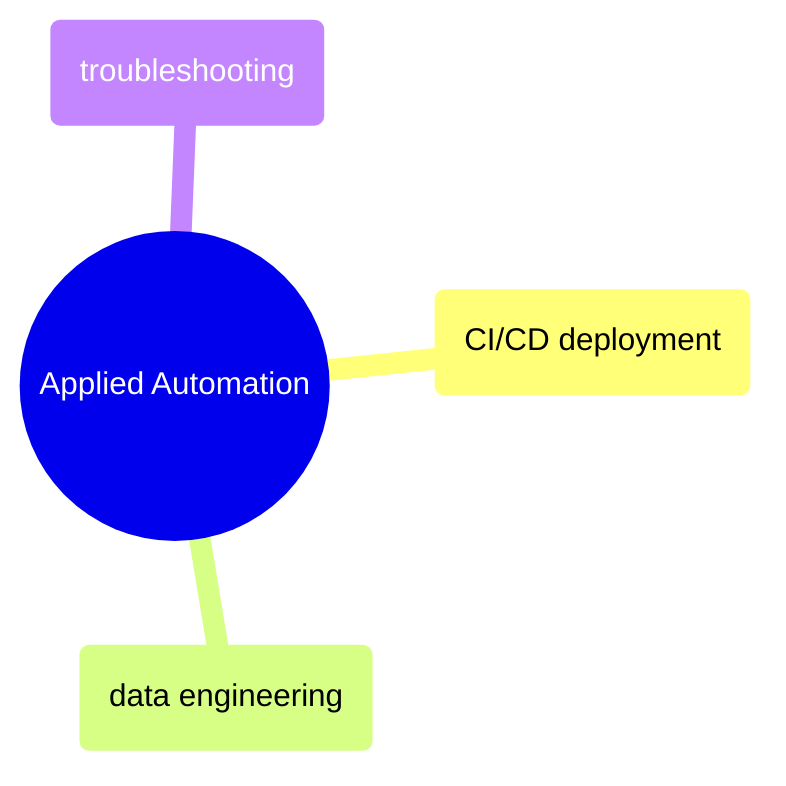

# Applied Automation

Real-world CI/CD deployment, data engineering pipeline automation, and troubleshooting common GitHub Actions failures.

> [!abstract]- [[github-actions-ci-cd]]
>
> - [[github-actions-ci-cd#How GitHub Actions Connects to Git|Git trigger events]]
> - [[github-actions-ci-cd#Monitoring Workflows with GitHub CLI|Monitoring with GitHub CLI]]
> - [[github-actions-ci-cd#Secrets Management|Secrets management]]
> - [[github-actions-ci-cd#Troubleshooting Common Errors|Troubleshooting common errors]]

> [!abstract]- [[github-actions-data-engineering]]
>
> - [[github-actions-data-engineering#CI for Data Pipelines|CI for data pipelines]]
> - [[github-actions-data-engineering#Terraform Automation|Terraform automation]]
> - [[github-actions-data-engineering#dbt CI|dbt CI]]
> - [[github-actions-data-engineering#Data Quality Gates|Data quality gates]]
> - [[github-actions-data-engineering#Workload Identity Federation (Keyless GCP Auth)|Workload Identity Federation]]
> - [[github-actions-data-engineering#Troubleshooting|Troubleshooting]]

> [!abstract]- [[github-actions-problems]]
>
> - [[github-actions-problems#Critical — Production Impact|Critical production impact]]
> - [[github-actions-problems#High — Team Velocity Killers|Team velocity killers]]
> - [[github-actions-problems#Moderate — Operational Pain|Operational pain]]
> - [[github-actions-problems#Low — Annoyances|Low-severity annoyances]]
