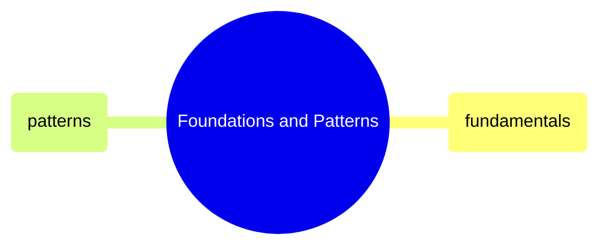

# Foundations and Patterns

GitHub Actions YAML syntax, triggers, jobs, expressions, secrets, caching, matrix builds, reusable workflows, and cost optimization patterns.

> [!abstract]- [[01-github-actions-fundamentals]]
>
> - [[github-actions-fundamentals#Workflow File Anatomy|Workflow file anatomy]]
> - [[github-actions-fundamentals#Triggers (on)|Triggers]]
> - [[github-actions-fundamentals#Jobs|Jobs and runners]]
> - [[github-actions-fundamentals#Expressions and Contexts|Expressions and contexts]]
> - [[github-actions-fundamentals#Secrets|Secrets and GITHUB_TOKEN]]
> - [[github-actions-fundamentals#Caching|Caching and concurrency]]

> [!abstract]- [[02-github-actions-patterns]]
>
> - [[github-actions-patterns#Matrix Builds|Matrix builds]]
> - [[github-actions-patterns#Reusable Workflows|Reusable workflows]]
> - [[github-actions-patterns#Composite Actions|Composite actions]]
> - [[github-actions-patterns#Environment Protection (Staging → Production)|Environment protection]]
> - [[github-actions-patterns#Monorepo: Path Filters|Monorepo path filters]]
> - [[github-actions-patterns#Cost Optimization|Cost optimization]]
