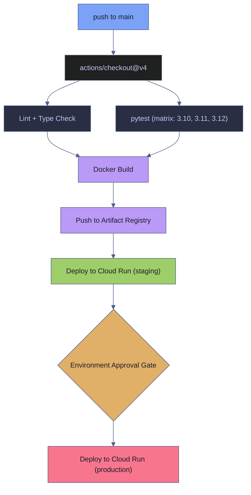

# GitHub Actions CI/CD

> [!quote]
> "If it hurts, do it more frequently, and bring the pain forward."
>
> — **Jez Humble**, *Continuous Delivery* (2010)

GitHub Actions is a CI/CD platform built into GitHub that automates workflows in response to repository events. A **workflow** is a YAML file in `.github/workflows/` that defines one or more **jobs**. Each job runs on a **runner** (a virtual machine — either GitHub-hosted or self-hosted) and contains a sequence of **steps**. A step either runs a shell command (`run:`) or invokes a reusable **action** (`uses:`). GitHub evaluates **expressions** (`${{ }}`) at runtime to inject context values like secrets, event payloads, and matrix variables.

## Triggers and Events

Every workflow begins with an `on:` key that specifies which repository events activate it. GitHub Actions supports over 30 event types. The most common for data engineering CI/CD are listed below.

### Event Types

The `on:` key accepts one or more events. Each event can be further filtered by branch, path, or activity type.

- **`push`** — fires when commits are pushed to a branch. Filter with `branches:` and `paths:` to limit scope. Typical use: deploy on push to `main`.
- **`pull_request`** — fires when a PR is opened, synchronized (new commits pushed), or reopened. Runs against the merge commit, not the PR branch HEAD. Typical use: run tests and linting on every PR (see [pull-requests-and-code-review](https://alp78.github.io/elysium/08-Git/pull-requests-and-code-review) for PR conventions that pair with these checks).
- **`schedule`** — fires on a cron schedule (UTC). Typical use: nightly data refresh at market close. Minimum interval is 5 minutes, but GitHub does not guarantee exact timing under heavy load.
- **`workflow_dispatch`** — manual trigger via the GitHub UI or CLI (`gh workflow run`). Supports input parameters for runtime configuration.
- **`workflow_call`** — allows one workflow to call another as a reusable workflow. The called workflow receives inputs and secrets from the caller.

> [!tip] Path filters reduce wasted builds
> Use `paths:` filters to skip workflows when only unrelated files change. For a monorepo with `pipeline/` and `dashboard/` directories, filter each workflow to its own path. This reduces billable minutes and keeps CI feedback fast.

### Common CI/CD Patterns for Data Teams

These patterns map repository events to automated workflows. Each pattern is implemented as a workflow file in `.github/workflows/`.

- **Push to `main`** → deploy pipeline container and dashboard to [Cloud Run](https://alp78.github.io/elysium/06-GCP/Compute/cloud-run-jobs-vs-services)
- **Pull request** → run unit tests, linting, SQL validation (for dbt-specific checks, see [dbt-ci-cd](https://alp78.github.io/elysium/11-dbt/Operations/dbt-ci-cd))
- **Schedule** (cron) → run data pipeline (e.g., daily at market close)
- **Tag** (`v*`) → create a GitHub Release with changelog
- **Matrix builds** → test across Python 3.10, 3.11, 3.12 in parallel

## Monitoring Workflows

The GitHub CLI (`gh`) provides commands to list, inspect, and re-trigger workflow runs from the terminal. This is faster than navigating the GitHub web UI and enables scripting for automated monitoring.

### List recent runs

`gh run list` displays the most recent workflow runs with their status, conclusion, branch, and run ID.

```bash
gh run list
```

### View run details

`gh run view` shows a summary of a specific run including job names, steps, and durations. Pass the run ID from `gh run list`.

```bash
gh run view 12345
```

### View full logs

The `--log` flag streams the complete step-by-step log output, useful for debugging failures without opening the browser.

```bash
gh run view 12345 --log
```

### Watch a run in real time

`gh run watch` attaches to the most recent in-progress run and streams live output until it completes.

```bash
gh run watch
```

### Trigger a workflow manually

`gh workflow run` dispatches a `workflow_dispatch` event. The workflow must have `workflow_dispatch` configured in its `on:` key.

```bash
gh workflow run deploy.yml
```

## Secrets Management

GitHub Actions secrets are encrypted values stored at the repository or organization level. Workflows reference them using the expression `${{ secrets.SECRET_NAME }}`. GitHub automatically redacts secret values from workflow logs. Secrets are not passed to workflows triggered from forked repositories, including Dependabot PRs — this is an intentional security boundary.

For the broader GCP secrets strategy (Secret Manager, IAM bindings), see [secrets-management](https://alp78.github.io/elysium/06-GCP/Security/secrets-management).

### Managing Secrets with GitHub CLI

The `gh secret` commands manage repository secrets from the terminal. Secret values are write-only — you can set and delete them but never read them back.

#### List configured secrets

`gh secret list` displays the names and last-updated timestamps of all secrets. Values are never shown.

```bash
gh secret list
```

#### Set a secret from a file

`gh secret set` creates or overwrites a secret. The `<` redirect reads the value from a file, avoiding shell history exposure. `GCP_SA_KEY` is the name referenced in workflows as `${{ secrets.GCP_SA_KEY }}`.

```bash
gh secret set GCP_SA_KEY < service-account-key.json
```

#### Set a secret interactively

Without file redirection, `gh secret set` prompts for the value interactively. The input is never visible in shell history.

```bash
gh secret set DD_API_KEY
```

#### Delete a secret

`gh secret delete` permanently removes a secret. Any workflow referencing it will receive an empty string on the next run.

```bash
gh secret delete OLD_SECRET
```

### GCP Authentication

GitHub Actions workflows that interact with GCP (deploying to Cloud Run, pushing to Artifact Registry, running Terraform) must authenticate using the `google-github-actions/auth@v2` action. Two methods are available: service account key JSON (legacy) and Workload Identity Federation (modern, keyless). For GCP IAM fundamentals, see [service-accounts-and-iam](https://alp78.github.io/elysium/06-GCP/Security/service-accounts-and-iam).

#### credentials_json with service account key

The `credentials_json` parameter receives the full JSON content of a service account key stored as a GitHub secret. This is the simpler setup but requires managing and rotating a long-lived credential.

```yaml
steps:
  - uses: google-github-actions/auth@v2
    with:
      credentials_json: ${{ secrets.GCP_SA_KEY }}
```

> [!danger] Missing secret gives cryptic error
> When `GCP_SA_KEY` is missing or empty, the expression `${{ secrets.GCP_SA_KEY }}` resolves to an empty string. The `google-github-actions/auth` action then fails with `must specify exactly one of workload_identity_provider or credentials_json` — not "secret is missing."

> [!success] Verify before debugging auth
> Run `gh secret list` to confirm `GCP_SA_KEY` exists in the repository. If missing, set it with `gh secret set GCP_SA_KEY < your-ci-key.json`. For new projects, prefer Workload Identity Federation over long-lived JSON keys — it eliminates this class of errors entirely.

#### Workload Identity Federation (OIDC)

Workload Identity Federation lets GitHub Actions authenticate to GCP without storing a service account key. The flow works in three steps: (1) GitHub's OIDC provider auto-generates a signed JWT containing claims about the workflow run (repository, branch, environment, actor), (2) GCP validates the JWT claims against the Workload Identity Pool configuration and returns a short-lived access token, (3) the workflow uses that token to call GCP APIs for the job's lifetime. This eliminates secret rotation and reduces the blast radius of a compromised workflow.

> [!todo] Setup steps
> 1. Create a Workload Identity Pool in GCP: `gcloud iam workload-identity-pools create "github-pool" --location="global"`
> 2. Create an OIDC Provider in the pool, mapping GitHub's token claims: `gcloud iam workload-identity-pools providers create-oidc "github-provider" --location="global" --workload-identity-pool="github-pool" --issuer-uri="https://token.actions.githubusercontent.com" --attribute-mapping="google.subject=assertion.sub,attribute.repository=assertion.repository"`
> 3. Grant the `roles/iam.workloadIdentityUser` role on the service account to the pool principal, scoped to a specific repository: `gcloud iam service-accounts add-iam-policy-binding "ci-deploy@PROJECT.iam.gserviceaccount.com" --role="roles/iam.workloadIdentityUser" --member="principalSet://iam.googleapis.com/projects/PROJECT_NUMBER/locations/global/workloadIdentityPools/github-pool/attribute.repository/OWNER/REPO"`
> 4. In the workflow, set `permissions: id-token: write` and use `workload_identity_provider` instead of `credentials_json`.

The workflow step uses the pool provider resource name and the target service account email. The `id-token: write` permission is required for GitHub to issue the OIDC token.

```yaml
permissions:
  contents: read
  id-token: write

steps:
  - uses: google-github-actions/auth@v2
    with:
      workload_identity_provider: "projects/PROJECT_NUMBER/locations/global/workloadIdentityPools/github-pool/providers/github-provider"
      service_account: "ci-deploy@PROJECT_ID.iam.gserviceaccount.com"
```

> [!info] OIDC token scoping
> The `attribute.repository` mapping restricts which GitHub repositories can assume the service account. Without this constraint, any repository with `id-token: write` permission could authenticate. Always scope the IAM binding to a specific `OWNER/REPO`. Additionally, set `--attribute-condition` on the OIDC provider (e.g., `assertion.repository_owner == 'my-org'`) as a second layer of restriction. Note that the `id-token` permission defaults to `none` in both permissive and restricted `GITHUB_TOKEN` modes — the explicit `permissions: id-token: write` declaration is always required. New pools, providers, and IAM bindings can take up to 5 minutes to propagate.

#### Common secrets for GCP projects

These are typical secrets configured for data engineering workflows that deploy to GCP.

| Secret Name | Contents | Used By |
|---|---|---|
| `GCP_SA_KEY` | Service account key JSON (entire file) | `google-github-actions/auth` for GCP authentication (legacy method) |
| `DD_API_KEY` | Datadog API key | Pipeline containers for APM and log shipping |
| `DB_PASSWORD` | Database service account password | Pipeline and dashboard containers |

### Secret Handling Rules

> [!danger] Secret exposure risks
> - Never commit secret files (`.json` keys, `.env`) to Git — add them to `.gitignore` (see [gitignore-patterns](https://alp78.github.io/elysium/08-Git/gitignore-patterns))
> - Secrets are NOT passed to workflows triggered from forks (including Dependabot) — this is a GitHub security feature
> - A missing or mistyped secret resolves to `""` silently — no error, just blank credentials downstream
> - Rotate secrets periodically: delete old key in GCP/Datadog, generate new, update GitHub secret

> [!success] Robust secret management
> Add `.json`, `.env`, and `*.pem` to `.gitignore` before the first commit. Store all secrets in GitHub Settings → Secrets. Use `gh secret list` to audit what is configured. For GCP authentication, prefer Workload Identity Federation to avoid long-lived key rotation entirely.

## CI/CD Pipeline Examples

This section contains complete, runnable workflow files that demonstrate common CI/CD patterns. Each workflow is a standalone `.yml` file in `.github/workflows/`. For Docker image management details, see [image-management](https://alp78.github.io/elysium/09-Docker/image-management).

### Build and Deploy to Cloud Run

This workflow builds a Docker image, pushes it to Artifact Registry, and updates a Cloud Run job on every push to `main`. It also supports manual triggering via `workflow_dispatch`. The single-job design is appropriate when build and deploy are tightly coupled and there is no approval gate.

**Prerequisites:** The `GCP_SA_KEY` secret (or Workload Identity Federation) must be configured. The `PROJECT_ID` variable must be set in repository settings (Settings → Variables). The Artifact Registry repository `data-pipeline` must exist in `europe-west1`.

```yaml
name: Deploy to Cloud Run

on:
  push:
    branches: [main]
  workflow_dispatch:

permissions:
  contents: read
  id-token: write

jobs:
  deploy:
    runs-on: ubuntu-latest
    steps:
      - uses: actions/checkout@v4

      - uses: google-github-actions/auth@v2
        with:
          credentials_json: ${{ secrets.GCP_SA_KEY }}

      - name: Configure Docker for Artifact Registry
        run: gcloud auth configure-docker europe-west1-docker.pkg.dev --quiet

      - name: Build and push image
        run: |
          docker build -t europe-west1-docker.pkg.dev/${{ vars.PROJECT_ID }}/data-pipeline/pipeline:latest .
          docker push europe-west1-docker.pkg.dev/${{ vars.PROJECT_ID }}/data-pipeline/pipeline:latest

      - name: Update Cloud Run job
        run: |
          gcloud run jobs update data-pipeline-pipeline \
            --image europe-west1-docker.pkg.dev/${{ vars.PROJECT_ID }}/data-pipeline/pipeline:latest \
            --region europe-west1
```

> [!info] Key fields
> - `permissions: id-token: write` — required if switching to Workload Identity Federation. With `credentials_json`, only `contents: read` is strictly needed, but setting both prepares for migration.
> - `vars.PROJECT_ID` — a repository-level variable (not a secret), accessed via `${{ vars.* }}`. Unlike secrets, variables are visible in logs.
> - `--quiet` — suppresses interactive prompts in `gcloud`, which would hang in a CI environment.

> [!warning] No concurrency group on this workflow
> Without a `concurrency` key, multiple pushes to `main` in quick succession will run parallel deploys. This can cause race conditions where an older image overwrites a newer deployment.

> [!success] Add a concurrency group
> Add `concurrency: { group: "deploy-prod", cancel-in-progress: true }` at the workflow level to ensure only the latest push deploys.

### Quartz Static Site Deployment to GitHub Pages

This two-job workflow builds the Quartz static site and deploys it to GitHub Pages. The `build` job compiles the site and uploads it as a GitHub Pages artifact. The `deploy` job (gated by `needs: build`) publishes the artifact. This is the actual workflow used by this vault's Quartz site.

**Prerequisites:** GitHub Pages must be enabled in repository settings with "Source" set to "GitHub Actions." The `pages: write` and `id-token: write` permissions are required by the `deploy-pages` action.

```yaml
name: Deploy Quartz to GitHub Pages

on:
  push:
    branches: [main]
  workflow_dispatch:

permissions:
  contents: read
  pages: write
  id-token: write

concurrency:
  group: "pages"
  cancel-in-progress: false

jobs:
  build:
    runs-on: ubuntu-22.04
    steps:
      - uses: actions/checkout@v4
        with:
          fetch-depth: 0

      - uses: actions/setup-node@v4
        with:
          node-version: 22

      - name: Install dependencies
        run: npm ci

      - name: Build Quartz
        run: npx quartz build

      - name: Upload artifact
        uses: actions/upload-pages-artifact@v3
        with:
          path: public

  deploy:
    environment:
      name: github-pages
      url: ${{ steps.deployment.outputs.page_url }}
    runs-on: ubuntu-22.04
    needs: build
    steps:
      - name: Deploy to GitHub Pages
        id: deployment
        uses: actions/deploy-pages@v4
```

> [!info] Key fields
> - `needs: build` — the `deploy` job waits for the `build` job to succeed before starting. This creates a two-node dependency graph: `build → deploy`.
> - `concurrency: { group: "pages", cancel-in-progress: false }` — ensures only one Pages deployment runs at a time. Setting `cancel-in-progress: false` prevents a new push from canceling a deployment already in progress (which could leave the site in a broken state).
> - `fetch-depth: 0` — clones the full Git history. Quartz uses commit timestamps for "last modified" dates on pages.
> - `environment: github-pages` — links this job to a GitHub environment, which enables deployment status tracking and optional protection rules.
> - `upload-pages-artifact` / `deploy-pages` — these are GitHub's official actions for the Pages deployment pipeline. The artifact is passed between jobs implicitly by name.

### Matrix Testing Across Python Versions

A matrix strategy runs the same job multiple times with different variable combinations. GitHub Actions expands the matrix into parallel job instances — one per combination. This workflow tests against Python 3.10, 3.11, and 3.12 on every push and pull request.

**Prerequisites:** A `requirements.txt` file must exist in the repository root. Tests must be in a `tests/` directory and runnable with `pytest`.

```yaml
name: Test Across Python Versions

on: [push, pull_request]

jobs:
  test:
    runs-on: ubuntu-latest
    strategy:
      matrix:
        python-version: ["3.10", "3.11", "3.12"]
      fail-fast: false

    steps:
      - uses: actions/checkout@v4

      - uses: actions/setup-python@v5
        with:
          python-version: ${{ matrix.python-version }}

      - name: Install dependencies
        run: pip install -r requirements.txt

      - name: Run tests
        run: pytest tests/
```

> [!info] Key fields
> - `matrix.python-version` — each value spawns a separate job instance. With 3 versions, GitHub runs 3 parallel jobs. The expression `${{ matrix.python-version }}` resolves to the current iteration's value.
> - `fail-fast: false` — by default, GitHub cancels all remaining matrix jobs when one fails (`fail-fast: true`). Setting `false` lets all versions run to completion, which reveals whether a failure is version-specific or universal.

> [!tip] Cost awareness for matrix builds
> Each matrix job is billed independently. A 3×2 matrix (3 Python versions × 2 OS) creates 6 parallel jobs. Each job start bills a minimum of 1 full minute. OS multipliers apply against included free minutes: Linux 1×, Windows 2×, macOS 10×. Included free minutes per month (Linux-equivalent): Free plan 2,000, Pro/Team 3,000, Enterprise 50,000. Use `paths:` filters to skip matrix builds when only documentation changes. Set `timeout-minutes` on each job — the default hang limit is 6 hours.

## Caching

GitHub Actions caching stores and restores dependency files between workflow runs, avoiding repeated downloads. GitHub-hosted runners start with a clean environment on every job, so without caching, dependencies are re-downloaded each run — increasing network usage, runtime, and cost. Caching is distinct from artifacts: caches accelerate repeated dependency downloads across runs on the same branch, while artifacts persist build outputs for cross-job data passing (default 90-day retention).

### Dependency Caching with actions/cache

The `actions/cache@v4` action saves and restores a directory based on a computed key. On cache hit, the `run: pip install` step completes in seconds instead of minutes. On cache miss, dependencies are installed fresh and the cache is saved at the end of the job. The `cache-hit` output can be used in subsequent steps to skip redundant work.

```yaml
steps:
  - uses: actions/checkout@v4

  - uses: actions/setup-python@v5
    with:
      python-version: "3.12"

  - uses: actions/cache@v4
    id: pip-cache
    with:
      path: ~/.cache/pip
      key: pip-${{ runner.os }}-${{ hashFiles('requirements.txt') }}
      restore-keys: |
        pip-${{ runner.os }}-

  - name: Install dependencies
    run: pip install -r requirements.txt
```

> [!info] Cache key design
> - `hashFiles('requirements.txt')` produces a SHA-256 hash of the file. When dependencies change, the hash changes, busting the cache. Keys can be up to 512 characters.
> - `restore-keys` provides ordered fallback prefixes. If the exact key misses, GitHub restores the most recent cache matching the prefix. This gives a partial hit (most dependencies cached) rather than a full miss.
> - Cache entries expire after 7 days of no access. The total cache size per repository is limited to 10 GB — oldest entries are evicted first. Monitor usage under Actions → Caches in the repository UI.

> [!warning] Cache key misses cause slow builds
> If the cache key never matches (e.g., using a timestamp or run ID in the key), every run installs dependencies from scratch. Always base cache keys on dependency lock files (`requirements.txt`, `package-lock.json`, `poetry.lock`). Caches are not portable across operating systems — a cache built on `ubuntu-latest` cannot be restored on `windows-latest`. For matrix builds, include `${{ matrix.python-version }}` in the key so each cell has its own cache bucket.

> [!success] Use hashFiles for proper invalidation
> Base the key on `hashFiles()` of your lock file. This ensures cache hits when dependencies haven't changed and automatic invalidation when they have. Use `if: steps.pip-cache.outputs.cache-hit != 'true'` on install steps to skip them entirely on exact cache hits.

### Setup Actions with Built-in Caching

Many `setup-*` actions include built-in cache management, requiring less configuration than the explicit `actions/cache` action. These actions automatically determine the cache path and key for their package manager.

| Package Manager | Setup Action | Cache Parameter |
|---|---|---|
| pip, pipenv, Poetry | `actions/setup-python@v5` | `cache: 'pip'` |
| npm, Yarn, pnpm | `actions/setup-node@v4` | `cache: 'npm'` |
| Gradle, Maven | `actions/setup-java@v4` | `cache: 'gradle'` |
| Go modules | `actions/setup-go@v5` | `cache: true` |
| RubyGems | `ruby/setup-ruby@v1` | `bundler-cache: true` |

### Docker Layer Caching

Docker builds in CI can reuse layer caches from previous runs using the GitHub Actions cache backend. The `docker/build-push-action` supports this via the `cache-from` and `cache-to` parameters with `type=gha`. This avoids rebuilding unchanged layers on each push.

```yaml
- uses: docker/build-push-action@v5
  with:
    push: true
    tags: europe-west1-docker.pkg.dev/project/repo/image:latest
    cache-from: type=gha
    cache-to: type=gha,mode=max
```

> [!warning] Docker layer caches consume significant storage
> The `mode=max` setting caches all layers (not just the final image layers), which maximizes hit rates but uses more of the 10 GB repository cache quota. Monitor cache usage and consider `mode=min` if storage pressure is high.

> [!success] Use mode=min for constrained repos
> If other caches (pip, npm) compete for the 10 GB limit, use `cache-to: type=gha,mode=min` to cache only the final image layers.

> [!danger] Never store secrets in caches
> Cache contents are accessible to any workflow run, including runs triggered by fork PRs. Never place access tokens, credentials, or sensitive configuration in cached directories.

## Concurrency

Concurrency groups prevent duplicate workflow runs from executing simultaneously. This is critical for deployment workflows where parallel runs can cause race conditions (e.g., two Cloud Run deployments overwriting each other).

### Concurrency Groups

The `concurrency` key at the workflow or job level assigns runs to a named group. Only one run per group executes at a time. Pending runs either queue or cancel depending on the `cancel-in-progress` setting.

```yaml
concurrency:
  group: deploy-${{ github.ref }}
  cancel-in-progress: true
```

The `group` name is an expression. Using `${{ github.ref }}` creates a separate group per branch, so a deploy from `main` and a deploy from `staging` can run simultaneously, but two pushes to `main` will not.

When `cancel-in-progress: true`, a new run cancels any in-progress run in the same group. Set to `false` for deployments where interruption could leave the target in a broken state (as in the Quartz Pages example above). Group names are case-insensitive. At most one running and one pending job exist per group at any time — an incoming job always cancels any existing pending job in the group regardless of the `cancel-in-progress` setting.

### Common Concurrency Patterns

| Use Case | `group` Expression | `cancel-in-progress` |
|---|---|---|
| CI — cancel on new push | `${{ github.workflow }}-${{ github.ref }}` | `true` |
| Per-PR isolation | `${{ github.workflow }}-${{ github.head_ref }}` | `true` |
| Cancel PRs only, protect main | `${{ github.workflow }}-${{ github.ref }}` | `${{ startsWith(github.ref, 'refs/pull/') }}` |
| Deployment (no interruption) | `deploy-prod` (static) | `false` |

> [!warning] Group name collisions across workflows
> Concurrency group names are shared across all workflows in a repository. If two workflows use the same group name (e.g., `deploy`), they will cancel each other's runs unintentionally. Always include `${{ github.workflow }}` in CI groups.

> [!success] Namespace groups by workflow
> Use `${{ github.workflow }}-${{ github.ref }}` as the default pattern. This isolates each workflow and each branch into its own concurrency lane.

## Environment Protection Rules

GitHub environments add approval gates and deployment controls to workflows. A job that declares `environment: production` must pass all protection rules configured on that environment before executing.

### Configuring Environments

Environments are created in repository settings (Settings → Environments → New environment). Protection rules include:

- **Required reviewers** — up to 6 users or teams; only one approval is needed to proceed. GitHub pauses the workflow and sends a notification. A "prevent self-review" option is available.
- **Wait timer** — a mandatory delay (1–43,200 minutes / 30 days) before the job executes, even after approval. Waiting jobs do not consume billable runner minutes. There is no built-in approval timeout — the job waits indefinitely until approved or cancelled.
- **Deployment branches** — restricts which branches can deploy to the environment. Three modes: no restriction, protected branches only, or a custom named list. For `production`, limit to `main` only.

> [!warning] Plan availability for private repositories
> Required reviewers and wait timers are only available for **public repositories** on Free/Pro/Team plans. For **private repositories**, these features require GitHub Enterprise Cloud or Enterprise Server. Deployment branch policies are available on Pro/Team for private repos.

> [!success] Check your plan before configuring
> Verify your repository's plan in Settings → General → Danger Zone. For private repos without Enterprise, use branch protection rules and manual `workflow_dispatch` triggers as an alternative approval mechanism.

```yaml
jobs:
  deploy-prod:
    runs-on: ubuntu-latest
    environment:
      name: production
      url: https://app.example.com
    needs: deploy-staging
    steps:
      - uses: actions/checkout@v4
      - name: Deploy to production
        run: echo "Deploying to production"
```

> [!info] Environment secrets
> Each environment can have its own secrets, separate from repository secrets. A job running in the `production` environment accesses `${{ secrets.PROD_DB_PASSWORD }}` — even if a secret with the same name exists at the repo level, the environment secret takes precedence.

> [!question] Environment-per-stage vs environment-per-branch
> **Environment-per-stage** (`staging`, `production`) maps environments to deployment targets. A single branch (`main`) deploys through stages sequentially. This is the standard pattern for most teams.
> **Environment-per-branch** (`dev`, `feature-x`) maps environments to Git branches. Each branch deploys to its own isolated environment. This suits teams that need preview environments for every PR but adds infrastructure cost.

## Pre-commit Hooks

Pre-commit hooks run locally before `git commit`, catching formatting and linting issues before they reach CI. This reduces failed workflow runs and keeps PRs clean. Pre-commit is a local developer tool, not a GitHub Actions feature, but it complements CI workflows by shifting quality checks left.

### Configuration

The `.pre-commit-config.yaml` file at the repository root defines which hooks to run. Each hook is pinned to a specific version (`rev:`) for reproducibility.

```yaml
repos:
  - repo: https://github.com/pre-commit/pre-commit-hooks
    rev: v4.5.0
    hooks:
      - id: trailing-whitespace
      - id: end-of-file-fixer
      - id: check-yaml
      - id: check-added-large-files

  - repo: https://github.com/psf/black
    rev: 24.1.1
    hooks:
      - id: black

  - repo: https://github.com/PyCQA/flake8
    rev: 7.0.0
    hooks:
      - id: flake8
```

> [!todo] Installation
> 1. Install pre-commit: `pip install pre-commit`
> 2. Install the hooks into the local repo: `pre-commit install`
> 3. Run against all files (first time): `pre-commit run --all-files`
> 4. From this point, hooks run automatically on every `git commit`

## Troubleshooting

This section covers common GitHub Actions errors and their resolution. For workflow debugging commands, see the Monitoring Workflows section above.

### Auth failure with google-github-actions/auth

**Symptom:** `must specify exactly one of workload_identity_provider or credentials_json`

**Cause:** The `GCP_SA_KEY` secret is missing, empty, or not accessible to the workflow. GitHub Actions secrets are not passed to workflows triggered from forks (including Dependabot PRs).

**Resolution:**

Verify the secret exists and re-run the failed workflow.

```bash
gh secret list
```

If `GCP_SA_KEY` is missing, set it from the service account key file.

```bash
gh secret set GCP_SA_KEY < your-ci-key.json
```

Re-run the failed workflow. The `--failed` flag re-runs only the jobs that failed, preserving successful job results.

```bash
gh run rerun <RUN_ID> --failed
```

> [!info] Fork and Dependabot PRs
> If the workflow was triggered by a fork or Dependabot, secrets are intentionally blocked by GitHub. Merge the PR first — the push-to-main workflow will have access to secrets.

### Re-running Failed Workflows

`gh run rerun` re-triggers a completed workflow run. Without `--failed`, it re-runs all jobs. With `--failed`, it re-runs only the jobs that failed, which is faster and cheaper.

```bash
gh run rerun <RUN_ID>
```

To re-run only failed jobs:

```bash
gh run rerun <RUN_ID> --failed
```

To watch the re-run in real time:

```bash
gh run watch
```

## Security Best Practices

GitHub Actions workflows execute arbitrary code with access to secrets and cloud credentials. The patterns below address the most common supply chain and credential risks.

> [!danger] Third-party actions pinned to tags
> Pinning actions to version tags (`@v2`, `@v4`) trusts the maintainer not to push malicious code to that tag. Tags are mutable — a compromised maintainer can overwrite `v2` with a backdoored release. This is a supply chain attack vector.

> [!success] Pin actions to commit SHAs
> Pin critical actions (especially authentication) to a full commit SHA: `uses: google-github-actions/auth@v2.1.2` or better, `uses: google-github-actions/auth@<full-sha>`. Use Dependabot or Renovate to automate SHA updates when new versions are released.

> [!danger] pull_request_target with untrusted checkout
> The `pull_request_target` event runs with write permissions and access to secrets, even for PRs from forks. If the workflow checks out the PR's code (`actions/checkout@v4` with `ref: ${{ github.event.pull_request.head.sha }}`), a malicious PR can exfiltrate secrets via a modified build script.

> [!success] Never check out PR code in pull_request_target
> Use `pull_request_target` only for labeling, commenting, or other operations that do not execute PR code. If you need to build/test fork PRs with secrets, use a two-workflow pattern: `pull_request` for untrusted CI, then a maintainer-approved workflow for deployment.

> [!danger] Overly permissive GITHUB_TOKEN
> By default, the `GITHUB_TOKEN` has broad permissions. A compromised action step could push code, create releases, or modify issues.

> [!success] Restrict with the permissions key
> Always declare explicit `permissions:` at the workflow level with the minimum required scopes. Start with `permissions: {}` (no permissions) and add only what each job needs. For a deploy workflow: `contents: read` and `id-token: write`.

> [!question] GitHub-hosted vs self-hosted runners
> **GitHub-hosted** runners are fully managed, ephemeral VMs. Each job gets a clean environment — no state persists between runs. Billing is per-minute ($0.008/min for Linux, $0.016/min for Windows, $0.08/min for macOS on the Team plan). Best for most CI/CD workloads.
> **Self-hosted** runners are machines you manage. Common use cases: access to resources behind a company firewall, licensed software, GPU-enabled hardware, or large disks for data processing. They persist between jobs by default, which means faster startup but also retained state (files, processes, credentials from previous runs).

> [!danger] Self-hosted runner security risks
> - **Never use self-hosted runners with public repositories.** Forks can trigger PR workflows that execute arbitrary code on your infrastructure.
> - Steps run as the same unprivileged user as the runner agent, but with **passwordless `sudo`** — a significant privilege escalation vector.
> - Runners do not auto-clean between jobs. A malicious step can install software, exfiltrate data, or modify subsequent jobs.
> - The runner communicates outbound-only on HTTPS port 443 via long polling (no inbound ports needed), but a compromised workflow can make unauthorized external connections.

> [!success] Self-hosted runner hardening
> - Use the `--ephemeral` flag on `config.sh` to create **just-in-time runners** that deregister after one job, eliminating state persistence.
> - Use **runner groups** (Team/Enterprise plan) to restrict which repositories and workflow paths can target specific runners.
> - Consider **StepSecurity** for declarative network policy enforcement: block-by-default outbound connections with centralized logging.
> - For Kubernetes-based teams, use auto-scaling ephemeral runners (e.g., Actions Runner Controller) that spin up a fresh pod per job.

## Pipeline Architecture

This diagram shows a typical CI/CD pipeline for a data engineering project, from code push to production deployment.



## Related

**GitHub Actions chapter:**
- [[github-actions-fundamentals]] — YAML syntax, triggers, runners, and core concepts
- [[github-actions-patterns]] — reusable workflows, composite actions, advanced patterns

**Git (Chapter 08):**
- [pull-requests-and-code-review](https://alp78.github.io/elysium/08-Git/pull-requests-and-code-review) — PR events that trigger workflows
- [gitignore-patterns](https://alp78.github.io/elysium/08-Git/gitignore-patterns) — preventing secret files from reaching Git

**Docker (Chapter 09):**
- [image-management](https://alp78.github.io/elysium/09-Docker/image-management) — Docker build/push commands used in deploy workflows

**Terraform (Chapter 07):**
- [terraform-plan-apply-destroy](https://alp78.github.io/elysium/07-Terraform/Fundamentals/terraform-plan-apply-destroy) — Terraform plan/apply steps orchestrated by workflows
- [terraform-registry-and-ci](https://alp78.github.io/elysium/07-Terraform/GCP-Resources/terraform-registry-and-ci) — CI service account and Artifact Registry setup

**GCP (Chapter 06):**
- [service-accounts-and-iam](https://alp78.github.io/elysium/06-GCP/Security/service-accounts-and-iam) — IAM fundamentals and Workload Identity Federation
- [secrets-management](https://alp78.github.io/elysium/06-GCP/Security/secrets-management) — GCP Secret Manager for application secrets
- [cloud-run-jobs-vs-services](https://alp78.github.io/elysium/06-GCP/Compute/cloud-run-jobs-vs-services) — Cloud Run deployment targets

**dbt (Chapter 11):**
- [dbt-ci-cd](https://alp78.github.io/elysium/11-dbt/Operations/dbt-ci-cd) — dbt-specific CI checks in GitHub Actions

## References

- [GitHub Actions documentation](https://docs.github.com/en/actions)
- [google-github-actions/auth](https://github.com/google-github-actions/auth)
- [GitHub CLI run commands](https://cli.github.com/manual/gh_run)
- [Workflow syntax for GitHub Actions](https://docs.github.com/en/actions/reference/workflow-syntax-for-github-actions)
- [actions/cache documentation](https://github.com/actions/cache)
- [GitHub Actions environments](https://docs.github.com/en/actions/deployment/targeting-different-environments/using-environments-for-deployment)
- [Configuring OIDC in GCP](https://docs.github.com/en/actions/security-for-github-actions/security-hardening-your-deployments/configuring-openid-connect-in-google-cloud-platform)
- [Security hardening for GitHub Actions](https://docs.github.com/en/actions/security-for-github-actions/security-hardening-your-deployments)
