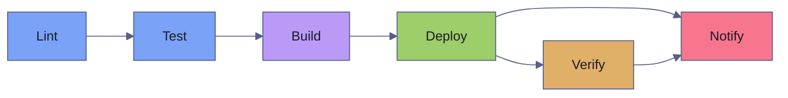

# GitHub Actions for Data Engineering

> [!quote]
> "Improving daily work is even more important than doing daily work."
>
> — **Gene Kim**, *The Phoenix Project* (2013)

This file contains production-ready GitHub Actions workflows for data engineering teams. Each workflow is a complete, runnable `.yml` file. The patterns cover the full lifecycle: linting and testing Python pipelines, validating SQL, deploying containers to Cloud Run, running Terraform, executing dbt builds in CI, enforcing data quality gates, and authenticating to GCP with Workload Identity Federation. For GitHub Actions fundamentals (triggers, runners, expressions), see [github-actions-ci-cd](https://alp78.github.io/elysium/10-GitHub-Actions/github-actions-ci-cd).

## CI for Data Pipelines

CI workflows run on every push and pull request to catch regressions before code reaches `main`. The workflows below implement a multi-job pipeline: lint first (fast feedback), then test (gated by lint success), then integration test (gated by unit tests, only on `main`). Each job uses a separate service account following the principle of least privilege — CI jobs get read-only access while deploy jobs get write access.

### Full Python Lint + Test Workflow

This workflow implements a complete CI pipeline for a Python data project: linting with ruff, SQL validation with sqlfluff, unit tests with pytest and coverage, and integration tests against live GCP resources. The four jobs run with dependencies: `lint` and `validate-sql` run in parallel, `test` waits for `lint`, and `integration-test` waits for `test` and only runs on pushes to `main`.

**Prerequisites:** `WIF_PROVIDER` and `WIF_SA_CI` secrets for GCP authentication (integration tests only). A `pyproject.toml` with `[dev]` extras including pytest, pytest-cov. SQL files in a `sql/` directory.

The workflow file lives at `.github/workflows/pipeline-ci.yml`.

```yaml
name: Pipeline CI

on:
  push:
    branches: [main, develop]
    paths:
      - "pipelines/**"
      - "src/**"
      - "tests/**"
      - "pyproject.toml"
      - "requirements*.txt"
  pull_request:
    branches: [main]
    types: [opened, synchronize, reopened]

env:
  PYTHON_VERSION: "3.12"

permissions:
  contents: read
  pull-requests: write
  checks: write

concurrency:
  group: ${{ github.workflow }}-${{ github.ref }}
  cancel-in-progress: true

jobs:
  lint:
    name: Lint & Format
    runs-on: ubuntu-latest
    timeout-minutes: 10
    steps:
      - uses: actions/checkout@v4

      - uses: actions/setup-python@v5
        with:
          python-version: ${{ env.PYTHON_VERSION }}
          cache: pip

      - name: Install ruff
        run: pip install ruff

      - name: Ruff lint
        run: ruff check . --output-format=github

      - name: Ruff format check
        run: ruff format --check .

  validate-sql:
    name: Validate SQL
    runs-on: ubuntu-latest
    timeout-minutes: 10
    steps:
      - uses: actions/checkout@v4

      - name: Find SQL files
        id: find-sql
        run: |
          COUNT=$(find sql/ -name "*.sql" | wc -l)
          echo "count=$COUNT" >> $GITHUB_OUTPUT

      - name: Validate SQL syntax (sqlfluff)
        if: steps.find-sql.outputs.count != '0'
        run: |
          pip install sqlfluff
          sqlfluff lint sql/ --dialect bigquery --format github-annotation

  test:
    name: Test
    runs-on: ubuntu-latest
    needs: [lint]
    timeout-minutes: 30
    steps:
      - uses: actions/checkout@v4

      - uses: actions/setup-python@v5
        with:
          python-version: ${{ env.PYTHON_VERSION }}
          cache: pip

      - uses: actions/cache@v4
        with:
          path: .venv
          key: venv-${{ runner.os }}-py${{ env.PYTHON_VERSION }}-${{ hashFiles('pyproject.toml') }}

      - name: Install dependencies
        run: |
          python -m venv .venv
          . .venv/bin/activate
          pip install -e ".[dev]"

      - name: Run unit tests
        run: |
          . .venv/bin/activate
          pytest tests/unit/ \
            --cov=src \
            --cov-report=xml \
            --cov-report=term-missing \
            --junit-xml=test-results.xml \
            -v \
            --tb=short

      - name: Upload test results
        uses: actions/upload-artifact@v4
        if: always()
        with:
          name: test-results
          path: test-results.xml
          retention-days: 7

      - name: Upload coverage
        uses: actions/upload-artifact@v4
        with:
          name: coverage
          path: coverage.xml
          retention-days: 7

  integration-test:
    name: Integration Tests
    runs-on: ubuntu-latest
    needs: test
    if: github.event_name == 'push' && github.ref == 'refs/heads/main'
    timeout-minutes: 30
    permissions:
      id-token: write
      contents: read
    steps:
      - uses: actions/checkout@v4

      - uses: google-github-actions/auth@v2
        with:
          workload_identity_provider: ${{ secrets.WIF_PROVIDER }}
          service_account: ${{ secrets.WIF_SA_CI }}

      - uses: actions/setup-python@v5
        with:
          python-version: ${{ env.PYTHON_VERSION }}
          cache: pip

      - run: pip install -e ".[dev]"

      - name: Run integration tests
        run: |
          pytest tests/integration/ \
            --timeout=120 \
            -v \
            --tb=short
        env:
          GCP_PROJECT: ${{ secrets.GCP_PROJECT }}
          BQ_DATASET: ci_test_${{ github.run_id }}
```

> [!info] Key fields
> - `paths:` filter — the workflow only triggers when files in `pipelines/`, `src/`, `tests/`, or dependency files change. Documentation-only changes skip CI entirely.
> - `concurrency: cancel-in-progress: true` — a new push to the same branch cancels any in-progress CI run, saving billable minutes on rapid iteration.
> - `cache: pip` on `setup-python` — uses the built-in pip cache, restoring `~/.cache/pip` between runs.
> - `needs: [lint]` on the `test` job — unit tests only run if linting passes, providing fast feedback on style violations.
> - `if: github.event_name == 'push' && github.ref == 'refs/heads/main'` — integration tests run only on pushes to `main`, not on PRs. This avoids running expensive GCP-authenticated tests on every PR push.
> - `BQ_DATASET: ci_test_${{ github.run_id }}` — creates a unique BigQuery dataset per run, preventing test interference across concurrent runs.
> - `--output-format=github` on ruff — formats lint violations as GitHub annotations, which appear inline on the PR diff.
> - `GITHUB_OUTPUT` — the `echo "key=value" >> $GITHUB_OUTPUT` syntax sets step outputs that subsequent steps and jobs can read via `${{ steps.<id>.outputs.<key> }}`.

> [!tip] Separate service accounts per workflow
> Use dedicated service accounts for each concern: `WIF_SA_CI` (read-only BigQuery access for tests), `WIF_SA_DEPLOY` (Cloud Run deploy permissions), `WIF_SA_DBT_CI` (BigQuery write for ephemeral schemas). This limits blast radius if any single workflow is compromised.

### SQL Validation: BigQuery Dry-Run

This job validates SQL files against the BigQuery parser without executing them. The `bq query --dry_run` flag checks syntax, resolves table references, and validates column types against the live schema — catching errors that a local linter would miss. This is a job fragment that belongs under the `jobs:` key of a CI workflow.

**Prerequisites:** `WIF_PROVIDER` and `WIF_SA_CI` secrets. The `setup-gcloud` action installs the `bq` CLI. SQL files must be in a `sql/` directory.

```yaml
  validate-bq-sql:
    name: BigQuery SQL Dry-Run
    runs-on: ubuntu-latest
    permissions:
      id-token: write
      contents: read
    steps:
      - uses: actions/checkout@v4

      - uses: google-github-actions/auth@v2
        with:
          workload_identity_provider: ${{ secrets.WIF_PROVIDER }}
          service_account: ${{ secrets.WIF_SA_CI }}

      - uses: google-github-actions/setup-gcloud@v2

      - name: Dry-run SQL files
        run: |
          ERRORS=0
          for f in $(find sql/ -name "*.sql"); do
            echo "Validating $f..."
            bq query \
              --project_id=${{ secrets.GCP_PROJECT }} \
              --dry_run \
              --use_legacy_sql=false \
              "$(cat $f)" || ERRORS=$((ERRORS+1))
          done
          if [ $ERRORS -gt 0 ]; then
            echo "::error::$ERRORS SQL file(s) failed validation"
            exit 1
          fi
```

> [!tip] Dry-run also estimates cost
> The `--dry_run` flag not only validates syntax but returns the number of bytes the query would process. This can be used to catch unexpectedly expensive queries in CI before they run against production datasets.

> [!info] `::error::` annotations
> The `::error::` prefix in `echo` statements creates GitHub workflow annotations. These appear as error markers in the Actions log and, for `pull_request` events, display inline on the PR diff. The format is `::error file={path},line={n}::{message}`.

### SQL Validation: SQL Server PARSEONLY

This job spins up a SQL Server 2022 container as a GitHub Actions service and validates SQL files using `SET PARSEONLY ON`, which checks syntax without executing the query. This catches parse errors, missing table references (when schemas are pre-loaded), and T-SQL syntax violations. The companion Python script iterates over all `.sql` files and reports failures as GitHub annotations.

**Prerequisites:** SQL files in a `sql/` directory. No external secrets needed — the SQL Server container is ephemeral and local to the runner.

> [!info] Service containers
> The `services:` key starts Docker containers alongside the job runner. GitHub creates them before the first step and tears them down after the last. The `options:` field passes Docker `--health-*` flags that make the job wait until the container is healthy before proceeding. Port mapping (`1433:1433`) exposes the container to `localhost` on the runner.

```yaml
  validate-sql-server:
    name: SQL Server PARSEONLY
    runs-on: ubuntu-latest
    services:
      sqlserver:
        image: mcr.microsoft.com/mssql/server:2022-latest
        env:
          ACCEPT_EULA: Y
          SA_PASSWORD: TestPassword123!
        ports:
          - 1433:1433
        options: >-
          --health-cmd "/opt/mssql-tools/bin/sqlcmd -S localhost -U sa -P TestPassword123! -Q 'SELECT 1'"
          --health-interval 10s
          --health-timeout 5s
          --health-retries 10
    steps:
      - uses: actions/checkout@v4
      - name: Validate SQL syntax
        run: |
          pip install pyodbc
          python scripts/validate_sql_parseonly.py sql/
```

The validation script (`scripts/validate_sql_parseonly.py`) connects to the ephemeral SQL Server, wraps each SQL file in `SET PARSEONLY ON/OFF`, and collects failures.

```python
import os, sys, glob
import pyodbc

conn = pyodbc.connect(
    "DRIVER={ODBC Driver 18 for SQL Server};"
    "SERVER=localhost;UID=sa;PWD=TestPassword123!;"
    "TrustServerCertificate=yes"
)
cursor = conn.cursor()

errors = []
for path in glob.glob(f"{sys.argv[1]}/**/*.sql", recursive=True):
    sql = open(path).read()
    try:
        cursor.execute(f"SET PARSEONLY ON; {sql}; SET PARSEONLY OFF;")
    except Exception as e:
        errors.append(f"{path}: {e}")

for e in errors:
    print(f"::error::{e}")
sys.exit(len(errors))
```

> [!danger] Hardcoded password in service container
> The `SA_PASSWORD` is visible in the workflow YAML file committed to the repository. This is acceptable for ephemeral CI containers that are destroyed after each run and contain no real data. Never reuse this password for non-ephemeral databases.

> [!success] Use environment-scoped secrets for real databases
> For integration tests against persistent databases, store the password in GitHub Secrets and reference it as `${{ secrets.SQL_SA_PASSWORD }}` in both the `services.sqlserver.env` and the connection string.

## CD for Cloud Run

CD (Continuous Delivery) workflows deploy validated code to cloud infrastructure. This two-job workflow builds a Docker image, pushes it to Artifact Registry, deploys to [Cloud Run](https://alp78.github.io/elysium/06-GCP/Compute/cloud-run-jobs-vs-services), and verifies the deployment with a health check. For Docker image management details, see [image-management](https://alp78.github.io/elysium/09-Docker/image-management).

### Build and Deploy Pipeline

The `build` job produces a tagged Docker image and passes its name to the `deploy` job via `outputs:`. The `deploy` job uses `google-github-actions/deploy-cloudrun@v2` to update the Cloud Run service, then runs a health check with retry logic.

**Prerequisites:** `WIF_PROVIDER` and `WIF_SA_DEPLOY` secrets. An Artifact Registry repository. A Cloud Run service already created (the workflow updates, not creates). The `production` environment configured in GitHub with optional protection rules.

The workflow file lives at `.github/workflows/deploy-cloud-run.yml`.

```yaml
name: Deploy Data Pipeline to Cloud Run

on:
  push:
    branches: [main]
    paths:
      - "src/**"
      - "Dockerfile"
      - "pyproject.toml"

env:
  PROJECT_ID: my-data-project
  REGION: us-central1
  SERVICE: data-pipeline
  REGISTRY: us-central1-docker.pkg.dev
  REPO: data-pipelines

permissions:
  contents: read
  id-token: write

concurrency:
  group: deploy-production
  cancel-in-progress: false

jobs:
  build:
    name: Build & Push
    runs-on: ubuntu-latest
    outputs:
      image: ${{ steps.image.outputs.value }}
    steps:
      - uses: actions/checkout@v4

      - name: Auth to GCP
        uses: google-github-actions/auth@v2
        with:
          workload_identity_provider: ${{ secrets.WIF_PROVIDER }}
          service_account: ${{ secrets.WIF_SA_DEPLOY }}

      - name: Docker auth
        run: gcloud auth configure-docker ${{ env.REGISTRY }} --quiet

      - uses: docker/setup-buildx-action@v3

      - uses: actions/cache@v4
        with:
          path: /tmp/.buildx-cache
          key: buildx-${{ github.sha }}
          restore-keys: buildx-

      - name: Set image name
        id: image
        run: |
          IMAGE="${{ env.REGISTRY }}/${{ env.PROJECT_ID }}/${{ env.REPO }}/${{ env.SERVICE }}:${{ github.sha }}"
          echo "value=$IMAGE" >> $GITHUB_OUTPUT

      - name: Build and push
        uses: docker/build-push-action@v5
        with:
          context: .
          push: true
          tags: |
            ${{ steps.image.outputs.value }}
            ${{ env.REGISTRY }}/${{ env.PROJECT_ID }}/${{ env.REPO }}/${{ env.SERVICE }}:latest
          cache-from: type=local,src=/tmp/.buildx-cache
          cache-to: type=local,dest=/tmp/.buildx-cache-new,mode=max

      - run: rm -rf /tmp/.buildx-cache && mv /tmp/.buildx-cache-new /tmp/.buildx-cache

  deploy:
    name: Deploy to Cloud Run
    needs: build
    runs-on: ubuntu-latest
    environment:
      name: production
      url: ${{ steps.deploy.outputs.url }}
    steps:
      - name: Auth to GCP
        uses: google-github-actions/auth@v2
        with:
          workload_identity_provider: ${{ secrets.WIF_PROVIDER }}
          service_account: ${{ secrets.WIF_SA_DEPLOY }}

      - name: Deploy
        id: deploy
        uses: google-github-actions/deploy-cloudrun@v2
        with:
          service: ${{ env.SERVICE }}
          region: ${{ env.REGION }}
          image: ${{ needs.build.outputs.image }}
          flags: >-
            --memory=2Gi
            --cpu=2
            --min-instances=0
            --max-instances=5
            --concurrency=10
            --timeout=3600
            --no-allow-unauthenticated
          env_vars: |
            ENVIRONMENT=production
            GCP_PROJECT=${{ env.PROJECT_ID }}
            LOG_LEVEL=INFO

      - name: Health check
        run: |
          URL="${{ steps.deploy.outputs.url }}/health"
          for i in 1 2 3; do
            STATUS=$(curl -s -o /dev/null -w "%{http_code}" \
              -H "Authorization: Bearer $(gcloud auth print-identity-token)" \
              "$URL")
            [ "$STATUS" = "200" ] && echo "Health OK" && exit 0
            echo "Attempt $i: HTTP $STATUS — retrying in 10s..."
            sleep 10
          done
          echo "::error::Health check failed after 3 attempts"
          exit 1
```

> [!info] Key fields
> - `outputs: image:` — the `build` job exposes the full image URI as an output. The `deploy` job reads it via `${{ needs.build.outputs.image }}`. This is the standard pattern for passing data between jobs.
> - `cancel-in-progress: false` — never cancel an in-flight deployment. A cancelled deploy could leave the service in an inconsistent state.
> - `cache-from/cache-to: type=local` with the rotate pattern (`rm old && mv new old`) — BuildKit caches grow unbounded. The rotation ensures only the latest cache is preserved, preventing cache directory bloat.
> - `--no-allow-unauthenticated` — the Cloud Run service requires authentication. Callers must present an identity token obtained via `gcloud auth print-identity-token`.
> - `environment: production` — links this job to a GitHub environment, enabling protection rules (required reviewers, wait timers) configured in repository settings.

## Terraform Automation

These workflows implement the plan-on-PR, apply-on-merge pattern for infrastructure changes. The plan output is posted as a PR comment for review. On merge to `main`, the apply runs automatically against the `production` environment. For Terraform fundamentals, see [terraform-plan-apply-destroy](https://alp78.github.io/elysium/07-Terraform/Fundamentals/terraform-plan-apply-destroy).

### Terraform Plan as PR Comment

This workflow runs `terraform init`, `validate`, and `plan` on every PR that touches the `infra/` directory, then posts the plan output as a collapsible PR comment. If a previous plan comment exists, it updates it in place rather than creating duplicates.

**Prerequisites:** `WIF_PROVIDER` and `TF_SA` secrets. Terraform state backend configured (GCS bucket). The `infra/` directory containing Terraform configuration. `pull-requests: write` permission for the PR comment.

The workflow file lives at `.github/workflows/terraform-ci.yml`.

```yaml
name: Terraform CI

on:
  pull_request:
    paths: ["infra/**"]

permissions:
  contents: read
  pull-requests: write
  id-token: write

jobs:
  plan:
    runs-on: ubuntu-latest
    defaults:
      run:
        working-directory: infra/
    steps:
      - uses: actions/checkout@v4

      - uses: hashicorp/setup-terraform@v3
        with:
          terraform_version: "1.7.0"
          terraform_wrapper: false   # needed to capture plan output

      - uses: google-github-actions/auth@v2
        with:
          workload_identity_provider: ${{ secrets.WIF_PROVIDER }}
          service_account: ${{ secrets.TF_SA }}

      - name: Init
        run: terraform init -input=false

      - name: Validate
        run: terraform validate -no-color

      - name: Plan
        id: plan
        run: |
          terraform plan -no-color -input=false -out=tfplan 2>&1 | tee plan.txt
          echo "exitcode=${PIPESTATUS[0]}" >> $GITHUB_OUTPUT
        continue-on-error: true

      - name: Comment Plan
        uses: actions/github-script@v7
        with:
          script: |
            const fs = require('fs');
            const plan = fs.readFileSync('infra/plan.txt', 'utf8');
            const truncated = plan.length > 60000
              ? plan.substring(0, 60000) + '\n\n... [truncated]'
              : plan;
            const outcome = '${{ steps.plan.outputs.exitcode }}';
            const icon = outcome === '0' ? '✅' : outcome === '2' ? '⚠️' : '❌';

            const body = `## ${icon} Terraform Plan

            | Step | Result |
            |------|--------|
            | Init | ✅ |
            | Validate | ✅ |
            | Plan | ${icon} exitcode \`${outcome}\` |

            <details><summary>Plan output</summary>

            \`\`\`hcl
            ${truncated}
            \`\`\`

            </details>

            *SHA: \`${{ github.sha }}\` | [Run](${{ github.server_url }}/${{ github.repository }}/actions/runs/${{ github.run_id }})*`;

            const { data: comments } = await github.rest.issues.listComments({
              owner: context.repo.owner,
              repo: context.repo.repo,
              issue_number: context.issue.number
            });

            const existing = comments.find(c =>
              c.user.type === 'Bot' && c.body.includes('Terraform Plan'));

            const params = {
              owner: context.repo.owner,
              repo: context.repo.repo,
              body
            };

            if (existing) {
              await github.rest.issues.updateComment({
                ...params,
                comment_id: existing.id
              });
            } else {
              await github.rest.issues.createComment({
                ...params,
                issue_number: context.issue.number
              });
            }

      - name: Fail on error
        if: steps.plan.outputs.exitcode == '1'
        run: exit 1

      - uses: actions/upload-artifact@v4
        with:
          name: tfplan
          path: infra/tfplan
          retention-days: 7
```

> [!info] Key fields
> - `terraform_wrapper: false` — disables the Terraform wrapper script that the `setup-terraform` action normally installs. Without this, `terraform plan` output is wrapped in additional metadata that corrupts the PR comment.
> - `continue-on-error: true` on the Plan step — allows the workflow to continue to the Comment step even if the plan fails. The exit code is captured via `PIPESTATUS[0]` and checked in the final "Fail on error" step.
> - `defaults.run.working-directory: infra/` — all `run:` steps in this job execute from the `infra/` directory, avoiding `cd infra/` in every step.
> - The `actions/github-script@v7` step uses the GitHub REST API to create or update a PR comment. It searches for an existing comment containing "Terraform Plan" and updates it in place, preventing comment spam on PRs with multiple pushes.

> [!warning] `continue-on-error: true` masks real failures
> The Plan step uses `continue-on-error: true` so the PR comment is always posted. However, if the "Fail on error" step is accidentally removed or the exit code check is wrong, plan failures will silently pass. Always verify the final gate step exists.

> [!success] Separate the gate from the comment
> The pattern shown here — capture exit code, always comment, then fail at the end — is the correct approach. Never rely solely on `continue-on-error` without a final exit code check.

### Terraform Apply on Merge

This workflow runs `terraform apply -auto-approve` on every push to `main` that changes the `infra/` directory. The `-auto-approve` flag skips interactive confirmation, which is safe because the plan was already reviewed in the PR. The `environment: production` gate can require manual approval before the apply runs.

**Prerequisites:** Same `WIF_PROVIDER` and `TF_SA` secrets as the plan workflow. The Terraform state backend must be configured. The `production` environment should have protection rules (required reviewers) for safety.

The workflow file lives at `.github/workflows/terraform-apply.yml`.

```yaml
name: Terraform Apply

on:
  push:
    branches: [main]
    paths: ["infra/**"]

permissions:
  contents: read
  id-token: write

jobs:
  apply:
    runs-on: ubuntu-latest
    environment: production
    defaults:
      run:
        working-directory: infra/
    steps:
      - uses: actions/checkout@v4
      - uses: hashicorp/setup-terraform@v3
        with:
          terraform_version: "1.7.0"
      - uses: google-github-actions/auth@v2
        with:
          workload_identity_provider: ${{ secrets.WIF_PROVIDER }}
          service_account: ${{ secrets.TF_SA }}
      - run: terraform init -input=false
      - run: terraform apply -auto-approve -input=false -no-color
```

> [!danger] Auto-approve without environment protection
> Without a `production` environment protection rule (required reviewers), every merge to `main` that touches `infra/` immediately applies Terraform changes. A misconfigured resource could be destroyed before anyone reviews the plan.

> [!success] Require approval on the production environment
> Configure the `production` environment in GitHub settings with at least one required reviewer. The `apply` job will pause and wait for approval, giving the team a final gate before infrastructure changes take effect.

## dbt CI

These workflows implement the [dbt CI/CD patterns](https://alp78.github.io/elysium/11-dbt/Operations/dbt-ci-cd) specific to BigQuery. The core pattern: run `dbt build` against an ephemeral CI schema named after the run ID, verify results, then clean up the schema. This prevents CI runs from polluting production datasets.

### dbt Build Against Dev Schema

This workflow runs on every PR that touches the `dbt/` directory. It installs dbt-bigquery, authenticates via WIF, runs `dbt deps` → `dbt parse` → `dbt build` against a CI-specific schema, generates documentation artifacts, cleans up the ephemeral schema, and posts results as a PR comment.

**Prerequisites:** `WIF_PROVIDER`, `WIF_SA_DBT_CI`, and `GCP_PROJECT` secrets. A `dbt/profiles.yml` with a `ci` target pointing to the CI schema. The dbt project must be in a `dbt/` directory.

The workflow file lives at `.github/workflows/dbt-ci.yml`.

```yaml
name: dbt CI

on:
  pull_request:
    branches: [main]
    paths:
      - "dbt/**"
      - ".github/workflows/dbt-ci.yml"

permissions:
  contents: read
  pull-requests: write
  id-token: write

jobs:
  dbt-ci:
    runs-on: ubuntu-latest
    timeout-minutes: 30
    env:
      DBT_PROJECT_DIR: dbt/
      DBT_TARGET: ci
    steps:
      - uses: actions/checkout@v4

      - uses: actions/setup-python@v5
        with:
          python-version: "3.12"
          cache: pip

      - uses: actions/cache@v4
        with:
          path: ~/.cache/pip
          key: dbt-${{ hashFiles('dbt/requirements.txt') }}

      - run: pip install dbt-bigquery

      - uses: google-github-actions/auth@v2
        with:
          workload_identity_provider: ${{ secrets.WIF_PROVIDER }}
          service_account: ${{ secrets.WIF_SA_DBT_CI }}

      - name: dbt deps
        working-directory: ${{ env.DBT_PROJECT_DIR }}
        run: dbt deps

      - name: dbt parse (syntax check)
        working-directory: ${{ env.DBT_PROJECT_DIR }}
        run: dbt parse --target ${{ env.DBT_TARGET }}

      - name: dbt build (CI schema)
        working-directory: ${{ env.DBT_PROJECT_DIR }}
        run: |
          dbt build \
            --target ${{ env.DBT_TARGET }} \
            --vars "{'ci_schema': 'dbt_ci_${{ github.run_id }}'}" \
            --exclude tag:skip_ci
        env:
          DBT_BIGQUERY_PROJECT: ${{ secrets.GCP_PROJECT }}

      - name: dbt docs generate
        working-directory: ${{ env.DBT_PROJECT_DIR }}
        run: dbt docs generate --target ${{ env.DBT_TARGET }}
        if: always()

      - name: Upload dbt artifacts
        uses: actions/upload-artifact@v4
        if: always()
        with:
          name: dbt-artifacts
          path: |
            dbt/target/run_results.json
            dbt/target/manifest.json
          retention-days: 7

      - name: Clean up CI schema
        if: always()
        working-directory: ${{ env.DBT_PROJECT_DIR }}
        run: |
          bq rm -r -f --dataset \
            "${{ secrets.GCP_PROJECT }}:dbt_ci_${{ github.run_id }}" || true

      - name: Comment dbt results on PR
        if: always() && github.event_name == 'pull_request'
        uses: actions/github-script@v7
        with:
          script: |
            const fs = require('fs');
            const results = JSON.parse(
              fs.readFileSync('dbt/target/run_results.json', 'utf8'));
            const total = results.results.length;
            const passed = results.results.filter(r => r.status === 'success' || r.status === 'pass').length;
            const failed = total - passed;
            const icon = failed === 0 ? '✅' : '❌';
            const body = `## ${icon} dbt CI Results
            | Metric | Value |
            |--------|-------|
            | Total | ${total} |
            | Passed | ${passed} |
            | Failed | ${failed} |
            | Duration | ${results.elapsed_time.toFixed(1)}s |`;
            github.rest.issues.createComment({
              owner: context.repo.owner,
              repo: context.repo.repo,
              issue_number: context.issue.number,
              body
            });
```

> [!info] Key fields
> - `--vars "{'ci_schema': 'dbt_ci_${{ github.run_id }}'}"` — passes the ephemeral schema name as a dbt variable. The `ci` target in `profiles.yml` should use this variable as the schema name, ensuring each run writes to an isolated dataset.
> - `--exclude tag:skip_ci` — skips models tagged `skip_ci` (e.g., expensive full-refresh models not suited for CI).
> - `if: always()` — the cleanup, docs generation, and PR comment steps run even if `dbt build` fails. This ensures the ephemeral schema is always deleted and results are always posted.
> - `|| true` on `bq rm` — prevents the cleanup step from failing the workflow if the dataset doesn't exist (e.g., if `dbt build` failed before creating any tables).

> [!warning] Ephemeral schema cleanup can fail silently
> If the `bq rm` command fails (e.g., due to a permission issue) and `|| true` swallows the error, orphaned CI datasets accumulate in BigQuery. These consume storage and can confuse analysts.

> [!success] Monitor orphaned CI datasets
> Add a scheduled workflow that queries `INFORMATION_SCHEMA.SCHEMATA` for datasets matching `dbt_ci_*` older than 24 hours and deletes them. This catches any cleanup failures.

> [!tip] dbt slim CI with state-based selection
> For large dbt projects, use `--select state:modified+` with a deferred manifest from the production run. This builds only models that changed in the PR and their downstream dependents, reducing CI time from minutes to seconds. Requires storing the production `manifest.json` as a workflow artifact or in a GCS bucket.

## Data Quality Gates

Data quality gates run automated checks against live data to verify pipeline outputs. They typically run on a schedule (after overnight pipelines complete) or on-demand via `workflow_dispatch`. When a check fails, the workflow sends an alert (Slack, PagerDuty) and exits non-zero to mark the run as failed.

### Great Expectations

This workflow runs a [Great Expectations](https://greatexpectations.io/) checkpoint against a BigQuery datasource on a daily schedule and on manual trigger. On failure, it sends a Slack alert with a link to the workflow run.

**Prerequisites:** `WIF_PROVIDER` and `WIF_SA_GE` secrets. A configured Great Expectations project in the repository with a `daily_quality_checkpoint`. A `SLACK_WEBHOOK` secret for failure alerts.

The workflow file lives at `.github/workflows/data-quality.yml`.

```yaml
name: Data Quality Gate

on:
  schedule:
    - cron: "0 7 * * *"
  workflow_dispatch:
    inputs:
      datasource:
        type: string
        required: true
        default: "daily_aggregates"

permissions:
  id-token: write
  contents: read

jobs:
  validate:
    runs-on: ubuntu-latest
    timeout-minutes: 30
    steps:
      - uses: actions/checkout@v4

      - uses: actions/setup-python@v5
        with:
          python-version: "3.12"
          cache: pip

      - run: pip install great-expectations[bigquery]

      - uses: google-github-actions/auth@v2
        with:
          workload_identity_provider: ${{ secrets.WIF_PROVIDER }}
          service_account: ${{ secrets.WIF_SA_GE }}

      - name: Run Great Expectations checkpoint
        id: ge
        run: |
          great_expectations checkpoint run daily_quality_checkpoint \
            --datasource-name "${{ inputs.datasource || 'daily_aggregates' }}" \
            2>&1 | tee ge_output.txt
          echo "exitcode=${PIPESTATUS[0]}" >> $GITHUB_OUTPUT
        continue-on-error: true

      - name: Upload validation results
        uses: actions/upload-artifact@v4
        if: always()
        with:
          name: ge-results
          path: great_expectations/uncommitted/data_docs/
          retention-days: 7

      - name: Alert on failure
        if: steps.ge.outputs.exitcode != '0'
        run: |
          curl -X POST '${{ secrets.SLACK_WEBHOOK }}' \
            -H 'Content-type: application/json' \
            --data '{
              "text": "Data quality gate FAILED for ${{ inputs.datasource || '\''daily_aggregates'\'' }}",
              "attachments": [{
                "color": "danger",
                "text": "Run: ${{ github.server_url }}/${{ github.repository }}/actions/runs/${{ github.run_id }}"
              }]
            }'
          exit 1
```

### Custom SQL Checks

For teams that don't use Great Expectations, a lightweight alternative is a Python script that runs SQL assertions directly against BigQuery. Each check defines a query, an assertion function, and a failure message. The script reports results as GitHub annotations. This is a job fragment that belongs under the `jobs:` key of the data quality workflow.

```yaml
  custom-sql-checks:
    runs-on: ubuntu-latest
    permissions:
      id-token: write
      contents: read
    steps:
      - uses: actions/checkout@v4
      - uses: google-github-actions/auth@v2
        with:
          workload_identity_provider: ${{ secrets.WIF_PROVIDER }}
          service_account: ${{ secrets.WIF_SA_CI }}
      - uses: google-github-actions/setup-gcloud@v2

      - name: Run SQL quality checks
        run: python scripts/run_sql_checks.py
        env:
          GCP_PROJECT: ${{ secrets.GCP_PROJECT }}
```

The check script (`scripts/run_sql_checks.py`) defines assertion-based checks against BigQuery tables. Each check queries for a condition and asserts the result. Failures are reported as `::error::` annotations.

```python
from google.cloud import bigquery
import json, sys, os

client = bigquery.Client(project=os.environ["GCP_PROJECT"])

CHECKS = [
    {
        "name": "no_null_user_ids",
        "sql": "SELECT COUNT(*) as cnt FROM `project.dataset.events` WHERE user_id IS NULL",
        "assertion": lambda cnt: cnt == 0,
        "message": "Found NULL user_ids in events table",
    },
    {
        "name": "row_count_today",
        "sql": """SELECT COUNT(*) as cnt FROM `project.dataset.events`
                  WHERE DATE(event_timestamp) = CURRENT_DATE()""",
        "assertion": lambda cnt: cnt > 1000,
        "message": "Event count below threshold (expected >1000)",
    },
    {
        "name": "no_duplicate_events",
        "sql": """SELECT MAX(cnt) as max_cnt FROM (
                    SELECT event_id, COUNT(*) as cnt
                    FROM `project.dataset.events`
                    GROUP BY event_id HAVING COUNT(*) > 1
                  )""",
        "assertion": lambda cnt: cnt is None or cnt == 0,
        "message": "Duplicate event_ids detected",
    },
]

failures = []
for check in CHECKS:
    result = client.query(check["sql"]).result()
    row = next(iter(result))
    value = row[0]
    if not check["assertion"](value):
        failures.append(f"FAILED [{check['name']}]: {check['message']} (value={value})")
        print(f"::error::{check['name']}: {check['message']} (value={value})")
    else:
        print(f"PASSED [{check['name']}]: value={value}")

sys.exit(len(failures))
```

### Airflow DAG Validation

Validating [DAG structure](https://alp78.github.io/elysium/12-Orchestration/Airflow/airflow-dag-patterns) in CI catches import errors and dependency cycles before they reach the scheduler. The workflow installs Airflow with version constraints, imports every DAG file via `DagBag`, and runs structural assertion tests. This prevents broken DAGs from reaching the Airflow scheduler.

**Prerequisites:** DAG files in a `dags/` directory. Airflow plugins in `plugins/`. A `requirements-airflow.txt` for caching. Structural tests in `tests/dag_tests/`.

The workflow file lives at `.github/workflows/dag-validation.yml`.

```yaml
name: Airflow DAG Validation

on:
  pull_request:
    paths:
      - "dags/**"
      - "plugins/**"

jobs:
  validate-dags:
    runs-on: ubuntu-latest
    timeout-minutes: 10
    steps:
      - uses: actions/checkout@v4

      - uses: actions/setup-python@v5
        with:
          python-version: "3.12"
          cache: pip

      - uses: actions/cache@v4
        with:
          path: ~/.cache/pip
          key: airflow-${{ hashFiles('requirements-airflow.txt') }}

      - name: Install Airflow (constrained)
        run: |
          AIRFLOW_VERSION=2.9.0
          PYTHON_VERSION=$(python --version | cut -d' ' -f2 | cut -d'.' -f1,2)
          CONSTRAINT_URL="https://raw.githubusercontent.com/apache/airflow/constraints-${AIRFLOW_VERSION}/constraints-${PYTHON_VERSION}.txt"
          pip install "apache-airflow==${AIRFLOW_VERSION}" \
            --constraint "$CONSTRAINT_URL"

      - name: Syntax check (import)
        run: |
          export AIRFLOW_HOME=$(pwd)/airflow_home
          airflow db init
          ERRORS=0
          for dag_file in $(find dags/ -name "*.py"); do
            echo "Checking $dag_file..."
            python -c "
          import importlib.util, sys
          spec = importlib.util.spec_from_file_location('dag', '$dag_file')
          mod = importlib.util.module_from_spec(spec)
          spec.loader.exec_module(mod)
          print('OK')
          " || ERRORS=$((ERRORS+1))
          done
          exit $ERRORS

      - name: Load DAGs test
        run: |
          export AIRFLOW_HOME=$(pwd)/airflow_home
          python -c "
          from airflow.models import DagBag
          bag = DagBag(dag_folder='dags/', include_examples=False)
          if bag.import_errors:
              for path, err in bag.import_errors.items():
                  print(f'::error file={path}::{err}')
              raise SystemExit(len(bag.import_errors))
          print(f'Loaded {len(bag.dags)} DAG(s) successfully')
          "

      - name: DAG structure tests
        run: pytest tests/dag_tests/ -v
```

> [!info] Key fields
> - Airflow is installed with **constraint files** matching the exact Airflow version and Python version. Without constraints, pip may install incompatible dependency versions that cause import errors unrelated to the DAG code.
> - `airflow db init` creates a local SQLite metadata database. This is required before `DagBag` can parse DAGs — Airflow needs a metadata store even for static analysis.
> - `DagBag(dag_folder='dags/', include_examples=False)` imports all Python files in the folder and reports `import_errors` — a dict of `{file_path: error_message}`. This catches missing dependencies, syntax errors, and circular imports.
> - The three validation steps are progressive: syntax check (can Python import the file?), load test (can Airflow parse DAG objects?), structure tests (do DAGs meet team conventions like timeout settings, owner tags, SLA definitions?).

> [!tip] DAG structure tests: operator whitelisting
> The `tests/dag_tests/` directory should include parametrized pytest tests that enforce team conventions. A common pattern: load all DAGs via `DagBag`, iterate over tasks, and assert each `task.task_type` is in an `ALLOWED_OPERATORS` list. This prevents unauthorized operators (e.g., `BashOperator` in a team that mandates `PythonOperator` or `KubernetesPodOperator`) from reaching production.

> [!question] Great Expectations vs dbt tests
> **Great Expectations** is a standalone data validation framework with broad connector support (BigQuery, Postgres, files, dataframes), rich profiling, and auto-generated data documentation. Best for teams that need cross-pipeline validation or don't use dbt.
> **dbt tests** are narrower but deeply integrated into the dbt workflow — schema tests (`unique`, `not_null`, `accepted_values`, `relationships`) run as part of `dbt build`. Best for teams already using dbt where most validation is column-level. Both tools complement each other: dbt tests for model-level assertions, GE for cross-dataset and business-rule validation.

## Workload Identity Federation (Keyless GCP Auth)

Workload Identity Federation (WIF) lets GitHub Actions authenticate to GCP using OIDC tokens instead of long-lived service account keys. GitHub issues a signed JWT for each workflow run, which GCP exchanges for short-lived credentials. This eliminates key rotation, prevents accidental key exposure, and reduces blast radius. For the conceptual overview, see the OIDC section in [github-actions-ci-cd](https://alp78.github.io/elysium/10-GitHub-Actions/github-actions-ci-cd). For GCP IAM fundamentals, see [service-accounts-and-iam](https://alp78.github.io/elysium/06-GCP/Security/service-accounts-and-iam).

> [!info] No more JSON keys
> With WIF configured, workflows use `workload_identity_provider` + `service_account` instead of `credentials_json`. No secrets to rotate, no JSON files to store.

> [!danger] Missing attribute_condition risk
>
> The `--attribute-condition` in the OIDC provider setup restricts which GitHub repositories can request tokens. If you omit this condition or set it to a wildcard, ANY public GitHub repository can authenticate as your service account and access your GCP resources. Always restrict to your specific org/repo: `assertion.repository=='my-org/my-repo'`. For additional safety, add `assertion.ref=='refs/heads/main'` to restrict to the main branch only.

> [!success] Correct attribute_condition pattern
>
> Always set `--attribute-condition="assertion.repository=='my-org/my-repo'"` when creating the OIDC provider. For production deployments, add a second condition on the branch: `assertion.ref=='refs/heads/main'`. This ensures only your specific repository on the main branch can exchange tokens — no other repository can impersonate your service account.

### One-Time GCP Setup

> [!info] WIF setup steps (run once per project)
> 1. Create a Workload Identity Pool
> 2. Create an OIDC Provider with attribute mapping and repository condition
> 3. Create a dedicated service account for CI
> 4. Bind the SA to the Workload Identity Pool for your repository
> 5. Grant the SA necessary IAM roles (e.g., `roles/bigquery.dataEditor`)
> 6. Get the provider resource name and save it as GitHub secret `WIF_PROVIDER`

```bash
PROJECT_ID="my-project"
PROJECT_NUMBER=$(gcloud projects describe $PROJECT_ID --format='value(projectNumber)')
POOL_ID="github-actions"
PROVIDER_ID="github-provider"
SA_EMAIL="gh-actions-ci@${PROJECT_ID}.iam.gserviceaccount.com"
REPO="my-org/my-repo"

gcloud iam workload-identity-pools create $POOL_ID \
  --project=$PROJECT_ID \
  --location=global \
  --display-name="GitHub Actions Pool"

gcloud iam workload-identity-pools providers create-oidc $PROVIDER_ID \
  --project=$PROJECT_ID \
  --location=global \
  --workload-identity-pool=$POOL_ID \
  --display-name="GitHub Provider" \
  --attribute-mapping="google.subject=assertion.sub,attribute.repository=assertion.repository,attribute.actor=assertion.actor,attribute.ref=assertion.ref" \
  --attribute-condition="assertion.repository=='${REPO}'" \
  --issuer-uri="https://token.actions.githubusercontent.com"

gcloud iam service-accounts create gh-actions-ci \
  --project=$PROJECT_ID \
  --display-name="GitHub Actions CI"

gcloud iam service-accounts add-iam-policy-binding $SA_EMAIL \
  --project=$PROJECT_ID \
  --role="roles/iam.workloadIdentityUser" \
  --member="principalSet://iam.googleapis.com/projects/${PROJECT_NUMBER}/locations/global/workloadIdentityPools/${POOL_ID}/attribute.repository/${REPO}"

gcloud projects add-iam-policy-binding $PROJECT_ID \
  --member="serviceAccount:${SA_EMAIL}" \
  --role="roles/bigquery.dataEditor"

gcloud iam workload-identity-pools providers describe $PROVIDER_ID \
  --project=$PROJECT_ID \
  --location=global \
  --workload-identity-pool=$POOL_ID \
  --format='value(name)'
```

### GitHub Secrets to Set

| Secret Name | Value |
|-------------|-------|
| `WIF_PROVIDER` | Full provider resource name from step 6 |
| `WIF_SA` | `gh-actions-ci@my-project.iam.gserviceaccount.com` |

### Using in Workflow

After the one-time setup, any workflow can authenticate by adding `permissions: id-token: write` and the `google-github-actions/auth@v2` step with the provider and service account. After authentication, `gcloud` and Google Cloud client libraries (Python, Node.js, Go) automatically use Application Default Credentials (ADC) provided by the auth action.

```yaml
permissions:
  id-token: write
  contents: read

steps:
  - uses: google-github-actions/auth@v2
    with:
      workload_identity_provider: ${{ secrets.WIF_PROVIDER }}
      service_account: ${{ secrets.WIF_SA }}

  - run: gcloud storage ls gs://my-bucket/
  - run: python pipeline.py
```

### Restricting by Branch or Tag

For production service accounts, restrict the IAM binding to a specific branch. This prevents feature branches from deploying to production even if they have the `id-token: write` permission.

```bash
gcloud iam service-accounts add-iam-policy-binding $SA_EMAIL \
  --role="roles/iam.workloadIdentityUser" \
  --member="principalSet://iam.googleapis.com/projects/${PROJECT_NUMBER}/locations/global/workloadIdentityPools/${POOL_ID}/attribute.ref/refs/heads/main"
```

## Operational Workflows

These workflows automate recurring operational tasks: secret rotation and cost monitoring. They typically run on a schedule and send alerts to Slack.

### Secret Rotation

This workflow rotates a secret in GCP Secret Manager on a monthly schedule and updates the corresponding GitHub secret. The `secret-rotation` environment requires manual approval before the rotation proceeds. For GCP Secret Manager details, see [secrets-management](https://alp78.github.io/elysium/06-GCP/Security/secrets-management).

**Prerequisites:** `WIF_PROVIDER` and `WIF_SA_SECRET_MANAGER` secrets. A `GH_PAT` (personal access token) with `secrets:write` scope for updating GitHub secrets programmatically. A `SLACK_WEBHOOK` secret for notifications. The `secret-rotation` environment with required reviewers.

The workflow file lives at `.github/workflows/rotate-secrets.yml`.

```yaml
name: Rotate Secrets

on:
  schedule:
    - cron: "0 2 1 * *"
  workflow_dispatch:
    inputs:
      secret_name:
        type: string
        required: true

permissions:
  id-token: write
  contents: read

jobs:
  rotate:
    runs-on: ubuntu-latest
    environment: secret-rotation
    steps:
      - uses: actions/checkout@v4

      - uses: google-github-actions/auth@v2
        with:
          workload_identity_provider: ${{ secrets.WIF_PROVIDER }}
          service_account: ${{ secrets.WIF_SA_SECRET_MANAGER }}

      - uses: google-github-actions/setup-gcloud@v2

      - name: Rotate secret in Secret Manager
        run: |
          SECRET="${{ inputs.secret_name || 'my-api-key' }}"
          NEW_VALUE=$(python scripts/generate_secret.py)
          echo -n "$NEW_VALUE" | gcloud secrets versions add $SECRET --data-file=-

      - name: Update GitHub secret
        uses: actions/github-script@v7
        env:
          NEW_VALUE: ${{ steps.generate.outputs.value }}
        with:
          github-token: ${{ secrets.GH_PAT }}
          script: |
            const { execSync } = require('child_process');
            execSync(`gh secret set MY_API_KEY --body "$NEW_VALUE"`, {
              env: { ...process.env, GH_TOKEN: process.env.GITHUB_TOKEN }
            });

      - name: Notify rotation complete
        run: |
          curl -X POST '${{ secrets.SLACK_WEBHOOK }}' \
            -d '{"text":"Secret rotation complete for ${{ inputs.secret_name }}"}'
```

### Cost Monitoring

This workflow queries the GCP billing export in BigQuery on weekday mornings and sends a cost summary to Slack. If total spend exceeds a threshold, the message includes an alert. This provides daily visibility into cloud costs without requiring access to the billing console.

**Prerequisites:** `WIF_PROVIDER` and `WIF_SA_BILLING` secrets. A BigQuery billing export configured (the `gcp_billing_export_v1_*` table). `BILLING_PROJECT`, `BILLING_DATASET`, and `SLACK_COST_WEBHOOK` secrets.

The workflow file lives at `.github/workflows/cost-monitor.yml`.

```yaml
name: BigQuery Cost Monitor

on:
  schedule:
    - cron: "0 9 * * 1-5"
  workflow_dispatch:

permissions:
  id-token: write
  contents: read

jobs:
  cost-report:
    runs-on: ubuntu-latest
    steps:
      - uses: actions/checkout@v4

      - uses: google-github-actions/auth@v2
        with:
          workload_identity_provider: ${{ secrets.WIF_PROVIDER }}
          service_account: ${{ secrets.WIF_SA_BILLING }}

      - uses: actions/setup-python@v5
        with:
          python-version: "3.12"
          cache: pip

      - run: pip install google-cloud-bigquery pandas

      - name: Query billing
        id: billing
        run: python scripts/bq_cost_report.py
        env:
          BILLING_PROJECT: ${{ secrets.BILLING_PROJECT }}
          BILLING_DATASET: ${{ secrets.BILLING_DATASET }}
          SLACK_WEBHOOK: ${{ secrets.SLACK_COST_WEBHOOK }}
          THRESHOLD_USD: "100"
```

The report script (`scripts/bq_cost_report.py`) queries the billing export, formats a Slack message, and sends it via webhook. The `THRESHOLD_USD` environment variable controls the alert threshold.

```python
from google.cloud import bigquery
import os, json
import urllib.request

client = bigquery.Client(project=os.environ["BILLING_PROJECT"])
threshold = float(os.environ.get("THRESHOLD_USD", "100"))

query = f"""
SELECT
  service.description AS service,
  ROUND(SUM(cost), 2) AS total_cost_usd,
  ROUND(SUM(cost) / 30, 2) AS daily_avg_usd
FROM `{os.environ["BILLING_PROJECT"]}.{os.environ["BILLING_DATASET"]}.gcp_billing_export_v1_*`
WHERE DATE(_PARTITIONTIME) >= DATE_SUB(CURRENT_DATE(), INTERVAL 30 DAY)
GROUP BY 1
ORDER BY 2 DESC
LIMIT 10
"""

results = list(client.query(query).result())
total = sum(r.total_cost_usd for r in results)

lines = [f"*GCP Cost Report — Last 30 days*", f"Total: *${total:.2f}*", ""]
for r in results:
    lines.append(f"• {r.service}: ${r.total_cost_usd:.2f} (${r.daily_avg_usd:.2f}/day)")

alert = " :rotating_light: *Over threshold!*" if total > threshold else ""
message = {"text": "\n".join(lines) + alert}

req = urllib.request.Request(
    os.environ["SLACK_WEBHOOK"],
    data=json.dumps(message).encode(),
    headers={"Content-Type": "application/json"}
)
urllib.request.urlopen(req)
print(f"Cost report sent. Total: ${total:.2f}")
```

## End-to-End Pipeline

This workflow combines CI and CD into a single file with conditional job execution. On pull requests, only lint and test run (CI). On pushes to `main`, the full pipeline runs: lint → test → build → deploy → verify → notify. The `if:` condition on the `build` job gates CD behind a `main` push, so PR workflows never trigger deployments.

**Prerequisites:** All secrets from the CI and CD workflows above. The `production` environment with protection rules. A `scripts/smoke_test.py` script for post-deploy verification.

The workflow file lives at `.github/workflows/e2e-pipeline.yml`.

```yaml
name: End-to-End Pipeline

on:
  push:
    branches: [main]
  pull_request:
    branches: [main]

env:
  PYTHON_VERSION: "3.12"
  SERVICE: data-pipeline
  REGION: us-central1
  PROJECT: my-data-project
  REGISTRY: us-central1-docker.pkg.dev
  REPO: data

permissions:
  contents: read
  pull-requests: write
  id-token: write
  checks: write

concurrency:
  group: ${{ github.workflow }}-${{ github.ref }}
  cancel-in-progress: ${{ github.event_name == 'pull_request' }}

jobs:
  # ─── CI ───────────────────────────────────────────────────────────
  lint:
    name: Lint
    runs-on: ubuntu-latest
    timeout-minutes: 10
    steps:
      - uses: actions/checkout@v4
      - uses: actions/setup-python@v5
        with:
          python-version: ${{ env.PYTHON_VERSION }}
          cache: pip
      - run: pip install ruff
      - run: ruff check . --output-format=github
      - run: ruff format --check .

  test:
    name: Test
    runs-on: ubuntu-latest
    needs: lint
    timeout-minutes: 20
    steps:
      - uses: actions/checkout@v4
      - uses: actions/setup-python@v5
        with:
          python-version: ${{ env.PYTHON_VERSION }}
          cache: pip
      - run: pip install -e ".[dev]"
      - run: pytest tests/unit/ --cov=src --cov-report=xml -v
      - uses: actions/upload-artifact@v4
        with:
          name: coverage
          path: coverage.xml

  # ─── CD (only on main) ───────────────────────────────────────────
  build:
    name: Build
    runs-on: ubuntu-latest
    needs: test
    if: github.ref == 'refs/heads/main' && github.event_name == 'push'
    outputs:
      image: ${{ steps.image.outputs.value }}
    steps:
      - uses: actions/checkout@v4
      - id: image
        run: echo "value=${{ env.REGISTRY }}/${{ env.PROJECT }}/${{ env.REPO }}/${{ env.SERVICE }}:${{ github.sha }}" >> $GITHUB_OUTPUT
      - uses: google-github-actions/auth@v2
        with:
          workload_identity_provider: ${{ secrets.WIF_PROVIDER }}
          service_account: ${{ secrets.WIF_SA }}
      - run: gcloud auth configure-docker ${{ env.REGISTRY }} --quiet
      - uses: docker/setup-buildx-action@v3
      - uses: actions/cache@v4
        with:
          path: /tmp/.buildx-cache
          key: buildx-${{ github.sha }}
          restore-keys: buildx-
      - uses: docker/build-push-action@v5
        with:
          context: .
          push: true
          tags: ${{ steps.image.outputs.value }}
          cache-from: type=local,src=/tmp/.buildx-cache
          cache-to: type=local,dest=/tmp/.buildx-cache-new,mode=max
      - run: rm -rf /tmp/.buildx-cache && mv /tmp/.buildx-cache-new /tmp/.buildx-cache

  deploy:
    name: Deploy
    runs-on: ubuntu-latest
    needs: build
    environment:
      name: production
      url: ${{ steps.deploy.outputs.url }}
    steps:
      - uses: google-github-actions/auth@v2
        with:
          workload_identity_provider: ${{ secrets.WIF_PROVIDER }}
          service_account: ${{ secrets.WIF_SA }}
      - uses: google-github-actions/deploy-cloudrun@v2
        id: deploy
        with:
          service: ${{ env.SERVICE }}
          region: ${{ env.REGION }}
          image: ${{ needs.build.outputs.image }}

  verify:
    name: Verify
    runs-on: ubuntu-latest
    needs: deploy
    steps:
      - uses: actions/checkout@v4
      - uses: google-github-actions/auth@v2
        with:
          workload_identity_provider: ${{ secrets.WIF_PROVIDER }}
          service_account: ${{ secrets.WIF_SA }}
      - run: pip install requests
      - name: Smoke test
        run: python scripts/smoke_test.py
        env:
          SERVICE_URL: ${{ needs.deploy.outputs.url }}

  notify:
    name: Notify
    runs-on: ubuntu-latest
    needs: [deploy, verify]
    if: always()
    steps:
      - name: Slack notification
        run: |
          STATUS="${{ needs.verify.result }}"
          if [ "$STATUS" = "success" ]; then
            COLOR="good"
            TEXT="Deployment successful: ${{ env.SERVICE }} @ ${{ github.sha }}"
          else
            COLOR="danger"
            TEXT="Deployment FAILED: ${{ env.SERVICE }} @ ${{ github.sha }}"
          fi
          curl -X POST '${{ secrets.SLACK_WEBHOOK }}' \
            -H 'Content-type: application/json' \
            --data "{\"attachments\":[{\"color\":\"$COLOR\",\"text\":\"$TEXT\"}]}"
```

> [!info] Key fields
> - `cancel-in-progress: ${{ github.event_name == 'pull_request' }}` — cancels in-progress runs for PRs (fast iteration) but queues them for `main` pushes (safe deployments). This is a common pattern for combined CI/CD workflows.
> - `if: github.ref == 'refs/heads/main' && github.event_name == 'push'` on the `build` job — gates CD behind a `main` push. On PRs, the workflow stops after `test`.
> - `needs: [deploy, verify]` with `if: always()` on `notify` — the notification job runs regardless of whether deploy or verify succeeded or failed, ensuring the team always gets a Slack message.
> - `${{ needs.verify.result }}` — reads the conclusion of the `verify` job (`success`, `failure`, `cancelled`, `skipped`). Used to set the Slack message color and text.

### Job Dependency Graph



> [!question] Single workflow vs separate CI and CD workflows
> **Single workflow** (as shown above) keeps the full pipeline in one file. The `if:` condition on `build` gates CD. Simpler to maintain for small teams.
> **Separate workflows** (`pipeline-ci.yml` and `deploy-cloud-run.yml`) decouple CI from CD. CI runs on PRs, CD runs on `main` push. Better for larger teams where CI and CD have different owners or schedules. The individual workflows shown earlier in this file follow this pattern.

## Quick Reference

A minimal CI template for starting a new data pipeline project. Copy this as `.github/workflows/pipeline-ci.yml` and expand as needed.

```yaml
name: Pipeline CI
on:
  pull_request:
    branches: [main]
    paths: ["src/**", "tests/**", "pyproject.toml"]

permissions:
  contents: read
  id-token: write

jobs:
  quality:
    runs-on: ubuntu-latest
    steps:
      - uses: actions/checkout@v4
      - uses: actions/setup-python@v5
        with: { python-version: "3.12", cache: pip }
      - run: pip install ruff pytest
      - run: ruff check . --output-format=github
      - run: pytest tests/unit/ -v
```

## Troubleshooting

This section covers debugging techniques for GitHub Actions workflows. For common CI/CD errors (auth failures, missing secrets), see [github-actions-ci-cd](https://alp78.github.io/elysium/10-GitHub-Actions/github-actions-ci-cd).

### Enable Debug Logging

There are three ways to enable verbose debug output in GitHub Actions.

**Option 1: Repository secrets.** Set `ACTIONS_STEP_DEBUG = true` and `ACTIONS_RUNNER_DEBUG = true` as repository secrets. This enables debug logging for all workflow runs until removed.

**Option 2: Re-run with debug.** In the GitHub UI, click "Re-run jobs" and check "Enable debug logging." This enables debug for a single re-run only.

**Option 3: In-workflow debug step.** Add a step that prints context values and environment variables.

```yaml
- name: Debug info
  run: |
    echo "Event: ${{ github.event_name }}"
    echo "Ref: ${{ github.ref }}"
    echo "Actor: ${{ github.actor }}"
    echo "SHA: ${{ github.sha }}"
    env | sort
```

### Common Errors

This table covers the most frequent error messages in GitHub Actions workflows with their causes and fixes.

| Error | Cause | Fix |
|---|---|---|
| `Permission denied to ...` | GITHUB_TOKEN lacks permission | Add `permissions:` block with required scopes |
| `Process completed with exit code 1` | Non-zero exit in `run:` step | Check step logs; add `set -x` to shell for verbose output |
| `Resource not accessible by integration` | Missing token permission | Add the specific permission (e.g., `pull-requests: write`) |
| `Context access might be invalid: secrets` | Using secrets in unsupported context | Secrets are not available in `if:` conditions — use step outputs instead |
| `Error: Artifact ... was not found` | Cross-run artifact reference | Artifacts expire after the retention period (default 90 days) |
| `OIDC token request failed` | Missing `id-token: write` | Add `permissions: id-token: write` to the job or workflow |
| `The process '/usr/bin/git' failed with exit code 128` | Shallow clone for git operations | Add `fetch-depth: 0` to `actions/checkout` |
| `Cannot find module` | Missing install step or wrong working directory | Check `defaults.run.working-directory` or add `npm ci` step |

### Debugging WIF Auth Failures

When Workload Identity Federation authentication fails, decode the OIDC token to inspect its claims. This reveals mismatches between the token's `repository`, `ref`, or `sub` claims and the attribute conditions configured on the GCP provider.

```yaml
- name: Debug WIF token
  run: |
    echo "OIDC token subject:"
    curl -sS -H "Authorization: Bearer $ACTIONS_ID_TOKEN_REQUEST_TOKEN" \
      "$ACTIONS_ID_TOKEN_REQUEST_URL&audience=https://iam.googleapis.com/${{ secrets.WIF_PROVIDER }}" \
      | python3 -c "import sys,json,base64; t=json.load(sys.stdin)['value']; print(json.dumps(json.loads(base64.b64decode(t.split('.')[1]+'==')), indent=2))"
```

### Common WIF Issues

| Issue | Cause | Fix |
|---|---|---|
| `Workload Identity token exchange failed` | Wrong provider format | Use full resource name (`projects/NUMBER/locations/global/...`), not a URL |
| `IAM permission denied` | SA not bound to pool | Re-run `gcloud iam service-accounts add-iam-policy-binding` |
| `Attribute condition failed` | Repo name mismatch | Check `assertion.repository` value in the decoded token |
| `id-token: write not set` | Missing permission | Add `permissions: id-token: write` to the job |

### Step-Level Debugging

Add shell flags to a failing step for maximum verbosity. `set -x` prints every command before execution, `set -e` exits on error, and `set -u` errors on undefined variables.

```yaml
steps:
  - name: Debug failing step
    run: |
      set -x
      set -e
      set -u
      ./my-script.sh
    env:
      ACTIONS_STEP_DEBUG: true
```

## Related

**GitHub Actions chapter:**
- [[github-actions-fundamentals]] — workflow anatomy, triggers, runners, GITHUB_TOKEN
- [[github-actions-ci-cd]] — secrets management, caching, concurrency, environments
- [[github-actions-patterns]] — matrix builds, reusable workflows, deployment patterns

**Docker (Chapter 09):**
- [image-management](https://alp78.github.io/elysium/09-Docker/image-management) — Docker build/push commands used in deploy workflows

**Terraform (Chapter 07):**
- [terraform-plan-apply-destroy](https://alp78.github.io/elysium/07-Terraform/Fundamentals/terraform-plan-apply-destroy) — Terraform plan/apply lifecycle

**GCP (Chapter 06):**
- [service-accounts-and-iam](https://alp78.github.io/elysium/06-GCP/Security/service-accounts-and-iam) — IAM fundamentals and Workload Identity Federation
- [secrets-management](https://alp78.github.io/elysium/06-GCP/Security/secrets-management) — GCP Secret Manager
- [cloud-run-jobs-vs-services](https://alp78.github.io/elysium/06-GCP/Compute/cloud-run-jobs-vs-services) — Cloud Run deployment targets

**dbt (Chapter 11):**
- [dbt-ci-cd](https://alp78.github.io/elysium/11-dbt/Operations/dbt-ci-cd) — dbt CI/CD patterns and ephemeral schema strategy

**Data Architecture (Chapter 14):**
- [dbt-transformation-layer](https://alp78.github.io/elysium/14-Data-Architecture/Pipeline-Patterns/dbt-transformation-layer) — dbt project structure
- [data-pipeline-testing-strategy](https://alp78.github.io/elysium/14-Data-Architecture/Pipeline-Patterns/data-pipeline-testing-strategy) — which tests to run at each CI/CD stage

**Orchestration (Chapter 12):**
- [airflow-dag-patterns](https://alp78.github.io/elysium/12-Orchestration/Airflow/airflow-dag-patterns) — DAG design patterns validated in CI

## References

- [GitHub Actions documentation](https://docs.github.com/en/actions)
- [google-github-actions/auth](https://github.com/google-github-actions/auth)
- [google-github-actions/deploy-cloudrun](https://github.com/google-github-actions/deploy-cloudrun)
- [hashicorp/setup-terraform](https://github.com/hashicorp/setup-terraform)
- [docker/build-push-action](https://github.com/docker/build-push-action)
- [Great Expectations documentation](https://docs.greatexpectations.io/)
- [dbt CI/CD guide](https://docs.getdbt.com/docs/deploy/continuous-integration)
- [Configuring OIDC in GCP](https://docs.github.com/en/actions/security-for-github-actions/security-hardening-your-deployments/configuring-openid-connect-in-google-cloud-platform)
