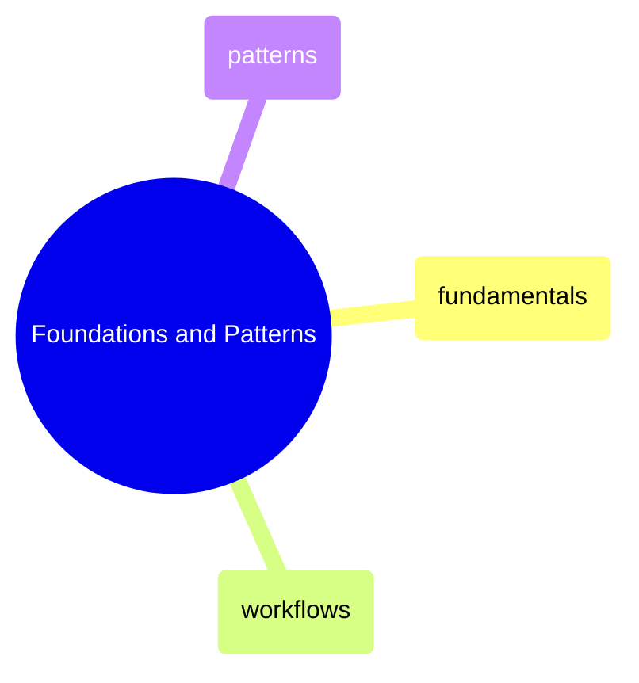
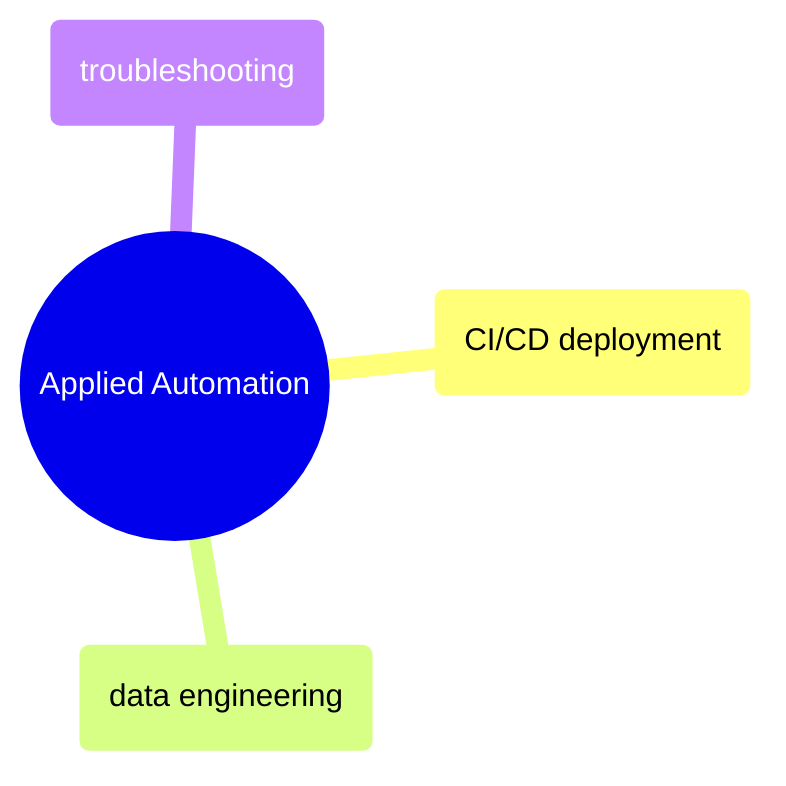

# MOC: GitHub Actions

CI/CD automation from YAML fundamentals to data engineering pipelines —
6 pages covering workflow syntax, reusable patterns, deployment automation,
and troubleshooting. Expand any section to browse page contents.

> [!example]- Foundations and Patterns
>
> > [!abstract]- [[github-actions-fundamentals]]
> >
> > - [[github-actions-fundamentals#Workflow File Anatomy|Workflow file anatomy]]
> > - [[github-actions-fundamentals#Triggers (on)|Triggers]]
> > - [[github-actions-fundamentals#Jobs|Jobs and runners]]
> > - [[github-actions-fundamentals#Expressions and Contexts|Expressions and contexts]]
> > - [[github-actions-fundamentals#Secrets|Secrets and GITHUB_TOKEN]]
> > - [[github-actions-fundamentals#Caching|Caching and concurrency]]
>
> > [!abstract]- [[github-actions-workflows]]
> >
> > - [[github-actions-workflows#Key Patterns|Key patterns]]
> > - [[github-actions-workflows#Matrix Testing|Matrix testing]]
> > - [[github-actions-workflows#Manual Workflow Dispatch with Inputs|Manual dispatch with inputs]]
> > - [[github-actions-workflows#Pre-commit Hooks|Pre-commit hooks]]
>
> > [!abstract]- [[github-actions-patterns]]
> >
> > - [[github-actions-patterns#Matrix Builds|Matrix builds]]
> > - [[github-actions-patterns#Reusable Workflows|Reusable workflows]]
> > - [[github-actions-patterns#Composite Actions|Composite actions]]
> > - [[github-actions-patterns#Environment Protection (Staging → Production)|Environment protection]]
> > - [[github-actions-patterns#Monorepo: Path Filters|Monorepo path filters]]
> > - [[github-actions-patterns#Cost Optimization|Cost optimization]]

> [!example]- Applied Automation
>
> > [!abstract]- [[github-actions-ci-cd]]
> >
> > - [[github-actions-ci-cd#How GitHub Actions Connects to Git|Git trigger events]]
> > - [[github-actions-ci-cd#Monitoring Workflows with GitHub CLI|Monitoring with GitHub CLI]]
> > - [[github-actions-ci-cd#Secrets Management|Secrets management]]
> > - [[github-actions-ci-cd#Troubleshooting Common Errors|Troubleshooting common errors]]
>
> > [!abstract]- [[github-actions-data-engineering]]
> >
> > - [[github-actions-data-engineering#CI for Data Pipelines|CI for data pipelines]]
> > - [[github-actions-data-engineering#Terraform Automation|Terraform automation]]
> > - [[github-actions-data-engineering#dbt CI|dbt CI]]
> > - [[github-actions-data-engineering#Data Quality Gates|Data quality gates]]
> > - [[github-actions-data-engineering#Workload Identity Federation (Keyless GCP Auth)|Workload Identity Federation]]
> > - [[github-actions-data-engineering#Troubleshooting|Troubleshooting]]
>
> > [!abstract]- [[github-actions-problems]]
> >
> > - [[github-actions-problems#Critical — Production Impact|Critical production impact]]
> > - [[github-actions-problems#High — Team Velocity Killers|Team velocity killers]]
> > - [[github-actions-problems#Moderate — Operational Pain|Operational pain]]
> > - [[github-actions-problems#Low — Annoyances|Low-severity annoyances]]

## Cross-References

- [[moc-git|Git]] — Git events that trigger GitHub Actions workflows
- [[moc-terraform|Terraform]] — Terraform plan/apply automated via GitHub Actions
- [[moc-docker|Docker]] — Docker build and push in CI/CD pipelines
- [[moc-data-architecture|Data Architecture]] — Testing strategy that coordinates CI with quality gates
