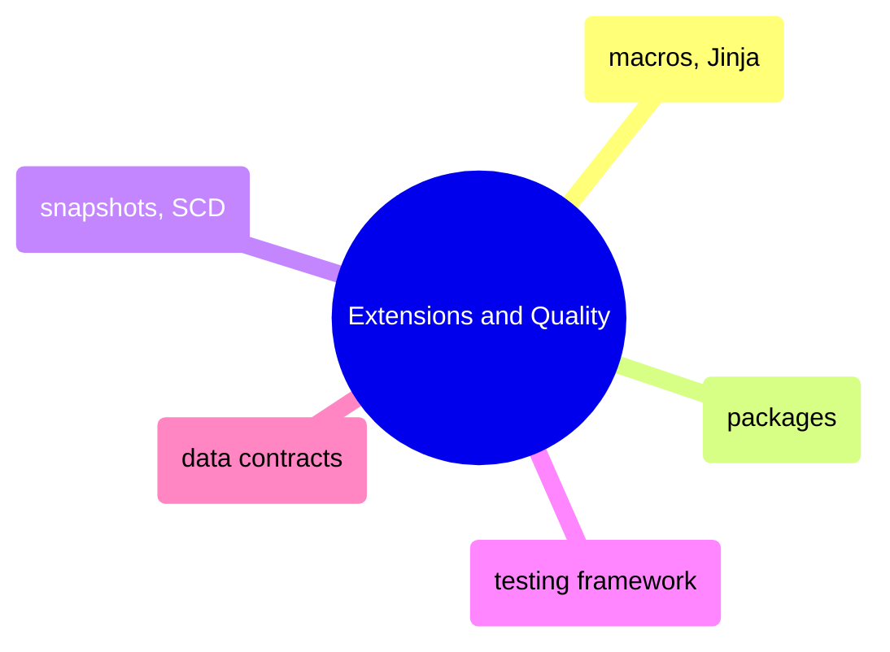

# Extensions and Quality

Macros, Jinja templating, community packages, snapshot-based SCD tracking, the testing framework, and data contracts for enforcing schema guarantees.

> [!abstract]- [[01-dbt-macros-and-jinja]]

> [!abstract]- [[03-dbt-packages]]

> [!abstract]- [[02-dbt-snapshots-and-scd]]

> [!abstract]- [[01-dbt-testing-framework]]

> [!abstract]- [[02-dbt-data-contracts-implementation]]
