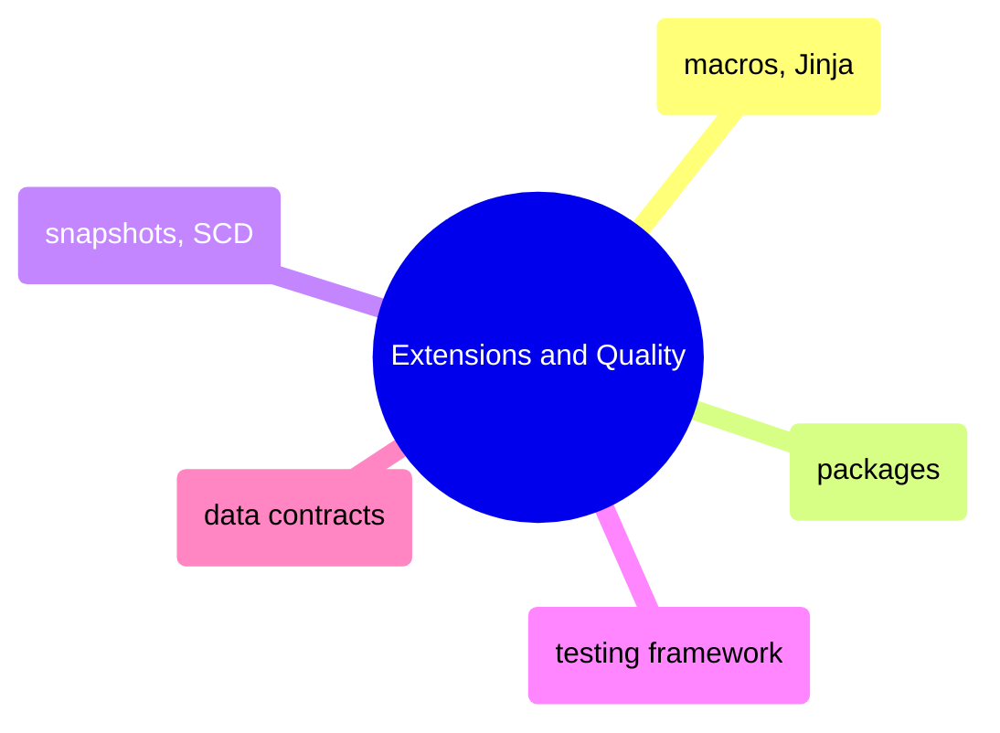

# Extensions and Quality

Macros, Jinja templating, community packages, snapshot-based SCD tracking, the testing framework, and data contracts for enforcing schema guarantees.

> [!abstract]- [[dbt-macros-and-jinja]]
>
> - [[dbt-macros-and-jinja#Variables and Filters|Variables and filters]]
> - [[dbt-macros-and-jinja#Writing Custom Macros|Writing custom macros]]
> - [[dbt-macros-and-jinja#Dispatch Macros for Cross-Adapter Compatibility|Dispatch macros]]
> - [[dbt-macros-and-jinja#Pre-hook and Post-hook Patterns|Pre-hook and post-hook patterns]]
> - [[dbt-macros-and-jinja#Jinja and Macro Anti-Patterns|Anti-patterns]]

> [!abstract]- [[dbt-packages]]
>
> - [[dbt-packages#dbt-utils — Most Used Macros in Financial Pipelines|dbt-utils key macros]]
> - [[dbt-packages#dbt-expectations — key tests for financial data quality|dbt-expectations key tests]]
> - [[dbt-packages#Elementary|Elementary anomaly detection]]
> - [[dbt-packages#Writing a Custom Package: dbt-financial-utils|Writing a custom package]]
> - [[dbt-packages#Version Pinning Strategy|Version pinning strategy]]

> [!abstract]- [[dbt-snapshots-and-scd]]
>
> - [[dbt-snapshots-and-scd#How dbt Snapshots Work|How snapshots work]]
> - [[dbt-snapshots-and-scd#Snapshot Strategy: timestamp|Timestamp strategy]]
> - [[dbt-snapshots-and-scd#Point-in-Time (PIT) Queries on Snapshot Tables|Point-in-time queries]]
> - [[dbt-snapshots-and-scd#Snapshot of ESG Scores for Audit Trail|ESG audit trail]]
> - [[dbt-snapshots-and-scd#Gotchas and Known Issues|Gotchas and known issues]]

> [!abstract]- [[dbt-testing-framework]]
>
> - [[dbt-testing-framework#dbt Test Categories|Test categories]]
> - [[dbt-testing-framework#dbt Built-in Generic Tests|Built-in generic tests]]
> - [[dbt-testing-framework#Custom Singular Tests|Custom singular tests]]
> - [[dbt-testing-framework#Custom Generic Tests|Custom generic tests]]
> - [[dbt-testing-framework#Test Coverage Strategy by Layer|Coverage strategy by layer]]

> [!abstract]- [[dbt-data-contracts-implementation]]
>
> - [[dbt-data-contracts-implementation#What Is a dbt Data Contract?|What is a data contract]]
> - [[dbt-data-contracts-implementation#Enabling a dbt Data Contract|Enabling contracts]]
> - [[dbt-data-contracts-implementation#Model Access Levels|Access levels]]
> - [[dbt-data-contracts-implementation#Model Versions|Model versions]]
> - [[dbt-data-contracts-implementation#Breaking Change Detection in CI|Breaking change detection in CI]]
