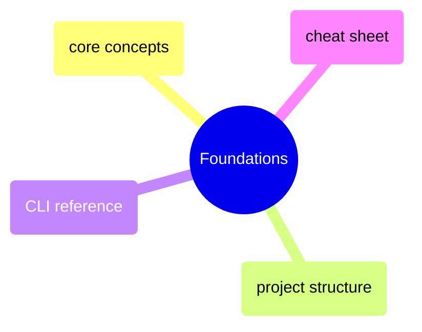

# Foundations

dbt core concepts, project structure conventions, CLI commands, and a quick-reference cheat sheet for day-to-day development.

> [!abstract]- [[dbt-core-concepts]]
>
> - [[dbt-core-concepts#What dbt Is (and Is Not)|What dbt is and is not]]
> - [[dbt-core-concepts#dbt Core vs dbt Cloud|Core vs Cloud]]
> - [[dbt-core-concepts#dbt Compilation Architecture|Compilation architecture]]
> - [[dbt-core-concepts#The dbt DAG|The DAG]]
> - [[dbt-core-concepts#dbt Profiles and Targets|Profiles and targets]]

> [!abstract]- [[dbt-project-structure]]
>
> - [[dbt-project-structure#dbt Directory Tree|Directory tree]]
> - [[dbt-project-structure#dbt_project.yml — Fully Annotated|dbt_project.yml annotated]]
> - [[dbt-project-structure#dbt Naming Conventions|Naming conventions]]
> - [[dbt-project-structure#dbt Config Inheritance: Project to Folder to Model|Config inheritance]]
> - [[dbt-project-structure#dbt Mapping to Medallion Architecture|Medallion architecture mapping]]

> [!abstract]- [[dbt-cli-reference]]
>
> - [[dbt-cli-reference#Core Commands Overview]]
> - [[dbt-cli-reference#Selector Syntax|Node selection syntax]]
> - [[dbt-cli-reference#Key Flags Reference|Key flags]]
> - [[dbt-cli-reference#Reading CLI Output|Reading CLI output]]

> [!abstract]- [[dbt-cheat-sheet]]
>
> - [[dbt-cheat-sheet#dbt Global Flags|Global flags]]
> - [[dbt-cheat-sheet#Node Selection Syntax|Node selection syntax]]
> - [[dbt-cheat-sheet#Jinja Reference|Jinja reference]]
> - [[dbt-cheat-sheet#YAML Schema Reference|YAML schema reference]]
> - [[dbt-cheat-sheet#Materialization Config Reference|Materialization config]]
