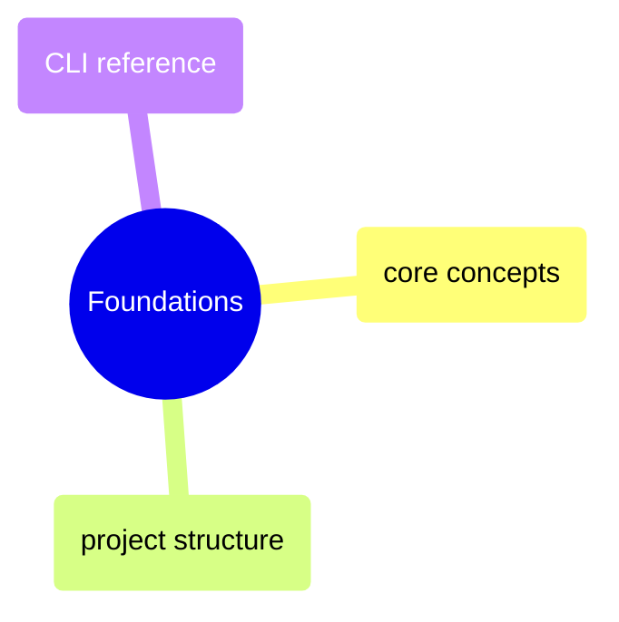

# Foundations

dbt core concepts, project structure conventions, CLI commands, and a quick-reference cheat sheet for day-to-day development.

> [!abstract]- [[01-dbt-core-concepts]]

> [!abstract]- [[02-dbt-project-structure]]

> [!abstract]- [[03-dbt-cli-reference]]

