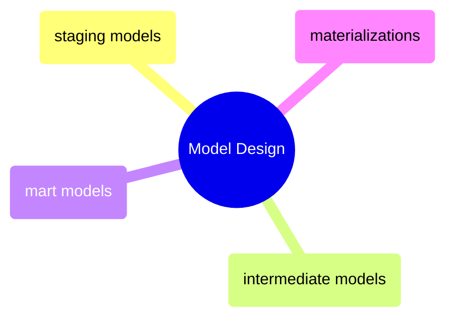

# Model Design

The staging-to-intermediate-to-mart progression, materialisation strategies, and the patterns that shape how dbt models transform raw data into analytics-ready tables.

> [!abstract]- [[dbt-staging-models]]
>
> - [[dbt-staging-models#Staging Model Core Principles|Core principles]]
> - [[dbt-staging-models#dbt _sources.yml — Full Declaration with Freshness|Source declaration with freshness]]
> - [[dbt-staging-models#_staging_market_data.yml — Column-Level Documentation|Column-level documentation]]
> - [[dbt-staging-models#dbt Source Freshness in Practice|Source freshness in practice]]
> - [[dbt-staging-models#Staging Model Anti-Patterns|Anti-patterns]]

> [!abstract]- [[dbt-intermediate-models]]
>
> - [[dbt-intermediate-models#Intermediate Model Core Principles|Core principles]]
> - [[dbt-intermediate-models#Intermediate Materialisation Strategy|Materialisation strategy]]
> - [[dbt-intermediate-models#int_daily_returns|Daily returns model]]
> - [[dbt-intermediate-models#int_momentum_scores|Momentum scores model]]
> - [[dbt-intermediate-models#dbt Ephemeral Models for Intermediate Logic|Ephemeral models]]

> [!abstract]- [[dbt-mart-models]]
>
> - [[dbt-mart-models#Mart Model Core Principles|Core principles]]
> - [[dbt-mart-models#Mart Grain Definition|Grain definition]]
> - [[dbt-mart-models#fct_index_performance|Index performance fact]]
> - [[dbt-mart-models#fct_composite_scores|Composite scores fact]]
> - [[dbt-mart-models#_exposures.yml|Exposures]]

> [!abstract]- [[dbt-materializations]]
>
> - [[dbt-materializations#The Five Materialisation Types|Five materialisation types]]
> - [[dbt-materializations#Incremental Strategies|Incremental strategies]]
> - [[dbt-materializations#dbt on_schema_change Behaviour|on_schema_change behaviour]]
> - [[dbt-materializations#dbt Late-Arriving Data Lookback Pattern|Late-arriving data lookback]]
> - [[dbt-materializations#Materialisation Decision Matrix|Decision matrix]]
