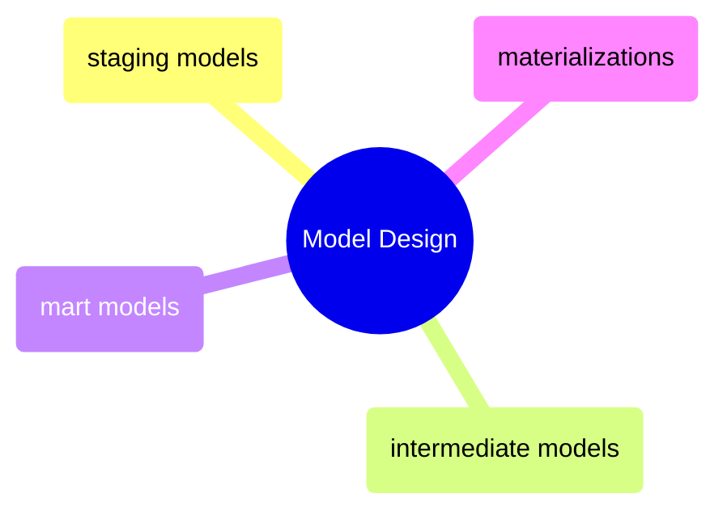

# Model Design

The staging-to-intermediate-to-mart progression, materialisation strategies, and the patterns that shape how dbt models transform raw data into analytics-ready tables.

> [!abstract]- [[01-dbt-staging-models]]

> [!abstract]- [[02-dbt-intermediate-models]]

> [!abstract]- [[03-dbt-mart-models]]

> [!abstract]- [[04-dbt-materializations]]
