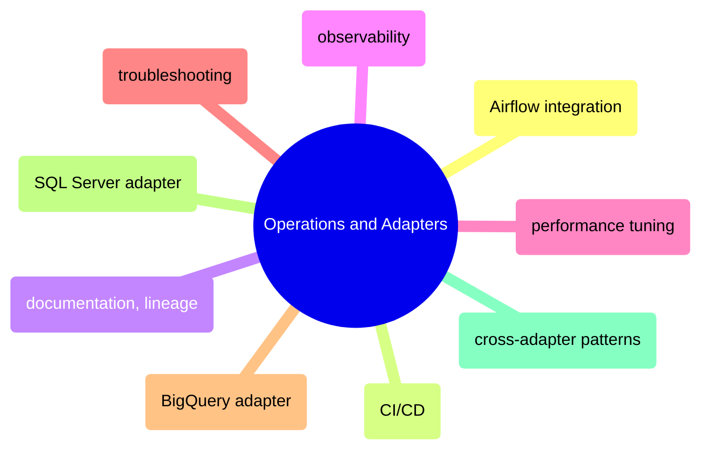

# Operations and Adapters

Running dbt in production — Airflow integration, CI/CD pipelines, documentation and lineage, observability, performance tuning, troubleshooting, and adapter-specific patterns for BigQuery, SQL Server, and cross-adapter compatibility.

> [!abstract]- [[01-dbt-airflow-integration]]
>

> [!abstract]- [[05-dbt-ci-cd]]
>

> [!abstract]- [[02-dbt-documentation-and-lineage]]
>

> [!abstract]- [[03-dbt-observability]]
>

> [!abstract]- [[04-dbt-performance-tuning]]
>

> [!abstract]- [[06-dbt-troubleshooting]]
>

> [!abstract]- [[02-dbt-bigquery-adapter]]
>

> [!abstract]- [[01-dbt-sqlserver-adapter]]
>

> [!abstract]- [[03-dbt-cross-adapter-patterns]]
>
