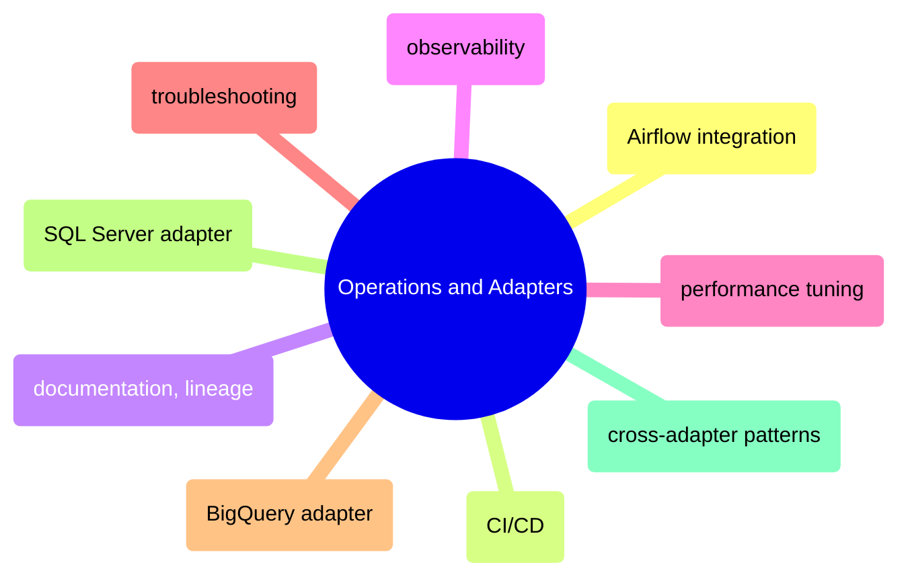

# Operations and Adapters

Running dbt in production — Airflow integration, CI/CD pipelines, documentation and lineage, observability, performance tuning, troubleshooting, and adapter-specific patterns for BigQuery, SQL Server, and cross-adapter compatibility.

> [!abstract]- [[dbt-airflow-integration]]
>
> - [[dbt-airflow-integration#Airflow BashOperator Wrapping dbt run|BashOperator wrapping dbt]]
> - [[dbt-airflow-integration#Airflow astronomer-cosmos DAG Definition|Cosmos per-model tasks]]
> - [[dbt-airflow-integration#Airflow CloudRunJobOperator (Isolated Container)|CloudRunJobOperator]]
> - [[dbt-airflow-integration#Full DAG: Extract to dbt Cosmos to dbt test to Publish|Full pipeline DAG]]
> - [[dbt-airflow-integration#Handling dbt Failures in Airflow|Handling failures]]

> [!abstract]- [[dbt-ci-cd]]
>
> - [[dbt-ci-cd#dbt Slim Build: State-Based Selection|Slim build with state selection]]
> - [[dbt-ci-cd#Workload Identity Federation (Keyless GCP Auth)|Workload Identity Federation]]
> - [[dbt-ci-cd#dbt Pre-Commit Hooks|Pre-commit hooks]]
> - [[dbt-ci-cd#Full dbt CI Workflow: dbt-ci.yml|Full CI workflow]]
> - [[dbt-ci-cd#Full dbt CD Workflow: dbt-cd.yml|Full CD workflow]]

> [!abstract]- [[dbt-documentation-and-lineage]]
>
> - [[dbt-documentation-and-lineage#Generating and Serving Docs|Generating and serving docs]]
> - [[dbt-documentation-and-lineage#Lineage Graph Visualisation|Lineage graph]]
> - [[dbt-documentation-and-lineage#Exposures|Exposures]]
> - [[dbt-documentation-and-lineage#Data Catalog Integration|Data catalog integration]]
> - [[dbt-documentation-and-lineage#EU BMR Methodology Traceability|EU BMR traceability]]

> [!abstract]- [[dbt-observability]]
>
> - [[dbt-observability#dbt Artifacts Overview|Artifacts overview]]
> - [[dbt-observability#Python Script: Push dbt Results to DogStatsD|Push results to DogStatsD]]
> - [[dbt-observability#Anomaly Detection Tests|Elementary anomaly detection]]
> - [[dbt-observability#Monitoring dbt in Datadog|Datadog monitoring]]
> - [[dbt-observability#Dashboard Template: Model Durations, Test Failures, Freshness|Dashboard template]]

> [!abstract]- [[dbt-performance-tuning]]
>
> - [[dbt-performance-tuning#Quick Analysis with Python|Identifying slow models]]
> - [[dbt-performance-tuning#BigQuery Tuning — Partition Pruning|BigQuery partition pruning]]
> - [[dbt-performance-tuning#Post-Hook Indexes|SQL Server post-hook indexes]]
> - [[dbt-performance-tuning#Thread Tuning Per Adapter|Thread tuning per adapter]]
> - [[dbt-performance-tuning#Model Refactoring: Split Slow Models|Refactoring slow models]]

> [!abstract]- [[dbt-troubleshooting]]
>
> - [[dbt-troubleshooting#dbt First Responder Commands|First responder commands]]
> - [[dbt-troubleshooting#Compilation Errors|Compilation errors]]
> - [[dbt-troubleshooting#Runtime Errors|Runtime errors]]
> - [[dbt-troubleshooting#Incremental Drift|Incremental drift]]
> - [[dbt-troubleshooting#Snapshot Corruption|Snapshot corruption]]
> - [[dbt-troubleshooting#dbt Common Errors Reference Table|Common errors reference table]]

> [!abstract]- [[dbt-bigquery-adapter]]
>
> - [[dbt-bigquery-adapter#BigQuery Adapter Installation]]
> - [[dbt-bigquery-adapter#Partitioning]]
> - [[dbt-bigquery-adapter#Incremental Strategy|Incremental strategies]]
> - [[dbt-bigquery-adapter#BigQuery SQL Patterns|BigQuery SQL patterns]]
> - [[dbt-bigquery-adapter#Cost Control|Cost control]]

> [!abstract]- [[dbt-sqlserver-adapter]]
>
> - [[dbt-sqlserver-adapter#SQL Server Adapter Installation]]
> - [[dbt-sqlserver-adapter#Incremental Strategy: delete+insert|Incremental delete+insert]]
> - [[dbt-sqlserver-adapter#T-SQL Differences From Standard SQL|T-SQL differences]]
> - [[dbt-sqlserver-adapter#SQL Server Post-Hook Indexes|Post-hook indexes]]
> - [[dbt-sqlserver-adapter#SQL Server Adapter Known Limitations Summary|Known limitations]]

> [!abstract]- [[dbt-cross-adapter-patterns]]
>
> - [[dbt-cross-adapter-patterns#The Cross-Adapter Problem|The cross-adapter problem]]
> - [[dbt-cross-adapter-patterns#The Dispatch Macro Pattern|Dispatch macro pattern]]
> - [[dbt-cross-adapter-patterns#Testing Across Adapters|Testing across adapters]]
> - [[dbt-cross-adapter-patterns#Migration Guide: SQL Server to BigQuery|SQL Server to BigQuery migration]]
