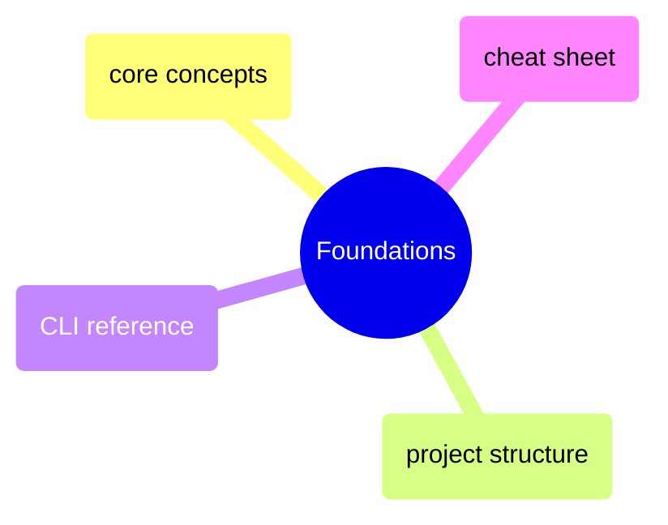
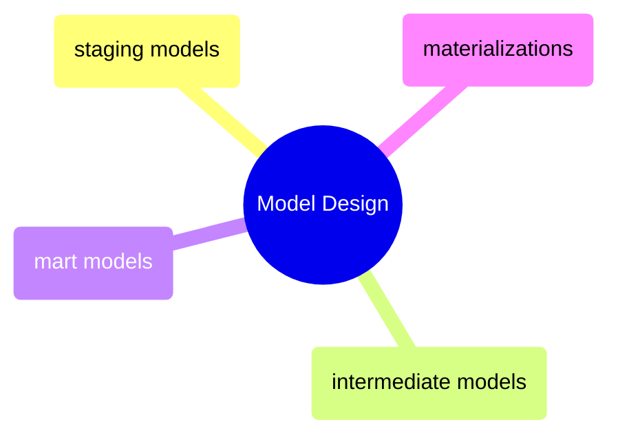
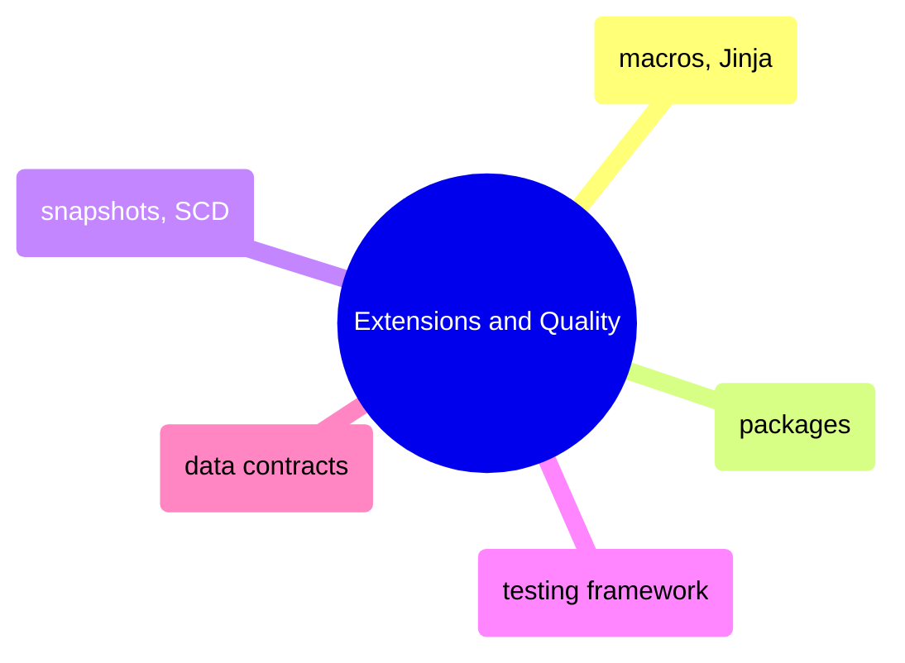
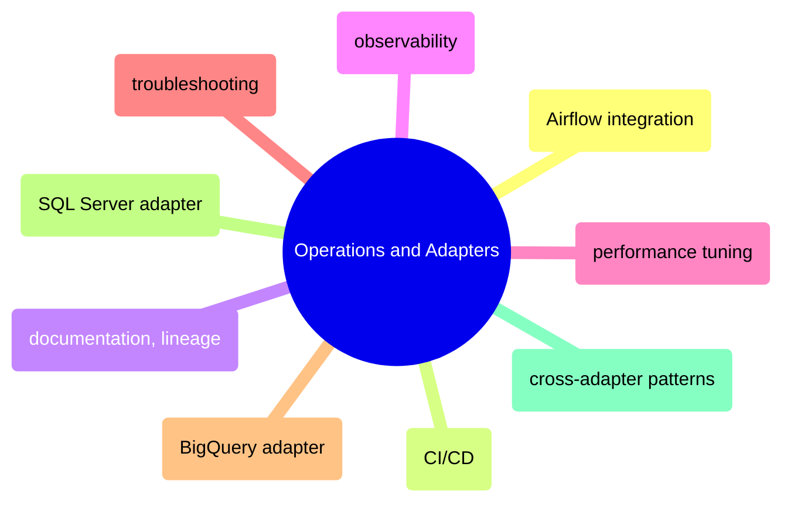

# MOC: dbt

The SQL transformation layer — from project setup through model design to
production operations. 22 pages covering dbt fundamentals, the staging →
intermediate → mart progression, testing, macros, and adapter-specific
patterns for BigQuery and SQL Server. Expand any section to browse contents.

> [!example]- Foundations
>
> > [!abstract]- [[dbt-core-concepts]]
> >
> > - [[dbt-core-concepts#What dbt Is (and Is Not)|What dbt is and is not]]
> > - [[dbt-core-concepts#dbt Core vs dbt Cloud|Core vs Cloud]]
> > - [[dbt-core-concepts#dbt Compilation Architecture|Compilation architecture]]
> > - [[dbt-core-concepts#The dbt DAG|The DAG]]
> > - [[dbt-core-concepts#dbt Profiles and Targets|Profiles and targets]]
>
> > [!abstract]- [[dbt-project-structure]]
> >
> > - [[dbt-project-structure#dbt Directory Tree|Directory tree]]
> > - [[dbt-project-structure#dbt_project.yml — Fully Annotated|dbt_project.yml annotated]]
> > - [[dbt-project-structure#dbt Naming Conventions|Naming conventions]]
> > - [[dbt-project-structure#dbt Config Inheritance: Project to Folder to Model|Config inheritance]]
> > - [[dbt-project-structure#dbt Mapping to Medallion Architecture|Medallion architecture mapping]]
>
> > [!abstract]- [[dbt-cli-reference]]
> >
> > - [[dbt-cli-reference#Core Commands Overview]]
> > - [[dbt-cli-reference#Selector Syntax|Node selection syntax]]
> > - [[dbt-cli-reference#Key Flags Reference|Key flags]]
> > - [[dbt-cli-reference#Reading CLI Output|Reading CLI output]]
>
> > [!abstract]- [[dbt-cheat-sheet]]
> >
> > - [[dbt-cheat-sheet#dbt Global Flags|Global flags]]
> > - [[dbt-cheat-sheet#Node Selection Syntax|Node selection syntax]]
> > - [[dbt-cheat-sheet#Jinja Reference|Jinja reference]]
> > - [[dbt-cheat-sheet#YAML Schema Reference|YAML schema reference]]
> > - [[dbt-cheat-sheet#Materialization Config Reference|Materialization config]]

> [!example]- Model Design
>
> > [!abstract]- [[dbt-staging-models]]
> >
> > - [[dbt-staging-models#Staging Model Core Principles|Core principles]]
> > - [[dbt-staging-models#dbt _sources.yml — Full Declaration with Freshness|Source declaration with freshness]]
> > - [[dbt-staging-models#_staging_market_data.yml — Column-Level Documentation|Column-level documentation]]
> > - [[dbt-staging-models#dbt Source Freshness in Practice|Source freshness in practice]]
> > - [[dbt-staging-models#Staging Model Anti-Patterns|Anti-patterns]]
>
> > [!abstract]- [[dbt-intermediate-models]]
> >
> > - [[dbt-intermediate-models#Intermediate Model Core Principles|Core principles]]
> > - [[dbt-intermediate-models#Intermediate Materialisation Strategy|Materialisation strategy]]
> > - [[dbt-intermediate-models#int_daily_returns|Daily returns model]]
> > - [[dbt-intermediate-models#int_momentum_scores|Momentum scores model]]
> > - [[dbt-intermediate-models#dbt Ephemeral Models for Intermediate Logic|Ephemeral models]]
>
> > [!abstract]- [[dbt-mart-models]]
> >
> > - [[dbt-mart-models#Mart Model Core Principles|Core principles]]
> > - [[dbt-mart-models#Mart Grain Definition|Grain definition]]
> > - [[dbt-mart-models#fct_index_performance|Index performance fact]]
> > - [[dbt-mart-models#fct_composite_scores|Composite scores fact]]
> > - [[dbt-mart-models#_exposures.yml|Exposures]]
>
> > [!abstract]- [[dbt-materializations]]
> >
> > - [[dbt-materializations#The Five Materialisation Types|Five materialisation types]]
> > - [[dbt-materializations#Incremental Strategies|Incremental strategies]]
> > - [[dbt-materializations#dbt on_schema_change Behaviour|on_schema_change behaviour]]
> > - [[dbt-materializations#dbt Late-Arriving Data Lookback Pattern|Late-arriving data lookback]]
> > - [[dbt-materializations#Materialisation Decision Matrix|Decision matrix]]

> [!example]- Extensions and Quality
>
> > [!abstract]- [[dbt-macros-and-jinja]]
> >
> > - [[dbt-macros-and-jinja#Variables and Filters|Variables and filters]]
> > - [[dbt-macros-and-jinja#Writing Custom Macros|Writing custom macros]]
> > - [[dbt-macros-and-jinja#Dispatch Macros for Cross-Adapter Compatibility|Dispatch macros]]
> > - [[dbt-macros-and-jinja#Pre-hook and Post-hook Patterns|Pre-hook and post-hook patterns]]
> > - [[dbt-macros-and-jinja#Jinja and Macro Anti-Patterns|Anti-patterns]]
>
> > [!abstract]- [[dbt-packages]]
> >
> > - [[dbt-packages#dbt-utils — Most Used Macros in Financial Pipelines|dbt-utils key macros]]
> > - [[dbt-packages#dbt-expectations — key tests for financial data quality|dbt-expectations key tests]]
> > - [[dbt-packages#Elementary|Elementary anomaly detection]]
> > - [[dbt-packages#Writing a Custom Package: dbt-financial-utils|Writing a custom package]]
> > - [[dbt-packages#Version Pinning Strategy|Version pinning strategy]]
>
> > [!abstract]- [[dbt-snapshots-and-scd]]
> >
> > - [[dbt-snapshots-and-scd#How dbt Snapshots Work|How snapshots work]]
> > - [[dbt-snapshots-and-scd#Snapshot Strategy: timestamp|Timestamp strategy]]
> > - [[dbt-snapshots-and-scd#Point-in-Time (PIT) Queries on Snapshot Tables|Point-in-time queries]]
> > - [[dbt-snapshots-and-scd#Snapshot of ESG Scores for Audit Trail|ESG audit trail]]
> > - [[dbt-snapshots-and-scd#Gotchas and Known Issues|Gotchas and known issues]]
>
> > [!abstract]- [[dbt-testing-framework]]
> >
> > - [[dbt-testing-framework#dbt Test Categories|Test categories]]
> > - [[dbt-testing-framework#dbt Built-in Generic Tests|Built-in generic tests]]
> > - [[dbt-testing-framework#Custom Singular Tests|Custom singular tests]]
> > - [[dbt-testing-framework#Custom Generic Tests|Custom generic tests]]
> > - [[dbt-testing-framework#Test Coverage Strategy by Layer|Coverage strategy by layer]]
>
> > [!abstract]- [[dbt-data-contracts-implementation]]
> >
> > - [[dbt-data-contracts-implementation#What Is a dbt Data Contract?|What is a data contract]]
> > - [[dbt-data-contracts-implementation#Enabling a dbt Data Contract|Enabling contracts]]
> > - [[dbt-data-contracts-implementation#Model Access Levels|Access levels]]
> > - [[dbt-data-contracts-implementation#Model Versions|Model versions]]
> > - [[dbt-data-contracts-implementation#Breaking Change Detection in CI|Breaking change detection in CI]]

> [!example]- Operations and Adapters
>
> > [!abstract]- [[dbt-airflow-integration]]
> >
> > - [[dbt-airflow-integration#Airflow BashOperator Wrapping dbt run|BashOperator wrapping dbt]]
> > - [[dbt-airflow-integration#Airflow astronomer-cosmos DAG Definition|Cosmos per-model tasks]]
> > - [[dbt-airflow-integration#Airflow CloudRunJobOperator (Isolated Container)|CloudRunJobOperator]]
> > - [[dbt-airflow-integration#Full DAG: Extract to dbt Cosmos to dbt test to Publish|Full pipeline DAG]]
> > - [[dbt-airflow-integration#Handling dbt Failures in Airflow|Handling failures]]
>
> > [!abstract]- [[dbt-ci-cd]]
> >
> > - [[dbt-ci-cd#dbt Slim Build: State-Based Selection|Slim build with state selection]]
> > - [[dbt-ci-cd#Workload Identity Federation (Keyless GCP Auth)|Workload Identity Federation]]
> > - [[dbt-ci-cd#dbt Pre-Commit Hooks|Pre-commit hooks]]
> > - [[dbt-ci-cd#Full dbt CI Workflow: dbt-ci.yml|Full CI workflow]]
> > - [[dbt-ci-cd#Full dbt CD Workflow: dbt-cd.yml|Full CD workflow]]
>
> > [!abstract]- [[dbt-documentation-and-lineage]]
> >
> > - [[dbt-documentation-and-lineage#Generating and Serving Docs|Generating and serving docs]]
> > - [[dbt-documentation-and-lineage#Lineage Graph Visualisation|Lineage graph]]
> > - [[dbt-documentation-and-lineage#Exposures|Exposures]]
> > - [[dbt-documentation-and-lineage#Data Catalog Integration|Data catalog integration]]
> > - [[dbt-documentation-and-lineage#EU BMR Methodology Traceability|EU BMR traceability]]
>
> > [!abstract]- [[dbt-observability]]
> >
> > - [[dbt-observability#dbt Artifacts Overview|Artifacts overview]]
> > - [[dbt-observability#Python Script: Push dbt Results to DogStatsD|Push results to DogStatsD]]
> > - [[dbt-observability#Anomaly Detection Tests|Elementary anomaly detection]]
> > - [[dbt-observability#Monitoring dbt in Datadog|Datadog monitoring]]
> > - [[dbt-observability#Dashboard Template: Model Durations, Test Failures, Freshness|Dashboard template]]
>
> > [!abstract]- [[dbt-performance-tuning]]
> >
> > - [[dbt-performance-tuning#Quick Analysis with Python|Identifying slow models]]
> > - [[dbt-performance-tuning#BigQuery Tuning — Partition Pruning|BigQuery partition pruning]]
> > - [[dbt-performance-tuning#Post-Hook Indexes|SQL Server post-hook indexes]]
> > - [[dbt-performance-tuning#Thread Tuning Per Adapter|Thread tuning per adapter]]
> > - [[dbt-performance-tuning#Model Refactoring: Split Slow Models|Refactoring slow models]]
>
> > [!abstract]- [[dbt-troubleshooting]]
> >
> > - [[dbt-troubleshooting#dbt First Responder Commands|First responder commands]]
> > - [[dbt-troubleshooting#Compilation Errors|Compilation errors]]
> > - [[dbt-troubleshooting#Runtime Errors|Runtime errors]]
> > - [[dbt-troubleshooting#Incremental Drift|Incremental drift]]
> > - [[dbt-troubleshooting#Snapshot Corruption|Snapshot corruption]]
> > - [[dbt-troubleshooting#dbt Common Errors Reference Table|Common errors reference table]]
>
> > [!abstract]- [[dbt-bigquery-adapter]]
> >
> > - [[dbt-bigquery-adapter#BigQuery Adapter Installation]]
> > - [[dbt-bigquery-adapter#Partitioning]]
> > - [[dbt-bigquery-adapter#Incremental Strategy|Incremental strategies]]
> > - [[dbt-bigquery-adapter#BigQuery SQL Patterns|BigQuery SQL patterns]]
> > - [[dbt-bigquery-adapter#Cost Control|Cost control]]
>
> > [!abstract]- [[dbt-sqlserver-adapter]]
> >
> > - [[dbt-sqlserver-adapter#SQL Server Adapter Installation]]
> > - [[dbt-sqlserver-adapter#Incremental Strategy: delete+insert|Incremental delete+insert]]
> > - [[dbt-sqlserver-adapter#T-SQL Differences From Standard SQL|T-SQL differences]]
> > - [[dbt-sqlserver-adapter#SQL Server Post-Hook Indexes|Post-hook indexes]]
> > - [[dbt-sqlserver-adapter#SQL Server Adapter Known Limitations Summary|Known limitations]]
>
> > [!abstract]- [[dbt-cross-adapter-patterns]]
> >
> > - [[dbt-cross-adapter-patterns#The Cross-Adapter Problem|The cross-adapter problem]]
> > - [[dbt-cross-adapter-patterns#The Dispatch Macro Pattern|Dispatch macro pattern]]
> > - [[dbt-cross-adapter-patterns#Testing Across Adapters|Testing across adapters]]
> > - [[dbt-cross-adapter-patterns#Migration Guide: SQL Server to BigQuery|SQL Server to BigQuery migration]]

## Cross-References

- [[moc-data-architecture|Data Architecture]] — dbt transformation layer theory and medallion architecture
- [[moc-sql-server|SQL Server]] — SQL Server pipeline patterns that dbt automates
- [[moc-db-queries|DB Queries]] — BigQuery and SQL Server query patterns used in dbt models
- [[moc-github-actions|GitHub Actions]] — CI/CD pipelines running dbt test and build
- [[moc-observability|Observability]] — dbt observability in the broader monitoring stack
