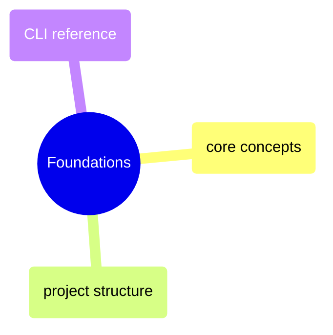
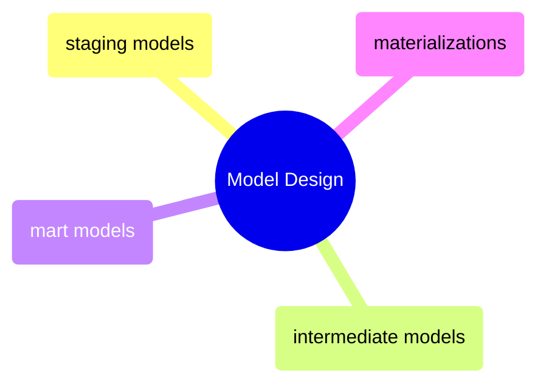
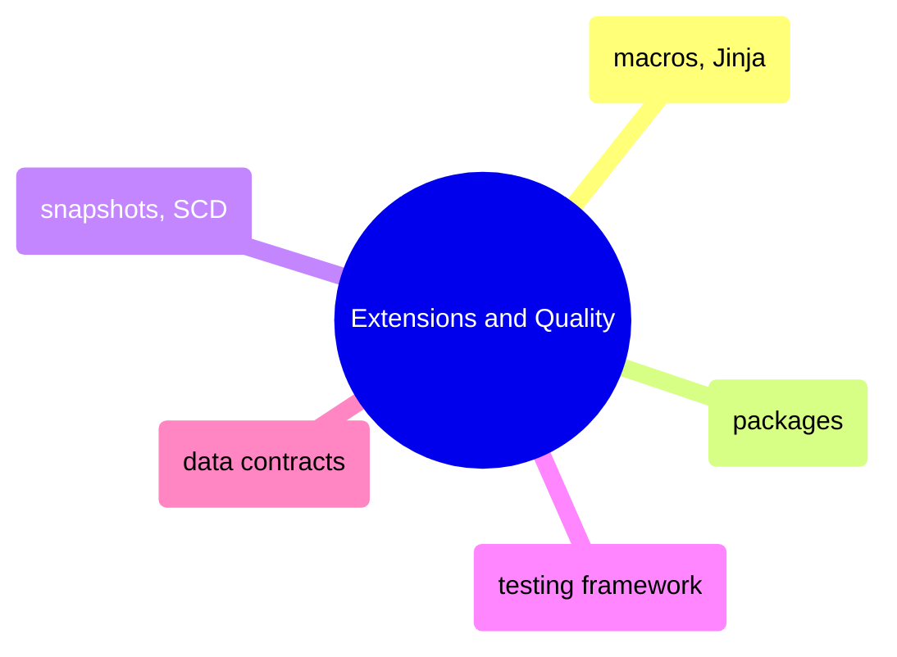
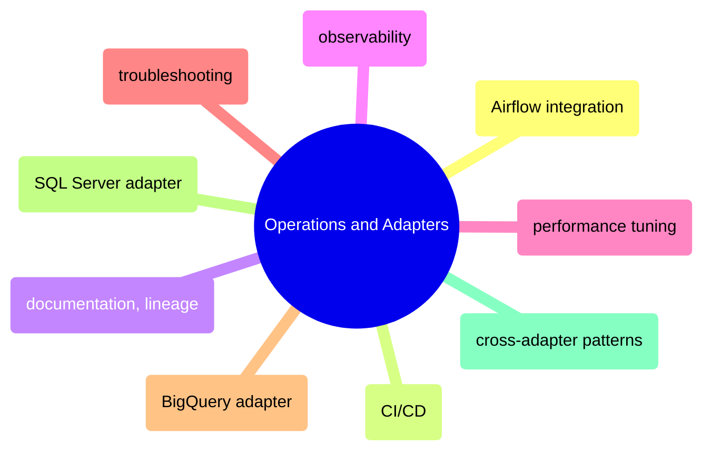

# MOC: dbt

The SQL transformation layer — from project setup through model design to
production operations. 22 pages covering dbt fundamentals, the staging →
intermediate → mart progression, testing, macros, and adapter-specific
patterns for BigQuery and SQL Server. Expand any section to browse contents.

> [!guide]+ Foundations
>
> [[domain-foundations]]
>
> dbt core concepts, project structure conventions, CLI commands, and a quick-reference cheat sheet for day-to-day development.

> [!guide]+ Model Design
>
> [[domain-model-design]]
>
> The staging-to-intermediate-to-mart progression, materialisation strategies, and the patterns that shape how dbt models transform raw data into analytics-ready tables.

> [!guide]+ Extensions and Quality
>
> [[domain-extensions-and-quality]]
>
> Macros, Jinja templating, community packages, snapshot-based SCD tracking, the testing framework, and data contracts for enforcing schema guarantees.

> [!guide]+ Operations and Adapters
>
> [[domain-operations-and-adapters]]
>
> Running dbt in production — Airflow integration, CI/CD pipelines, documentation and lineage, observability, performance tuning, troubleshooting, and adapter-specific patterns for BigQuery, SQL Server, and cross-adapter compatibility.

## dbt Cross-References

- [Data Architecture](https://alp78.github.io/elysium/14-Data-Architecture/moc-data-architecture) — dbt transformation layer theory and medallion architecture
- [SQL Server](https://alp78.github.io/elysium/04-Databases/moc-sql-server) — SQL Server pipeline patterns that dbt automates
- [DB Queries](https://alp78.github.io/elysium/05-DB-Queries/moc-db-queries) — BigQuery and SQL Server query patterns used in dbt models
- [GitHub Actions](https://alp78.github.io/elysium/10-CICD/moc-github-actions) — CI/CD pipelines running dbt test and build
- [Observability](https://alp78.github.io/elysium/13-Observability/moc-observability) — dbt observability in the broader monitoring stack
