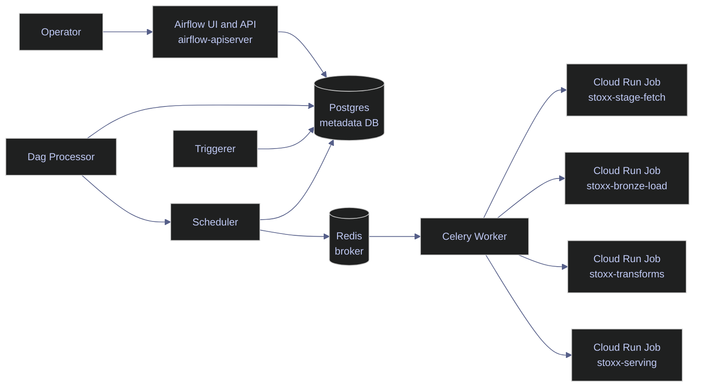

# Airflow Core Concepts

Airflow is the orchestration layer for the live STOXX index pipeline running on `stoxx-airflow`. It does not fetch market data itself, parse JSON itself, compute silver and gold tables itself, or publish Firestore documents itself. It schedules, coordinates, retries, and records the work performed by Cloud Run jobs and the downstream systems they touch.

## What This Note Covers

This note defines the minimum Airflow vocabulary required to understand the live platform safely, then maps each term to the deployed `stoxx_stage_yfinance` DAG and the Airflow 3.2 runtime that currently orchestrates the STOXX-only pipeline in project `bq-wh-nb`.

- What Airflow is and is not in this platform.
- Which runtime components exist on `stoxx-airflow`, and what each one does.
- How DAGs, tasks, task instances, DAG runs, retries, timeouts, connections, and XCom appear in the real STOXX pipeline.
- Why the current deployment uses `CeleryExecutor`, a local metadata database, Redis, and Cloud Run jobs instead of placing the data-processing logic directly inside Airflow tasks.

## Glossary / Key Terms

> [!info] Key Terms
>
> | Term | Definition | Why it matters here | Caveat |
> |---|---|---|---|
> | Airflow | A workflow orchestrator that stores run state, schedules work, and coordinates task execution. | It is the control plane for the STOXX pipeline. | It is not the compute engine that transforms market data. |
> | DAG | A Directed Acyclic Graph that defines tasks and dependencies as code. | `stoxx_stage_yfinance` is the pipeline contract Airflow parses and schedules. | A DAG definition is static Python code; runtime data should not shape it at import time. |
> | DAG run | One execution of a DAG for a specific trigger and time context. | The validated end-to-end serving run is `manual__2026-04-13T17:28:30Z_serving`. | A DAG run can exist even when some tasks fail or are skipped. |
> | Task | A single node in the DAG graph. | `load_bronze_into_sql` and `build_bigquery_marts` are tasks. | A task definition is not an execution record. |
> | Task instance | One execution record of one task inside one DAG run. | Airflow stores start time, end time, and state per task instance. | Retries create multiple attempts for the same logical task instance. |
> | Scheduler | The Airflow component that decides what can run next. | It turns the parsed DAG and task states into queued work. | If it stalls, every DAG appears broken even when workers are healthy. |
> | Worker | The component that executes queued tasks. | The Celery worker calls the Google provider operator that starts Cloud Run jobs. | The worker is not where the STOXX pipeline data processing actually happens. |
> | Triggerer | The component that manages deferred asynchronous work. | The live stack runs a triggerer even though the current DAG sets `deferrable=False`. | Having a triggerer does not mean tasks are automatically deferrable. |
> | Metadata database | Airflow's shared state store. | It holds DAG metadata, task states, connections, and UI state. | If it is wrong or unavailable, the platform cannot be trusted. |
> | Executor | The strategy Airflow uses to hand queued tasks to execution slots. | The live runtime uses `CeleryExecutor`. | The executor choice changes scaling and failure behavior, not DAG semantics. |
> | Connection | A named integration object Airflow uses to resolve credentials and defaults for external systems. | `google_cloud_default` is required for `CloudRunExecuteJobOperator`. | VM metadata credentials do not remove the need for the connection record itself. |
> | XCom | Airflow's cross-communication channel for small metadata payloads between tasks. | The Google operator pushes execution metadata that Airflow can inspect. | XCom is not used for JSON payloads, market data, or table data in this platform. |
> | Catchup | Airflow behavior that backfills missed schedule intervals automatically. | The live DAG disables it with `catchup=False`. | Enabling it accidentally can create replay storms. |
> | Data interval | The time window a scheduled DAG run represents. | It matters when DAGs are cron-driven and partitioned by logical time. | The current DAG is `schedule=None`, so manual runs are the operational default. |

## What Airflow Is In This Platform

Airflow is the system that decides when the STOXX pipeline may advance from one stage to the next. It is the place that knows that bronze loading must finish before silver transforms start, that BigQuery marts must wait for gold tables, and that Firestore publication must not run until marts are built.

### Runtime Architecture

The deployed Airflow runtime is a private Compute Engine VM called `stoxx-airflow`. The VM runs Airflow 3.2.0 in Docker Compose, with Postgres as the metadata database, Redis as the Celery broker, and one Celery worker that launches Google Cloud Run jobs.



### Airflow Does Not Process Market Data

The live DAG deliberately keeps Airflow thin. The scheduler and worker do not fetch yfinance data row by row, do not parse every JSON file, and do not execute the medallion SQL transformations inline. They invoke external jobs that own those responsibilities.

> [!warning] Airflow Is Not The ETL Engine
>
> Putting the market-data parsing, SQL loading, or BigQuery mart logic directly inside long-lived Airflow Python tasks would move heavy compute into the control plane. That makes retries slower, worker saturation more likely, and failure recovery harder.
>
> [!success] Airflow Owns Orchestration Only
>
> The live design keeps Airflow responsible for dependency control, retries, timeouts, visibility, and manual reruns. Cloud Run jobs own the data movement and transformation logic.

## The Live Control Plane

This section maps the core runtime components to the actual Airflow VM and shows the command outputs that prove the current topology.

### Runtime Components On `stoxx-airflow`

This subsection shows which Airflow services are actually running now and how to interpret them.

#### Inspect The Running Airflow Services

**When to run:** Run this after deployment, after any Compose restart, or whenever the UI suggests a service-level problem.
**Trigger:** A DAG is missing, tasks are not advancing, or container health is in doubt.
**Context:** Run from a workstation with `gcloud` access. The command is read-only. It tunnels through IAP because the VM has no public IP.
**Purpose:** Confirm that the Airflow API server, scheduler, dag processor, triggerer, worker, Postgres, and Redis are all present and healthy.

*This command SSHes through IAP to `stoxx-airflow` and asks Docker Compose for the live container state.*

```powershell
gcloud compute ssh stoxx-airflow `
  --project=bq-wh-nb `
  --zone=europe-west1-b `
  --tunnel-through-iap `
  --command "cd /home/alexper_recovery_gmail_com/app && sudo docker compose ps"
```

```text
NAME                          IMAGE                 COMMAND                  SERVICE                 CREATED       STATUS                 PORTS
app-airflow-apiserver-1       stoxx-airflow:3.2.0   "/usr/bin/dumb-init …"   airflow-apiserver       2 hours ago   Up 2 hours (healthy)   0.0.0.0:8080->8080/tcp, [::]:8080->8080/tcp
app-airflow-dag-processor-1   stoxx-airflow:3.2.0   "/usr/bin/dumb-init …"   airflow-dag-processor   2 hours ago   Up 2 hours (healthy)   8080/tcp
app-airflow-scheduler-1       stoxx-airflow:3.2.0   "/usr/bin/dumb-init …"   airflow-scheduler       2 hours ago   Up 2 hours (healthy)   8080/tcp
app-airflow-triggerer-1       stoxx-airflow:3.2.0   "/usr/bin/dumb-init …"   airflow-triggerer       2 hours ago   Up 2 hours (healthy)   8080/tcp
app-airflow-worker-1          stoxx-airflow:3.2.0   "/usr/bin/dumb-init …"   airflow-worker          2 hours ago   Up 2 hours (healthy)   8080/tcp
app-postgres-1                postgres:16           "docker-entrypoint.s…"   postgres                5 hours ago   Up 5 hours (healthy)   5432/tcp
app-redis-1                   redis:7.2-bookworm    "docker-entrypoint.s…"   redis                   5 hours ago   Up 5 hours (healthy)   6379/tcp
```

The important operational reading is straightforward:

- `airflow-apiserver` serves the UI and Airflow API.
- `airflow-scheduler` decides which task instances can queue next.
- `airflow-dag-processor` parses DAG files into scheduler-consumable metadata.
- `airflow-worker` executes queued operator code.
- `airflow-triggerer` is available for deferred tasks.
- `postgres` and `redis` are not optional sidecars; they are required state dependencies for `CeleryExecutor`.

#### Read The Scheduler Role From Live Logs

**When to run:** Run this when the scheduler might be unhealthy or after a restart when you need to see whether it actually came back.
**Trigger:** DAG runs remain queued, task instances do not advance, or the scheduler heartbeat is suspect.
**Context:** Run from the same VM shell path. The command is read-only and tails scheduler logs.
**Purpose:** Prove that the scheduler has loaded the executor, started its main loop, and is responding to health probes.

*This tails the scheduler container log so the operator can confirm that scheduling has actually resumed.*

```powershell
gcloud compute ssh stoxx-airflow `
  --project=bq-wh-nb `
  --zone=europe-west1-b `
  --tunnel-through-iap `
  --command "cd /home/alexper_recovery_gmail_com/app && sudo docker compose logs --tail=25 airflow-scheduler"
```

```text
airflow-scheduler-1  | 2026-04-13T17:26:08.689572Z [info     ] Loaded executor: :CeleryExecutor:
airflow-scheduler-1  | 2026-04-13T17:26:11.000515Z [info     ] Starting the scheduler
airflow-scheduler-1  | 2026-04-13T17:26:11.016136Z [info     ] Adopting or resetting orphaned tasks for active dag runs
airflow-scheduler-1  | 127.0.0.1 - - [13/Apr/2026 17:26:37] "GET /health HTTP/1.1" 200 -
airflow-scheduler-1  | 127.0.0.1 - - [13/Apr/2026 17:27:07] "GET /health HTTP/1.1" 200 -
airflow-scheduler-1  | 127.0.0.1 - - [13/Apr/2026 17:27:38] "GET /health HTTP/1.1" 200 -
```

The `Loaded executor: :CeleryExecutor:` line matters because it proves the runtime is not using a local single-process executor. The repeated `GET /health ... 200` lines matter because the container health check is succeeding, which means the service is alive rather than merely started.

| Flag | Syntax | Description |
|---|---|---|
| `--project` | `gcloud compute ssh ... --project=bq-wh-nb` | Selects the active GCP project that contains the VM. |
| `--zone` | `gcloud compute ssh ... --zone=europe-west1-b` | Selects the VM zone. |
| `--tunnel-through-iap` | `gcloud compute ssh ... --tunnel-through-iap` | Reaches the private VM without requiring a public IP. |
| `--command` | `gcloud compute ssh ... --command "<linux command>"` | Runs a remote shell command non-interactively. |

### DAG Discovery, Executor, And Connection Surfaces

Airflow's state model is only useful if the scheduler can see the DAG, the executor can queue work correctly, and the provider operators can resolve their connections.

#### Verify That The DAG Is Registered

**When to run:** Run this after copying a new DAG file, after restarting Airflow services, or when the UI does not show the workflow.
**Trigger:** A newly deployed DAG does not appear, or a known DAG appears paused or missing.
**Context:** This is a read-only CLI check executed inside the Airflow worker container.
**Purpose:** Confirm that `stoxx_stage_yfinance` is present in the DagBag and visible to Airflow.

*This command filters the Airflow DAG catalog to the live STOXX DAG.*

```powershell
gcloud compute ssh stoxx-airflow `
  --project=bq-wh-nb `
  --zone=europe-west1-b `
  --tunnel-through-iap `
  --command "cd /home/alexper_recovery_gmail_com/app && sudo docker compose exec -T airflow-worker airflow dags list | grep stoxx_stage_yfinance"
```

```text
stoxx_stage_yfinance | /opt/airflow/dags/stoxx_stage_yfinance.py | airflow | False     | dags-folder | None
stoxx_stage_yfinance | /opt/airflow/dags/stoxx_stage_yfinance.py | airflow | False     | dags-folder | None
stoxx_stage_yfinance | /opt/airflow/dags/stoxx_stage_yfinance.py | airflow | False     | dags-folder | None
```

The important field here is `False` in the paused column. Earlier in the rollout, the DAG was visible but still paused. Airflow can know about a DAG and still refuse to schedule it until that flag is cleared.

#### Verify The Executor And Google Connection

**When to run:** Run this on first bootstrap, after image rebuilds, or when Google operators start failing unexpectedly.
**Trigger:** Tasks queue but do not launch Cloud Run jobs, or provider operators complain about missing credentials or connection IDs.
**Context:** These are read-only Airflow CLI calls executed inside the worker container.
**Purpose:** Prove that the runtime uses `CeleryExecutor` and that `google_cloud_default` exists in the metadata database.

*The first command prints the configured executor. The second prints the stored Google connection record that the Cloud Run operator relies on.*

```powershell
gcloud compute ssh stoxx-airflow `
  --project=bq-wh-nb `
  --zone=europe-west1-b `
  --tunnel-through-iap `
  --command "cd /home/alexper_recovery_gmail_com/app && sudo docker compose exec -T airflow-worker airflow config get-value core executor"
```

```text
CeleryExecutor
```

```powershell
gcloud compute ssh stoxx-airflow `
  --project=bq-wh-nb `
  --zone=europe-west1-b `
  --tunnel-through-iap `
  --command "cd /home/alexper_recovery_gmail_com/app && sudo docker compose exec -T airflow-worker airflow connections get google_cloud_default"
```

```text
id | conn_id              | conn_type             | description | host | schema | login | password | port | is_encrypted | is_extra_encrypted | extra_dejson | get_uri
===+======================+=======================+=============+======+========+=======+==========+======+==============+====================+==============+=========================
1  | google_cloud_default | google_cloud_platform | None        |      |        | None  | None     | None | False        | False              | {}           | google-cloud-platform://
```

The connection output is operationally important for one reason: the Google provider resolved its default connection name. The VM service account provides the underlying credentials through Application Default Credentials, but the Airflow connection record is still the object that the operator expects to exist.

| Flag | Syntax | Description |
|---|---|---|
| `exec -T` | `docker compose exec -T airflow-worker ...` | Runs a command inside the worker container without allocating a pseudo-TTY, which keeps non-interactive output clean. |
| `config get-value` | `airflow config get-value core executor` | Reads the effective Airflow configuration value for a given section and key. |
| `connections get` | `airflow connections get google_cloud_default` | Prints the stored Airflow connection record. |
| `dags list` | `airflow dags list` | Prints DAGs visible to the current Airflow runtime. |

## The Core Airflow Objects In The Live DAG

The best way to learn Airflow safely is to map the vocabulary to a real DAG instead of an isolated tutorial script. The current platform uses one manually triggered DAG that fans out into silver transforms, converges into gold and serving tasks, and finishes with Firestore validation.

### DAG Definition And Scheduling Semantics

This subsection shows the actual DAG declaration and explains what each top-level option means in the live deployment.

#### Read The Real DAG Definition

The following snippet is taken directly from [stoxx_stage_yfinance.py](</C:/Users/aperi/My Drive/VAULT/.codex-temp/airflow-vm/dags/stoxx_stage_yfinance.py:1>). It is the real DAG that Airflow currently parses on `stoxx-airflow`.

> [!example] Real DAG Declaration
>
> ```python
> with DAG(
>     dag_id="stoxx_stage_yfinance",
>     description="Fetch STOXX bronze-stage JSON from yfinance into GCS via Cloud Run",
>     start_date=pendulum.datetime(2026, 4, 13, tz="Europe/Prague"),
>     schedule=None,
>     catchup=False,
>     max_active_runs=1,
>     default_args={
>         "retries": 1,
>         "retry_delay": timedelta(minutes=5),
>         "execution_timeout": timedelta(minutes=45),
>     },
>     tags=["stoxx", "bronze", "gcs", "yfinance", "cloud-run"],
> ) as dag:
> ```

Each field has a concrete operational meaning:

- `dag_id="stoxx_stage_yfinance"` is the stable Airflow identifier used everywhere else: logs, task instances, CLI inspection, and the UI.
- `start_date=... Europe/Prague` anchors the DAG in the business timezone used for the demo environment.
- `schedule=None` means Airflow will not create recurring runs on its own. Runs are manual or API-triggered.
- `catchup=False` means Airflow will not backfill historical intervals automatically.
- `max_active_runs=1` serializes full pipeline runs so the demo environment does not overlap bronze, silver, gold, BigQuery, and Firestore publication windows.
- `retries=1`, `retry_delay=5 minutes`, and `execution_timeout=45 minutes` apply to all tasks by default unless a task overrides them.

> [!warning] `schedule=None` Is Intentional
>
> This DAG is currently designed for controlled demonstration and validation runs. Turning it into a recurring cron schedule without first defining the partitioning, backfill policy, and overlap policy would create avoidable replay risk.
>
> [!success] Manual Orchestration Keeps The Blast Radius Small
>
> The current choice makes every full run explicit. Operators can reset the recent window, trigger the DAG once, observe the whole chain, and validate the serving state deterministically.

### Tasks, Operators, And Dependencies

The DAG is a graph of `CloudRunExecuteJobOperator` tasks. Each task launches a purpose-built Cloud Run job and then records the execution outcome in Airflow.

#### Read The Real Task Graph

The following dependency block is the real orchestration skeleton from the deployed DAG.

> [!example] Real Dependency Chain
>
> ```python
> fetch_bronze_stage_into_gcs >> load_bronze_into_sql
> load_bronze_into_sql >> [
>     transform_ohlcv_to_silver,
>     transform_signals_daily_to_silver,
>     transform_signals_quarterly_to_silver,
> ]
> [
>     transform_ohlcv_to_silver,
>     transform_signals_daily_to_silver,
>     transform_signals_quarterly_to_silver,
> ] >> build_gold_scores >> build_gold_index_performance
> build_gold_index_performance >> sync_gold_to_bigquery >> build_bigquery_marts
> build_bigquery_marts >> publish_serving_to_firestore >> validate_serving_layer
> ```

This graph expresses five different Airflow concepts at once:

- `fetch_bronze_stage_into_gcs` is the extract-and-land boundary.
- `load_bronze_into_sql` is the bronze persistence boundary.
- The three transform tasks are a controlled fan-out.
- `build_gold_scores` and `build_gold_index_performance` are a fan-in followed by serial gold construction.
- `sync_gold_to_bigquery`, `build_bigquery_marts`, `publish_serving_to_firestore`, and `validate_serving_layer` are the publication path.

The current DAG does not use Task Groups, branching, dataset scheduling, or sensors. The graph is intentionally explicit because the pipeline is linear with one parallel silver stage.

#### Read One Real Operator Definition

This operator definition is representative of the live pattern. The worker does not execute transformation code locally; it tells Cloud Run which job to run and what arguments to pass.

> [!example] Real Cloud Run Operator
>
> ```python
> build_bigquery_marts = CloudRunExecuteJobOperator(
>     task_id="build_bigquery_marts",
>     project_id=PROJECT_ID,
>     region=REGION,
>     job_name=SERVING_JOB_NAME,
>     deferrable=False,
>     overrides={
>         "task_count": 1,
>         "container_overrides": [{
>             "clear_args": False,
>             "args": ["--mode=build-marts"],
>         }],
>     },
> )
> ```

Important details:

- `task_id` is the Airflow identity of the node.
- `job_name=SERVING_JOB_NAME` binds the task to the Cloud Run job `stoxx-serving`.
- `args=["--mode=build-marts"]` tells the serving job to execute only the BigQuery mart step.
- `deferrable=False` means the worker slot stays occupied while Airflow waits for the Cloud Run execution to finish.

### Connections, Hooks, And XCom In The STOXX DAG

Airflow's integration surfaces are present in the platform, but they are used selectively.

#### How `google_cloud_default` Is Used

The DAG does not set `gcp_conn_id` explicitly on each task. The Google provider falls back to `google_cloud_default`, which must exist in the metadata database. When the operator ran successfully, the task test log showed the provider resolving credentials through `google.auth.default()`.

```text
2026-04-13T15:27:22.088482Z [info] Getting connection using `google.auth.default()` since no explicit credentials are provided.
```

That single line explains the full credential stack:

- Airflow resolves the connection object by name.
- The connection contains no embedded secret.
- The provider then uses the VM service account via Application Default Credentials.

#### Why XCom Is Present But Not A Data Bus

The Google operator still pushes metadata to XCom, but the pipeline does not move datasets through Airflow. The task test logs show the operator's XCom push point:

```text
2026-04-13T15:28:35.619081Z [info] Pushing xcom [task]
[] []
```

That is the correct design boundary:

- bronze JSON lives in `gs://stoxx-stage-bucket`
- bronze, silver, and gold tables live in SQL Server on `stoxx-vm`
- replica and marts live in BigQuery datasets such as `stoxx_gold` and `stoxx_marts`
- serving documents live in Firestore database `main`

Airflow only stores lightweight execution metadata and state transitions.

## DAG Runs And Task Instances In The Live Pipeline

The most important operational Airflow concept is that a DAG definition is static code, while DAG runs and task instances are runtime records. The same DAG can have many runs. Each run contains one task instance per task, with its own state and timestamps.

### Read A Successful Full DAG Run

This subsection uses the validated serving run to show exactly what a completed Airflow pipeline looks like in the metadata database.

#### Inspect The Task States For The Successful Serving Run

**When to run:** Run this after a full DAG execution, during incident review, or while proving that a rollout succeeded end to end.
**Trigger:** You need to know which tasks ran, in what order, and whether the whole graph finished successfully.
**Context:** This is a read-only Airflow CLI command executed inside the worker container.
**Purpose:** Print the task-instance state table for a specific DAG run and use it as the authoritative run ledger.

*This command reads task-instance state for the validated end-to-end serving run.*

```powershell
gcloud compute ssh stoxx-airflow `
  --project=bq-wh-nb `
  --zone=europe-west1-b `
  --tunnel-through-iap `
  --command "cd /home/alexper_recovery_gmail_com/app && sudo docker compose exec -T airflow-worker airflow tasks states-for-dag-run stoxx_stage_yfinance manual__2026-04-13T17:28:30Z_serving"
```

```text
dag_id               | logical_date | task_id                               | state   | start_date                       | end_date
=====================+==============+=======================================+=========+==================================+=================================
stoxx_stage_yfinance |              | build_gold_scores                     | success | 2026-04-13T17:34:07.755655+00:00 | 2026-04-13T17:35:19.502117+00:00
stoxx_stage_yfinance |              | build_bigquery_marts                  | success | 2026-04-13T17:38:08.176627+00:00 | 2026-04-13T17:39:31.636842+00:00
stoxx_stage_yfinance |              | transform_ohlcv_to_silver             | success | 2026-04-13T17:32:52.958397+00:00 | 2026-04-13T17:34:07.065424+00:00
stoxx_stage_yfinance |              | build_gold_index_performance          | success | 2026-04-13T17:35:20.521940+00:00 | 2026-04-13T17:36:29.693701+00:00
stoxx_stage_yfinance |              | load_bronze_into_sql                  | success | 2026-04-13T17:31:54.675515+00:00 | 2026-04-13T17:32:52.180176+00:00
stoxx_stage_yfinance |              | sync_gold_to_bigquery                 | success | 2026-04-13T17:36:30.357505+00:00 | 2026-04-13T17:38:07.571071+00:00
stoxx_stage_yfinance |              | publish_serving_to_firestore          | success | 2026-04-13T17:39:32.834998+00:00 | 2026-04-13T17:40:40.082303+00:00
stoxx_stage_yfinance |              | fetch_bronze_stage_into_gcs           | success | 2026-04-13T17:30:27.650234+00:00 | 2026-04-13T17:31:54.180281+00:00
stoxx_stage_yfinance |              | transform_signals_daily_to_silver     | success | 2026-04-13T17:32:53.576918+00:00 | 2026-04-13T17:33:59.913948+00:00
stoxx_stage_yfinance |              | transform_signals_quarterly_to_silver | success | 2026-04-13T17:32:53.740656+00:00 | 2026-04-13T17:34:04.283928+00:00
stoxx_stage_yfinance |              | validate_serving_layer                | success | 2026-04-13T17:40:40.571297+00:00 | 2026-04-13T17:41:44.811851+00:00
```

This single table teaches the live state model better than a generic diagram:

- Each row is one task instance inside one DAG run.
- `state=success` means the task's operator completed successfully from Airflow's point of view.
- The three silver transform tasks started within the same second, which proves the fan-out happened in parallel.
- The next downstream task did not start until all three silver tasks succeeded.
- The final validation task finished last, which makes it the terminal checkpoint for the entire serving chain.

| Flag | Syntax | Description |
|---|---|---|
| `states-for-dag-run` | `airflow tasks states-for-dag-run <dag_id> <run_id>` | Prints the task-instance states for one DAG run. |
| `<dag_id>` | `stoxx_stage_yfinance` | Identifies which workflow to inspect. |
| `<run_id>` | `manual__2026-04-13T17:28:30Z_serving` | Identifies the exact execution instance. |

## Triggerer, Deferrable Operators, And Why They Matter Here

The live runtime includes a healthy triggerer container, so the platform is ready for deferred asynchronous patterns. The current DAG does not use them yet because every `CloudRunExecuteJobOperator` is declared with `deferrable=False`.

This matters for capacity planning:

- with `deferrable=False`, the worker holds the task slot while Airflow waits for the Cloud Run execution to complete
- with a deferrable pattern, the worker could hand off the wait state to the triggerer and free capacity for other work

The current choice is acceptable because the DAG is single-run, manual, and demonstration-oriented. If the platform becomes scheduled and runs multiple DAGs or higher parallelism, converting suitable external-wait tasks to deferrable execution is one of the first efficiency upgrades to evaluate.

> [!tip] When To Care About The Triggerer
>
> Start treating the triggerer as a capacity feature rather than a background service when these conditions are true:
>
> - several long-running external jobs are active at the same time
> - worker slots become the bottleneck rather than Cloud Run quotas
> - the DAG spends more time waiting on external execution than doing operator work

## What To Remember

Airflow in this environment is a stateful orchestration control plane with a simple, explicit contract:

- the DAG defines the allowed order of work
- the scheduler decides when tasks may run
- the worker launches provider operators
- the metadata database records what happened
- the actual data processing happens in Cloud Run, SQL Server, BigQuery, and Firestore

That separation is the foundation for every other Airflow note in this chapter. The next note builds on it by showing which DAG patterns the live STOXX pipeline actually uses and why those patterns were chosen.
