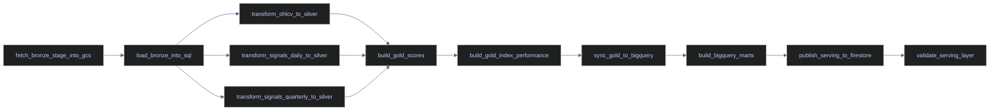

# Airflow DAG Patterns

This chapter does not use generic toy DAGs because the live platform already provides a better teaching surface. The actual workflow on `stoxx-airflow` expresses the design decisions that matter in production: explicit task boundaries, externalized compute, controlled parallelism, deterministic reruns, and a serving handoff that ends in Firestore and Eventarc.

## What This Note Covers

This note explains the real DAG patterns used by `stoxx_stage_yfinance` and why those patterns were chosen for the STOXX-only production demo pipeline.

- The exact orchestration shape from yfinance extraction to Firestore publication.
- How task boundaries map to Cloud Run jobs and command-line modes.
- Why silver transforms fan out in parallel and then converge.
- How reruns stay safe by pushing stateful data work into GCS, SQL Server, BigQuery, and Firestore instead of XCom.
- Which common Airflow patterns are deliberately not used yet, and what would have to change before they become worthwhile.

## Glossary / Key Terms

> [!info] Key Terms
>
> | Term | Definition | Why it matters here | Caveat |
> |---|---|---|---|
> | Thin orchestration | A DAG design where Airflow coordinates work but does not embed heavy processing logic. | The live DAG only launches Cloud Run jobs and checks their outcomes. | This requires good task boundaries outside Airflow. |
> | Fan-out | One upstream task unlocking several downstream tasks in parallel. | `load_bronze_into_sql` unlocks the three silver transform tasks. | Fan-out is only safe when the downstream tasks do not write conflicting targets. |
> | Fan-in | Several upstream tasks converging into one downstream task. | `build_gold_scores` waits for all three silver transforms. | The join point is only correct if every prerequisite is truly required. |
> | Idempotency | Re-running a task with the same input produces the same durable result. | The pipeline must survive retries and demo reruns safely. | Idempotency lives in the task payload code, not in Airflow alone. |
> | Task boundary | The unit of responsibility assigned to one Airflow task. | Each task maps to a distinct Cloud Run job or execution mode. | Bad boundaries create oversized retries or tangled failure domains. |
> | Overlap control | Preventing multiple full DAG runs from modifying the same state at the same time. | `max_active_runs=1` serializes the entire pipeline. | This reduces concurrency in exchange for deterministic state. |
> | Replay window | The slice of recent data deliberately reopened before a demo rerun. | Reset scripts trim recent bronze, silver, and gold rows so the DAG produces visible inserts again. | Replay logic must be narrow or it will destroy trusted history. |
> | Publication path | The downstream chain that turns analytical tables into serving data. | The live path is SQL gold -> BigQuery marts -> Firestore -> Eventarc. | A publication path often needs different SLAs than ingestion. |

## The Real End-To-End DAG Shape

The live DAG is explicit enough that the best pattern guide is the workflow itself.

### The Deployed Graph

The current DAG orchestrates one end-to-end path from market-data fetch to serving publication. It does not rely on cross-DAG sensors, dynamic task mapping, or dataset scheduling. The graph is kept direct so operators can reason about every dependency from the UI without hidden runtime expansion.



### A Real Successful Run Proves The Shape

The validated end-to-end serving run shows exactly how the graph behaved in production. The three silver tasks started in parallel, then converged before gold building began.

```text
stoxx_stage_yfinance | transform_ohlcv_to_silver             | success | 2026-04-13T17:32:52.958397+00:00 | 2026-04-13T17:34:07.065424+00:00
stoxx_stage_yfinance | transform_signals_daily_to_silver     | success | 2026-04-13T17:32:53.576918+00:00 | 2026-04-13T17:33:59.913948+00:00
stoxx_stage_yfinance | transform_signals_quarterly_to_silver | success | 2026-04-13T17:32:53.740656+00:00 | 2026-04-13T17:34:04.283928+00:00
stoxx_stage_yfinance | build_gold_scores                     | success | 2026-04-13T17:34:07.755655+00:00 | 2026-04-13T17:35:19.502117+00:00
```

That timing proves the fan-out and fan-in are not theoretical. Airflow actually ran the silver transforms concurrently and only released the next gold step when the last prerequisite finished.

## Pattern 1: Thin Orchestration With External Compute

The first and most important DAG pattern in the platform is architectural rather than syntactic: Airflow delegates real data processing to Cloud Run jobs.

### One Airflow Task Maps To One External Responsibility

The DAG definition below is representative of the live style. Each task names one operational boundary and invokes one Cloud Run job in one region with one explicit mode or step selection.

#### Read The Live Task Definitions

The following code is the actual orchestration surface from [stoxx_stage_yfinance.py](</C:/Users/aperi/My Drive/VAULT/.codex-temp/airflow-vm/dags/stoxx_stage_yfinance.py:1>).

> [!example] Real Airflow Task Boundaries
>
> ```python
> fetch_bronze_stage_into_gcs = CloudRunExecuteJobOperator(
>     task_id="fetch_bronze_stage_into_gcs",
>     project_id=PROJECT_ID,
>     region=REGION,
>     job_name=FETCH_JOB_NAME,
>     deferrable=False,
> )
>
> load_bronze_into_sql = CloudRunExecuteJobOperator(
>     task_id="load_bronze_into_sql",
>     project_id=PROJECT_ID,
>     region=REGION,
>     job_name=LOAD_JOB_NAME,
>     deferrable=False,
> )
>
> build_bigquery_marts = CloudRunExecuteJobOperator(
>     task_id="build_bigquery_marts",
>     project_id=PROJECT_ID,
>     region=REGION,
>     job_name=SERVING_JOB_NAME,
>     deferrable=False,
>     overrides={"container_overrides": [{"args": ["--mode=build-marts"]}]},
> )
> ```

This pattern matters because it keeps the DAG readable:

- task names describe business boundaries rather than implementation details
- Airflow knows only enough to launch and wait
- the data-processing code can evolve independently in its own container image

### The External Jobs Hold The Business Logic

The Airflow DAG stays small because the heavy code lives in the jobs it triggers.

#### Bronze Loading Logic Lives In The Bronze Loader

This excerpt from [load_stage.py](</C:/Users/aperi/My Drive/VAULT/.codex-temp/stoxx-bronze-load/load_stage.py:1>) shows that idempotent table loading is owned by the Cloud Run job, not by Airflow.

> [!example] Real Bronze Loader Logic
>
> ```python
> def load_ohlcv(cursor: pyodbc.Cursor, index_key: str, records: list[dict[str, Any]]) -> dict[str, int]:
>     table = bronze_ohlcv_table(index_key)
>     before = count_rows(cursor, table)
>     cursor.execute(f"SELECT symbol, CONVERT(VARCHAR(10), [date], 120), ISNULL(volume, 0) FROM {table}")
>     existing = {(row[0], row[1]): row[2] for row in cursor.fetchall()}
>
>     inserts: list[tuple[Any, ...]] = []
>     updates: list[tuple[Any, ...]] = []
>     for rec in records:
>         ...
>         if key not in existing:
>             inserts.append((symbol, date_value) + values)
>         elif (existing[key] or 0) == 0 and (to_int(rec.get("volume")) or 0) > 0:
>             updates.append(values + (symbol, date_value))
> ```

Airflow does not understand `symbol`, `date`, or merge semantics here. It only records whether the bronze-load task succeeded or failed.

#### The Transform Job Owns The Medallion Step Registry

The silver and gold transforms are not separate DAG files. They are step windows inside the Cloud Run job defined by [run_pipeline.py](</C:/Users/aperi/My Drive/VAULT/.codex-temp/stoxx-transforms/utils/run_pipeline.py:1>).

> [!example] Real Transform Step Registry
>
> ```python
> STEPS = [
>     (3,  "transform_ohlcv",            step_03_transform_ohlcv),
>     (8,  "transform_signals_daily",    step_08_transform_signals_daily),
>     (9,  "transform_signals_quarterly", step_09_transform_signals_quarterly),
>     (14, "transform_scores_daily",     step_14_transform_scores_daily),
>     (15, "transform_scores_quarterly", step_15_transform_scores_quarterly),
>     (16, "transform_index_performance", step_16_transform_index_performance),
> ]
> ```

This is why the DAG can ask the same Cloud Run job to do different things safely. Airflow provides the orchestration boundary; the transform container provides the internal step routing.

## Pattern 2: Controlled Fan-Out And Fan-In

The second real pattern is limited parallelism. The DAG does not parallelize everything. It only parallelizes the silver steps that write to disjoint targets and must all complete before the gold phase begins.

### Parallelize Only Where Write Sets Are Clean

The silver tasks are safe to parallelize because they target different downstream tables:

- `transform_ohlcv_to_silver` populates silver OHLCV tables
- `transform_signals_daily_to_silver` populates `silver.signals_daily`
- `transform_signals_quarterly_to_silver` populates `silver.signals_quarterly`

They share the bronze layer as input, but they do not race on the same silver target.

#### Read The Real Parallel Join

> [!example] Real Fan-Out And Fan-In
>
> ```python
> load_bronze_into_sql >> [
>     transform_ohlcv_to_silver,
>     transform_signals_daily_to_silver,
>     transform_signals_quarterly_to_silver,
> ]
> [
>     transform_ohlcv_to_silver,
>     transform_signals_daily_to_silver,
>     transform_signals_quarterly_to_silver,
> ] >> build_gold_scores
> ```

This join point is operationally correct because `build_gold_scores` depends on all three silver surfaces. If Airflow released gold scoring after only one of them, the resulting gold tables would be incomplete or inconsistent.

> [!danger] Fan-Out Without A Clean Join Is A Correctness Bug
>
> If one silver input is missing but gold computation proceeds anyway, the platform can publish stale or partial derived scores while still showing a superficially successful run.
>
> [!success] The Gold Join Encodes A Data Contract
>
> The current join makes the contract explicit: gold scoring is only valid when all prerequisite silver layers have succeeded in the same DAG run.

## Pattern 3: Parameterized External Steps Instead Of Many Tiny DAGs

The platform reuses two Cloud Run jobs, `stoxx-transforms` and `stoxx-serving`, by passing explicit mode arguments from Airflow rather than creating a new image or a new DAG per substep.

### Airflow Passes Modes And Step Windows Explicitly

This pattern is visible in both the transform and serving tasks.

#### Read The Real Parameterization

> [!example] Real Task Parameterization
>
> ```python
> transform_ohlcv_to_silver = CloudRunExecuteJobOperator(
>     task_id="transform_ohlcv_to_silver",
>     job_name=TRANSFORM_JOB_NAME,
>     overrides={"container_overrides": [{"args": ["--step=3"]}]},
> )
>
> build_gold_scores = CloudRunExecuteJobOperator(
>     task_id="build_gold_scores",
>     job_name=TRANSFORM_JOB_NAME,
>     overrides={"container_overrides": [{"args": ["--from=14", "--to=15"]}]},
> )
>
> publish_serving_to_firestore = CloudRunExecuteJobOperator(
>     task_id="publish_serving_to_firestore",
>     job_name=SERVING_JOB_NAME,
>     overrides={"container_overrides": [{"args": ["--mode=publish-firestore"]}]},
> )
> ```

This gives the platform three advantages:

- one image can expose several well-defined operational modes
- Airflow still has task-level visibility and retry control for each stage
- failures remain isolated to the specific mode that failed

### Why This Is Better Than One Giant End-To-End Task

Putting the whole pipeline behind one single `run_everything` Airflow task would destroy most of Airflow's value:

- no stage-level retry boundaries
- no clear graph view
- no visibility into which phase failed
- no selective reruns of bronze, silver, gold, or serving steps

By contrast, the live DAG uses parameterized external steps so the orchestration graph stays meaningful.

## Pattern 4: Idempotent Reruns And Demo Reset Windows

Airflow can retry tasks, but retries are only safe when the underlying task payloads are designed for reruns. The STOXX pipeline implements rerun safety in the task code and in the demo reset scripts.

### Bronze And Serving Steps Are Built For Re-Execution

The bronze loader reads a manifest, applies deterministic deletes or inserts, and commits one object at a time. The serving job recreates replica tables and rebuilds marts from source truth rather than trying to append blindly.

#### Read The Real Serving Rebuild Pattern

This excerpt from [stoxx_serving.py](</C:/Users/aperi/My Drive/VAULT/.codex-temp/stoxx-serving/stoxx_serving.py:1>) shows that the BigQuery replica layer is rebuilt explicitly.

> [!example] Real Replica Rebuild Pattern
>
> ```python
> def ensure_table(client: bigquery.Client, spec: ReplicaTable) -> None:
>     client.delete_table(spec.fq_name, not_found_ok=True)
>     table = bigquery.Table(spec.fq_name, schema=spec.schema)
>     ...
>     client.create_table(table, exists_ok=True)
>
> def load_rows(client: bigquery.Client, spec: ReplicaTable, rows: list[dict[str, Any]]) -> None:
>     job_config = bigquery.LoadJobConfig(
>         schema=spec.schema,
>         write_disposition=bigquery.WriteDisposition.WRITE_TRUNCATE,
>     )
> ```

This is not append-and-hope behavior. The serving publication path is deterministic because each run rebuilds the desired state from authoritative upstream tables.

### Demo Reruns Reopen Only The Recent Window

The platform also includes reset scripts that truncate only the recent bronze, silver, and gold window before a demonstration. That gives the next DAG run meaningful inserts and updates without destroying the rest of the history.

That reset pattern is separate from Airflow itself, but it is what makes manual reruns operationally useful. Airflow then reruns the same DAG against a deliberately reopened window and records a fresh, observable end-to-end run.

## Pattern 5: Explicit Publication Path Instead Of Hidden Side Effects

The last section of the DAG is deliberately publication-oriented. It does not stop at SQL gold.

### BigQuery And Firestore Are Separate Airflow Steps

The DAG has a visible publication chain:

- `sync_gold_to_bigquery`
- `build_bigquery_marts`
- `publish_serving_to_firestore`
- `validate_serving_layer`

That choice matters because analytical correctness and serving correctness are not the same checkpoint. A mart can build successfully while Firestore publication still fails, and a Firestore publish can succeed while validation still catches missing documents.

#### Read The Real Firestore Publication Trigger

This excerpt from [stoxx_serving.py](</C:/Users/aperi/My Drive/VAULT/.codex-temp/stoxx-serving/stoxx_serving.py:1>) shows that the serving step does more than copy rows. It updates the Firestore control document that the Eventarc demo path listens to.

> [!example] Real Firestore Control-Document Update
>
> ```python
> def publish_control_doc(db: firestore.Client, *, indexes: list[str], root_doc_count: int, ... ) -> None:
>     control_collection = os.environ.get("FIRESTORE_CONTROL_COLLECTION", "serving_control")
>     control_document = os.environ.get("FIRESTORE_CONTROL_DOCUMENT", "current")
>     publish_id = datetime.now(UTC).strftime("%Y%m%dT%H%M%S.%fZ")
>     payload = {
>         "publish_id": publish_id,
>         "pipeline": "stoxx_stage_yfinance",
>         "publisher": "stoxx-serving",
>         "database": os.environ.get("FIRESTORE_DATABASE", "main"),
>         ...
>     }
>     db.collection(control_collection).document(control_document).set(payload, merge=True)
> ```

That is why the Airflow DAG can end with `validate_serving_layer` and the separate GCP event path can later catch the Firestore control-document update.

## Patterns Deliberately Not Used Yet

Not every Airflow feature improves this pipeline. The absence of a feature can be a design decision rather than a missing maturity step.

### No Dynamic Task Mapping

The pipeline currently orchestrates exactly three index families:

- `euro_stoxx_50`
- `stoxx_asia_50`
- `stoxx_usa_50`

That set is stable, small, and operationally important enough that explicit tasks are clearer than runtime expansion.

### No Sensors Or Dataset Scheduling

The fetch, load, transform, and serving boundaries are all controlled inside one DAG run. There is no need yet for:

- a sensor that waits for another DAG
- dataset-triggered scheduling from one DAG to another
- external event-driven scheduling into Airflow

The Firestore-to-Eventarc path happens after the DAG, not as a prerequisite for it.

### No Pools Or Priority Weights Yet

The current deployment is single-DAG and demo-oriented. `max_active_runs=1` already serializes the full workflow. Pools and priority weights will matter when more DAGs compete for the same worker and Cloud Run quotas.

> [!warning] Do Not Add Features Before They Solve A Real Constraint
>
> Dynamic mapping, pools, datasets, and sensors all add operational surface area. In a small but stateful pipeline, every extra orchestration feature increases the number of failure modes operators must understand.
>
> [!success] The Current DAG Uses Only The Features It Needs
>
> Explicit dependencies, one executor model, one Google connection, one worker path, and one publication chain are enough to explain and operate the platform today.

## What To Remember

The real STOXX DAG uses five production-grade patterns that are worth copying:

- keep Airflow thin and move heavy logic into external jobs
- parallelize only where write sets are clean
- converge explicitly before downstream derived steps
- make reruns safe in the task payload, not just in the DAG
- expose the publication path as first-class Airflow tasks

Everything else in the chapter depends on these patterns: deployment hardens them, troubleshooting protects them, and the problems note explains what broke when those boundaries were violated.
