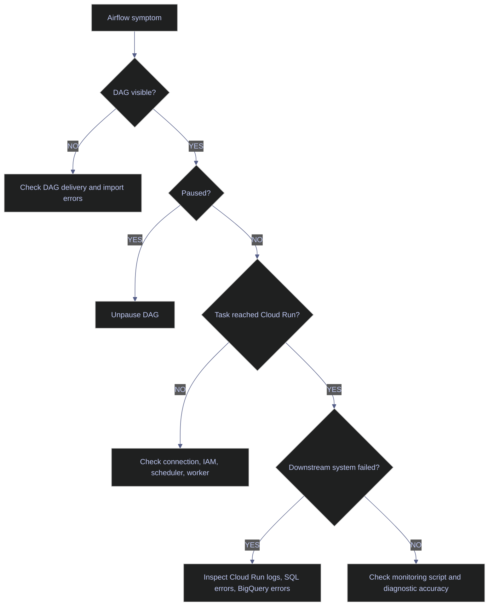

# Airflow Troubleshooting

This runbook is built from the failures that actually happened while bringing the STOXX Airflow pipeline online. It is not a generic list of Airflow symptoms. Every troubleshooting path below ties to a real command, a real output, a real root cause, and a fix that was validated on the live platform.

## What This Note Covers

This note gives the shortest reliable path from Airflow symptom to root cause for the current deployment on `stoxx-airflow`.

- How to tell whether the problem is DAG discovery, DAG pause state, container startup, Cloud Run execution, SQL permissions, BigQuery SQL, or a bad operator-side diagnostic.
- The exact commands and outputs that identified the real failures in this environment.
- The validation sequence that proved the platform was healthy again after each fix.

## Glossary / Key Terms

> [!info] Key Terms
>
> | Term | Definition | Why it matters here | Caveat |
> |---|---|---|---|
> | Import error | A DAG parse failure that stops Airflow from registering a workflow. | It is the first thing to eliminate when a DAG is missing. | A DAG can also be visible but paused, which is a different problem. |
> | Paused DAG | A DAG that Airflow knows about but will not schedule automatically. | `stoxx_stage_yfinance` was visible but paused during rollout. | Visibility in the DAG list does not guarantee schedulability. |
> | Queued task | A task instance that the scheduler has released but the executor has not yet completed. | It helps separate scheduler problems from downstream execution problems. | A queued task may still fail because the external service rejects the request. |
> | Downstream failure | A task failure caused by the system Airflow invoked rather than by Airflow itself. | Most STOXX task failures happened in Cloud Run, SQL Server, or BigQuery. | Airflow records the failure, but the real fix may live outside Airflow. |
> | False alarm | A failure signal produced by the diagnostic tool or monitoring wrapper rather than by the platform itself. | The SQL-escaping error in the DAG monitor loop looked like an Airflow outage but was not one. | False alarms waste incident time because they mimic real failures. |

## Triage Flow For This Platform

When the STOXX workflow looks broken, do not jump straight into Cloud Run or SQL logs. First isolate the failure surface.



The rest of the note follows that decision tree.

## Control-Plane Failures

Control-plane failures are problems with Airflow's ability to see, schedule, or keep its own services alive.

### The DAG Was Missing From The UI Or Suspected To Be Broken

The first task is to distinguish three very different states:

- the DAG file is not being parsed at all
- the DAG is parsed but paused
- the DAG is present and healthy, and the failure lives elsewhere

#### Problem

Operators suspected that the DAG might not have loaded correctly after a deployment.

#### Context

The goal was to confirm whether `stoxx_stage_yfinance` had been registered by the Airflow runtime and whether any import error blocked it.

#### Exact Command / Action

Run `airflow dags list | grep stoxx_stage_yfinance` and then `airflow dags list-import-errors`.

#### Actual Output / Logs

The rollout artifact recorded both checks together:

```text
stoxx_stage_yfinance | /opt/airflow/dags/stoxx_stage_yfinance.py | airflow | True      | dags-folder | None
stoxx_stage_yfinance | /opt/airflow/dags/stoxx_stage_yfinance.py | airflow | True      | dags-folder | None
...
---
No data found
```

#### Diagnosis

`No data found` in `list-import-errors` means there was no import error. The DAG was present in the catalog, so the issue was not parse-time failure. The `True` paused flag meant the real problem was scheduling state, not discovery.

#### Resolution

Treat this as a pause-state problem, not a DAG code problem. Do not start rewriting the DAG or restarting services until you confirm the pause flag.

#### Validation

After unpausing, the DAG catalog showed:

```text
stoxx_stage_yfinance | /opt/airflow/dags/stoxx_stage_yfinance.py | airflow | False     | dags-folder | None
```

#### Prevention Rule

Always run the visibility check and the import-error check together. A visible paused DAG and an invisible import-broken DAG are different incidents that require different fixes.

### The DAG Was Visible But Paused

This was the actual reason a later run did not advance when expected.

#### Problem

Airflow knew about the DAG, but the DAG remained paused after deployment.

#### Context

The goal was to start the live serving rollout through Airflow after refreshing the DAG and restarting services.

#### Exact Command / Action

Inspect the pause state, then unpause `stoxx_stage_yfinance`.

#### Actual Output / Logs

The pause-state artifact showed the before-and-after state:

```text
dag_id               | is_paused
=====================+==========
stoxx_stage_yfinance | True

stoxx_stage_yfinance | /opt/airflow/dags/stoxx_stage_yfinance.py | airflow | False     | dags-folder | None
```

#### Diagnosis

The workflow was operationally blocked by Airflow state, not by container health or DAG code. This is a common Airflow trap: visibility alone is not permission to schedule.

#### Resolution

Unpause the DAG before trying to trigger or monitor it.

#### Validation

After unpausing, the later full run `manual__2026-04-13T17:28:30Z_serving` completed with every task in `success`.

#### Prevention Rule

After every DAG deployment, add an explicit pause-state check to the validation checklist. Never assume a visible DAG is schedulable.

### Dag Processor Or Triggerer Looked Unhealthy Right After Restart

This is a real operational condition on the platform, but it is not always a persistent incident.

#### Problem

Immediately after a Compose restart, `airflow-dag-processor` and `airflow-triggerer` appeared unhealthy or stuck in `health: starting`.

#### Context

The goal was to refresh the Airflow stack after the serving extension was deployed.

#### Exact Command / Action

Restart the stack and inspect `docker compose ps` too early.

#### Actual Output / Logs

```text
time="2026-04-13T17:23:43Z" level=warning msg="The \"SERVING_JOB\" variable is not set. Defaulting to a blank string."
...
app-airflow-dag-processor-1   ... Up 7 seconds (health: starting)
app-airflow-triggerer-1       ... Up 8 seconds (health: starting)
app-airflow-worker-1          ... Up 1 second (health: starting)
```

#### Diagnosis

Two things were happening at once:

- the services were still inside their normal startup window
- the blank `SERVING_JOB` variable had created configuration drift that made the restart noisy and suspect

This was not the same as a proven long-lived unhealthy container state.

#### Resolution

Fix the Compose default for `SERVING_JOB`, restart again, and wait for the health checks to settle before declaring an incident.

#### Validation

The later steady-state `docker compose ps` output showed:

```text
app-airflow-dag-processor-1   ... Up 2 hours (healthy)
app-airflow-triggerer-1       ... Up 2 hours (healthy)
```

#### Prevention Rule

Do not treat `health: starting` as a final diagnosis during the first seconds after restart. Wait for the health-check window, then reassess the state with a second `compose ps`.

## Execution-Plane Failures

Execution-plane failures occur after Airflow has already accepted the DAG and attempted to run a task. At that point, the fault may still be inside Airflow, but on this platform it more often lives in a downstream service.

### Cloud Run Job Could Not Start Because The Network Configuration Was Wrong

This failure looked like an Airflow task problem from the UI, but the root cause was Cloud Run networking.

#### Problem

The serving job failed before the container code could run because the configured VPC connector did not exist.

#### Context

The goal was to execute the `stoxx-serving` job from Airflow for the `sync-replica` step.

#### Exact Command / Action

Airflow launched the Cloud Run job using a configuration that referenced a nonexistent VPC connector.

#### Actual Output / Logs

```text
X VPC connector projects/bq-wh-nb/locations/europe-west1/connectors/default does not exist, or Cloud
Run does not have permission to use it.
```

#### Diagnosis

The job was configured as if a named connector existed, but the platform actually used direct network and subnet settings instead of a connector resource. Airflow only reported the job failure; Cloud Run explained the real cause.

#### Resolution

Redeploy the job using direct VPC networking:

- `--network=default`
- `--subnet=default`
- `--vpc-egress=private-ranges-only`

#### Validation

Later serving executions advanced past job creation and reached container execution and BigQuery SQL, proving the network boundary had been fixed.

#### Prevention Rule

Do not assume that a network name and a VPC connector name are interchangeable. Validate the exact Cloud Run networking mode during deployment, not after the first DAG failure.

### SQL Transform Step Failed Because The Pipeline Login Lacked Read Permission On Silver Tables

This was a downstream SQL authorization fault surfaced through a Cloud Run task.

#### Problem

`transform_ohlcv_to_silver` failed with a SQL `229` permission error.

#### Context

The goal was to run the silver OHLCV transformation as step `3` inside the `stoxx-transforms` Cloud Run job.

#### Exact Command / Action

Airflow launched the transform task, which connected to SQL Server using the `stoxx_pipeline` login and attempted to read the silver table.

#### Actual Output / Logs

```text
pyodbc.ProgrammingError: ('42000', "[42000] [Microsoft][ODBC Driver 18 for SQL Server][SQL Server]The SELECT permission was denied on the object 'eurostoxx50_ohlcv', database 'stoxx', schema 'silver'. (229) (SQLExecDirectW)")
ERROR | Step 3 (transform_ohlcv) failed | step=pipeline step_num=3 step_name=transform_ohlcv
```

#### Diagnosis

The pipeline login had enough permission to execute part of the transform path but not enough to read the silver object used by the transform logic. Airflow was healthy; the task payload was underprivileged.

#### Resolution

Grant the missing transform permissions to the pipeline login on the affected schemas and tables.

#### Validation

After the grant, the transform steps for OHLCV, daily signals, and quarterly signals succeeded, and the DAG advanced into the gold tasks.

#### Prevention Rule

For service logins, test the full read-and-write path of each transform stage. A loader account and a transform account often need different privileges even when they hit the same database.

### BigQuery Mart Build Failed Because The SQL Shape Was Unsupported

This was a mart-design problem, not an Airflow problem.

#### Problem

`build_bigquery_marts` failed with a BigQuery `400` because the factsheet SQL used a correlated subquery pattern that BigQuery could not de-correlate.

#### Context

The goal was to build the serving marts after syncing the replica layer to BigQuery.

#### Exact Command / Action

Airflow launched the `stoxx-serving` job with `--mode=build-marts`.

#### Actual Output / Logs

```text
google.api_core.exceptions.BadRequest: 400 GET https://bigquery.googleapis.com/...:
Correlated subqueries that reference other tables are not supported unless they can be de-correlated,
such as by transforming them into an efficient JOIN.
```

#### Diagnosis

The mart SQL was logically valid as an analytical idea but invalid for BigQuery's execution rules. Airflow did exactly what it should do: record the failure of the downstream build step.

#### Resolution

Rewrite the mart SQL to use pre-aggregated CTEs and arrays instead of the unsupported correlated-subquery pattern.

#### Validation

After the SQL rewrite, `build_bigquery_marts` succeeded in the final DAG run and the serving chain advanced into Firestore publication.

#### Prevention Rule

Test non-trivial BigQuery SQL directly against BigQuery before wiring it into Airflow. Airflow is the wrong place to discover engine-specific SQL limits for the first time.

## Diagnostic Mistakes That Looked Like Incidents

Not every red screen or repeated error line was a real platform fault. One of the most misleading failure trails came from the monitoring loop itself.

### The Monitoring Query Was Broken, Not The DAG

This problem mattered because it created the appearance of repeated Airflow failure while the actual DAG run continued.

#### Problem

A monitoring loop generated repeated SQL syntax errors referencing `stoxx_stage_yfinance`.

#### Context

The goal was to poll DAG and task state repeatedly from the Airflow metadata database during the live run.

#### Exact Command / Action

The monitoring wrapper issued SQL with incorrectly escaped quoted identifiers inside the loop.

#### Actual Output / Logs

```text
ERROR:  syntax error at or near "stoxx_stage_yfinance"
LINE 1: ... HH24:MI:SS TZ'), '') FROM dag_run WHERE dag_id=''stoxx_stag...
                                                             ^
...
ERROR:  syntax error at or near "stoxx_stage_yfinance"
LINE 1: ...MI:SS TZ'), '') FROM task_instance WHERE dag_id=''stoxx_stag...
```

#### Diagnosis

The query string itself was malformed. The Airflow platform was not reporting a DAG failure; the diagnostic tool was failing before it could read the metadata database correctly.

#### Resolution

Stop using the broken monitor loop and validate state through the native Airflow CLI commands such as `airflow tasks states-for-dag-run`.

#### Validation

The DAG later completed successfully with every task instance in `success`, proving the monitor loop was the faulty component.

#### Prevention Rule

Treat ad-hoc monitoring wrappers as code with their own failure modes. When a custom monitor reports repeated SQL syntax errors, verify the same state through a native CLI before escalating.

## Post-Fix Validation

Every fix in this note ultimately flowed into the same validation surface: the DAG had to complete, not just start.

### Use The Final DAG-Run State Table As The Ground Truth

Once a fix is applied, the fastest trustworthy validation is the task-state table for the full DAG run.

#### Problem

A fix is not complete until the entire workflow reaches the final validation task successfully.

#### Context

The goal is to prove that the control plane, Cloud Run jobs, SQL transforms, BigQuery marts, and Firestore publication all worked together after the fix.

#### Exact Command / Action

Run `airflow tasks states-for-dag-run` for the target run.

#### Actual Output / Logs

```text
stoxx_stage_yfinance | fetch_bronze_stage_into_gcs           | success
stoxx_stage_yfinance | load_bronze_into_sql                  | success
stoxx_stage_yfinance | transform_ohlcv_to_silver             | success
stoxx_stage_yfinance | transform_signals_daily_to_silver     | success
stoxx_stage_yfinance | transform_signals_quarterly_to_silver | success
stoxx_stage_yfinance | build_gold_scores                     | success
stoxx_stage_yfinance | build_gold_index_performance          | success
stoxx_stage_yfinance | sync_gold_to_bigquery                 | success
stoxx_stage_yfinance | build_bigquery_marts                  | success
stoxx_stage_yfinance | publish_serving_to_firestore          | success
stoxx_stage_yfinance | validate_serving_layer                | success
```

#### Diagnosis

The platform is healthy only when the final validation task succeeds. Intermediate success is not enough.

#### Resolution

Use the final task-state table as the standard post-fix sign-off artifact.

#### Validation

The validated full run was `manual__2026-04-13T17:28:30Z_serving`.

#### Prevention Rule

Never sign off a fix based only on one restarted container or one successful intermediate task. Validate the full orchestration chain.

## What To Remember

Troubleshooting this platform is easiest when you keep the layers separate:

- first decide whether the problem is Airflow discovery, Airflow scheduling state, or downstream execution
- then inspect the native output of the layer that actually failed
- finally validate the whole DAG run, not just the local fix

The next note steps back from individual incidents and captures the recurring architectural mistakes and guardrails that these failures exposed.
