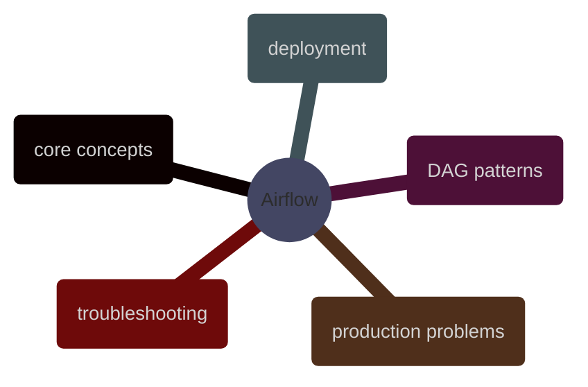

# Airflow

Apache Airflow for programmatic workflow orchestration, explained through the live STOXX Airflow 3.2 deployment on `stoxx-airflow` and the real DAG that orchestrates Cloud Run, SQL Server, BigQuery, Firestore, and Eventarc.

> [!abstract]- [[01-airflow-core-concepts]]
>
> Airflow fundamentals grounded in the live `stoxx_stage_yfinance` deployment: scheduler, dag processor, worker, triggerer, metadata DB, `CeleryExecutor`, `google_cloud_default`, and the real distinction between orchestration state and external compute.

> [!abstract]- [[02-airflow-dag-patterns]]
>
> Real DAG patterns from the STOXX pipeline: thin orchestration, Cloud Run task boundaries, silver fan-out and gold fan-in, idempotent reruns, publication into BigQuery and Firestore, and the Airflow features intentionally not used yet.

> [!abstract]- [[03-airflow-deployment]]
>
> The actual deployment story for the live platform: private Compute Engine VM, Docker Compose topology, Google provider wiring, DAG delivery onto the mounted `dags/` path, runtime validation, and the real setup failures and fixes.

> [!abstract]- [[05-airflow-problems]]
>
> The real production mistakes and guardrails that emerged during rollout: hidden Airflow dependencies, IAM drift, blank environment defaults, bad network assumptions, incomplete SQL privileges, invalid BigQuery SQL, and false incidents caused by broken diagnostics.

> [!abstract]- [[04-airflow-troubleshooting]]
>
> An operational runbook built from the actual incidents on `stoxx-airflow`: DAG visibility vs pause-state checks, startup health interpretation, Cloud Run execution failures, SQL permission errors, BigQuery mart failures, and validation of the final end-to-end serving run.
