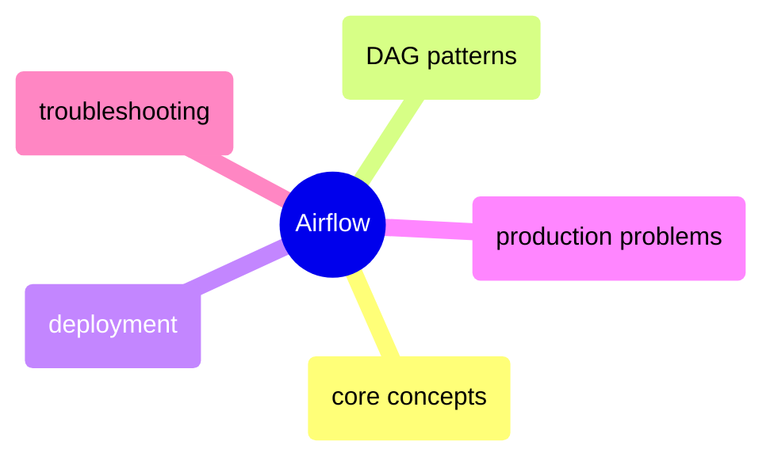

# Airflow

Apache Airflow for programmatic workflow orchestration — architecture, DAG authoring, production deployment, common failure modes, and troubleshooting.

> [!abstract]- [[01-airflow-core-concepts]]
>
> Airflow architecture (Scheduler, Webserver, Worker, Metadata DB), DAG structure, Operators (Bash, Python, Kubernetes), Sensors, Hooks, XComs for cross-task communication, the TaskFlow API, Connections and Variables, and a comparison of all Executor types (Sequential, Local, Celery, Kubernetes).

> [!abstract]- [[02-airflow-dag-patterns]]
>
> Task dependency syntax (bitshift operators, chain, cross_downstream), TaskGroups for visual grouping, dynamic DAG generation, BranchPythonOperator for conditional paths, trigger rules, idempotent pipeline design, backfill strategies, parameterized DAGs, dataset-driven scheduling, and SLA/callback configuration.

> [!abstract]- [[03-airflow-deployment]]
>
> Local Docker Compose setup, self-hosted Airflow on GCE, GCP Cloud Composer (managed), AWS MWAA, airflow.cfg configuration reference, DAG deployment strategies (git-sync, GCS bucket), secrets management with GCP Secret Manager, monitoring with StatsD, and cost comparisons across deployment options.

> [!abstract]- [[05-airflow-problems]]
>
> 25 production problems ranked by severity including scheduler crash/hang, zombie tasks, tasks stuck in queued, metadata DB deadlocks, worker OOM kills, DAG import errors at scale, and prevention protocols for financial pipeline SLAs.

> [!abstract]- [[04-airflow-troubleshooting]]
>
> DAG import error diagnosis, task failure debugging, scheduler not picking up DAGs, tasks stuck in queued or running, metadata DB connection refused, XCom size limits, worker OOM, zombie task cleanup, and key CLI commands.
