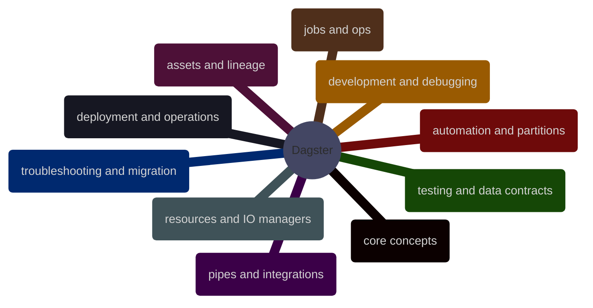

# Dagster

Dagster for modern data orchestration, structured from first principles to production-grade platform design. This chapter is intentionally broader than the Airflow section because Dagster's current model spans asset graphs, declarative automation, testing, data contracts, external compute, and deployment choices across OSS and Dagster+.

> [!abstract]- [[01-dagster-core-concepts]]
>
> Dagster from first principles: assets, definitions, code locations, runs, materializations, the control plane, and the mental shift from DAG-first orchestration to asset-first orchestration.

> [!abstract]- [[02-dagster-assets-and-lineage]]
>
> Software-defined assets as the primary modeling surface: dependencies, asset groups, metadata, observations, partitions at the asset layer, and how lineage becomes the operating model.

> [!abstract]- [[03-dagster-resources-config-and-io-managers]]
>
> The runtime plumbing that makes asset code production-safe: resources, config, I/O managers, external resource boundaries, reusable components, and how data moves between compute and storage.

> [!abstract]- [[04-dagster-ops-jobs-and-graphs]]
>
> The lower-level Dagster building blocks used when asset-first modeling is not enough: ops, graphs, jobs, retries, hooks, and hybrid designs that mix imperative orchestration with asset definitions.

> [!abstract]- [[05-dagster-automation-and-partitions]]
>
> How Dagster decides what should run and when: schedules, sensors, asset sensors, declarative automation, partitioned assets, backfills, and safe re-execution strategies.

> [!abstract]- [[06-dagster-pipes-dbt-and-external-systems]]
>
> Professional integration patterns for external compute and analytics stacks: Dagster Pipes, dbt, warehouse jobs, container workloads, and when orchestration should trigger work instead of hosting it.

> [!abstract]- [[07-dagster-development-ui-and-debugging]]
>
> Daily engineering workflow in Dagster: project structure, local development, the UI, asset selection, logs, run inspection, and how to debug definitions without turning the instance into a black box.

> [!abstract]- [[08-dagster-testing-asset-checks-and-data-contracts]]
>
> Testability and quality controls in Dagster: unit tests for assets and ops, mocked resources, partition-aware tests, asset checks, and data-contract patterns that belong in professional pipelines.

> [!abstract]- [[09-dagster-deployment-and-production-operations]]
>
> Running Dagster in real environments: OSS versus Dagster+, webserver and daemon responsibilities, executors, concurrency, packaging, secrets, CI/CD, and the move from development to production.

> [!abstract]- [[10-dagster-troubleshooting-anti-patterns-and-airflow-migration]]
>
> Failure analysis and design guardrails: stuck runs, noisy sensors, bad partitioning, broken code locations, monolithic assets, side-effect-heavy orchestration, and how to translate Airflow habits into Dagster safely.
