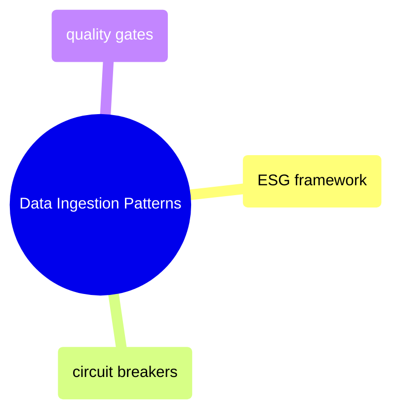

# Data Ingestion Patterns

A domain-specific ingestion framework for multi-vendor ESG data that combines scheduling, quality gates, and anomaly detection into a production pipeline pattern.

```mermaid
mindmap
  ((Data Ingestion Patterns))
    (ESG framework)
    (circuit breakers)
    (quality gates)
```
