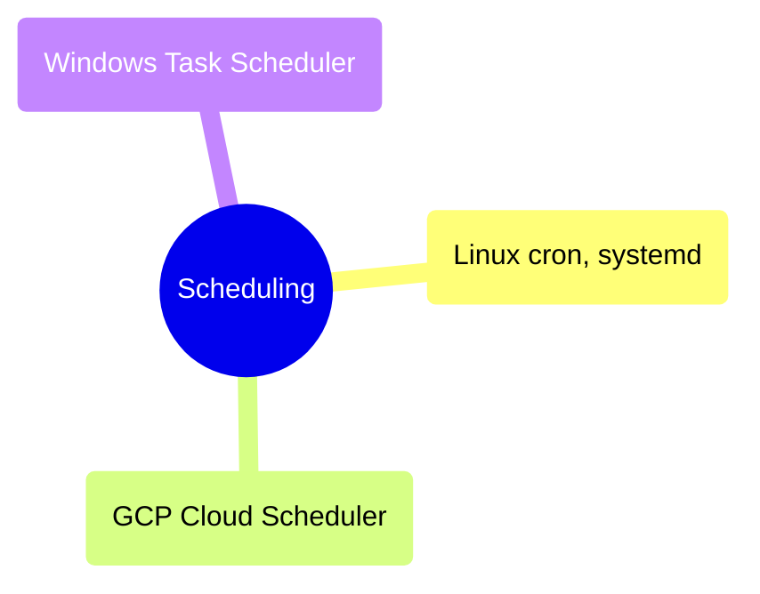

# Scheduling

Platform-native scheduling tools for recurring jobs that do not require a full orchestration framework — Linux cron and systemd timers, GCP Cloud Scheduler and Cloud Workflows, and Windows Task Scheduler.

> [!abstract]- [linux-scheduling](https://alp78.github.io/elysium/12-Orchestration/Scheduling/linux-scheduling)
>
> Cron syntax and crontab management, systemd timers with OnCalendar, at/batch for one-time jobs, anacron for intermittent machines, overlap prevention with flock, cron environment and PATH gotchas, SSH configuration for remote scheduling, and a decision table for cron vs Airflow vs Cloud Scheduler.

> [!abstract]- [[03-gcp-scheduling]]
>
> Cloud Scheduler (managed cron-as-a-service) with HTTP, Pub/Sub, and App Engine targets, Cloud Tasks for durable rate-limited queues, Cloud Workflows for multi-step serverless orchestration, Eventarc for event-driven triggers, wiring patterns for Cloud Run jobs and Cloud Functions, and a cost/capability comparison across all four services.

> [!abstract]- [[02-windows-scheduling]]
>
> schtasks.exe (legacy CLI), PowerShell ScheduledTasks module (Register-ScheduledTask, triggers, settings), PSScheduledJob for native PowerShell output, data engineering patterns for SSIS/sqlcmd/Python pipelines, event-based triggers (ONLOGON, ONEVENT), and a mapping to Linux cron equivalents.

> [!abstract]- [[01-linux-scheduling]]
