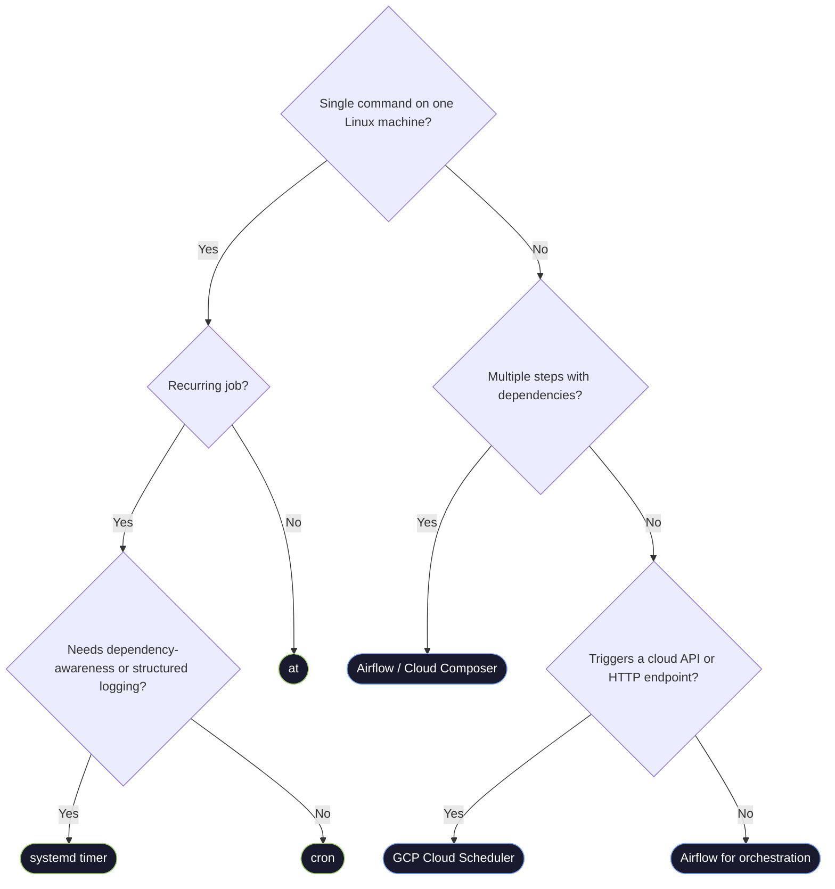

# Linux Task Scheduling — Cron, Systemd Timers, at, and Anacron

> [!quote]
> "As an industry we've been pushing: Automate. Automate. Automate. We should have been saying: Understand. Understand. Understand."
> — **Kelsey Hightower**

Linux task scheduling encompasses every mechanism for running commands automatically at a specified time or interval: cron for recurring jobs, systemd timers for dependency-aware scheduling, `at` for one-time future execution, and anacron for machines that are not always powered on. This reference covers all four tools plus SSH configuration for remote scheduling, data engineering patterns, and a decision framework for when to use cron vs Airflow vs Cloud Scheduler.

> [!info] Source
> Core content in sections 1 and 5 is derived verbatim from *The Senior Data Engineer Book*, Chapters 19 and 20. Substantial additional content has been added throughout.

---

## Cron and Crontab

Cron is the simplest scheduler — it runs commands at specified intervals on a single machine. For lightweight tasks (backup scripts, health checks, log rotation), cron is the right tool. For complex pipelines with dependencies, retries, and monitoring, use [Airflow](https://alp78.github.io/elysium/12-Orchestration/Airflow/airflow-core-concepts).

### Crontab Syntax Diagram

The crontab format uses five time fields followed by the command. Memorize this diagram:

```
┌───────── minute        (0–59)
│ ┌───────── hour          (0–23)
│ │ ┌───────── day of month  (1–31)
│ │ │ ┌───────── month         (1–12)  or jan,feb,...,dec
│ │ │ │ ┌───────── day of week   (0–7)   0 and 7 = Sunday, or sun,mon,...,sat
│ │ │ │ │
* * * * *  command to execute
```

#### Field operators

| Operator | Meaning | Example |
|---|---|---|
| `*` | Every value in the field | `* * * * *` = every minute |
| `,` | List of values | `0,30 * * * *` = on the hour and half-hour |
| `-` | Range of values | `1-5` in day-of-week = Mon–Fri |
| `/` | Step / interval | `*/5` = every 5th unit |
| `L` | Last (day-of-month only, some crond) | `0 2 L * *` = last day of month at 02:00 |
| `#` | Nth occurrence (some crond) | `0 9 * * 1#1` = first Monday at 09:00 |

> [!warning] Day-of-week numbering
> Both `0` and `7` mean Sunday in standard cron. Vixie cron (the most common Linux implementation) accepts `0–7`. Always verify on your target system.

### Crontab Management Commands

#### Edit the current user's crontab

```bash
# Edit the current user's crontab
crontab -e
# Opens the crontab file in your default editor

# Crontab format:
# ┌───────── minute (0-59)
# │ ┌───────── hour (0-23)
# │ │ ┌───────── day of month (1-31)
# │ │ │ ┌───────── month (1-12)
# │ │ │ │ ┌───────── day of week (0-7, 0 and 7 = Sunday)
# │ │ │ │ │
# * * * * * command to execute

# Examples:
0 9,17,22 * * 1-5  /home/airflow/scripts/run_pipeline.sh
# At 09:00, 17:00, 22:00 on weekdays (Mon-Fri)

*/5 * * * *  /home/airflow/scripts/pulse_check.sh
# Every 5 minutes (*/5 = every 5th minute)

0 2 * * 0  /home/airflow/scripts/weekly_maintenance.sh
# At 02:00 on Sundays (day 0)

# List current crontab
crontab -l

# CRITICAL: cron runs with a minimal environment (no .bashrc, no PATH modifications)
# Always use full paths in crontab:
0 * * * * /usr/bin/python3 /home/pipeline/scripts/check.py >> /var/log/pipeline/check.log 2>&1
# Full path to python3, full path to script, redirect output to log file
```

#### Full crontab management

```bash
# List all cron jobs for the current user
crontab -l

# Edit the crontab (opens $EDITOR, default is vi or nano)
crontab -e

# Remove (delete) the entire crontab — no confirmation prompt
crontab -r

# Remove crontab with confirmation prompt (safer than bare -r)
crontab -i -r

# Edit another user's crontab (requires root)
sudo crontab -e -u www-data
sudo crontab -l -u airflow

# Install a crontab from a file (overwrites existing)
crontab /path/to/my-crontab.txt

# Export current crontab to a file (version control it)
crontab -l > ~/crontab-backup.txt
```

> [!tip] Version-control your crontab
> Export `crontab -l > crontab.txt` and commit it to git. This gives you a history of schedule changes and makes recovery trivial after accidental `crontab -r`.

### Common Schedule Patterns

#### Cron schedule — every N minutes

Use the step syntax `*/N` in the minute field to run at regular intervals within each hour.

```bash
*/5  * * * *   command    # every 5 minutes
*/10 * * * *   command    # every 10 minutes
*/15 * * * *   command    # every 15 minutes
*/30 * * * *   command    # every 30 minutes
```

#### Cron schedule — hourly variants

Pin a specific minute (or multiple minutes) with `*` in the hour field.

```bash
0    * * * *   command    # at the top of every hour (XX:00)
30   * * * *   command    # at XX:30 every hour (half-past)
15,45 * * * *  command    # at XX:15 and XX:45
```

#### Cron schedule — daily

Set minute and hour to fixed values with `* * *` for the remaining fields.

```bash
0  3 * * *     command    # every day at 03:00 AM
0  6 * * *     command    # every day at 06:00 AM
30 23 * * *    command    # every day at 23:30
```

#### Cron schedule — weekdays only

Use `1-5` (Monday through Friday) in the day-of-week field. Comma-separated lists also work.

```bash
0 9,17,22 * * 1-5   command    # 09:00, 17:00, 22:00 Mon–Fri
0 7       * * 1-5   command    # 07:00 Mon–Fri
0 6       * * 1,2,3,4,5  command  # same as above, explicit
```

#### Cron schedule — weekends only

Saturday is `6`, Sunday is `0` (or `7` in some crond implementations).

```bash
0 2 * * 6,0   command    # 02:00 on Saturday and Sunday
0 2 * * 6-7   command    # 02:00 on Saturday and Sunday (7=Sun in some crond)
```

#### Cron schedule — weekly

Set the day-of-week field to a single day (`0` = Sunday, `1` = Monday, etc.).

```bash
0 2 * * 0     command    # 02:00 every Sunday
0 2 * * 1     command    # 02:00 every Monday
```

#### Cron schedule — monthly

Set the day-of-month field to a fixed date (or comma-separated dates).

```bash
0 0 1 * *     command    # midnight on the 1st of every month
0 6 15 * *    command    # 06:00 on the 15th of every month
0 0 1,15 * *  command    # midnight on the 1st and 15th
```

#### Cron schedule — specific day-of-month and day-of-week combos

> [!warning] Day-of-month and day-of-week are OR'd, not AND'd
> In standard Vixie cron, `0 6 1 * 1` means 06:00 on the 1st **or** any Monday -- not both. To target the first Monday of the month, restrict the day-of-month range to `1-7` and guard inside the script. For precise calendar targeting, switch to systemd timers with `OnCalendar=Mon *-*-1..7`.

```bash
0 6 1-7 * 1   /path/script.sh  # runs every Monday + every 1st–7th
# Script body: [ $(date +\%u) -eq 1 ] || exit 0  — only proceed if it's Monday
```

#### Cron schedule — yearly

Set both month and day-of-month to fixed values.

```bash
0 0 1 1 *     command    # midnight on January 1st each year
```

### Special Strings (@reboot, @daily, etc.)

Vixie cron and most modern crond implementations support `@string` shortcuts:

```bash
# Special strings (equivalent cron expressions shown as comments):
@reboot    command    # run once at system startup (no cron equivalent)
@yearly    command    # 0 0 1 1 *     — midnight Jan 1
@annually  command    # 0 0 1 1 *     — same as @yearly
@monthly   command    # 0 0 1 * *     — midnight on 1st of month
@weekly    command    # 0 0 * * 0     — midnight Sunday
@daily     command    # 0 0 * * *     — midnight every day
@midnight  command    # 0 0 * * *     — same as @daily
@hourly    command    # 0 * * * *     — top of every hour

# Practical examples:
@reboot    /usr/local/bin/start_pipeline_agent.sh
@daily     /usr/bin/find /var/log/pipeline -name "*.log" -mtime +30 -delete  # see [finding-files](https://alp78.github.io/elysium/01-Shell/File-Operations/finding-files) for more find patterns
@weekly    /home/airflow/scripts/weekly_maintenance.sh
@monthly   /home/airflow/scripts/monthly_report.sh
```

> [!info] @reboot timing
> `@reboot` jobs run after the cron daemon itself starts, not at the very first moment of boot. There can be a delay of several seconds to minutes depending on the system. For precise boot-time ordering, use a systemd service with `After=network.target` instead.

### Environment in Cron

Cron runs with a stripped-down environment — no `.bashrc`, no `.bash_profile`, no PATH additions from your shell config.

> [!info] Default cron PATH
> Cron's default PATH is typically just `/usr/bin:/bin`, which means `python3`, `pip`, `virtualenv`, `gcloud`, `bq`, and most other tools you rely on are missing.

#### Cron environment — set variables at the top of the crontab

Add variable assignments above the schedule lines in `crontab -e`. Cron applies them to all subsequent jobs.

```bash
SHELL=/bin/bash
PATH=/usr/local/sbin:/usr/local/bin:/usr/sbin:/usr/bin:/sbin:/bin:/snap/bin:/home/pipeline/.local/bin
MAILTO=oncall@example.com
TZ=UTC
```

#### Cron environment — source your environment inside the script

Load `.bashrc` or `.env` at the top of the wrapper script so the cron job inherits the same PATH and secrets as your interactive shell.

```bash
#!/bin/bash
set -euo pipefail                    # see [defensive-scripting](https://alp78.github.io/elysium/01-Shell/Scripting/defensive-scripting) for why this matters
source /home/pipeline/.bashrc       # loads aliases and PATH changes
source /home/pipeline/.env          # loads environment-specific secrets
exec /home/pipeline/scripts/main.py "$@"
```

#### Cron environment — use full absolute paths everywhere

The safest and most portable approach. No dependency on PATH at all.

```bash
0 * * * * /usr/bin/python3 /home/pipeline/scripts/check.py >> /var/log/pipeline/check.log 2>&1
```

#### Cron environment — activate a virtualenv inside the cron job

Either source the `activate` script, or call the venv's Python binary directly (more robust since it avoids `source` in a non-interactive shell).

```bash
0 3 * * * source /home/pipeline/venv/bin/activate && python /home/pipeline/etl/run.py

# Or more robustly, call the venv python directly:
0 3 * * * /home/pipeline/venv/bin/python /home/pipeline/etl/run.py >> /var/log/pipeline/etl.log 2>&1
```

#### Cron environment — explicit timezone in crontab

Set `TZ` in the crontab to decouple schedule times from the server's local timezone.

```bash
TZ=UTC
0 3 * * * /path/to/script.sh    # runs at 03:00 UTC regardless of server TZ

# Check current system timezone
timedatectl
# Output: Time zone: Europe/Berlin (CET, +0100)

# Change system timezone (affects all cron jobs without explicit TZ)
sudo timedatectl set-timezone UTC
```

> [!warning] Cron PATH issues
>
> This is the #1 source of "it works in terminal but not in cron." Always test a failing cron job by running it exactly as cron would: `env -i HOME=/root SHELL=/bin/bash PATH=/usr/bin:/bin /path/to/your/script.sh`. This strips your environment down to cron's defaults and surfaces missing PATH entries immediately.

#### PowerShell equivalent (Windows Task Scheduler environment)

```powershell
# Windows Task Scheduler also runs with a minimal environment
# Set environment variables in the action's "Start in" field or in the script itself

# Check current PATH in a scheduled task context:
$env:PATH

# Add to PATH at the start of a scheduled PowerShell script:
$env:PATH += ";C:\Python312;C:\Python312\Scripts;C:\tools\gcloud\bin"

# Or set permanent user/system environment variables:
[System.Environment]::SetEnvironmentVariable("PIPELINE_ENV", "production", "Machine")

# Create a scheduled task (Task Scheduler equivalent of crontab):
$action = New-ScheduledTaskAction -Execute "powershell.exe" `
    -Argument "-NonInteractive -File C:\scripts\run_pipeline.ps1"
$trigger = New-ScheduledTaskTrigger -Daily -At "03:00"
$settings = New-ScheduledTaskSettingsSet -ExecutionTimeLimit (New-TimeSpan -Hours 2)
Register-ScheduledTask -TaskName "DailyETL" -Action $action `
    -Trigger $trigger -Settings $settings -RunLevel Highest
```

### Output Handling — Redirect, MAILTO, and Logging

#### Cron output — default behavior

If `MAILTO` is not set and a mail transport is configured, cron emails both stdout and stderr to the local user. On most servers this piles up silently in `/var/spool/mail/$USER`.

#### Cron output — discard all output (silent mode)

> [!warning] Silent mode hides failures
> Discarding all output means you will never know if a job failed unless you add separate health checks or alerting.

```bash
0 * * * * /path/to/script.sh > /dev/null 2>&1
# > /dev/null    = discard stdout
# 2>&1           = redirect stderr to where stdout goes (also /dev/null)
```

#### Cron output — log stdout only

Stderr still goes to the cron email (or is lost if mail is not configured).

```bash
0 * * * * /path/to/script.sh >> /var/log/pipeline/check.log
```

#### Cron output — log both stdout and stderr (recommended)

Use `>>` to append rather than overwrite, preserving history across runs.

```bash
0 * * * * /path/to/script.sh >> /var/log/pipeline/check.log 2>&1
```

#### Cron output — timestamped logging

Prepend a timestamp before each run, or define a `log()` function inside the script for per-line timestamps.

```bash
0 * * * * echo "[$(date '+%Y-%m-%d %H:%M:%S')] Starting" >> /var/log/pipeline/check.log 2>&1 && \
           /path/to/script.sh >> /var/log/pipeline/check.log 2>&1

# Or add timestamps inside the script with a logger function:
# log() { echo "[$(date '+%Y-%m-%d %H:%M:%S')] $*"; }
```

#### Cron output — email notifications via MAILTO

Set `MAILTO` at the top of the crontab to control where cron sends output.

```bash
MAILTO=oncall@example.com          # email all output to this address
MAILTO=""                          # suppress all email
```

#### Cron output — log rotation with logrotate

Prevent log files from growing forever by adding a logrotate config in `/etc/logrotate.d/`.

```bash
# /etc/logrotate.d/pipeline:
/var/log/pipeline/*.log {
    daily
    rotate 30
    compress
    delaycompress
    missingok
    notifempty
}
```

#### Cron output — write to syslog with logger

Pipe output to `logger` when you already aggregate syslog centrally. View entries with `journalctl -t pipeline-check`.

```bash
0 * * * * /path/to/script.sh 2>&1 | /usr/bin/logger -t pipeline-check
```

#### PowerShell equivalent (Windows logging)

```powershell
# Redirect output in a scheduled PowerShell task:
Start-Transcript -Path "C:\logs\pipeline\etl-$(Get-Date -Format 'yyyyMMdd').log" -Append
try {
    # ... your script logic ...
} catch {
    Write-Error "Pipeline failed: $_"
    exit 1
} finally {
    Stop-Transcript
}

# Write to Windows Event Log:
Write-EventLog -LogName Application -Source "PipelineJob" `
    -EntryType Information -EventId 1001 -Message "Pipeline completed successfully"
```

### Overlap Prevention with flock

When a cron job's execution time exceeds its schedule interval, multiple instances run simultaneously. For pipelines that write to databases or files, this causes corruption, duplicate records, and resource exhaustion.

#### flock — basic usage in crontab

`flock -n` is non-blocking — if the lock is already held, the invocation exits immediately instead of waiting. The lock file path (e.g., `/tmp/pipeline.lock`) can be any path; just be consistent. Append `|| echo ... >> log` to record when a run was skipped due to overlap. Use `--timeout 60` to wait up to 60 seconds for the lock instead of failing instantly.

```bash
# Basic: skip silently if previous run is still active
*/5 * * * * flock -n /tmp/pipeline.lock /path/to/script.sh

# With logging when skipped
*/5 * * * * flock -n /tmp/pipeline.lock /path/to/script.sh \
    || echo "[$(date)] Skipped: previous run still active" >> /var/log/pipeline/overlap.log

# With timeout: wait up to 60 seconds for the lock
*/5 * * * * flock --timeout 60 /tmp/pipeline.lock /path/to/script.sh
```

#### flock — inside the script (recommended pattern)

Place the lock acquisition at the top of the script itself. The file descriptor pattern (`exec 9>`) holds the lock for the entire script lifetime — it's automatically released when the script exits (even on crash).

```bash
#!/bin/bash
LOCKFILE=/tmp/run_etl.lock
exec 9>"$LOCKFILE"
if ! flock -n 9; then
    echo "[$(date)] Already running — exiting" >&2
    exit 0
fi
# Lock is held for the rest of the script's lifetime
# ... rest of script ...
```

#### flock — inline wrapper and debugging

```bash
# Readable inline wrapper in crontab
0 3 * * * /usr/bin/flock -n /tmp/daily-etl.lock /home/pipeline/venv/bin/python \
    /home/pipeline/etl/daily_run.py >> /var/log/pipeline/daily.log 2>&1

# Check if a lock is currently held (debugging)
flock -n /tmp/pipeline.lock echo "No lock held" || echo "Lock is currently held"
```

> [!info] Stale lock files are not a problem with flock
> `flock` uses `fcntl` kernel-level file locks — they are automatically released when the process dies. You do NOT need to manually delete lock files. This is why `flock` is preferred over PID file patterns, which leave stale files on crash.

> [!warning] PID files vs flock
> Older scripts use PID file patterns (`echo $$ > /tmp/script.pid; kill -0 $(cat /tmp/script.pid)`). These are fragile: if the process crashes, the PID file is left behind and blocks future runs. `flock` uses kernel-level file locks that are automatically released on process exit — always prefer `flock`.

#### PowerShell equivalent (Windows mutex)

```powershell
# Windows equivalent of flock: use a named mutex
$mutexName = "Global\PipelineJobMutex"
$mutex = New-Object System.Threading.Mutex($false, $mutexName)
if (-not $mutex.WaitOne(0)) {
    Write-Warning "Job already running — exiting"
    exit 0
}
try {
    # ... your job logic ...
} finally {
    $mutex.ReleaseMutex()
    $mutex.Dispose()
}
```

### User Crontab vs System Crontab

Linux has multiple crontab locations with different purposes:

```
/var/spool/cron/crontabs/$USER   — user crontabs (edited via crontab -e)
/etc/crontab                     — system crontab (has extra USERNAME field)
/etc/cron.d/                     — drop-in crontab fragments (same format as /etc/crontab)
/etc/cron.hourly/                — scripts placed here run hourly (via run-parts)
/etc/cron.daily/                 — scripts placed here run daily
/etc/cron.weekly/                — scripts placed here run weekly
/etc/cron.monthly/               — scripts placed here run monthly
```

**System crontab format** (`/etc/crontab` and `/etc/cron.d/*`) has a USERNAME field:

```bash
# /etc/crontab — note the extra USERNAME field
# m h  dom mon dow   user    command
17 *   * * *   root    cd / && run-parts --report /etc/cron.hourly
25 6   * * *   root    test -x /usr/sbin/anacron || ( cd / && run-parts --report /etc/cron.daily )
47 6   * * 7   root    test -x /usr/sbin/anacron || ( cd / && run-parts --report /etc/cron.weekly )
52 6   1 * *   root    test -x /usr/sbin/anacron || ( cd / && run-parts --report /etc/cron.monthly )

# /etc/cron.d/pipeline — a drop-in for the pipeline service account
# Same format as /etc/crontab (requires username field)
SHELL=/bin/bash
PATH=/usr/local/bin:/usr/bin:/bin
MAILTO=oncall@example.com

# m h  dom mon dow   user     command
0 3    * * *   pipeline /home/pipeline/venv/bin/python /home/pipeline/etl/daily_run.py >> /var/log/pipeline/daily.log 2>&1
*/5 *  * * *   pipeline /usr/bin/flock -n /tmp/pulse.lock /home/pipeline/scripts/pulse_check.sh >> /var/log/pipeline/pulse.log 2>&1
```

> [!tip] Prefer /etc/cron.d/ for production
>
> Drop-in files in `/etc/cron.d/` are version-controllable, can be deployed by configuration management tools (Ansible, Chef, Terraform provisioners), and survive `crontab -r` accidents. Name them after the application: `/etc/cron.d/pipeline`, `/etc/cron.d/datadog-custom-checks`.

```bash
# Allow/deny cron access (security)
# If /etc/cron.allow exists: only users listed can use cron
# If /etc/cron.deny exists: users listed are blocked
# If neither exists: all users can use cron (Ubuntu default)

# View who has cron access:
cat /etc/cron.allow 2>/dev/null || echo "cron.allow not present"
cat /etc/cron.deny  2>/dev/null || echo "cron.deny not present"

# Restrict cron to root and the pipeline user only:
echo -e "root\npipeline" | sudo tee /etc/cron.allow
```

### Debugging Cron — Syslog, Testing, and Common Failures

#### Check cron logs in syslog — find evidence of job execution or failure

The cron log location depends on your distro and whether it uses `journald` or traditional syslog files.

```bash
# journald (Ubuntu 16.04+, Debian 9+)
journalctl -u cron --since "1 hour ago"
journalctl -u cron -f                    # follow in real time
journalctl -u cron --since "2026-03-22 03:00:00" --until "2026-03-22 04:00:00"
```

```bash
# Traditional syslog (older Debian/Ubuntu)
grep CRON /var/log/syslog | tail -50
grep "pipeline" /var/log/syslog
```

```bash
# /var/log/cron (RHEL/CentOS/Amazon Linux)
tail -f /var/log/cron
```

#### Test your script exactly as cron runs it — strip the environment to cron defaults

Cron jobs run with a minimal environment. If your script works interactively but fails under cron, simulate cron's stripped-down environment to reproduce the problem.

```bash
env -i HOME=/home/pipeline SHELL=/bin/bash \
    PATH=/usr/bin:/bin \
    LOGNAME=pipeline USER=pipeline \
    /home/pipeline/scripts/run_etl.sh
```

> [!tip] If the `env -i` invocation fails but `bash /home/pipeline/scripts/run_etl.sh` succeeds, you have a PATH or environment variable problem.

#### Temporarily shorten the interval for testing — run every minute to verify quickly

> [!warning] Change `"0 3 * * *"` to `"* * * * *"` in `crontab -e` to run every minute. Watch with `journalctl -u cron -f`. Change it back when done — never leave a per-minute schedule in production.

#### Check if crond is running — verify the daemon is active

```bash
systemctl status cron        # Debian/Ubuntu
systemctl status crond       # RHEL/CentOS/Amazon Linux
pgrep -l cron                # find cron process(es)
```

#### Common cron failures — the five problems that cause most silent breakage

```bash
# 1. Script not executable
chmod +x /home/pipeline/scripts/run_etl.sh
```

```bash
# 2. Script has Windows line endings (CRLF)
file /home/pipeline/scripts/run_etl.sh      # will say "CRLF" if broken
dos2unix /home/pipeline/scripts/run_etl.sh  # fix it
```

> [!warning] Cron's working directory is `/`, so relative paths in your script will fail silently. Use absolute paths: `/home/pipeline/venv/bin/python /home/pipeline/etl/etl.py`, or `cd` first with `cd /home/pipeline/etl && ...`.

```bash
# 4. Missing environment variable (e.g. DB_HOST)
# Add to crontab: DB_HOST=10.132.0.2
```

```bash
# 5. Script output buffering hides errors in logs
# Add PYTHONUNBUFFERED=1 to crontab or use python -u flag
```

---

## Systemd Timers — The Modern Alternative to Cron

Systemd timers are the recommended replacement for cron on modern Linux systems. They offer dependency-aware scheduling, full integration with `journalctl` logging, better error handling, and persistent timers that run missed jobs after reboot.

### Why Systemd Timers Over Cron

| Feature | Cron | Systemd Timer |
|---|---|---|
| Logging | `/var/log/syslog` or MAILTO | `journalctl -u service-name` (full structured log) |
| Missed job after reboot | Skipped | Runs immediately (with `Persistent=true`) |
| Dependency management | None | Full systemd dependency graph (`After=`, `Requires=`) |
| Output capture | Must redirect manually | Captured automatically by journald |
| Resource limits | None | `CPUQuota=`, `MemoryMax=`, `IOWeight=` |
| Error handling | Silent failure by default | Failure visible in `systemctl status` |
| Distribution | Ships with crond | Ships with systemd (standard on Ubuntu 16.04+) |
| Randomized delay | Not available | `RandomizedDelaySec=` (avoids thundering herd) |

### Creating a Systemd Timer — Full Example

A systemd timer requires two unit files: a `.service` file (what to run) and a `.timer` file (when to run it).

**Step 1 — Create the service unit** (`/etc/systemd/system/pipeline-etl.service`):

```ini
[Unit]
Description=Daily ETL Pipeline
Documentation=https://internal-wiki/pipeline
# Only run if the network is up
After=network-online.target
Wants=network-online.target

[Service]
Type=oneshot
# Run as the pipeline service account
User=pipeline
Group=pipeline
# Working directory
WorkingDirectory=/home/pipeline/etl

# The actual command to run
ExecStart=/home/pipeline/venv/bin/python /home/pipeline/etl/daily_run.py

# Environment variables (alternative to setting them in the script)
Environment="TZ=UTC"
Environment="PIPELINE_ENV=production"
# Or load from a file (recommended for secrets):
EnvironmentFile=/etc/pipeline/env

# Timeouts and restart
TimeoutStartSec=3600
# oneshot services don't restart by default; add this for retries:
# Restart=on-failure
# RestartSec=60

# Resource limits
# CPUQuota=80%
# MemoryMax=2G

# Logging (all output goes to journald automatically)
StandardOutput=journal
StandardError=journal

[Install]
WantedBy=multi-user.target
```

**Step 2 — Create the timer unit** (`/etc/systemd/system/pipeline-etl.timer`):

```ini
[Unit]
Description=Daily ETL Pipeline Timer
# Ensure the timer is tied to the service:
Requires=pipeline-etl.service

[Timer]
# ─── Calendar-based (like cron) ──────────────────────────────────────────────
# Run at 03:00 UTC every day:
OnCalendar=*-*-* 03:00:00

# Every weekday at 09:00, 17:00, 22:00:
# OnCalendar=Mon..Fri 09,17,22:00:00

# Every 5 minutes:
# OnCalendar=*:0/5

# First Monday of each month at 06:00:
# OnCalendar=Mon *-*-1..7 06:00:00

# ─── Interval-based ──────────────────────────────────────────────────────────
# Run 5 minutes after boot:
# OnBootSec=5min

# Then every 30 minutes after the last run:
# OnUnitActiveSec=30min

# ─── Persistent: run missed jobs after reboot ─────────────────────────────────
# If the machine was off at 03:00, run the job as soon as it comes back up:
Persistent=true

# ─── Randomize start time (avoids thundering herd on shared infrastructure) ──
# Adds up to 5 minutes of random delay:
# RandomizedDelaySec=300

# Which service this timer activates (must match .service name):
Unit=pipeline-etl.service

[Install]
WantedBy=timers.target
```

#### Step 3 — Enable and start the timer

```bash
# Reload systemd to pick up new unit files
sudo systemctl daemon-reload

# Enable the timer (auto-start on boot)
sudo systemctl enable pipeline-etl.timer

# Start the timer now (without rebooting)
sudo systemctl start pipeline-etl.timer

# Check timer status and next/last run times:
systemctl status pipeline-etl.timer

# List all active timers with next run time:
systemctl list-timers --all

# Run the service immediately (bypasses the timer — useful for testing):
sudo systemctl start pipeline-etl.service

# Disable and stop the timer:
sudo systemctl disable pipeline-etl.timer
sudo systemctl stop pipeline-etl.timer
```

### OnCalendar Syntax Reference

OnCalendar is richer than cron's 5-field format:

```
OnCalendar=DayOfWeek Year-Month-Day Hour:Minute:Second

Wildcards and ranges:
  *           = any value
  ..          = range (Mon..Fri = Monday through Friday)
  ,           = list (Mon,Wed,Fri)
  /           = step (0/5 = 0, 5, 10, 15... i.e. every 5)

Examples:
  daily                           = *-*-* 00:00:00  (midnight every day)
  weekly                          = Mon *-*-* 00:00:00
  monthly                         = *-*-01 00:00:00
  annually                        = *-01-01 00:00:00
  *:0/5                           = every 5 minutes
  Mon..Fri 09:00:00               = weekdays at 09:00
  Mon *-*-1..7 06:00:00           = first Monday of the month at 06:00
  *-*-* 03,09,15,21:00:00         = four times daily at 03, 09, 15, 21
```

```bash
# Test and validate an OnCalendar expression before using it:
systemd-analyze calendar "Mon..Fri 09:00:00"
# Output:
#   Original form: Mon..Fri 09:00:00
# Normalized form: Mon..Fri *-*-* 09:00:00
#     Next elapse: Mon 2026-03-23 09:00:00 UTC
#        (in UTC): Mon 2026-03-23 09:00:00 UTC
#        From now: 21h 34min left

systemd-analyze calendar "*:0/5"
```

### Reading Timer Logs with journalctl

```bash
# View logs for the ETL service (all time):
journalctl -u pipeline-etl.service

# Last 100 lines:
journalctl -u pipeline-etl.service -n 100

# Since last hour:
journalctl -u pipeline-etl.service --since "1 hour ago"

# Follow in real time (like tail -f):
journalctl -u pipeline-etl.service -f

# View logs for the timer (activation events):
journalctl -u pipeline-etl.timer

# View output of the most recent run:
journalctl -u pipeline-etl.service -n 50 --no-pager

# View all logs since a specific date:
journalctl -u pipeline-etl.service --since "2026-03-22 03:00:00"

# View logs in JSON format (useful for log aggregation):
journalctl -u pipeline-etl.service -o json-pretty | head -100
```

### Persistent Timers — Handling Missed Jobs After Reboot

```ini
[Timer]
OnCalendar=*-*-* 03:00:00
# If the machine was powered off at 03:00, run the job immediately on next boot:
Persistent=true
# Without Persistent=true, missed jobs are silently skipped
```

```bash
# Check if persistent timer ran a missed job:
journalctl -u pipeline-etl.service --since "2026-03-22" | grep -E "Started|Failed|Finished"

# Check last activation time:
systemctl show pipeline-etl.timer --property=LastTriggerUSec
```

---

## at and batch — One-Time Scheduling

`at` and `batch` schedule commands to run once in the future, unlike cron which runs on recurring schedules.

### at — One-Time Future Execution

```bash
# ─── BASIC USAGE ─────────────────────────────────────────────────────────────
# Run a command at a specific time:
at 3:00 AM tomorrow
# at> /home/pipeline/scripts/one_time_migration.sh >> /var/log/migration.log 2>&1
# at> <Ctrl-D>  (press Ctrl+D to submit)

# Inline (single command):
echo "/home/pipeline/scripts/migrate.sh >> /var/log/migration.log 2>&1" | at 3:00 AM tomorrow

# ─── TIME FORMATS ────────────────────────────────────────────────────────────
at 14:30                          # today at 14:30 (or tomorrow if already past)
at 2:30 PM                        # 12-hour format
at 14:30 tomorrow                 # tomorrow at 14:30
at 14:30 2026-03-25               # specific date (ISO format)
at 14:30 Mar 25                   # specific date (natural format)
at now + 2 hours                  # 2 hours from now
at now + 30 minutes               # 30 minutes from now
at now + 1 week                   # 1 week from now
at midnight                       # midnight tonight
at noon                           # noon today

# ─── QUEUE MANAGEMENT ────────────────────────────────────────────────────────
# List pending at jobs:
atq
# Output: job_id  date  time  queue  user

# View contents of a specific job:
at -c 7                           # show job #7's commands

# Remove (delete) a pending job:
atrm 7                            # delete job #7
at -d 7                           # same as atrm

# ─── PRACTICAL EXAMPLES ──────────────────────────────────────────────────────
# Schedule a database migration for off-hours:
echo "cd /home/pipeline && /home/pipeline/venv/bin/python migrate_db.py" | at 2:00 AM

# Deploy a configuration change at a safe time:
echo "sudo systemctl restart pipeline-etl.service" | at 10:00 PM

# One-time data load after a maintenance window:
echo "/home/pipeline/scripts/bulk_load.sh >> /var/log/bulk-load.log 2>&1" | at now + 15 minutes

# ─── ENVIRONMENT IN at ───────────────────────────────────────────────────────
# Unlike cron, `at` captures your current environment when you submit the job
# (all your PATH, variables, etc. are preserved)
# This makes at jobs easier to debug than cron jobs
```

#### PowerShell equivalent (Windows Task Scheduler one-time task)

```powershell
# Schedule a one-time task to run at a specific time:
$trigger = New-ScheduledTaskTrigger -Once -At "2026-03-25 02:00:00"
$action = New-ScheduledTaskAction -Execute "powershell.exe" `
    -Argument "-File C:\scripts\one_time_migration.ps1"
Register-ScheduledTask -TaskName "OneTimeMigration" -Trigger $trigger -Action $action

# List scheduled tasks (like atq):
Get-ScheduledTask | Where-Object State -eq "Ready" | Select-Object TaskName, TaskPath

# Delete a task (like atrm):
Unregister-ScheduledTask -TaskName "OneTimeMigration" -Confirm:$false
```

### batch — Load-Aware Execution

```bash
# batch runs commands when system load drops below 1.5 (configurable via atd)
# Use when you want the task to run "when the system isn't busy" rather than at a fixed time

# Submit a batch job (same syntax as at, but runs when load allows):
batch
# batch> /home/pipeline/scripts/heavy_computation.sh
# batch> <Ctrl-D>

# Inline batch job:
echo "/home/pipeline/scripts/reindex.sh" | batch

# List pending batch jobs (they appear in atq with queue 'b'):
atq

# Configure the load threshold for atd (default 1.5):
# Edit /etc/default/atd:
# LOADAVG_MX=2.0    # allow batch jobs when load < 2.0
```

---

## Anacron — Scheduling for Machines That Aren't Always On

Anacron solves a fundamental problem with cron: if a daily job is scheduled for 03:00 and the machine is off at 03:00, cron skips it. Anacron ensures the job runs eventually, even if the machine has been off.

### How Anacron Differs from Cron

| Aspect | Cron | Anacron |
|---|---|---|
| Granularity | Minutes | Days (minimum 1-day intervals) |
| Missed jobs | Skipped | Runs on next startup |
| Always-on requirement | Yes | No |
| Root required | No | Generally yes |
| Use case | Servers | Laptops, development machines |
| Log | syslog | syslog + `/var/spool/anacron/` |

### /etc/anacrontab Format

```bash
# /etc/anacrontab format:
# period   delay   job-identifier   command
#
# period     = days between runs (1 = daily, 7 = weekly, 30 = monthly)
# delay      = minutes to wait after anacron starts before running this job
#              (staggers jobs to avoid running everything simultaneously)
# identifier = unique string used for tracking last-run timestamp

# Example /etc/anacrontab:
1       5       cron.daily       nice run-parts /etc/cron.daily
7       10      cron.weekly      nice run-parts /etc/cron.weekly
@monthly 15     cron.monthly     nice run-parts /etc/cron.monthly

# Custom data engineering example:
1       2       pipeline-daily   /home/pipeline/venv/bin/python /home/pipeline/etl/daily_run.py
7       5       pipeline-weekly  /home/pipeline/scripts/weekly_report.sh
30      10      pipeline-monthly /home/pipeline/scripts/archive_old_data.sh
```

#### Anacron commands — manual runs, timestamps, and logs

```bash
# Run anacron manually (for testing):
sudo anacron -d -f              # -d = debug mode, -f = force run all jobs

# Run only specific jobs:
sudo anacron -d -f cron.daily

# Check when jobs last ran (timestamp files):
ls -la /var/spool/anacron/
cat /var/spool/anacron/pipeline-daily   # contains the date of last run

# View anacron logs:
grep anacron /var/log/syslog
journalctl -t anacron

# Check if anacron is installed and configured:
which anacron && anacron -V
cat /etc/anacrontab
```

> [!tip] Anacron for development machines
>
> If you run scheduled ETL jobs or data quality checks on your laptop or development machine (not a 24/7 server), use anacron. Replace cron's `@daily` with anacron's `period=1` and your jobs will always eventually run even if you're not at your desk at the scheduled time.

---

## SSH Configuration — Remote Scheduling and Access

SSH is the secure channel between your workstation and your infrastructure. Every `gcloud compute ssh`, every `scp` file transfer, and every IAP tunnel is SSH underneath. Understanding SSH configuration saves you from typing long commands and enables secure, passwordless automation.

### SSH Config File (~/.ssh/config)

```bash
# SSH config file (~/.ssh/config) — stop typing long commands
Host data-pipeline-sql
    HostName 10.132.0.2
    User your_username
    IdentityFile ~/.ssh/gcp_key
    ProxyCommand gcloud compute start-iap-tunnel data-pipeline-sql %p --listen-on-stdin --zone=europe-west1-b

# Now you can just type:
ssh data-pipeline-sql
# Instead of: gcloud compute ssh data-pipeline-sql --zone=europe-west1-b --tunnel-through-iap

# SSH key management
ssh-keygen -t ed25519 -C "data-engineer@company.com"
# -t ed25519 = key type (modern, secure, preferred over RSA)
# -C = comment (identifies the key)
# Creates: ~/.ssh/id_ed25519 (private) and ~/.ssh/id_ed25519.pub (public)

# Copy public key to a server
ssh-copy-id user@server
# Appends your public key to the server's ~/.ssh/authorized_keys

# SSH tunneling (access a remote database from your local machine)
ssh -L 1433:10.132.0.2:1433 bastion-server
# -L = local port forwarding
# 1433:10.132.0.2:1433 = local_port:remote_host:remote_port
# Now: sqlcmd -S localhost,1433 connects to the remote SQL Server through the tunnel
```

### Extended SSH Config Patterns

#### GCP VM with IAP tunneling — SSH config for private VMs

GCP VMs without public IPs require Identity-Aware Proxy tunneling. The `ProxyCommand` directive wraps `gcloud compute start-iap-tunnel` so the tunnel is transparent.

```bash
# ~/.ssh/config
Host data-pipeline-sql
    HostName 10.132.0.2
    User pipeline
    IdentityFile ~/.ssh/gcp_ed25519
    ProxyCommand gcloud compute start-iap-tunnel data-pipeline-sql %p \
        --listen-on-stdin \
        --zone=europe-west1-b \
        --project=data-platform-prod
```

#### Bastion host pattern — SSH through a jump host to internal servers

Connect to internal servers that have no direct network path by chaining through a bastion host. `ProxyJump` handles the two-hop connection transparently.

```bash
# ~/.ssh/config
Host bastion
    HostName bastion.example.com
    User deploy
    IdentityFile ~/.ssh/deploy_key

Host internal-db
    HostName 10.0.1.50
    User pipeline
    IdentityFile ~/.ssh/deploy_key
    ProxyJump bastion             # SSH through bastion transparently
    # Alternative syntax: ProxyCommand ssh -W %h:%p bastion
```

#### Multiple environments — wildcard Host blocks for prod and dev

Use wildcard patterns to apply shared settings across all hosts in an environment. Specific `Host` entries inherit from the matching wildcard block.

```bash
# ~/.ssh/config
Host prod-*
    User pipeline-prod
    IdentityFile ~/.ssh/prod_key
    ServerAliveInterval 60        # keep connection alive
    ServerAliveCountMax 3

Host dev-*
    User pipeline-dev
    IdentityFile ~/.ssh/dev_key

Host prod-sql
    HostName 10.132.0.2

Host prod-airflow
    HostName 10.132.0.10
```

#### Shared config options — connection reuse and agent forwarding

The `Host *` block applies to every connection. Connection multiplexing (`ControlMaster`) avoids repeated handshakes when you SSH to the same host multiple times.

```bash
# ~/.ssh/config
Host *
    # Reuse SSH connections (faster repeated connections to same host):
    ControlMaster auto
    ControlPath ~/.ssh/cm_%r@%h:%p
    ControlPersist 300            # keep master connection for 5 minutes
    # Suppress host key checking for known ranges (development only):
    # StrictHostKeyChecking no    # NEVER use in production
    # Add keys to agent automatically:
    AddKeysToAgent yes
```

### SSH Key Generation and Management

#### Generate SSH keys — ed25519 for modern systems, RSA for legacy

Prefer `ed25519` over RSA for new keys: it is faster, more secure, and produces shorter key material. Use RSA 4096 only when connecting to systems that do not support ed25519.

```bash
# Modern key (ed25519 — preferred):
ssh-keygen -t ed25519 -C "data-engineer@company.com" -f ~/.ssh/gcp_ed25519
# -t ed25519  = elliptic curve (faster and more secure than RSA 2048)
# -C          = comment (appears in authorized_keys for identification)
# -f          = output filename

# RSA key (for legacy systems that don't support ed25519):
ssh-keygen -t rsa -b 4096 -C "legacy-system@company.com" -f ~/.ssh/legacy_rsa

# Generate without passphrase (for automation — handle with care):
ssh-keygen -t ed25519 -C "ci-deploy@company.com" -f ~/.ssh/ci_deploy -N ""
# -N "" = empty passphrase (no prompt required for automation)
```

#### Copy key to server — ssh-copy-id appends to authorized_keys

```bash
ssh-copy-id -i ~/.ssh/gcp_ed25519.pub user@server
# Appends the public key to ~/.ssh/authorized_keys on the server

# Equivalent manual steps:
cat ~/.ssh/gcp_ed25519.pub | ssh user@server "mkdir -p ~/.ssh && cat >> ~/.ssh/authorized_keys"
```

#### SSH agent — cache passphrases so you type them once per session

```bash
# Start the agent (usually auto-started by your desktop environment):
eval "$(ssh-agent -s)"

# Add a key to the agent (avoids typing passphrase repeatedly):
ssh-add ~/.ssh/gcp_ed25519

# List keys in the agent:
ssh-add -l

# Remove a key from the agent:
ssh-add -d ~/.ssh/gcp_ed25519
```

#### View key fingerprint — verify which key is deployed

```bash
ssh-keygen -lf ~/.ssh/gcp_ed25519.pub
# Output: 256 SHA256:xxxx... data-engineer@company.com (ED25519)
```

#### SSH directory permissions — required for SSH to function

> [!danger] SSH silently refuses to work if permissions are wrong
>
> If your private key file is group- or world-readable, SSH will ignore it without a clear error. If `~/.ssh` itself is too open, `authorized_keys` is ignored entirely. Always set these permissions immediately after creating keys.

```bash
chmod 700 ~/.ssh
chmod 600 ~/.ssh/config
chmod 600 ~/.ssh/id_ed25519           # private key: owner read/write only
chmod 644 ~/.ssh/id_ed25519.pub       # public key: world-readable is fine
chmod 600 ~/.ssh/authorized_keys
```

### SSH Tunneling for Data Engineering

#### Local port forwarding (-L) — access a remote database from your workstation

Maps a port on your local machine to a service reachable from the remote host. The most common data engineering use case is tunneling to SQL Server or PostgreSQL through a bastion.

```bash
# Forward local port 1433 to the SQL Server at 10.132.0.2:1433 via a bastion:
ssh -L 1433:10.132.0.2:1433 bastion-server -N &
# -L local_port:remote_host:remote_port
# -N = don't execute a command (tunnel only)
# &  = run in background

# Now connect to SQL Server as if it were local:
sqlcmd -S localhost,1433 -U sa

# Forward BigQuery proxy port:
ssh -L 9050:127.0.0.1:9050 prod-server -N &
# For cloud-sql-proxy listening on the remote server
```

#### Remote port forwarding (-R) — expose a local service to a remote server

Makes a port on the remote server point back to your local machine. Useful for testing webhooks or letting a remote CI runner reach a local dev service.

```bash
# Expose local port 8080 on the remote server's port 8080:
ssh -R 8080:localhost:8080 remote-server
# The remote server can now reach your local service at localhost:8080
```

#### Dynamic SOCKS proxy (-D) — route arbitrary traffic through SSH

Creates a SOCKS5 proxy that tunnels any TCP connection through the SSH host. Configure your browser or CLI tools to use `localhost:1080` as a SOCKS5 proxy.

```bash
ssh -D 1080 bastion-server -N &
# Creates a SOCKS5 proxy on localhost:1080
```

#### SSH config tunnel entries — declare tunnels declaratively

Instead of remembering `-L` flags, define tunnels in `~/.ssh/config` and start them with a single command. Multiple `LocalForward` directives can forward several ports at once.

```bash
# Add to ~/.ssh/config:
Host sql-tunnel
    HostName bastion.example.com
    User deploy
    LocalForward 1433 10.132.0.2:1433
    LocalForward 5432 10.132.0.3:5432    # PostgreSQL at the same time

# Then:
ssh sql-tunnel -N &    # start the tunnel
sqlcmd -S localhost,1433 ...
```

#### GCP IAP tunnel — reach private VMs without a public IP

IAP tunneling authenticates via your Google identity and does not require the VM to have an external IP. Preferred over traditional bastion hosts in GCP environments.

```bash
gcloud compute start-iap-tunnel data-pipeline-sql 22 --local-host-port=localhost:2222 \
    --zone=europe-west1-b &
ssh -p 2222 user@localhost

# Or via SSH config ProxyCommand (see Extended SSH Config Patterns above):
ssh data-pipeline-sql    # IAP tunnel is transparent

# For SQL Server (port 1433) via IAP:
gcloud compute start-iap-tunnel data-pipeline-sql 1433 --local-host-port=localhost:1433 \
    --zone=europe-west1-b &
sqlcmd -S localhost,1433 -U sa
```

#### PowerShell equivalent (Windows SSH and tunneling)

```powershell
# Windows 10/11 includes OpenSSH client natively
# Same ssh command syntax works in PowerShell:
ssh -L 1433:10.132.0.2:1433 bastion-server -N

# Windows SSH config: C:\Users\$env:USERNAME\.ssh\config
# Same format as Linux ~/.ssh/config

# Generate SSH key in PowerShell:
ssh-keygen -t ed25519 -C "data-engineer@company.com"

# Copy key to server (if ssh-copy-id not available on older Windows):
type $env:USERPROFILE\.ssh\id_ed25519.pub | ssh user@server "cat >> ~/.ssh/authorized_keys"

# PuTTY users: convert OpenSSH private key to PuTTY format:
# puttygen ~/.ssh/id_ed25519 -o id_ed25519.ppk
```

---

## Data Engineering Scheduling Patterns

### Pipeline Scheduling with Cron — Production Patterns

#### Complete production crontab example — /etc/cron.d layout

A real-world `/etc/cron.d/data-pipeline` file combining environment variables, `flock` overlap prevention, log redirection, and jobs at multiple cadences. Every entry uses the system crontab format (includes the `user` field).

```bash
# /etc/cron.d/data-pipeline
SHELL=/bin/bash
PATH=/usr/local/sbin:/usr/local/bin:/usr/sbin:/usr/bin:/sbin:/bin:/home/pipeline/.local/bin
MAILTO=oncall@example.com
TZ=UTC

# Format: min hour dom month dow  user     command

# Health check: every 5 minutes, with overlap prevention
*/5 * * * *  pipeline  flock -n /tmp/pulse.lock /home/pipeline/scripts/pulse_check.sh >> /var/log/pipeline/pulse.log 2>&1

# Intraday pipeline: 09:00, 17:00, 22:00 UTC on weekdays
0 9,17,22 * * 1-5  pipeline  flock -n /tmp/intraday.lock /home/pipeline/scripts/run_pipeline.sh >> /var/log/pipeline/intraday.log 2>&1

# Daily ETL: 03:00 UTC every day (markets closed globally)
0 3 * * *  pipeline  flock -n /tmp/daily-etl.lock /home/pipeline/venv/bin/python /home/pipeline/etl/daily_run.py >> /var/log/pipeline/daily-etl.log 2>&1

# Weekly maintenance: Sunday 02:00 UTC
0 2 * * 0  pipeline  /home/pipeline/scripts/weekly_maintenance.sh >> /var/log/pipeline/maintenance.log 2>&1

# Monthly report: first of month at 00:30 UTC
30 0 1 * *  pipeline  /home/pipeline/scripts/monthly_report.sh >> /var/log/pipeline/monthly.log 2>&1

# Log rotation cleanup: daily, remove logs older than 30 days
0 4 * * *  root  find /var/log/pipeline -name "*.log" -mtime +30 -delete

# Backup (SQL Server dump to GCS): daily at 01:00 UTC
0 1 * * *  pipeline  /home/pipeline/scripts/backup_to_gcs.sh >> /var/log/pipeline/backup.log 2>&1
```

### Running Python Pipelines via Cron

#### Recommended pattern — virtualenv Python with flock and date-stamped logs

Always invoke the virtualenv Python binary directly (not `python3` from PATH). Combine with `flock` for overlap prevention and date-stamped log files for easy debugging.

> [!warning] Percent signs must be escaped in crontab
>
> Cron interprets `%` as a newline. Use `\%` for date formatting inside crontab entries (e.g., `\%Y-\%m-\%d`). This does not apply inside wrapper scripts.

```bash
# In crontab or /etc/cron.d/pipeline:
0 3 * * * pipeline flock -n /tmp/etl.lock \
    /home/pipeline/venv/bin/python /home/pipeline/etl/run.py \
    >> /var/log/pipeline/etl-$(date +\%Y-\%m-\%d).log 2>&1
```

#### Wrapper script pattern — keeps crontab clean and adds alerting

Move all logic into a bash wrapper so the crontab entry stays on one line. The wrapper handles logging, exit code capture, and failure alerting.

```bash
# /home/pipeline/scripts/run_etl_wrapper.sh:
#!/bin/bash
set -euo pipefail

SCRIPT_DIR="$(cd "$(dirname "${BASH_SOURCE[0]}")" && pwd)"
LOG_DIR="/var/log/pipeline"
LOG_FILE="$LOG_DIR/etl-$(date +%Y-%m-%d).log"
VENV_PYTHON="/home/pipeline/venv/bin/python"
ETL_SCRIPT="/home/pipeline/etl/run.py"

mkdir -p "$LOG_DIR"

log() {
    echo "[$(date '+%Y-%m-%d %H:%M:%S')] $*" | tee -a "$LOG_FILE"
}
```

```bash
# Continuation of run_etl_wrapper.sh — execution and alerting:
log "Starting ETL pipeline"
"$VENV_PYTHON" "$ETL_SCRIPT" 2>&1 | tee -a "$LOG_FILE"
EXIT_CODE=${PIPESTATUS[0]}

if [ $EXIT_CODE -eq 0 ]; then
    log "ETL completed successfully"
else
    log "ETL FAILED with exit code $EXIT_CODE"
    # Send alert (requires mailutils or curl to webhook):
    echo "ETL failed at $(date)" | mail -s "ALERT: Pipeline Failure" oncall@example.com
fi

exit $EXIT_CODE
```

The crontab entry becomes a single readable line:

```bash
0 3 * * * pipeline flock -n /tmp/etl.lock /home/pipeline/scripts/run_etl_wrapper.sh
```

### Backup Script Pattern

```bash
# /home/pipeline/scripts/backup_to_gcs.sh
#!/bin/bash
set -euo pipefail

BUCKET="gs://data-backups"
TIMESTAMP=$(date '+%Y%m%d_%H%M%S')
BACKUP_FILE="/tmp/db_backup_${TIMESTAMP}.bak"

log() { echo "[$(date '+%Y-%m-%d %H:%M:%S')] $*"; }

log "Starting backup"

# SQL Server backup via sqlcmd
/opt/mssql-tools/bin/sqlcmd \
    -S localhost \
    -U sa \
    -P "${SA_PASSWORD}" \
    -Q "BACKUP DATABASE [analytics_db] TO DISK = '${BACKUP_FILE}' WITH COMPRESSION, STATS = 10"

log "Uploading to GCS: ${BUCKET}/$(date +%Y/%m/%d)/"  # see [data-transfer](https://alp78.github.io/elysium/01-Shell/File-Operations/data-transfer) for rsync/gsutil patterns
gsutil cp "${BACKUP_FILE}" "${BUCKET}/$(date +%Y/%m/%d)/$(basename ${BACKUP_FILE})"

log "Cleanup: removing local backup file"
rm -f "${BACKUP_FILE}"

log "Backup complete"
```

### Health Check Script Pattern

```bash
# /home/pipeline/scripts/pulse_check.sh
#!/bin/bash
# Quick health check: run every 5 minutes via cron + flock

set -euo pipefail

LOG=/var/log/pipeline/pulse.log
ALERT_EMAIL=oncall@example.com
DATADOG_API_KEY="${DATADOG_API_KEY:-}"

log() { echo "[$(date '+%Y-%m-%d %H:%M:%S')] $*"; }

# Check SQL Server connectivity
if ! /opt/mssql-tools/bin/sqlcmd -S localhost -U sa -P "${SA_PASSWORD}" -Q "SELECT 1" -b > /dev/null 2>&1; then
    log "ERROR: SQL Server not responding"
    echo "SQL Server health check failed at $(date)" | mail -s "ALERT: SQL Server Down" "$ALERT_EMAIL"
    exit 1
fi

# Check pipeline last-run timestamp
LAST_RUN_FILE=/var/run/pipeline/last_successful_run
if [ -f "$LAST_RUN_FILE" ]; then
    LAST_RUN=$(cat "$LAST_RUN_FILE")
    AGE=$(( $(date +%s) - LAST_RUN ))
    if [ $AGE -gt 86400 ]; then   # older than 24 hours
        log "WARNING: No successful pipeline run in last 24 hours"
    fi
fi

# Send heartbeat metric to Datadog (if API key configured):
if [ -n "$DATADOG_API_KEY" ]; then
    NOW=$(date +%s)
    curl -s -X POST "https://api.datadoghq.com/api/v1/series" \
        -H "Content-Type: application/json" \
        -H "DD-API-KEY: ${DATADOG_API_KEY}" \
        -d "{\"series\":[{\"metric\":\"pipeline.heartbeat\",\"points\":[[${NOW},1]],\"tags\":[\"env:production\"]}]}" \
        > /dev/null
fi

log "Health check passed"
```

### Monitoring Cron Jobs with Datadog / External Alerting

```bash
# ─── DATADOG DEAD MAN'S SNITCH PATTERN ──────────────────────────────────────
# Pattern: ping a monitoring URL at the END of a successful job
# If the URL isn't pinged within the expected window, Datadog raises an alert
# (Datadog calls this "Synthetics" or use a service like Cronitor, Healthchecks.io)

# In your cron job wrapper script, after successful completion:
curl -fsS --retry 3 "https://hc-ping.com/your-check-uuid" > /dev/null 2>&1

# Or ping Datadog custom metric:
DD_NOW=$(date +%s)
curl -s -X POST "https://api.datadoghq.com/api/v1/series" \
    -H "DD-API-KEY: ${DATADOG_API_KEY}" \
    -H "Content-Type: application/json" \
    -d "{\"series\":[{\"metric\":\"pipeline.daily_etl.success\",\"points\":[[${DD_NOW},1]],\"type\":\"count\",\"tags\":[\"env:prod\"]}]}" \
    > /dev/null

# ─── ALERTING ON CRON FAILURE ────────────────────────────────────────────────
# Wrap cron command with exit code checking:
0 3 * * * pipeline /home/pipeline/scripts/etl.sh || \
    curl -fsS "https://alerts.example.com/webhook" \
    -d '{"text":"Daily ETL failed at '"$(date)"'"}'
```

---

## Choosing Between Cron, Airflow, and Cloud Scheduler

Use this decision table to select the right scheduler for a given task:

| Criterion | Cron | Systemd Timer | Airflow / Cloud Composer | GCP Cloud Scheduler |
|---|---|---|---|---|
| **Best for** | Simple recurring scripts on a single machine | Services on systemd Linux hosts | Complex multi-step pipelines with dependencies | Triggering Cloud Functions, HTTP endpoints, Pub/Sub |
| **Dependencies** | None (you manage manually) | systemd unit dependencies | First-class DAG task dependencies | None |
| **Retry on failure** | No (manual) | Yes (with `Restart=on-failure`) | Yes (configurable per task) | Yes (configurable) |
| **Observability** | `/var/log/syslog` | `journalctl` (rich, structured) | Airflow UI, logs per task run | Cloud Logging |
| **Alerting** | Manual (MAILTO or scripts) | Manual or systemd OnFailure | Built-in SLA miss alerts | Cloud Monitoring alerts |
| **Multi-machine** | No | No | Yes (distributed workers) | Yes (serverless) |
| **Parallelism** | Manual (flock prevents overlap) | Manual | Built-in (concurrency limits) | Yes |
| **Cost** | Free | Free | Cloud Composer: ~$300/month minimum | $0.10/job/month |
| **Setup complexity** | Minimal | Low | High | Low |
| **Infrastructure req** | Linux machine | Linux machine with systemd | Kubernetes cluster or Cloud Composer | GCP project |
| **Ideal use cases** | Log rotation, health checks, backups, quick ETL | Service-lifecycle-aware tasks | Multi-step ETL, pipeline DAGs, data warehouse loads | Trigger Pub/Sub, invoke APIs on schedule |

#### Cron vs Airflow vs Cloud Scheduler — decision flowchart



> [!info] GCP Cloud Scheduler
> Cloud Scheduler is not a replacement for cron on Linux — it is a managed service that sends HTTP requests or Pub/Sub messages on a schedule. It cannot run arbitrary shell commands. Use it to trigger Cloud Functions, Cloud Run services, or Pub/Sub topics from a managed, serverless context. See [connecting-to-gcp-resources](https://alp78.github.io/elysium/01-Shell/Networking/connecting-to-gcp-resources) for GCP integration patterns.

---

## Quick Reference — Schedule Expression Cheat Sheet

### Cron Expressions

```
Expression       Meaning
─────────────────────────────────────────────────────
* * * * *        every minute
*/5 * * * *      every 5 minutes
0 * * * *        every hour at :00
0 */4 * * *      every 4 hours
0 6 * * *        daily at 06:00
0 6 * * 1-5      weekdays at 06:00
0 6 * * 0        every Sunday at 06:00
0 6 1 * *        first of month at 06:00
0 6 1 1 *        January 1st at 06:00
@reboot          once at system startup
@daily           midnight every day (= 0 0 * * *)
@weekly          midnight every Sunday
@monthly         midnight first of month
@annually        midnight January 1st
```

### Systemd OnCalendar Expressions

```
Expression                Meaning
─────────────────────────────────────────────────────────────────
*-*-* 03:00:00            daily at 03:00
Mon..Fri 09:00:00         weekdays at 09:00
Mon *-*-1..7 06:00:00     first Monday of each month at 06:00
*:0/5                     every 5 minutes
*-*-* 09,17,22:00:00      three times daily
weekly                    Monday midnight (shorthand)
daily                     midnight every day (shorthand)
```

### flock Patterns

```bash
# Non-blocking (skip if already running):
flock -n /tmp/job.lock command

# With timeout (wait up to 60s):
flock --timeout 60 /tmp/job.lock command

# Inside a script (file descriptor pattern):
exec 9>/tmp/job.lock
flock -n 9 || exit 0
```

---

For the Windows equivalent of these scheduling tools, see [windows-scheduling](https://alp78.github.io/elysium/12-Orchestration/Scheduling/windows-scheduling).

## Related Notes

- [managing-services](https://alp78.github.io/elysium/01-Shell/Process-Management/managing-services) — systemd service management, systemctl, journalctl
- [defensive-scripting](https://alp78.github.io/elysium/01-Shell/Scripting/defensive-scripting) — set -euo pipefail, error handling in shell scripts
- [environment-variables](https://alp78.github.io/elysium/01-Shell/Scripting/environment-variables) — shell environment, export, sourcing files
- [io-redirection](https://alp78.github.io/elysium/01-Shell/Scripting/io-redirection) — stdout/stderr redirection, tee, append vs overwrite
- [iap-tunneling](https://alp78.github.io/elysium/01-Shell/Networking/iap-tunneling) — GCP Identity-Aware Proxy tunneling in detail
- [connecting-to-gcp-resources](https://alp78.github.io/elysium/01-Shell/Networking/connecting-to-gcp-resources) — gcloud, GCS, BigQuery from the shell

## References

- [Crontab guru](https://crontab.guru/) — interactive cron expression editor and validator
- [systemd.timer man page](https://www.freedesktop.org/software/systemd/man/systemd.timer.html) — official timer unit reference
- [systemd.time man page](https://www.freedesktop.org/software/systemd/man/systemd.time.html) — OnCalendar expression syntax
- [flock(1) man page](https://man7.org/linux/man-pages/man1/flock.1.html) — file locking for scripts
- [at(1) man page](https://man7.org/linux/man-pages/man1/at.1.html) — one-time job scheduling
- [anacron(8) man page](https://man7.org/linux/man-pages/man8/anacron.8.html) — periodic command execution
- [OpenSSH config man page](https://man.openbsd.org/ssh_config) — full SSH config reference
- [GCP Cloud Scheduler docs](https://cloud.google.com/scheduler/docs) — managed HTTP/Pub/Sub scheduling
