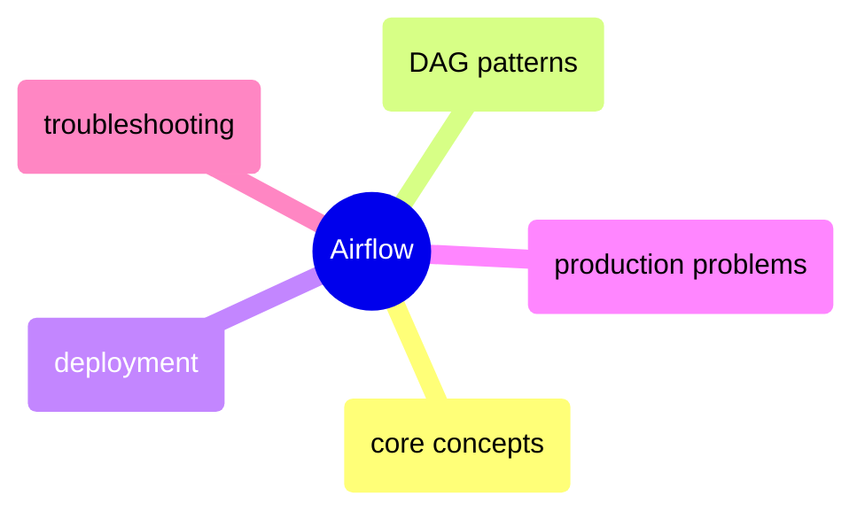
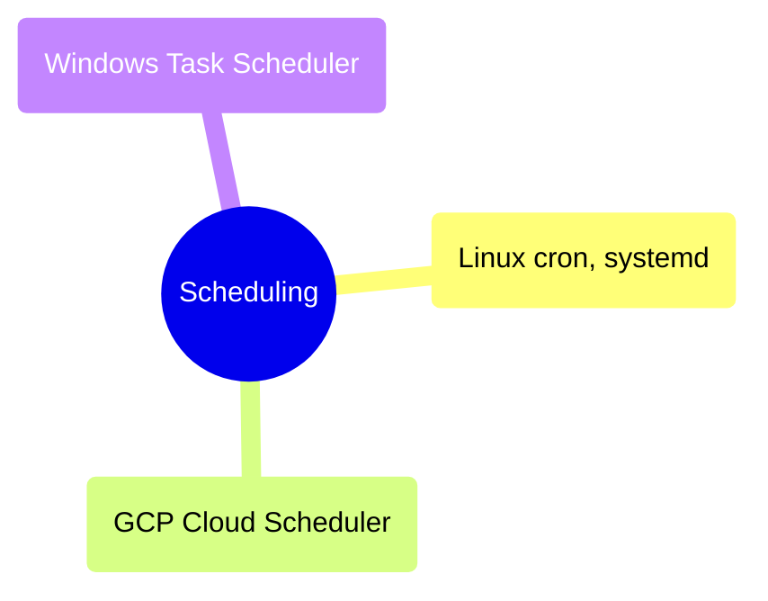

# MOC: Orchestration

Orchestration determines when pipelines run, in what order, and what happens when they fail. These notes cover Apache Airflow for complex DAG-based workflows and platform-native scheduling tools for simpler recurring jobs.

> [!guide]+ Airflow
>
> [[domain-airflow]]
>
> Apache Airflow for programmatic workflow orchestration — architecture, DAG authoring, production deployment, common failure modes, and troubleshooting.

> [!guide]+ Scheduling
>
> [[domain-scheduling]]
>
> Platform-native scheduling tools for recurring jobs that do not require a full orchestration framework — Linux cron and systemd timers, GCP Cloud Scheduler and Cloud Workflows, and Windows Task Scheduler.

## Cross-References

- [Data Architecture](https://alp78.github.io/elysium/14-Data-Architecture/moc-data-architecture) — pipeline patterns that Airflow orchestrates
- [docker-compose](https://alp78.github.io/elysium/09-Docker/docker-compose) — running Airflow locally via Docker Compose
- [cloud-run-jobs-vs-services](https://alp78.github.io/elysium/06-GCP/Serverless/cloud-run-jobs-vs-services) — serverless targets Airflow triggers
- [datadog-airflow-observability](https://alp78.github.io/elysium/13-Observability/Datadog/datadog-airflow-observability) — monitoring Airflow with Datadog
- [github-actions-ci-cd](https://alp78.github.io/elysium/10-GitHub-Actions/github-actions-ci-cd) — deploying DAGs automatically via CI/CD
- [dbt-airflow-integration](https://alp78.github.io/elysium/11-dbt/Operations/dbt-airflow-integration) — running dbt in Airflow DAGs (BashOperator, Cosmos, Cloud Run)
