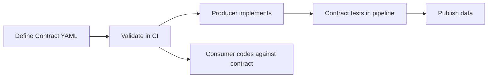

# Data Contracts

> [!abstract] When You Need This
> A data contract is a formal agreement between a data producer and its consumers specifying the schema, SLAs, semantics, and ownership of a dataset. Without contracts, schema changes break downstream pipelines silently.

## What a Data Contract Contains

| Component | Definition | Example |
|-----------|-----------|---------|
| **Schema** | Column names, types, nullability, constraints | `instrument_isin CHAR(12) NOT NULL` |
| **SLA** | Freshness, availability, quality thresholds | "Available by 18:00 UTC, 99.9% uptime" |
| **Semantics** | Business meaning of each field | "close_price is the official exchange closing price in local currency" |
| **Ownership** | Who produces, who maintains, who to contact | "Market Data Team owns, Index Ops consumes" |
| **Versioning** | How changes are communicated and rolled out | "Semver: breaking = major, additive = minor" |

## Contract-First Development Workflow



1. Producer and consumer agree on the contract (schema + SLA) before any code is written
2. Contract is version-controlled alongside the pipeline code
3. CI validates that produced data matches the contract
4. Breaking changes require a new major version and migration period

## Schema Definition Formats

| Format | Strengths | When to Use |
|--------|-----------|-------------|
| **JSON Schema** | Human-readable, widely supported | REST APIs, config validation |
| **Protocol Buffers** | Strongly typed, backward-compatible by design | gRPC services, high-throughput |
| **Avro** | Schema evolution built-in, compact binary | Kafka/Pub/Sub messages |
| **dbt YAML** | Native to dbt, enforced at build time | Warehouse transforms |
| **SQL DDL** | Universal, everyone reads SQL | Database tables |

## Example Contract: ESG Score Feed

```yaml
# contracts/esg-scores-v2.yaml
contract:
  name: esg-scores
  version: 2.0.0
  owner: esg-data-team
  description: "Normalized ESG scores from multiple vendors, 0-100 scale (higher = better)"

schema:
  columns:
    - name: instrument_isin
      type: string
      length: 12
      nullable: false
      description: "ISO 6166 ISIN identifier"
    - name: vendor_code
      type: string
      nullable: false
      enum: [MSCI, SUSTAINALYTICS, ISS, BLOOMBERG, CDP]
    - name: normalized_score
      type: decimal
      precision: 5
      scale: 2
      nullable: true
      description: "Score normalized to 0-100, higher = better"
      constraints:
        min: 0
        max: 100
    - name: score_date
      type: date
      nullable: false
    - name: loaded_at
      type: timestamp
      nullable: false

  primary_key: [instrument_isin, vendor_code, score_date]
  unique_constraints: []

sla:
  freshness: "Updated weekly by Monday 08:00 UTC"
  availability: "99.9%"
  quality:
    completeness: ">= 95% of index universe covered"
    null_rate: "< 2% for normalized_score"

breaking_changes:
  - Removing a column
  - Changing a column type
  - Changing primary key
  - Narrowing an enum

non_breaking_changes:
  - Adding a new column (nullable)
  - Widening an enum (adding new vendor)
  - Relaxing a constraint
```

## Example Contract: Index Constituent Feed

```yaml
contract:
  name: index-constituents
  version: 1.0.0
  owner: index-operations-team

schema:
  columns:
    - name: index_code
      type: string
      nullable: false
    - name: instrument_isin
      type: string
      length: 12
      nullable: false
    - name: effective_date
      type: date
      nullable: false
    - name: expiry_date
      type: date
      nullable: false
      default: "9999-12-31"
    - name: weight_pct
      type: decimal
      precision: 18
      scale: 10
      nullable: false
      constraints:
        min: 0
        max: 1
    - name: change_reason
      type: string
      nullable: true
      enum: [REBALANCE, IPO_ADD, MERGER_REMOVE, DELIST, SPIN_OFF_ADD]

  primary_key: [index_code, instrument_isin, effective_date]

sla:
  freshness: "Updated at each quarterly rebalancing and on corporate action events"
  quality:
    weight_sum: "SUM(weight_pct) = 1.00000000 for each index_code + date"
    completeness: "Exactly N constituents where N = target count for the index"
```

## Contract Testing in CI

```yaml
# .github/workflows/contract-test.yml
name: Data Contract Validation
on:
  push:
    paths: ['contracts/**', 'models/**']

jobs:
  validate:
    runs-on: ubuntu-latest
    steps:
      - uses: actions/checkout@v4
      - name: Validate contract schemas
        run: |
          pip install jsonschema pyyaml
          python scripts/validate_contracts.py contracts/
      - name: Run dbt contract tests
        run: |
          dbt build --select tag:contract_test --target ci
```

## Breaking vs Non-Breaking Changes

| Change | Breaking? | Action Required |
|--------|----------|----------------|
| Add nullable column | No | Minor version bump |
| Remove column | **Yes** | Major version, migration period |
| Change column type | **Yes** | Major version |
| Rename column | **Yes** | Major version |
| Add enum value | No | Minor version bump |
| Remove enum value | **Yes** | Major version |
| Tighten constraint | **Yes** | Major version |
| Relax constraint | No | Minor version bump |
| Change SLA | Depends | Communicate to all consumers |

## Producer and Consumer Responsibilities

| Responsibility | Producer | Consumer |
|---------------|----------|----------|
| Schema definition | Defines and maintains | Validates inputs against |
| SLA compliance | Monitors and guarantees | Monitors and alerts on breach |
| Breaking changes | Publishes new major version | Migrates within deprecation window |
| Quality checks | Validates before publishing | Validates after receiving |
| Documentation | Maintains contract YAML | References contract in their code |
| Incidents | Notifies consumers of issues | Reports anomalies to producer |

## Anti-Patterns

| Anti-Pattern | Problem | Better Approach |
|-------------|---------|----------------|
| No contract exists | Schema changes break consumers silently | Define contracts before building |
| Contract not enforced | Contract exists but nobody checks | Automate validation in CI and pipeline |
| Verbal agreements | "We agreed in a meeting" is not auditable | Version-controlled YAML contracts |
| Producer ignores consumer needs | Schema designed for producer convenience | Joint schema design sessions |
| No deprecation period | Old version removed immediately | Minimum 30-day deprecation window |

## Related

- [[data-quality-framework]] — Quality gates that enforce contract SLAs
- [[data-mesh-architecture]] — Data products and federated governance
- [[dbt-transformation-layer]] — dbt model contracts with enforced schemas
- [[serialization-formats]] — Schema formats (Protobuf, Avro, JSON Schema)
- [[streaming-architecture]] — Schema registries for event contracts
