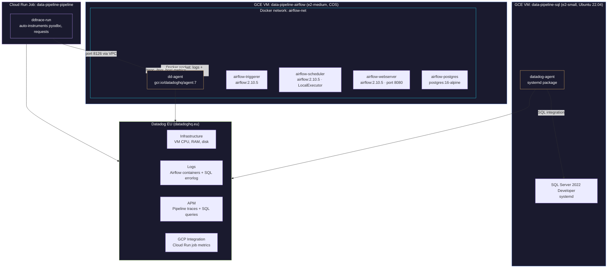

# Datadog Architecture Overview

> [!quote]+
> "No complex system is ever fully healthy."
>
> — **Cindy Sridharan**, *Distributed Systems Observability* (2018)

> [!abstract]- Summary
>
> This note maps Datadog as a layered observability surface for the platform: two host agents cover the persistent SQL and Airflow VMs, while the GCP integration pulls Cloud Run and other managed-service metrics that cannot be collected from an in-container agent.
>
> **Topology and coverage**
> - Explains the two-agent-plus-integration topology, the Datadog EU site boundary, and which hosts, containers, databases, logs, and traces each collection path is responsible for.
> - Ties the architecture back to the three observability pillars so the reader can see which signal comes from the agent, which comes from Cloud Monitoring, and which comes from application tracing.
>
> **Bootstrap prerequisites**
> - Lists the Datadog account, API and application keys, and the Terraform variable gate that turns the whole monitoring stack on or off.
> - Shows how the platform keeps Datadog resources conditional so the observability footprint stays explicit in infrastructure code.
>
> **GCP integration onboarding**
> - Walks through the manual GCP integration flow, the supporting Terraform resources, and the host-map checks that confirm Datadog can see the project estate.
> - Frames the integration as the bridge for ephemeral Cloud Run jobs that have no long-lived host for a resident agent.
>
> **Verification and shutdown**
> - Covers the verification path for hosts and Cloud Run metrics and the disable path when `dd_api_key` is emptied or the integration is removed.
> - When to use: the team needs the control-plane view of how Datadog fits across the full stack before going deeper into per-component notes.

> [!note]- Glossary
>
> **Datadog Agent**
> - The host-side collector that ships metrics, logs, and traces from a VM or container environment into Datadog.
> - It matters here because the architecture relies on one package-based agent on SQL Server and one Docker-based agent on Airflow.
>
> > [!info] Host collection boundary
> >
> > Agents can only observe what the host exposes. Managed or ephemeral services still need an API-based integration path.
>
> ---
>
> **GCP Integration**
> - The Datadog integration that reads Google Cloud resource metadata and monitoring metrics through Google APIs.
> - It matters here because Cloud Run job metrics enter Datadog through this pull path rather than through an in-guest agent.
>
> > [!info] API pull path
> >
> > For managed services, the integration is the observability control plane, not an optional add-on.
>
> ---
>
> **Three pillars**
> - The metrics, logs, and traces that together describe system health and execution behavior.
> - It matters here because the note maps each pillar to a concrete collection path in the project architecture.
>
> > [!tip] Different signals, different jobs
> >
> > Metrics show shape, logs explain events, and traces localize latency across service boundaries.
>
> ---
>
> **Datadog site**
> - The regional Datadog control plane such as `datadoghq.eu` that receives telemetry and hosts dashboards.
> - It matters here because the agent, API key configuration, and account setup must target the correct regional site.
>
> > [!info] Region is part of config
> >
> > Pointing agents or automation at the wrong site produces silent ingestion failures even if keys are valid.
>
> ---
>
> **Service tag**
> - A shared tag used to group metrics, logs, and traces that belong to the same application or component.
> - It matters here because correlation across dashboards and APM depends on consistent service naming.
>
> > [!tip] Correlation needs stable tags
> >
> > Logs and traces only line up cleanly when the tagging model is consistent across the stack.
>
> ---
>
> **Host Map**
> - Datadog's infrastructure view that shows discovered hosts and their current state.
> - It matters here because host appearance is one of the quickest validation checks after installing agents or the GCP integration.
>
> > [!info] Fast validation surface
> >
> > If hosts are missing here, the issue is usually identity, ingestion, or integration setup rather than dashboard design.
>
> ---
>
> **Cloud Run metric namespace**
> - The `gcp.run.job.*` metric family exposed through the Google integration for Cloud Run jobs.
> - It matters here because those metrics cover job executions, CPU, and memory for the pipeline workload that has no persistent node.
>
> > [!info] Managed-service signals
> >
> > The namespace tells you the signal came from Google monitoring APIs, not from an agent inside the workload.
>
> ---
>
> **`dd_api_key` gate**
> - The Terraform variable that decides whether Datadog resources and startup-script branches are enabled.
> - It matters here because the platform uses one explicit switch to control whether the observability stack exists at all.
>
> > [!tip] One feature flag
> >
> > A single infrastructure toggle is safer than partially enabling agents and leaving the architecture in a half-configured state.

### Datadog Infrastructure Topology



---

### What Gets Monitored by Datadog

| Source | Method | Data |
|--------|--------|------|
| Airflow VM | DD Agent (system checks) | CPU, RAM, disk, network, I/O |
| Airflow containers | DD Agent (Docker autodiscovery) | Per-container logs, CPU, memory |
| PostgreSQL | DD Agent (Postgres check via labels) | Connections, query metrics |
| SQL Server VM | DD Agent (system checks) | CPU, RAM, disk, network, I/O |
| SQL Server database | DD Agent (sqlserver check) | Connections, buffer pool, waits, query stats |
| SQL Server errorlog | DD Agent (file tailing) | Errors, failed logins, checkpoints |
| Pipeline steps | ddtrace APM | Per-step traces with duration, SQL queries |
| Cloud Run jobs | GCP Integration | Execution count, CPU, memory — compare with [GCP-native Cloud Monitoring](https://alp78.github.io/elysium/06-GCP/Logging/cloud-monitoring-metrics) for metrics that remain outside Datadog |

---

### Three Pillars of Observability in Datadog

| Pillar | What | How it gets to Datadog |
|--------|------|------------------------|
| **Metrics** | Numeric time series (CPU %, memory, request count) | Agent collects from host + Docker; GCP Integration pulls from Cloud Monitoring API |
| **Logs** | Structured text from containers + errorlog | Agent reads Docker stdout via socket; tails SQL Server errorlog |
| **Traces** | Request-level spans with timing | `ddtrace-run` instruments Python code; traces route through Agent on port 8126 |

All three converge in Datadog by sharing the `service` tag (e.g., `data-pipeline-pipeline`) and trace correlation IDs (`dd.trace_id`, `dd.span_id`) for log-to-trace linking. This three-pillar approach is an implementation of the conceptual framework described in [observability-deep-dive](https://alp78.github.io/elysium/13-Observability/Monitoring/observability-deep-dive), applied specifically to the project's GCP-hosted stack.

> [!info] Log-to-Trace Correlation
> When `LOG_FORMAT=json` is set on the Cloud Run Job and the JSON logger injects `dd.trace_id` / `dd.span_id`, you can click directly from a log line in Datadog's Log Explorer to the corresponding APM flame graph. See [datadog-apm-traces](https://alp78.github.io/elysium/13-Observability/Datadog/datadog-apm-traces) for the logger implementation.

---

## Prerequisites

1. **Datadog EU account** at `datadoghq.eu` (14-day trial is sufficient)
2. **API key** (32 characters) from Organization Settings > API Keys
3. **Application key** (40 characters) from Organization Settings > Application Keys
4. All existing the data pipeline project infrastructure deployed via Terraform

> [!tip] API Key vs Application Key
> The API key (32 chars) is used to **send** data (metrics, logs, traces) to Datadog. The Application key (40 chars) is used to **read** data from Datadog's API (listing hosts, creating dashboards). The Agent and ddtrace only need the API key.

### Terraform Variable

The `dd_api_key` variable is defined in `infra/variables.tf`:

```hcl
variable "dd_api_key" {
  description = "Datadog API key (leave empty to disable agent)"
  type        = string
  sensitive   = true
  default     = ""
}
```

Set it in `infra/terraform.tfvars` (git-ignored):

```hcl
dd_api_key = "<your-32-char-api-key>"
```

All Datadog resources are conditional on `var.dd_api_key != ""`. Setting it to empty disables everything.

#### Apply Terraform

```powershell
terraform -chdir=infra apply
```

This creates/updates:

- VM metadata with `dd-api-key` on both VMs (read by startup scripts)
- Firewall rule `data-pipeline-allow-apm` (port 8126 from VPC subnet)
- Datadog service account `data-pipeline-datadog` with viewer roles
- Cloud Run Job env vars for APM (`DD_SERVICE`, `DD_ENV`, `DD_TRACE_AGENT_URL`, `DD_API_KEY`)

---

## GCP Integration Setup

The GCP Integration enables Datadog to pull metrics from Cloud Run, Compute Engine, and other GCP services via the Cloud Monitoring API. This is how Cloud Run job metrics (CPU, memory, execution count) appear in Datadog — since Cloud Run jobs are ephemeral, no agent runs inside them.

### Setup Steps

1. In Datadog, go to **Integrations > Google Cloud Platform**
2. Choose **Manual** setup method
3. Enter the service account email:

```
   data-pipeline-datadog@data-platform-prod.iam.gserviceaccount.com
```

4. When prompted for "Generate Principal", use the SA impersonation flow
5. Enable **GCE Automuting** (auto-mutes monitors when VM is stopped)
6. Enable **Resource Collection** (discovers GCP resources in Datadog)
7. Save the integration

> [!info] Service Account Permissions
> The Datadog SA has `monitoring.viewer`, `compute.viewer`, and `cloudasset.viewer` roles — it can read metrics but cannot modify any GCP resources.

### Terraform Resources

The service account is created conditionally in `infra/iam.tf`:

```hcl
resource "google_service_account" "datadog" {
  count        = var.dd_api_key != "" ? 1 : 0
  account_id   = "data-pipeline-datadog"
  display_name = "Datadog Integration"
}
```

### Verify Integration

After setup, go to **Infrastructure > Host Map** in Datadog. You should see GCE VMs listed. Cloud Run metrics appear under **Cloud > GCP > Cloud Run**.

---

> [!warning] Agent resource overhead
>
> The Datadog Agent consumes approximately 1-2% CPU and 200-400 MB RAM continuously. On an e2-small (2 vCPU, 2 GB RAM) running SQL Server, the agent takes 10-20% of available memory. If SQL Server starts experiencing memory pressure (buffer cache hit ratio dropping below 99%), investigate agent overhead before resizing the VM. Use `systemctl stop datadog-agent` temporarily to confirm.

> [!success] Reduce Agent Memory Pressure
> Stop the agent temporarily to confirm it is the cause (`sudo systemctl stop datadog-agent`), then check the buffer cache hit ratio. If confirmed, reduce agent overhead by disabling unused checks in `/etc/datadog-agent/conf.d/` (e.g., process collection) or upgrade the SQL VM to `e2-medium` (4 GB RAM) if full observability is required.

### Disabling Datadog Agents and Integration

When the trial ends or you want to remove Datadog:

1. Set `dd_api_key = ""` in `terraform.tfvars`
2. Run `terraform apply` — conditional resources are destroyed
3. SSH into Airflow VM and remove the agent: `docker rm -f dd-agent`
4. SSH into SQL VM and stop the agent: `sudo systemctl disable datadog-agent && sudo systemctl stop datadog-agent`
5. Revert Dockerfile entrypoint:

```dockerfile
   ENTRYPOINT ["python", "utils/run_pipeline.py"]
```

6. Remove `ddtrace>=2.10.0` from `requirements.txt`
7. Rebuild and push the pipeline image
8. The logger and run_pipeline trace code no-ops automatically (`ImportError` guard)

One `terraform apply` + one image rebuild cleans up everything.

---

## Related

- [datadog-agent-airflow-vm](https://alp78.github.io/elysium/13-Observability/Datadog/datadog-agent-airflow-vm) — Agent setup on Container-Optimized OS
- [datadog-agent-sql-vm](https://alp78.github.io/elysium/13-Observability/Datadog/datadog-agent-sql-vm) — Agent setup on Ubuntu with systemd
- [datadog-sql-server-integration](https://alp78.github.io/elysium/13-Observability/Datadog/datadog-sql-server-integration) — SQL Server integration configuration
- [datadog-apm-traces](https://alp78.github.io/elysium/13-Observability/Datadog/datadog-apm-traces) — APM tracing and Python instrumentation
- [datadog-dashboards](https://alp78.github.io/elysium/13-Observability/Datadog/datadog-dashboards) — Pipeline Watch and DBA dashboards
- [datadog-troubleshooting](https://alp78.github.io/elysium/13-Observability/Datadog/datadog-troubleshooting) — Common issues and fixes
- [datadog-cost-optimization](https://alp78.github.io/elysium/13-Observability/Datadog/datadog-cost-optimization) — Pricing breakdown
- the project architecture — Full the data pipeline project system architecture
- the GCP resources — GCP resources managed by Terraform
