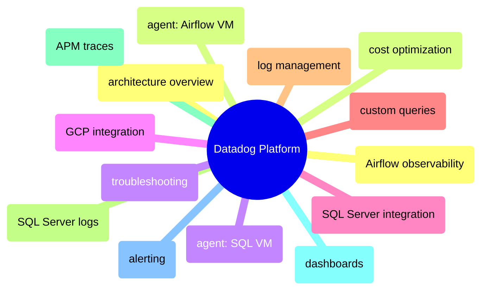

# Datadog Platform

End-to-end Datadog coverage from agent deployment through dashboards, alerting, APM traces, log management, cost optimization, and troubleshooting.

> [!abstract]- [[01-datadog-architecture-overview]]
>
> - [[datadog-architecture-overview#Datadog Infrastructure Topology|Infrastructure topology]]
> - [[datadog-architecture-overview#What Gets Monitored by Datadog|What gets monitored]]
> - [[datadog-architecture-overview#Three Pillars of Observability in Datadog|Three pillars in Datadog]]
> - [[datadog-architecture-overview#GCP Integration Setup|GCP integration setup]]
> - [[datadog-architecture-overview#Disabling Datadog Agents and Integration|Disabling Datadog]]

> [!abstract]- [[03-datadog-agent-airflow-vm]]
>
> - [[datadog-agent-airflow-vm#How It Works|How it works]]
> - [[datadog-agent-airflow-vm#Docker Autodiscovery Labels|Docker autodiscovery labels]]
> - [[datadog-agent-airflow-vm#StatsD — Airflow Metrics Collection|StatsD metrics collection]]
> - [[datadog-agent-airflow-vm#Datadog Agent Memory Budget on Airflow VM|Memory budget]]
> - [[datadog-agent-airflow-vm#Terraform Configuration for Airflow VM Agent|Terraform configuration]]

> [!abstract]- [[02-datadog-agent-sql-vm]]
>
> - [[datadog-agent-sql-vm#Automated Setup (via Startup Script)|Automated setup]]
> - [[datadog-agent-sql-vm#Datadog Agent Manual Install on SQL VM|Manual install]]
> - [[datadog-agent-sql-vm#Datadog Agent Config File Locations on SQL VM|Config file locations]]
> - [[datadog-agent-sql-vm#Datadog Agent Management Commands on SQL VM|Management commands]]

> [!abstract]- [[06-datadog-gcp-integration]]
>
> - [[datadog-gcp-integration#Why the Datadog GCP Integration Is Needed|Why GCP integration is needed]]
> - [[datadog-gcp-integration#GCP Integration Setup Steps|Setup steps]]
> - [[datadog-gcp-integration#Terraform Resources for GCP Integration|Terraform resources]]
> - [[datadog-gcp-integration#Using Cloud Run Metrics in Dashboards|Cloud Run metrics in dashboards]]

> [!abstract]- [[04-datadog-sql-server-integration]]
>
> - [[datadog-sql-server-integration#Integration Config File|Integration config file]]
> - [[datadog-sql-server-integration#SQL Server Integration Connection Parameters|Connection parameters]]
> - [[datadog-sql-server-integration#Built-in SQL Server Metrics Collected by Datadog|Built-in metrics collected]]
> - [[datadog-sql-server-integration#Verifying the SQL Server Integration|Verifying the integration]]

> [!abstract]- [[08-datadog-custom-queries]]
>
> - [[datadog-custom-queries#Query 1: Connections by Login Name|Connections by login name]]
> - [[datadog-custom-queries#Query 2: SQL Server Deadlock Count Metric|Deadlock count metric]]
> - [[datadog-custom-queries#Full custom_queries Config Reference|Full config reference]]
> - [[datadog-custom-queries#Datadog Column Type Reference for custom_queries|Column type reference]]

> [!abstract]- [[11-datadog-log-management]]
>
> - [[datadog-log-management#SQL Server Errorlog Collection|SQL Server errorlog collection (overview)]]
> - [[datadog-log-management#Airflow Container Log Collection|Airflow container log collection]]
> - [[datadog-log-management#Viewing Logs in Datadog Log Explorer|Viewing logs in Log Explorer]]
> - [[datadog-log-management#Cloud Run Pipeline Logs in Datadog|Cloud Run pipeline logs]]

> [!abstract]- [[12-datadog-sql-server-logs]]
>
> - [[datadog-sql-server-logs#Configure the SQL Server Log Source|Configure the log source]]
> - [[datadog-sql-server-logs#What Gets Logged from SQL Server Errorlog|What gets logged]]
> - [[datadog-sql-server-logs#Troubleshooting If Bytes Read Stays at 0|Troubleshooting bytes read]]
> - [[datadog-sql-server-logs#SQL Server Log Search Queries in Datadog|Log search queries]]

> [!abstract]- [[10-datadog-apm-traces]]
>
> - [[datadog-apm-traces#How ddtrace Works (APM Auto-Instrumentation)|How ddtrace works]]
> - [[datadog-apm-traces#What a Datadog APM Trace Looks Like|What a trace looks like]]
> - [[datadog-apm-traces#Manual Spans per Pipeline Step|Manual spans per step]]
> - [[datadog-apm-traces#Log-to-Trace Correlation with dd.trace_id|Log-to-trace correlation]]
> - [[datadog-apm-traces#APM Trace Search Queries in Datadog|Trace search queries]]

> [!abstract]- [[07-datadog-dashboards]]
>
> - [[datadog-dashboards#Pipeline Watch Dashboard|Pipeline Watch dashboard]]
> - [[datadog-dashboards#SQL Server DBA Dashboard|SQL Server DBA dashboard]]
> - [[datadog-dashboards#Airflow Orchestration Dashboard|Airflow Orchestration dashboard]]

> [!abstract]- [[09-datadog-alerting]]
>
> - [[datadog-alerting#SQL Server DBA Monitors|SQL Server DBA monitors]]
> - [[datadog-alerting#Airflow Orchestration Monitors|Airflow orchestration monitors]]
> - [[datadog-alerting#Dashboard Conditional Formatting|Dashboard conditional formatting]]
> - [[datadog-alerting#GCE Host Automuting in Datadog|GCE host automuting]]

> [!abstract]- [datadog-airflow-observability](https://alp78.github.io/elysium/13-Observability/Datadog/datadog-airflow-observability)
>
> - [StatsD metrics flow](https://alp78.github.io/elysium/13-Observability/Datadog/datadog-airflow-observability#how-statsd-metrics-flow-from-airflow-to-datadog)
> - [Key metrics reference](https://alp78.github.io/elysium/13-Observability/Datadog/datadog-airflow-observability#key-metrics-reference)
> - [Airflow dashboard](https://alp78.github.io/elysium/13-Observability/Datadog/datadog-airflow-observability#airflow-orchestration-dashboard-in-datadog)
> - [Recommended monitors](https://alp78.github.io/elysium/13-Observability/Datadog/datadog-airflow-observability#recommended-airflow-monitors-in-datadog)
> - [Self-hosted limitations](https://alp78.github.io/elysium/13-Observability/Datadog/datadog-airflow-observability#limitations-of-self-hosted-airflow-observability)

> [!abstract]- [[13-datadog-cost-optimization]]
>
> - [[datadog-cost-optimization#Datadog Cost Breakdown per Component|Cost breakdown per component]]
> - [[datadog-cost-optimization#Datadog Agent Memory Overhead|Agent memory overhead]]
> - [[datadog-cost-optimization#Disabling Datadog to Remove All Costs|Disabling Datadog]]
> - [[datadog-cost-optimization#Datadog Cost Reduction Strategies|Cost reduction strategies]]
> - [[datadog-cost-optimization#Datadog Trial and Evaluation Period|Trial and evaluation period]]
> - [[datadog-cost-optimization#Datadog Compared to GCP Infrastructure Costs|Compared to GCP costs]]

> [!abstract]- [[14-datadog-troubleshooting]]
>
> - [[datadog-troubleshooting#Agent Not Appearing in Datadog|Agent not appearing]]
> - [[datadog-troubleshooting#APM Traces Not Appearing|APM traces not appearing]]
> - [[datadog-troubleshooting#No Logs Appearing in Datadog Log Explorer|No logs appearing]]
> - [[datadog-troubleshooting#COS Read-Only Filesystem Constraints for dd-agent|COS filesystem constraints]]
> - [[datadog-troubleshooting#Ghost Hosts Appearing in Datadog Infrastructure|Ghost hosts]]
> - [[datadog-troubleshooting#Agent Management Commands|Agent management commands]]

> [!abstract]- [[05-datadog-airflow-observability]]
>
> - [[datadog-airflow-observability#How StatsD Metrics Flow from Airflow to Datadog|StatsD metrics flow]]
> - [[datadog-airflow-observability#Enabling StatsD in Airflow Docker Compose|Enabling StatsD]]
> - [[datadog-airflow-observability#Verifying Metrics Flow|Verifying metrics]]
> - [[datadog-airflow-observability#Key Metrics Reference|Key metrics reference]]
