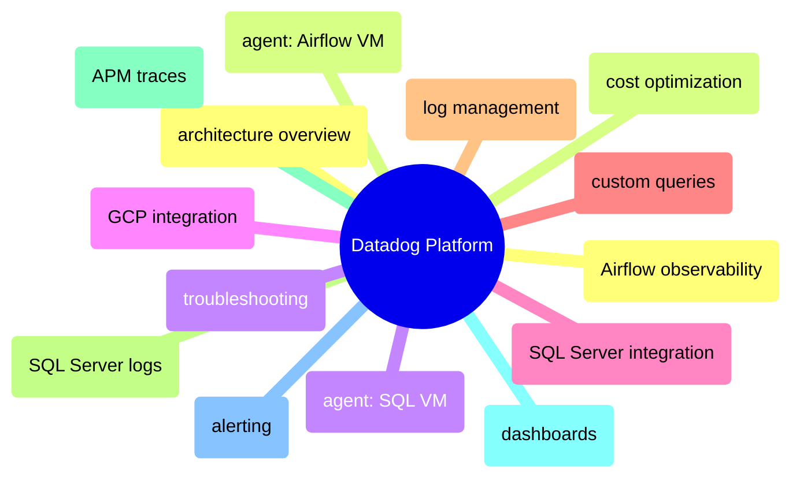

# Datadog Platform

End-to-end Datadog coverage from agent deployment through dashboards, alerting, APM traces, log management, cost optimization, and troubleshooting.

> [!abstract]- [[01-datadog-architecture-overview]]

> [!abstract]- [[03-datadog-agent-airflow-vm]]

> [!abstract]- [[02-datadog-agent-sql-vm]]

> [!abstract]- [[06-datadog-gcp-integration]]

> [!abstract]- [[04-datadog-sql-server-integration]]

> [!abstract]- [[08-datadog-custom-queries]]

> [!abstract]- [[11-datadog-log-management]]

> [!abstract]- [[12-datadog-sql-server-logs]]

> [!abstract]- [[10-datadog-apm-traces]]

> [!abstract]- [[07-datadog-dashboards]]

> [!abstract]- [[09-datadog-alerting]]

> [!abstract]- [[05-datadog-airflow-observability]]

> [!abstract]- [[13-datadog-cost-optimization]]

> [!abstract]- [[14-datadog-troubleshooting]]
