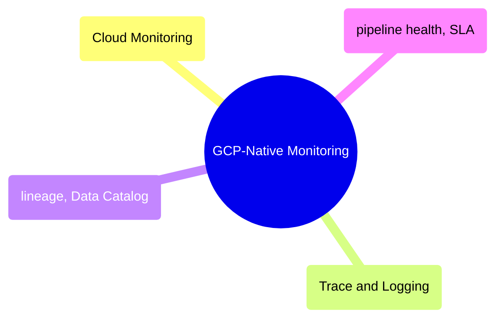

# GCP-Native Monitoring

Google Cloud's built-in observability stack — Cloud Monitoring, Cloud Trace, Cloud Logging, Data Catalog, Dataplex, and pipeline health/SLA patterns.

> [!abstract]- [[gcp-cloud-monitoring-deep-dive]]
>
> - [[gcp-cloud-monitoring-deep-dive#Cloud Monitoring Architecture|Architecture]]
> - [[gcp-cloud-monitoring-deep-dive#Monitoring Every GCP Component Used in Data Engineering|Monitoring every GCP component]]
> - [[gcp-cloud-monitoring-deep-dive#Monitoring Query Language (MQL)|Monitoring Query Language]]
> - [[gcp-cloud-monitoring-deep-dive#Custom Metrics for Data Pipelines|Custom metrics for pipelines]]
> - [[gcp-cloud-monitoring-deep-dive#Alerting Policies|Alerting policies]]
> - [[gcp-cloud-monitoring-deep-dive#SLIs and SLOs|SLIs and SLOs]]

> [!abstract]- [[gcp-cloud-trace-and-logging]]
>
> - [[gcp-cloud-trace-and-logging#Cloud Logging for Data Engineers|Cloud Logging for data engineers]]
> - [[gcp-cloud-trace-and-logging#Log-Based Metrics|Log-based metrics]]
> - [[gcp-cloud-trace-and-logging#Log Router and Sinks|Log router and sinks]]
> - [[gcp-cloud-trace-and-logging#Cloud Trace for Distributed Pipeline Tracing|Cloud Trace for pipeline tracing]]
> - [[gcp-cloud-trace-and-logging#End-to-End Observability: Connecting Metrics, Logs, and Traces|Connecting metrics, logs, and traces]]
> - [[gcp-cloud-trace-and-logging#Cost Comparison: GCP-Native vs Datadog|Cost comparison with Datadog]]

> [!abstract]- [[gcp-data-lineage-and-catalog]]
>
> - [[gcp-data-lineage-and-catalog#GCP Lineage and Catalog Landscape|Lineage and catalog landscape]]
> - [[gcp-data-lineage-and-catalog#Dataplex — Unified Data Governance|Dataplex unified governance]]
> - [[gcp-data-lineage-and-catalog#Data Catalog — Tagging and Business Context|Data Catalog tagging]]
> - [[gcp-data-lineage-and-catalog#Data Lineage — End-to-End Tracing|End-to-end lineage tracing]]
> - [[gcp-data-lineage-and-catalog#Data Quality with Dataplex|Data quality with Dataplex]]
> - [[gcp-data-lineage-and-catalog#Impact Analysis — Before You Change Anything|Impact analysis]]

> [!abstract]- [[gcp-pipeline-health-and-sla]]
>
> - [[gcp-pipeline-health-and-sla#Data Freshness Monitoring|Data freshness monitoring]]
> - [[gcp-pipeline-health-and-sla#Data Quality Checks|Data quality checks]]
> - [[gcp-pipeline-health-and-sla#SLA Monitoring and Reporting|SLA monitoring and reporting]]
> - [[gcp-pipeline-health-and-sla#Dead Man's Switch (Heartbeat Monitoring)|Heartbeat monitoring]]
> - [[gcp-pipeline-health-and-sla#Alerting Runbook for Data Engineers|Alerting runbook]]
> - [[gcp-pipeline-health-and-sla#Automation: Self-Healing Pipelines|Self-healing pipelines]]
